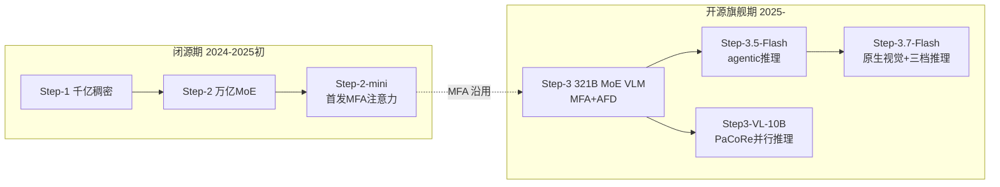

# StepFun（阶跃星辰）

> **一句话定位**：阶跃星辰（2023-04 成立于上海，创始人姜大昕为前微软全球副总裁，"AI 六小虎"之一）走"多模态优先 + 模型-系统协同设计"路线——旗舰坚持原生 VLM 一体化，以自研 MFA 注意力、AFD 分离式推理、3:1 滑窗混合注意力与 MTP 多 token 预测，把"每 token 解码成本"当作与智能水平同级的第一性设计目标，并以"卷王"节奏在理解与生成两线（视频/音频/图像/3D/音乐）全面开源。
>
> 首发年份：2024（Step-1 千亿稠密，2024-03；阶跃星辰 2023-04 成立）· 机构：阶跃星辰（StepFun）· 代表版本：Step-3.7-Flash 198B-A11B（2026-05）
>
> 相关阅读：[基础模型总览](/base-models/)；对比阅读：[DeepSeek](/base-models/deepseek)（MoE 推理成本之争的直接对标）、[Kimi](/base-models/kimi)（同为效率技术栈驱动的开源旗舰）、[KV Cache](/inference/kv-cache)

发展脉络分三段：2024 年闭源做千亿稠密（Step-1）与万亿 MoE（Step-2）；2025-02 与吉利汽车联合开源 Step-Video-T2V 与 Step-Audio，转向开源，2025-07 旗舰 Step-3 开放权重；2026 年起主线收敛为开源 Flash 系列（Step-3.5/3.7-Flash），思考、agentic 与视觉能力全部并入这一条线。

## 模型系列总览

### 语言 / Agent 模型

| 模型 | 发布时间 | 开源 | 要点 | 链接 |
|---|---|---|---|---|
| Step-1 | 2024-03 | 否（API） | 千亿参数稠密模型，官方称两个月一次性训练成功，性能超 GPT-3.5 | [报道](https://finance.sina.com.cn/tech/roll/2024-07-05/doc-inccaxkh1932103.shtml) |
| Step-2 | 2024-03 预览 / 2024-07 正式 | 否（API） | 万亿参数 MoE（step-2-16k）；2024-11 LiveBench 国产基座第一、全球第五 | [报道](https://finance.sina.com.cn/tech/roll/2024-11-25/doc-incxhkcn8196091.shtml) |
| Step-2-mini / Step-2 文学大师版 | 2025-01 | 否（API） | mini 首次落地自研 MFA 注意力，较标准 MHA 节省约 94% KV cache | [报道](https://news.qq.com/rain/a/20250121A09CHP00) |
| Step-3.5-Flash | 2026-02 | Apache-2.0 | 196B 总参 MoE / 激活 11B，256K 上下文，3:1 滑窗:全注意力混合，MTP-3 多 token 预测头（峰值约 350 tok/s）；agentic 推理定位，SWE-bench Verified 74.4%、Terminal-Bench 2.0 51.0%、AIME 2025 97.3% | [官方博客](https://static.stepfun.com/blog/step-3.5-flash/) |
| Step-3.7-Flash | 2026-05-29 | Apache-2.0 | 198B 总参稀疏 MoE VLM（196B 语言骨干 + 1.8B 视觉塔），激活约 11B，288 路由专家 + 1 共享、top-8 sigmoid 路由，256K 上下文，low/medium/high 三档推理深度，吞吐最高约 400 tok/s；提供 BF16/FP8/NVFP4/GGUF | [模型卡](https://huggingface.co/stepfun-ai/Step-3.7-Flash) |

### VL / 多模态理解

| 模型 | 发布时间 | 开源 | 要点 | 链接 |
|---|---|---|---|---|
| Step-1V | 2024-03 | 否（API） | 千亿参数多模态理解模型，当时 OpenCompass 多模态榜第一，对标 GPT-4V | [报道](https://36kr.com/p/2706455840962441) |
| Step-1.5V | 2024-07 | 否（API） | 从图像理解升级到视频理解 | [报道](https://zhidx.com/p/431903.html) |
| Step-1o Vision | 2025-01-21 | 否（API） | Step-1o 端到端三模态系列的视觉成员，LMSYS 视觉榜国内第一 | [报道](https://www.qbitai.com/2025/01/247196.html) |
| Step-3 | 2025-07（07-31 放权重） | Apache-2.0 | 321B 总参 / 38B 激活 MoE VLM（61 层含 5 稠密层），MFA 注意力 + AFD 分离式推理，65,536 上下文；核心卖点是解码成本显著低于 DeepSeek-V3 / Qwen3-235B | [论文](https://arxiv.org/abs/2507.19427) |
| Step3-VL-10B | 2026-01 | Apache-2.0 | 10B 紧凑 VLM（1.8B Perception Encoder + Qwen3-8B 解码器），1.2T 多模态 token 全解冻统一预训练 + 1000+ 轮 RL；PaCoRe 并行协同推理扩展测试时算力（64K，PaCoRe 模式 128K），官方称比肩 10–20 倍大的开源模型 | [论文](https://arxiv.org/abs/2601.09668) |
| GOT-OCR2.0 | 2024-09 | 开源 | 580M 端到端统一 OCR-2.0 模型（高压缩编码器 + 长上下文解码器），StepFun 参与 | [论文](https://arxiv.org/abs/2409.01704) |

### 思考 / 推理

| 模型 | 发布时间 | 开源 | 要点 | 链接 |
|---|---|---|---|---|
| Step R-mini | 2025-01 | 否（API） | 首个 o1 类推理模型，AIME2024 / MATH500 超 o1-mini 与 o1-preview | [报道](https://news.qq.com/rain/a/20250121A09CHP00) |
| Step-R1-V-Mini | 2025-04-08 | 否（API） | 多模态推理（图文入、文字出），基于 [PPO](/rlhf/ppo) 的多模态联合 RL 并在图像空间引入可验证奖励，MathVision 国内第一 | [报道](https://news.qq.com/rain/a/20250408A094CJ00) |

2026 年起独立推理线终止，思考能力并入开源 Flash 主线：Step-3.5-Flash 本身即 agentic 推理模型，Step-3.7-Flash 提供三档可调推理深度——与 Claude 的"推理是能力开关而非独立系列"思路趋同（参见 [Claude](/base-models/claude)）。

### Omni / 音频

| 模型 | 发布时间 | 开源 | 要点 | 链接 |
|---|---|---|---|---|
| Step-1o 系列 | 2025-01 | 否（API） | 原生端到端"文本-视觉-语音"三模态理解+生成家族；Step-1o Audio 号称国内首个千亿参数端到端语音大模型 | [报道](https://m.leiphone.com/category/ai/qK43IEMdAs5Casxh.html) |
| Step-Audio | 2025-02-17 | 开源 | "业界首个产品级开源语音交互方案"：130B 统一语音-文本模型 Step-Audio-Chat（基于 Step-1 续训）+ 蒸馏版 TTS-3B + 双码本 tokenizer（语言 16.7Hz/1024 码本 + 语义 25Hz/4096 码本，2:3 交错） | [论文](https://arxiv.org/abs/2502.11946) |
| Step-Audio-AQAA | 2025-06 | Apache-2.0 | 全端到端音频问答（音频进、音频出），130B 骨干 + 双码本 + 神经声码器 | [论文](https://arxiv.org/abs/2506.08967) |
| Step-Audio 2 / 2 mini | 2025-07 / mini 2025-08-29 | 完整版闭源；mini（8B）Apache-2.0 | 离散音频 token 纳入语言建模，集成 RAG 与工具调用（网页搜索/音色切换）；另有 mini Think 版（2025-09-15） | [论文](https://arxiv.org/abs/2507.16632) |
| Step-Audio-EditX | 2025-11 | Apache-2.0 | 3B LLM 式音频编辑：迭代编辑情感/风格/副语言 + 零样本 TTS，核心是仅用大间隔合成数据训练 | [论文](https://arxiv.org/abs/2511.03601) |
| Step-Audio-R1 | 2025-11-27 | Apache-2.0 | "首个音频推理模型"（解码器基于 Qwen2.5-32B），MGRD 蒸馏使思维链落地于声学特征；后续 R1.1（2026-01）、R1.5（2026-04） | [论文](https://arxiv.org/abs/2511.15848) |
| ACE-Step / 1.5 | 2025-05 / 2026-01-28 | Apache-2.0 | 与 ACE Studio 联合的音乐生成基础模型；1.5 版 A100 上 2 秒内生成整曲、<4GB 显存，SongEval 超 Suno v5 | [论文](https://arxiv.org/abs/2602.00744) |

### 生成式多模态：视频 / 图像 / 3D

| 模型 | 发布时间 | 开源 | 要点 | 链接 |
|---|---|---|---|---|
| Step-Video-T2V | 2025-02-17 | MIT | 30B 文生视频，发布时最大开源视频模型；DiT（48 层 × 48 头 × 128 维）+ Flow Matching，最长 204 帧，自研 Video-VAE（16×16 空间 / 8× 时间压缩），引入 Video-DPO 偏好对齐；另有蒸馏加速版 Turbo | [论文](https://arxiv.org/abs/2502.10248) |
| Step-Video-TI2V | 2025-03 | 开源 | 30B 图生视频，基于 T2V 续训 | [论文](https://arxiv.org/abs/2503.11251) |
| Step-Video V2 | 2025-01 | 否（产品/API） | 闭源升级版：复杂运动、人物、简单文字生成与中英双语运镜语言 | [报道](https://news.qq.com/rain/a/20250121A09CHP00) |
| Step-1X | 2024-07 | 否（API） | 全自研 DiT 文生图，600M/2B/8B 三档，对中国文化元素深度优化 | [报道](https://m.leiphone.com/category/ai/WVNWjY8sPMfcKVgi.html) |
| Step1X-Edit | 2025-04-25 | Apache-2.0 | 19B 通用图像编辑（7B MLLM + 12B DiT），11 类编辑任务并提出 GEdit-Bench，对标 GPT-4o/Gemini 2 Flash 编辑能力；HF 已迭代至 v1.2 | [论文](https://arxiv.org/abs/2504.17761) |
| Step1X-3D | 2025-05-13 | Apache-2.0 | 约 4.8B（几何 1.3B + 纹理 3.5B）两阶段 3D 资产生成：混合 VAE-DiT 几何 + 扩散纹理，支持 LoRA 等 2D 控制技术迁移到 3D | [论文](https://arxiv.org/abs/2505.07747) |
| NextStep-1 | 2025-08 | 开源 | 14B 自回归文生图（连续 token 路线）：标准 LM 头处理文本 + 仅 157M flow matching 头处理连续图像 token，自回归范式 SOTA，ICLR 2026 Oral | [论文](https://arxiv.org/abs/2508.10711) |

### Coder / Embedding

无知名独立模型。代码与 agentic 编程能力并入 Step-3.5/3.7-Flash 主线（以 SWE-bench、Terminal-Bench 为主打指标）；开放平台提供嵌入等 API，但无显著社区影响力。

## 架构与训练亮点

**MFA 注意力：KV cache 的另一条压缩路线**（arXiv:2412.19255，与清华等合作，ACL 2025 Findings）。与 DeepSeek 的 MLA 压缩 KV 不同，MFA（Multi-matrix Factorization Attention）对 QK 回路做低秩矩阵分解，以此扩展注意力头数与头维度——性能超 MLA、与 MHA 相当，KV cache 较 MHA 最多节省 93.7%。2025-01 在 Step-2-mini 首次落地，随后成为 Step-3 旗舰的注意力机制（低秩 query 维 2048、64 头 × 256 维）。背景见 [KV Cache](/inference/kv-cache)。

**AFD 与"解码成本第一性"**。Step-3 技术报告的核心主张是：每 token 解码成本应当与智能水平同级地纳入模型设计。其 AFD（Attention-FFN Disaggregation）把注意力与 FFN 拆到不同硬件分组流水执行，配合 MFA 实现 321B 模型解码成本低于 [DeepSeek](/base-models/deepseek)-V3 与 Qwen3-235B——这是国内少见的把 serving 系统写进模型论文主线的"模型-系统协同设计"。

> 图源：StepFun, *Step-3 is Large yet Affordable: Model-system Co-design for Cost-effective Decoding*, [arXiv:2507.19427](https://arxiv.org/abs/2507.19427)（用于学习注解，版权归原作者）

**Flash 系列的效率组合拳**。Step-3.5/3.7-Flash 在约 200B 总参下只激活 11B（288 路由专家 + 1 共享、top-8 sigmoid 路由），注意力按 3:1 滑窗(SWA):全注意力混合（与 Kimi Linear 的 3:1 KDA:MLA 混合异曲同工），再叠加 MTP-3 多 token 预测头（原理近亲见[投机解码](/inference/speculative-decoding)），达到 350–400 tok/s 的解码吞吐，把"agentic 模型必须便宜且快"贯彻到底。

**旗舰原生多模态**。从 Step-3 到 Step-3.7-Flash，旗舰始终自带视觉塔（1.8B Perception Encoder）而非外挂适配器；Step3-VL-10B 进一步验证小模型路线：1.2T 多模态 token 全解冻统一预训练 + 1000+ 轮 RL 后训练，并以 PaCoRe 并行协同推理扩展测试时算力。RL 侧的探索从 Step-R1-V-Mini 的 PPO + 图像空间可验证奖励一路延续（参见 [RLHF 总览](/rlhf/)）。

**生成线全栈开源**。视频（DiT + Flow Matching + Video-DPO，偏好对齐思想同 [DPO](/dpo/dpo)）、音频（双码本 tokenizer + 130B 统一建模 + [蒸馏](/distillation/) TTS-3B）、图像（自回归连续 token 的 NextStep-1）、3D 与音乐各成体系——在国内厂商中理解与生成两线同时开源的覆盖面最广。

## 许可证与选型建议

| 许可证 | 覆盖模型 |
|---|---|
| Apache-2.0 | Step-3、Step-3.5-Flash、Step-3.7-Flash、Step3-VL-10B、Step-Audio 全家族（含 AQAA/2 mini/EditX/R1）、Step1X-Edit、Step1X-3D、NextStep-1、ACE-Step |
| MIT | Step-Video-T2V / TI2V |
| 不开放权重 | Step-1/1V/1.5V、Step-2 系列、Step-1o 系列、Step R-mini、Step-R1-V-Mini、Step-Audio 2 完整版、Step-Video V2、Step-1X（均经 platform.stepfun.com API 或产品提供） |

开源许可证宽松，商用基本无障碍。选型参考：

- **agentic / coding 主力**：Step-3.7-Flash（带视觉、三档推理）或 Step-3.5-Flash（纯文本 agentic）；约 200B 总参但激活仅 11B，量化版本齐全（FP8/NVFP4/GGUF，见[量化](/inference/quantization)）。
- **多模态理解**：旗舰用 Step-3（321B/38B，需多卡），资源受限用 Step3-VL-10B；文档 OCR 场景可用 GOT-OCR2.0。
- **语音**：端侧/自部署语音对话用 Step-Audio 2 mini（8B）；音频编辑与零样本 TTS 用 Step-Audio-EditX；音频推理用 Step-Audio-R1。
- **生成式媒体**：文生视频 Step-Video-T2V（MIT，30B 需大显存）、图像编辑 Step1X-Edit、3D 资产 Step1X-3D、音乐 ACE-Step 1.5（<4GB 显存）；研究自回归文生图范式选 NextStep-1。

## 参考链接

- StepFun, 2025. Step-3 is Large yet Affordable: Model-system Co-design for Cost-effective Decoding. arXiv:2507.19427
- Hu et al., 2024. Multi-matrix Factorization Attention. arXiv:2412.19255
- StepFun, 2026. Step3-VL 技术报告. arXiv:2601.09668
- StepFun, 2025. Step-Audio: Unified Understanding and Generation in Intelligent Speech Interaction. arXiv:2502.11946
- StepFun, 2025. Step-Audio 2 Technical Report. arXiv:2507.16632
- StepFun, 2025. Step-Audio-R1 技术报告. arXiv:2511.15848
- StepFun, 2025. Step-Video-T2V Technical Report. arXiv:2502.10248
- StepFun, 2025. Step1X-Edit: A Practical Framework for General Image Editing. arXiv:2504.17761
- StepFun, 2025. NextStep-1: Toward Autoregressive Image Generation with Continuous Tokens at Scale. arXiv:2508.10711
- [Step-3.5-Flash 官方博客](https://static.stepfun.com/blog/step-3.5-flash/)
- [Hugging Face: stepfun-ai 组织页](https://huggingface.co/stepfun-ai)
- [GitHub: stepfun-ai](https://github.com/stepfun-ai)
