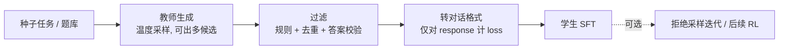

# 黑盒蒸馏（Black-Box / Data Distillation）

> **一句话**：拿不到教师 logits 时，让教师生成完整输出序列、学生在这些序列上做 SFT——理论原型是序列级知识蒸馏（*Sequence-Level Knowledge Distillation*, 2016），LLM 时代的三代代表是 Self-Instruct（2022）、Alpaca（2023）与 DeepSeek-R1-Distill（2025）。
>
> 前置阅读：[知识蒸馏总览](/distillation/) · [SFT 总览](/sft/) · [SFT 数据构造](/sft/data-construction)

## 直觉与动机

闭源 API 通常只返回生成文本（至多附带少量 top logprobs），全词表分布拿不到，经典的逐 token 分布匹配无从谈起。黑盒场景下唯一可用的教师信号，是教师「认为好」的完整输出序列。

Kim & Rush（2016）在 NMT 上把这件事形式化：词级 KD 只是在数据集给定的前缀下匹配下一词分布，而真正想要的是匹配教师的**序列级分布**。直接优化序列级目标在指数大的输出空间上不可行，但可以用教师自己解码出的序列作为近似——于是序列级 KD 退化为「在教师输出上做极大似然」，也就是一次普通的 SFT。他们验证了学生比 SOTA 教师快约 10 倍而性能损失很小，且学生可以在解码时丢掉 beam search、用贪心解码即可，结合剪枝后参数量可减少 13 倍。

这个视角解释了黑盒蒸馏为什么有效：学生学到的不是孤立的「正确答案」，而是教师输出分布的主模式——包括解题路径本身。DeepSeek-R1 蒸馏系列正是靠这一点把长链推理（CoT）能力迁移进小模型：小模型直接模仿教师的完整推理轨迹，而不需要自己从 RL 中「涌现」出推理行为。

工程上的优势同样明显：完全复用 SFT 的全套设施；教师与学生的 tokenizer、架构都可以不同；天然适配「闭源强模型 → 开源小模型」的场景。

## 方法与公式

序列级 KD 的理想目标是让学生匹配教师的序列分布（教师记为 $\pi_{\text{T}}$，学生为 $\pi_\theta$）：

$$
\mathcal{L}_{\text{seq-KD}}(\theta) = -\,\mathbb{E}_{x \sim \mathbb{D}} \left[ \sum_{y \in \mathcal{Y}} \pi_{\text{T}}(y \mid x)\, \log \pi_\theta(y \mid x) \right]
$$

对全序列空间 $\mathcal{Y}$ 求和不可行，用教师解码出的序列 $\hat{y}$（beam search 近似众数，或温度采样）替代期望：

$$
\mathcal{L}_{\text{seq-KD}}(\theta) \;\approx\; -\,\mathbb{E}_{x \sim \mathbb{D}} \left[ \log \pi_\theta(\hat{y} \mid x) \right], \qquad \hat{y} \sim \pi_{\text{T}}(\cdot \mid x)
$$

即对教师样本的标准 SFT 负对数似然（参见[符号约定](/guide/notation)）。黑盒蒸馏的全部方法差异，都体现在 $\hat{y}$ 怎么造、怎么过滤、怎么配比上：


> 图源：Wang et al., *Self-Instruct: Aligning Language Models with Self-Generated Instructions*, arXiv:2212.10560（用于学习注解，版权归原作者）



**三代代表性管线**：

1. **Self-Instruct（2022，ACL 2023）**：从 175 个人工种子任务出发，引导 GPT-3（davinci）自举生成约 52K 条指令、配 82K 个输入输出实例，经启发式过滤（含用 ROUGE-L 相似度对指令去重）后用于微调原模型，在 Super-NaturalInstructions 上取得 33% 绝对提升，效果接近 InstructGPT-001。它把「教师既出题又答题」的自举范式跑通了——教师与学生甚至可以是同一个模型。
2. **Alpaca（2023）**：把 Self-Instruct 管线的教师换成更强的 text-davinci-003，用 175 个种子样本生成 52K 指令跟随数据，微调 LLaMA-7B。成本极低：数据生成的 API 费用不到 500 美元，云上微调不到 100 美元。这是「强闭源模型输出 → 开源小模型」路线的标志性工作。
3. **DeepSeek-R1-Distill（2025）**：用 DeepSeek-R1 生成并整理约 800K 样本（约 600K 推理样本 + 约 200K 非推理样本），对 6 个开源稠密基座（Qwen2.5-Math-1.5B/7B、Qwen2.5-14B/32B、Llama-3.1-8B、Llama-3.3-70B-Instruct）**只做 SFT、不做 RL**（论文原话："For distilled models, we apply only SFT and do not include an RL stage"）。证明黑盒数据蒸馏足以把旗舰模型的推理能力迁移到 1.5B~70B 的小模型。围绕"蒸推理专长"还衍生出 s1、LIMO、Sky-T1 等"少量精选长思维链"的工作，专门梳理见 [推理蒸馏](/distillation/reasoning)。

## 与 baseline 对比

| 维度 | 词级 KD（[白盒](/distillation/white-box)） | 序列级 KD / 黑盒蒸馏 | 人工标注 SFT |
| --- | --- | --- | --- |
| 教师访问 | 需要 logits | 仅输出文本 | 不需要教师 |
| 每 token 信号 | 全词表软分布 | one-hot（教师序列） | one-hot（人工序列） |
| tokenizer 约束 | 通常要求一致 | 无 | 无 |
| 训练序列来源 | 固定数据集前缀 | 教师采样 | 人工撰写 |
| 规模化成本 | 教师前向开销 | 教师推理费用 | 人力，最贵 |
| 上限 | 受散度 / 分布失配影响 | 受教师水平与数据质量影响 | 受标注质量影响 |

黑盒蒸馏相对人工标注的核心优势是边际成本：质量可控的前提下，几乎可以无限扩量；相对白盒的劣势是信号稀疏——同样的数据量，学到的信息少于全分布匹配。

## 实现要点

```python
# 黑盒蒸馏管线骨架
prompts = expand(seed_tasks)                  # 1. 造 prompt 池：种子 + 自举扩增
for x in prompts:
    cands = teacher.generate(x, T=0.7, n=k)   # 2. 教师生成, 温度采样出多候选
    y = select(cands)                         # 3. 过滤: 规则 + 去重 + 答案校验
    if y is not None:
        data.append(to_chat_format(x, y))     # 4. 套 chat template
student.sft(data)                             # 5. 标准 SFT, 只对 response 算 loss
```

- **过滤是管线的生命线**。Self-Instruct 官方仓库提示，人工评估发现约 46% 的生成数据存在质量问题——不过滤直接训，等于把教师的全部缺陷按比例蒸给学生。常用手段：规则过滤（长度、语言、截断、格式）、指令/语义去重（ROUGE 或 embedding 相似度）、可验证任务用答案校验做拒绝采样（只保留终答正确的轨迹，数学 / 代码尤其有效，DeepSeek-R1 的推理数据即按此整理）。
- **格式细节决定能否复用 SFT 设施**：统一 [chat template](/sft/chat-template)，prompt 部分做 [loss masking](/sft/loss-masking)，长短样本拼接见 [packing](/sft/packing)。
- **数据配比**：纯推理数据会损伤通用对话能力，R1 蒸馏混入了约 1/4 的非推理样本；自己的管线同样要保留通用数据防遗忘。
- **许可合规前置**：用 OpenAI 等闭源 API 的输出训练竞争模型违反其服务条款（Alpaca 因此禁止商用、按 CC BY-NC 4.0 发布数据）；DeepSeek-R1 则以 MIT License 明确允许蒸馏。选教师前先读条款。

## 调参与实践经验

- **教师采样温度**：偏高的温度增加数据多样性但拉低单条质量，常配合多候选 + 过滤使用；对可验证任务，"高温多采 + 拒绝采样"通常优于"低温单采"。
- **学生基座的选择影响显著**：R1 蒸馏在数学方向选用了 Qwen2.5-Math 系基座（见 [Qwen](/base-models/qwen)、[Llama](/base-models/llama)），领域预训练好的基座对蒸馏上限影响很大——蒸馏注入的是行为模式，知识底子还得靠基座。
- **不要急着上 RL**：R1 的结论是蒸馏阶段只用 SFT 就已足够好；蒸馏完成后若仍有提升需求，再考虑在蒸馏模型上做 RL（论文将这一步留给社区探索）。
- **警惕教师偏置的继承**：学生会原样学走教师的口头禅、拒答风格与系统性错误；混入多教师数据或人工数据可部分稀释。
- **迭代式自举**：把蒸馏后的学生当作新的（弱）教师参与下一轮数据生成与过滤，是 Self-Instruct 范式的自然延伸，但要监控质量漂移。

## 参考文献

- Hinton, Vinyals, Dean, 2015. Distilling the Knowledge in a Neural Network. arXiv:1503.02531
- Kim & Rush, 2016. Sequence-Level Knowledge Distillation. arXiv:1606.07947（EMNLP 2016）
- Wang et al., 2022. Self-Instruct: Aligning Language Models with Self-Generated Instructions. arXiv:2212.10560（ACL 2023）
- Taori et al., 2023. Stanford Alpaca: An Instruction-following LLaMA Model. Stanford CRFM 博客与 GitHub 仓库
- DeepSeek-AI, 2025. DeepSeek-R1: Incentivizing Reasoning Capability in LLMs via Reinforcement Learning. arXiv:2501.12948（同行评审版发表于 Nature 645, 633–638, 2025）
