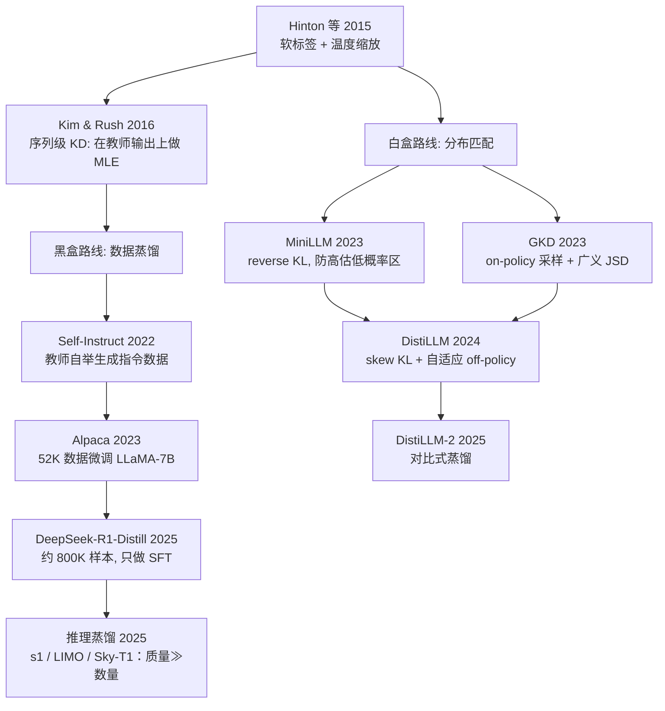
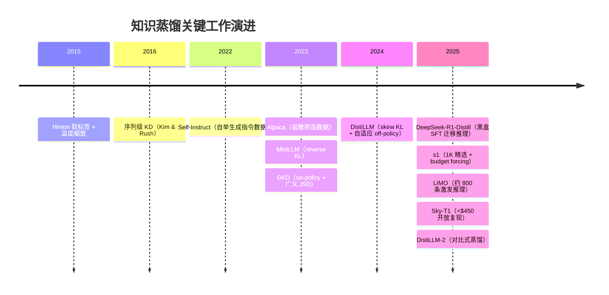

# 知识蒸馏（Distillation）总览

> **一句话**：把强教师模型的能力压进小学生模型；LLM 时代按「能否拿到教师 logits」分成黑盒（数据蒸馏 + SFT）与白盒（分布匹配）两条路线。

## 从软标签到 LLM 蒸馏

知识蒸馏由 Hinton 等人于 2015 年正式提出（*Distilling the Knowledge in a Neural Network*，arXiv:1503.02531）：用教师模型经温度 $\tau$ 缩放后的软标签（soft targets）训练学生。软标签携带类别之间的相对相似度信息（所谓 dark knowledge），比 one-hot 标签的信号密度高得多。Kim & Rush（2016）把它推广到序列生成：与其逐 token 匹配下一词分布（词级 KD），不如让学生直接在教师生成的完整输出序列上做极大似然（序列级 KD）——这正是后来所有「用强模型造数据训小模型」做法的理论原型。

到了 LLM 时代，路线按教师的访问权限一分为二：

- **[黑盒蒸馏](/distillation/black-box)**：只能拿到教师的输出文本（典型如闭源 API）。做法是让教师批量生成指令—回答数据，学生做 SFT，本质是数据工程。代表：Self-Instruct → Alpaca → DeepSeek-R1 蒸馏系列。
- **[白盒蒸馏](/distillation/white-box)**：能拿到教师每一步的 logits / 全词表分布（自家模型或开源权重）。做法是 token 级分布匹配，核心设计空间是「用什么散度 × 在谁生成的序列上算」。代表：MiniLLM、GKD、DistiLLM 系列。

## 演化图

## 演进时间线

## 黑盒 vs 白盒

| 维度 | 黑盒蒸馏 | 白盒蒸馏 |
| --- | --- | --- |
| 教师访问要求 | 仅输出文本（API 即可） | 需要 logits（权重在手） |
| 训练信号 | hard label（教师采样的完整序列） | 软分布（每 token 全词表概率） |
| 本质工作 | 数据构造、过滤、配比 | 散度选择、采样策略 |
| tokenizer 约束 | 教师 / 学生可不同 | 通常要求词表一致 |
| 实现成本 | 低，完全复用 SFT 设施 | 高，需教师在线前向或离线存 logits |
| 典型场景 | 强闭源模型 → 开源小模型 | 自家大模型 → 自家小模型 |

## 选型建议

- 教师是闭源 API、或教师与学生 tokenizer 不同：只能走黑盒，把功夫花在数据构造与过滤上（见 [SFT 数据构造](/sft/data-construction)）。
- 教师权重在手且词表一致：白盒上限更高——软标签的每 token 信号远比 hard label 稠密；预算允许时优先尝试 on-policy 类方法（GKD / DistiLLM），缓解训练与推理的分布失配。
- 推理（reasoning）能力蒸馏：DeepSeek-R1 证明纯黑盒 SFT 就能把长链推理迁移到 1.5B~70B 的小模型，且官方明确「蒸馏模型只做 SFT、不做 RL」；先蒸馏、后视需要再上 RL，是性价比较高的路线（RL 部分见 [RLHF 总览](/rlhf/)）。s1 / LIMO 进一步表明"少量精选长思维链"即可激发推理——系统梳理见 [推理蒸馏](/distillation/reasoning)。
- 蒸馏与[投机解码](/inference/speculative-decoding)互补：蒸馏出的小模型常被用作 draft model，其分布与教师越接近，draft 接受率越高。

## 法律与许可

用别家模型的输出训练自己的模型存在条款风险，且各家政策差异巨大：

- **Alpaca**：仅限学术研究、明确禁止商用。官方给出的理由之一是数据来自 OpenAI text-davinci-003，而 OpenAI 使用条款禁止用其输出开发与之竞争的模型；数据集与权重 diff 均为 CC BY-NC 4.0。
- **DeepSeek-R1**：代码与权重均为 MIT License，官方明确允许商用与修改，「including, but not limited to, distillation for training other LLMs」——是目前对蒸馏最友好的旗舰开源模型之一（见 [DeepSeek](/base-models/deepseek)）。

工程上的顺序应该是：先查教师模型的许可证与服务条款，再设计数据管线。

## 本章页面

| 页面 | 内容 |
| --- | --- |
| [黑盒蒸馏](/distillation/black-box) | 序列级 KD 原理、Self-Instruct / Alpaca / DeepSeek-R1-Distill 三代管线、数据构造与合规 |
| [白盒蒸馏](/distillation/white-box) | forward / reverse / skew KL 与广义 JSD、MiniLLM、GKD、DistiLLM 系列、散度 × 采样的设计空间 |
| [推理蒸馏](/distillation/reasoning) | 把强推理模型的长思维链专长蒸进小模型：R1-Distill / s1 / LIMO / Sky-T1 / OpenThoughts，「质量≫数量」与蒸馏 vs RL |
