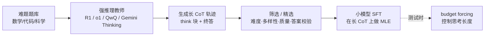

# 推理蒸馏（Reasoning Distillation）

> **一句话**：推理蒸馏是用强推理模型（R1 / o1 级）生成的**长思维链（long CoT）轨迹**做 SFT，把「会推理」这种专家能力迁移到更小的模型；核心经验是**数据质量与结构 ≫ 数量**——少量精选样本就能激发，且在小模型上常比直接做 RL 更划算。
>
> 关键年份：Distilling Step-by-Step 2023（arXiv:2305.02301）· DeepSeek-R1-Distill 2025（arXiv:2501.12948）· s1 2025（arXiv:2501.19393）· LIMO 2025（arXiv:2502.03387）· Sky-T1 2025（NovaSky）
>
> 前置阅读：[蒸馏总览](/distillation/) · [黑盒蒸馏（数据/CoT）](/distillation/black-box) · [GRPO](/rlhf/grpo)

## 一、什么是推理蒸馏：蒸的是「长思维链」与推理专长

普通的 CoT 蒸馏（见 [黑盒蒸馏](/distillation/black-box)）也让教师生成「带推理步骤的答案」，但它面向的是通用指令跟随：教师写一段简短的解释 + 终答，学生学的是「解释清楚」。

推理蒸馏蒸的对象不一样。R1 / o1 这一代「推理模型」在回答前会产生一段**显式的、可能很长的思考过程**——反复试探、自我怀疑（"Wait, let me reconsider…"）、回溯、验算。这段轨迹不是事后补的解释，而是模型真正用来求解的计算过程。推理蒸馏的目标，就是把这种**长 CoT 的结构和「思考行为」**复刻到小模型里，让小模型在推理任务上也学会「想久一点、想细一点、会自查」。

与普通 CoT 蒸馏的关键区别：

- **轨迹形态**：从「一段简短 rationale」变成「数千 token 的探索式 think 块 + 终答」，常带 `<think>...</think>` 一类结构标记。
- **能力目标**：不是迁移某条知识，而是迁移一种**可泛化的解题策略**（分解、试错、验证）。
- **数据来源**：教师必须是真正强推理的模型（R1、o1、QwQ、Gemini Thinking 等），否则蒸不出「专长」，只蒸出风格。

形式上它仍是一次标准 SFT，对教师轨迹做极大似然（记号见 [符号约定](/guide/notation)）：

$$
\mathcal{L}_{\text{SFT}}(\theta) = -\,\mathbb{E}_{(x,\,y_{\text{cot}}) \sim \mathcal{D}} \left[ \sum_{t=1}^{|y_{\text{cot}}|} \log \pi_\theta\big(y_{\text{cot},t} \mid x, y_{\text{cot},<t}\big) \right]
$$

其中 $y_{\text{cot}}$ 是教师生成的「长思维链 + 终答」整条轨迹。算法没新意，**全部功夫在 $\mathcal{D}$ 怎么造、怎么选**。

## 二、代表工作逐一

**DeepSeek-R1-Distill（DeepSeek-AI, 2025, arXiv:2501.12948）**——大规模路线的标杆。用已训好的 DeepSeek-R1 离线生成并整理约 **800K** 样本（约 600K 推理 + 约 200K 非推理，数字以原文为准），对 6 个开源稠密基座（Qwen2.5-Math-1.5B/7B、Qwen2.5-14B/32B、Llama-3.1-8B、Llama-3.3-70B-Instruct）**只做 SFT、不做 RL**（论文原话："we apply only SFT and do not include an RL stage"）。蒸馏版在 AIME 2024、MATH-500、GPQA Diamond、LiveCodeBench 等上显著超过同规模乃至更大的开源对手（具体分数以原文为准）。论文的关键结论：**「在小模型上，蒸馏比直接做 RL 更有效、也更省」**——把大模型 RL 出来的推理模式蒸过去，胜过在小模型上从头 RL。

**s1: Simple test-time scaling（Muennighoff et al., 2025, arXiv:2501.19393）**——极小数据 + 测试时控制。精选仅 **1000 条**样本（数据集 s1K，按难度 / 多样性 / 质量三准则筛选，推理轨迹蒸自 Gemini Thinking Experimental），SFT 一个 Qwen2.5-32B-Instruct 得到 **s1-32B**，论文称仅需约 26 分钟、16×H100（以原文为准）。其招牌是 **budget forcing**：测试时通过强制截断思考、或在模型想结束时反复追加 "Wait" 来延长思考，借此可控地用更多算力换更高准确率，s1-32B 在竞赛数学上超过 o1-preview（以原文为准）。

**LIMO: Less is More for Reasoning（Ye et al., 2025, arXiv:2502.03387，COLM 2025）**——「少即是多」的代表。仅用约 **817 条**高质量样本，LIMO 在 AIME 达到 57.1%、MATH 达到 94.8%（对比前代 SFT 基线的 6.5% / 59.2%，数字以原文为准），仅用了过往方法约 1% 的数据。它提出 **LIMO 假设**：当基座在预训练阶段已充分编码领域知识时，复杂推理能力可以被「少量但精心设计的认知过程示范」激发出来——即蒸馏激发的是「调用已有能力的方式」，而非灌入新知识。

**Sky-T1（NovaSky, UC Berkeley Sky Computing Lab, 2025）**——低成本开放复现。Sky-T1-32B-Preview 用约 **17K** 数据训练，训练成本 **低于 $450**（约 19 小时、8×H100，数字以原文为准）。数据由另一推理模型 QwQ-32B-Preview 生成，再经整理、用 GPT-4o-mini 重排成规整格式。它在数学和代码上可与 o1 早期版本相当（科学题偏弱），且数据 + 代码全开源，是「可从零复现」的开放推理模型代表。

**OpenThoughts / Bespoke-Stratos（2025）**——开放推理数据集生态。Bespoke-Stratos（7B/32B，Bespoke Labs）用约 17K 样本、复用 Sky-T1 数据管线、蒸馏自 DeepSeek-R1；OpenThoughts 是 Bespoke Labs、Stanford、UC Berkeley 等多家合作的开放数据配方项目，后续 OpenThoughts2-1M / OpenThoughts3-1.2M 把规模推到百万级，OpenThinker 系列据称首次让「开放数据」模型在标准推理 benchmark 上追平 R1-Distill 系（定位 / 数字以各自原文为准）。这类工作的价值在于把「教什么题、怎么配比、怎么筛」沉淀成可复用的数据配方。

**对照：Distilling Step-by-Step（Hsieh et al., ACL 2023, arXiv:2305.02301）**——「过程蒸馏」更早的源头。它从 LLM 抽取 **rationale（解题理由）** 作为额外监督，在多任务框架下训练小的任务专用模型，用更少的标注 / 无标注数据就超过更大的 LLM。它早于长 CoT 时代，蒸的是「带过程的监督信号」而非完整探索式思维链，但奠定了「用教师的推理过程、而非只用答案来监督小模型」这一核心思想。

## 三、核心经验：质量与结构 ≫ 数量

- **less is more 是反复被验证的现象**：LIMO 817 条、s1 1000 条都能激发强数学推理。前提是基座底子够（知识已在预训练里），蒸馏负责「点亮」而非「灌输」。
- **筛选三准则**：难度（足够难才逼出长推理）、多样性（覆盖题型 / 领域）、质量（轨迹正确且结构清晰）。对可验证任务（数学 / 代码）务必做**答案校验式拒绝采样**，只留终答正确的轨迹。
- **长 CoT 的格式很重要**：统一 think 块的结构标记、保持探索—回溯—验证的完整形态；轨迹被截断或被「洗成简洁解释」会丢掉最值钱的「思考行为」。
- **数据配比防遗忘**：纯推理数据会损伤通用对话能力，R1 蒸馏混入约 1/4 非推理样本；自建管线同样要保留通用数据。
- **test-time 控制是蒸馏的延伸**：s1 的 budget forcing 说明，蒸进去的长 CoT 能力可以在推理时被显式「拨长 / 拨短」，用算力换准确率，与训练阶段互补。
- **工程上完全复用 SFT 设施**：统一 [chat template](/sft/chat-template)、对 prompt 做 [loss masking](/sft/loss-masking)、长轨迹用 [packing](/sft/packing)；注意长 CoT 会显著拉高序列长度，对上下文窗口与显存有要求。

## 四、蒸馏 vs RL：怎么理解「小模型蒸馏优于 RL」

R1 报告的结论容易被误读成「RL 没用」。更准确的理解是**两者作用层次不同**：

- **蒸馏迁移的是「已有能力的上限」**：教师（经大规模 RL）已经把推理能力炼出来了，蒸馏只是把这套行为模式低成本搬到小模型。小模型自己跑 RL，受限于基座的探索能力和算力，往往**够不到**教师已经达到的高度——所以「蒸 > 在小模型上 RL」。
- **RL 拓展的是「能力的上限本身」**：要让模型超过任何现有教师，只能靠 RL 在可验证奖励下自我探索（见 [GRPO](/rlhf/grpo)）。蒸馏天花板就是教师；RL 没有这个天花板，但贵、不稳、且强烈依赖**老师强弱**和**可验证奖励**的存在。
- **实践顺序**：先用强教师蒸馏拿到一个不错的起点（便宜、稳），需要突破教师上限时再在蒸馏模型上做 RL。R1 论文把「蒸馏后再 RL」明确留给社区探索。
- **前提条件**：蒸馏优于 RL 的结论建立在「有一个足够强的教师」之上。没有强教师、或目标恰恰是造出更强的模型时，RL 不可替代。

## 五、风险与局限

- **学到的是「风格」还是「能力」**：小模型可能只学会了长 CoT 的口吻（频繁 "Wait"、装模作样地回溯）却没真正提升正确率。必须在**留出的、未污染**的难 benchmark 上验证，而非看输出像不像。
- **过拟合与数据污染**：精选小数据极易过拟合到训练分布；若蒸馏数据与评测集重叠（teacher 见过题），分数会虚高。需做去污染检查。
- **忠实性（faithfulness）**：长 CoT 不保证是模型得出答案的真实计算路径——可能终答对但中间步骤错，或事后编造一段看似合理的推理。蒸馏会把教师这种「不忠实」一并继承。
- **长度膨胀**：蒸完的模型倾向于对简单问题也输出超长思考，推高延迟与成本。可用 budget forcing、长度惩罚或混入短轨迹数据来抑制。
- **能力偏窄**：精选数据多集中数学 / 代码，蒸出的「推理专长」未必迁移到其他领域；通用能力还可能因纯推理数据而退化。
- **教师偏置继承**：教师的系统性错误、拒答风格会被原样蒸走；可混入多教师 / 人工数据稀释。

## 六、代表工作对比

| 工作 | 数据量 | 基座 / 教师 | 亮点（数字以原文为准） |
| --- | --- | --- | --- |
| Distilling Step-by-Step（2023） | 远少于全量 | 小任务模型 / LLM 教师 | 用 rationale 做额外监督，少数据超大模型，过程蒸馏源头 |
| DeepSeek-R1-Distill（2025） | 约 800K | Qwen/Llama 1.5B–70B / R1 | 只 SFT 不 RL；「小模型蒸馏 > 直接 RL」；AIME/MATH 显著领先同规模 |
| s1（2025） | 1000（s1K） | Qwen2.5-32B / Gemini Thinking | 极小数据 + budget forcing 测试时控制；s1-32B 超 o1-preview |
| LIMO（2025） | 约 817 | Qwen2.5-32B 系 / — | AIME 57.1% / MATH 94.8%，约 1% 数据；提出 LIMO 假设 |
| Sky-T1（2025） | 约 17K | Qwen2.5-32B / QwQ-32B | 训练成本 < $450，全开源可复现 |
| Bespoke-Stratos / OpenThoughts（2025） | 约 17K → 1M+ | Qwen 系 / R1 | 开放推理数据配方；OpenThinker 追平 R1-Distill（开放数据） |

## 七、参考文献

- Hsieh et al., 2023. Distilling Step-by-Step! Outperforming Larger Language Models with Less Training Data and Smaller Model Sizes. arXiv:2305.02301（ACL 2023 Findings）
- DeepSeek-AI, 2025. DeepSeek-R1: Incentivizing Reasoning Capability in LLMs via Reinforcement Learning. arXiv:2501.12948
- Muennighoff et al., 2025. s1: Simple test-time scaling. arXiv:2501.19393
- Ye et al., 2025. LIMO: Less is More for Reasoning. arXiv:2502.03387（COLM 2025）
- NovaSky (UC Berkeley Sky Computing Lab), 2025. Sky-T1: Train your own O1 preview model within $450. 项目博客与 SkyThought 仓库
- Bespoke Labs, 2025. Bespoke-Stratos: The unreasonable effectiveness of reasoning distillation. 项目博客
- OpenThoughts Team, 2025. OpenThoughts: Data Recipes for Reasoning Models. arXiv:2506.04178
