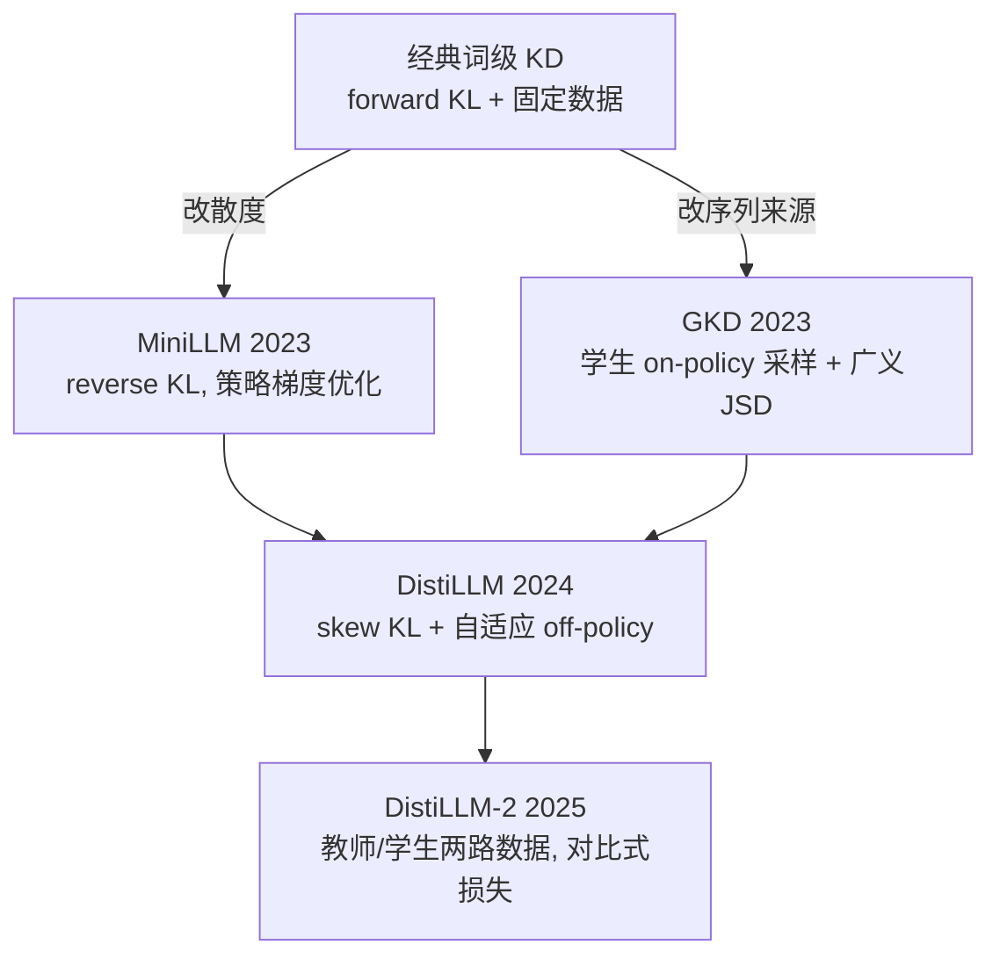

# 白盒蒸馏（White-Box Distillation）

> **一句话**：教师 logits 在手时，逐 token 匹配全词表分布；现代方法的设计空间是「散度怎么选（forward / reverse / skew KL、广义 JSD）× 在谁的序列上算（固定数据 off-policy vs 学生采样 on-policy）」。代表：*MiniLLM*（2023）、*GKD: On-Policy Distillation of Language Models*（2023）、*DistiLLM*（2024）。
>
> 前置阅读：[知识蒸馏总览](/distillation/) · [黑盒蒸馏](/distillation/black-box)

## 直觉与动机

白盒蒸馏的出发点是 Hinton（2015）的软标签：教师在每个位置给出的全词表分布，携带「哪些 token 同样合理、哪些绝对不行」的相对偏好，信号密度远高于 one-hot。教师权重在手时不用这部分信息是浪费。

但把经典 token 级 KD 直接搬到 LLM 生成任务上，有两个结构性问题：

**1. forward KL 是 mode-covering 的。** 最小化 $\mathrm{KL}(\pi_{\text{T}} \| \pi_\theta)$ 要求教师分布非零处学生也必须非零。学生容量小、装不下教师的所有模式时，会被迫把概率质量摊到自己根本驾驭不了的低概率区域——训练 loss 看着正常，生成时却容易在这些区域产出退化文本。MiniLLM（ICLR 2024）的解法是换成 reverse KL $\mathrm{KL}(\pi_\theta \| \pi_{\text{T}})$：mode-seeking，学生只需把教师的主模式学扎实，主动放弃覆盖不了的长尾，防止高估教师分布的低概率区域。

**2. 训练与推理的分布失配（exposure bias）。** 传统 KD 在固定数据集（教师或人工写的序列）的前缀上算散度，但推理时学生走在自己生成的前缀上——一步偏出训练分布，后续误差滚雪球。GKD（ICLR 2024）的解法是 on-policy：让学生在**自己采样的序列**上接受教师的逐 token 反馈，从自己的错误中学习，并把散度选择开放为可配置项（如广义 JSD）。

两条线随后合流：reverse KL 要靠从学生采样 + 策略梯度优化，方差大、训练不稳、还可能加剧模式坍缩；纯 on-policy 每步都要重新采样，训练昂贵。DistiLLM（ICML 2024）用 skew KL 拿到更稳的梯度和理论保证，再用自适应 off-policy 机制复用学生历史样本，报告相比近期 KD 方法最高 4.3 倍加速。DistiLLM-2（ICML 2025 Spotlight）进一步把教师数据与学生数据拆开、各配不同损失，组成对比式目标：拉高学生在教师回复上的似然，压低其在学生自身（劣质）回复上的似然。



## 方法与公式

**经典 KD（Hinton 2015）**：教师与学生的 logits 同除温度 $\tau$ 后取 softmax，匹配软分布（梯度乘 $\tau^2$ 保持量级），再与真实标签的交叉熵加权混合。$\tau > 1$ 放大非最大类的概率，暴露更多类间结构。

**token 级 forward KL（LLM 标准形式）**：在序列每个位置匹配下一 token 分布，

$$
\mathcal{L}_{\text{FKL}}(\theta) = \mathbb{E}_{(x,y) \sim \mathbb{D}} \left[ \sum_{t=1}^{|y|} \mathrm{KL}\!\left( \pi_{\text{T}}(\cdot \mid x, y_{<t}) \,\big\|\, \pi_\theta(\cdot \mid x, y_{<t}) \right) \right]
$$

**MiniLLM（reverse KL）**：把目标换为

$$
\theta^\star = \arg\min_\theta \ \mathrm{KL}(\pi_\theta \,\|\, \pi_{\text{T}}) = \arg\min_\theta \ \mathbb{E}_{x \sim \mathbb{D},\, y \sim \pi_\theta(\cdot \mid x)} \left[ \log \frac{\pi_\theta(y \mid x)}{\pi_{\text{T}}(y \mid x)} \right]
$$

期望取在学生自身分布上，无法直接反传，需用策略梯度优化（论文配套了单步分解、teacher-mixed 采样、长度正则等稳定化技巧），训练形态接近一个以 $\log \pi_{\text{T}}$ 为奖励信号的 RL（可对照 [PPO](/rlhf/ppo) 的基建）。

**GKD（on-policy + 广义 JSD）**：序列来源与散度两个轴解耦。序列以概率混合自固定数据集与学生采样 $y \sim \pi_\theta$；散度可选广义 JSD（记教师分布 $p$、学生分布 $q_\theta$，插值系数用 $\lambda$ 以免与本站 KL 系数 $\beta$ 混淆）：

$$
\mathrm{JSD}_{\lambda}(p \,\|\, q_\theta) = \lambda\, \mathrm{KL}(p \,\|\, m) + (1-\lambda)\, \mathrm{KL}(q_\theta \,\|\, m), \qquad m = \lambda p + (1-\lambda)\, q_\theta
$$

$\lambda \to 0$ 时（按比例）趋近 forward KL，$\lambda \to 1$ 时趋近 reverse KL，可在 mode-covering 与 mode-seeking 之间连续调节。关键工程性质：即使序列来自学生采样，loss 仍是逐位置散度、对 $\theta$ 直接可微（把采样视为数据生成、不对采样过程求导），不需要策略梯度。GKD 还能与 RLHF 目标线性组合，蒸馏与对齐一锅出。

**DistiLLM（skew KL + 自适应 off-policy）**：$\alpha$-skew forward KL 把学生分布与教师分布先插值再算散度：

$$
\mathrm{SKL}^{(\alpha)}(p \,\|\, q_\theta) = \mathrm{KL}\!\left( p \,\,\big\|\,\, \alpha\, p + (1-\alpha)\, q_\theta \right)
$$

（对称地有 skew reverse KL。）插值保证了散度有界、梯度行为更稳，论文给出相应理论性质；配合按验证 loss 自适应决定是否启用学生样本（off-policy 复用 replay 池，而非每步重新采样），显著降低 on-policy 的训练开销。

**DistiLLM-2（对比式）**：对教师生成与学生生成两类数据使用不同损失设计，同时提高教师回复的似然、降低学生回复的似然，形态上接近偏好优化中「拉 chosen、推 rejected」的对比结构（可类比 [DPO 家族](/dpo/)）。


> 图源：Agarwal et al., *On-Policy Distillation of Language Models: Learning from Self-Generated Mistakes*, arXiv:2306.13649（用于学习注解，版权归原作者）


> 图源：Gu, Dong, Wei, Huang, *MiniLLM: Knowledge Distillation of Large Language Models*, arXiv:2306.08543（用于学习注解，版权归原作者）

## 与 baseline 对比

| 方法 | 散度 | 训练序列来源 | 优化方式 | 主要卖点 |
| --- | --- | --- | --- | --- |
| 词级 KD（baseline） | forward KL | 固定数据集 | 直接可微 | 实现最简单 |
| 序列级 KD（[黑盒](/distillation/black-box)） | —（教师样本 MLE） | 教师采样 | 直接可微 | 无需 logits |
| MiniLLM | reverse KL | 学生采样 | 策略梯度 | 防高估低概率区 |
| GKD | 广义 JSD（可配） | 学生采样为主，可混合 | 直接可微 | 缓解分布失配，可接 RLHF |
| DistiLLM | skew KL | 自适应 off-policy | 直接可微 | 稳定 + 最高 4.3× 加速 |
| DistiLLM-2 | 对比式 skew 损失 | 教师 + 学生两路 | 直接可微 | 两类数据各司其职 |

## 实现要点

```python
# token 级 KL 蒸馏核心（forward KL, 带温度）
with torch.no_grad():
    t_logits = teacher(input_ids).logits          # 教师冻结
s_logits = student(input_ids).logits
p  = F.softmax(t_logits / tau, dim=-1)
lq = F.log_softmax(s_logits / tau, dim=-1)
kl = (p * (p.clamp_min(1e-9).log() - lq)).sum(-1)  # [B, L] 每位置 KL
loss = (kl * response_mask).sum() / response_mask.sum()  # 只算 response 段
```

- **词表一致是硬前提**：逐 token 散度要求教师与学生 tokenizer / 词表一致，跨词表需要额外的对齐技巧，实践中通常直接选同家族模型（如同系列大小模型互蒸）。
- **教师 logits 的获取方式**是主要成本项：在线方案双模型同时驻显存、教师每步前向；离线方案预先存教师 logits，但全词表概率体积巨大，一般只存 top-k 加归一化（注意截断会让分布失真，k 与重归一化方式要做消融）。
- **on-policy 训练形态与 RLHF 基建高度重合**：rollout（学生采样）→ 教师前向打分 → 算散度 → 更新，采样引擎、KV cache 管理可直接复用 [RLHF](/rlhf/) 与[推理优化](/inference/kv-cache)那套设施。
- **学生初始化**：先对学生做一轮 SFT（在目标域数据上）再进入分布蒸馏，是 MiniLLM、GKD 等方法的标准设置；直接从 base 起蒸通常更难收敛。
- **mask 与黑盒一致**：只对 response 段计损失（见 [loss masking](/sft/loss-masking)）。

## 调参与实践经验

- **散度按任务和容量差选**：输出空间受限的任务（翻译、摘要式改写）forward KL 往往够用；开放生成、师生容量差大时，mode-seeking 一侧（reverse KL、大 $\lambda$ 的 JSD、skew reverse）更稳——容量差越大，mode-covering 的危害越明显。GKD 的实验信息也表明最优散度依任务而变，没有全局赢家，留出消融预算。
- **on-policy 比例**：全 on-policy 最贴近推理分布但最贵；混合采样（部分固定数据 + 部分学生采样）或 DistiLLM 式自适应复用，通常是性价比更高的折中。
- **温度 $\tau$**：训练时教师与学生用同一温度；$\tau$ 大则软分布更平、传递更多类间信息但信号变弱，属于必调超参，建议从 1 附近网格搜起。
- **监控生成质量而非只看 loss**：分布失配问题的典型症状就是「蒸馏 loss 降、生成质量不涨」，训练全程要带生成侧评测。
- **与黑盒组合**：常见配方是先用教师数据做序列级 KD 把学生拉进教师的输出风格，再用白盒分布蒸馏精修；产出的学生模型也常被用作[投机解码](/inference/speculative-decoding)的 draft model——分布对齐做得越好，接受率越高。

## 参考文献

- Hinton, Vinyals, Dean, 2015. Distilling the Knowledge in a Neural Network. arXiv:1503.02531
- Kim & Rush, 2016. Sequence-Level Knowledge Distillation. arXiv:1606.07947（EMNLP 2016）
- Gu, Dong, Wei, Huang, 2023. MiniLLM: Knowledge Distillation of Large Language Models. arXiv:2306.08543（ICLR 2024）
- Agarwal et al., 2023. On-Policy Distillation of Language Models: Learning from Self-Generated Mistakes. arXiv:2306.13649（ICLR 2024）
- Ko, Kim, Chen, Yun, 2024. DistiLLM: Towards Streamlined Distillation for Large Language Models. arXiv:2402.03898（ICML 2024）
- Ko et al., 2025. DistiLLM-2: A Contrastive Approach Boosts the Distillation of LLMs. arXiv:2503.07067（ICML 2025 Spotlight）
