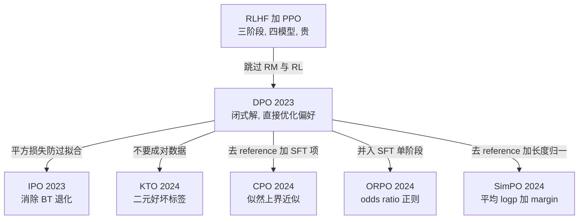
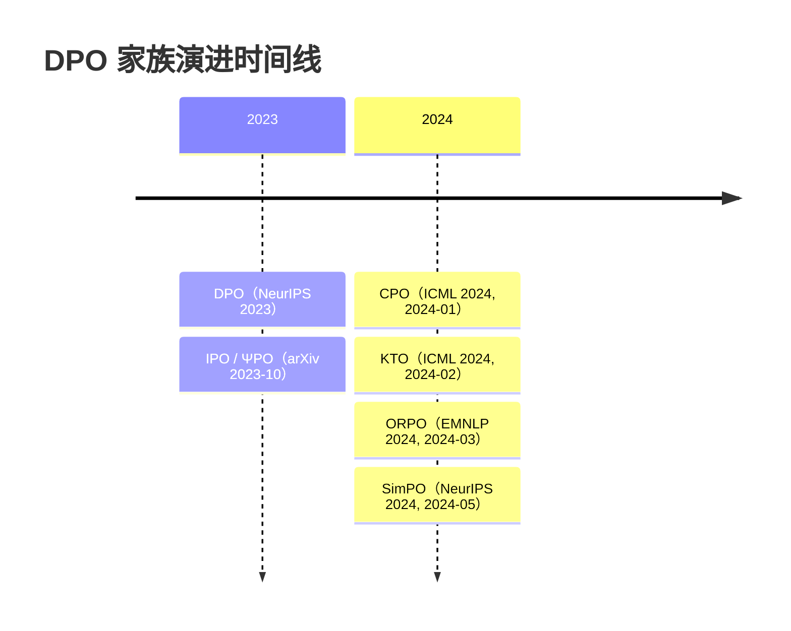

# 偏好优化（DPO 家族）总览

> **一句话**：DPO 证明了「不训 reward model、不跑 RL」也能做偏好对齐——把 RLHF 的 KL 约束目标求出闭式解，整个对齐退化成一个分类损失；之后的变体围绕「去掉 reference 模型、消除长度偏置、支持非成对数据」三条线继续演化。
>
> 前置阅读：[RLHF 总览](/rlhf/)、[Reward Model](/rlhf/reward-model)、[SFT 总览](/sft/)

## 为什么会有 DPO 家族

经典 [RLHF](/rlhf/) 流程是三段式：SFT → 训 [reward model](/rlhf/reward-model) → 用 [PPO](/rlhf/ppo) 在线优化。这套流程效果好，但工程代价高：训练时显存里要同时驻留 policy、reference、reward、critic 四个模型；在线采样让吞吐成为瓶颈；PPO 本身对超参敏感、容易训崩。对大多数团队，「先把模型对齐到一个能用的水平」并不需要这么重的机器。

DPO（Direct Preference Optimization，2023）给出的洞察是：RLHF 那个「最大化 reward 同时不偏离 reference 太远」的 KL 约束目标，其最优策略与 reward 之间存在一个**闭式映射**——reward 可以用 $\beta\log\frac{\pi_\theta(y|x)}{\pi_{\text{ref}}(y|x)}$ 表示出来。把这个映射代回 Bradley-Terry 偏好模型，reward model 就被消掉了，对齐变成在偏好对 $(y_w, y_l)$ 上的一个 sigmoid 二分类损失。一句话：**语言模型本身就是隐式 reward model**。

DPO 之后衍生出一整个家族，每个变体都在解决 DPO 暴露出的某个具体痛点。下图按动机梳理演化脉络。

## 家族演化图

## 演化时间线

## 变体对比

| 方法 | 年份 | Reference model | 数据形式 | 核心改动 | 解决的问题 |
| --- | --- | --- | --- | --- | --- |
| [DPO](/dpo/dpo) | 2023 | 需要 | 成对 $(y_w, y_l)$ | BT 模型闭式解 | 去掉 RM 与 RL |
| [IPO](/dpo/ipo) | 2023 | 需要 | 成对 | sigmoid 换平方损失 | DPO 在易分对上过拟合 |
| [CPO](/dpo/cpo) | 2024 | 不需要 | 成对 | 似然上界近似 + SFT 项 | ref 显存 + 训练效率 |
| [KTO](/dpo/kto) | 2024 | 需要 | 单条 + 好/坏标签 | 前景理论价值函数 | 成对数据难收集 |
| [ORPO](/dpo/orpo) | 2024 | 不需要 | 成对 | SFT + odds ratio 单阶段 | 省掉 SFT 阶段与 ref 模型 |
| [SimPO](/dpo/simpo) | 2024 | 不需要 | 成对 | 长度归一化 + margin | 长度偏置 + ref 显存 |

## 三条共同的演化主线

**主线一：去掉 reference 模型。** DPO 需要在显存里多放一份冻结的 $\pi_{\text{ref}}$，或预计算并缓存其 logprob。SimPO、CPO、ORPO 都试图彻底去掉 reference，代价是失去 KL 锚点、更容易过度偏移训练分布，因此通常要补一个 margin 或 SFT 正则项来稳住。

**主线二：消除长度偏置。** DPO 的隐式 reward 是逐 token logprob 之和，序列越长这个和的绝对值越大，模型很容易学到「答得更长就更好」的捷径。SimPO 用平均 logprob（除以长度）正面解决，是这条线上最直接的方案。实践中即便用 DPO，也常配合长度惩罚或对长度做配对控制。

**主线三：放宽数据形式。** 成对偏好数据需要标注者对同一 prompt 的两个回答排序，贵且慢。KTO 只要每条样本一个二元「好/坏」标签（点赞/点踩、是否通过单测都可以），把数据门槛降到最低；ORPO 则把偏好训练并入 SFT，省掉独立的偏好对齐阶段。

## 选型建议

- **数据是成对的、想要稳的下限**：直接上 [DPO](/dpo/dpo)，它是最被验证过、生态最成熟的基线（TRL/各框架一行配置）。
- **偏好对里有大量「明显胜负」的容易对、观察到过拟合**：换 [IPO](/dpo/ipo) 的平方损失。
- **只有二元反馈、或正负样本严重不均衡**：上 [KTO](/dpo/kto)。
- **显存紧、想省 reference**：[SimPO](/dpo/simpo)（注意长度归一）或 [CPO](/dpo/cpo)。
- **想把 SFT 和对齐合成一个阶段**：[ORPO](/dpo/orpo)。
- **追求效果天花板、且有在线采样基建**：DPO 家族整体是「离线、便宜、够用」，但在难任务（数学、代码、长 CoT）上，在线 RL（[GRPO](/rlhf/grpo)、[PPO](/rlhf/ppo)）通常仍有更高上限——因为离线偏好数据无法覆盖策略在训练中新产生的分布。常见做法是先 DPO 打底，再上 RL 精修。

## 共同的坑

- **chosen 概率一起下降**：DPO 训练中常观察到 $\pi_\theta(y_w|x)$ 与 $\pi_\theta(y_l|x)$ 的 logprob 同时下降，只是 rejected 降得更快。这是 BT 损失只约束「差值」、不约束「绝对水平」的直接后果，详见 [DPO 页](/dpo/dpo)。
- **长度膨胀**：见主线二。上线前务必检查输出长度分布。
- **分布偏移**：偏好数据若不是当前策略采样出来的（off-policy 程度高），DPO 提升会打折。理想情况下 chosen/rejected 都应接近 $\pi_{\text{ref}}$ 的分布。

## 与 RLHF 的理论联系

DPO 家族与 [PPO](/rlhf/ppo) 解的是**同一个** KL 约束优化目标，只是求解方式不同：PPO 用采样 + 策略梯度在线逼近，DPO 用闭式解把问题转成离线分类。理解这一点有助于判断何时该从 DPO 切到 RL——本质区别不在「损失函数好坏」，而在「能否用上策略自己新采样出来的数据」。
