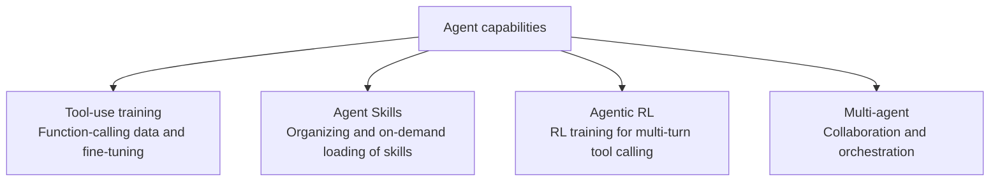

# Agents and Skills Overview

> **In one sentence**: Make the model not just "answer" but "act": calling tools, executing multi-step tasks, loading skills on demand; how to train and organize these capabilities is the theme of this section.

::: warning Status
🚧 This page is a placeholder outline; the full text has not been written yet.
:::

## Section Map

## Subtopics

| Page | Question it answers |
| --- | --- |
| [Tool-Use Training](/en/agent/tool-use) | How to teach a model to issue function calls correctly |
| [Agent Skills](/en/skills/) | How to package domain knowledge into reusable skills |
| [Agentic RL](/en/agent/agentic-rl) | How to train multi-turn interactive tasks with RL |
| [Multi-Agent](/en/agent/multi-agent) | How multiple agents divide work and collaborate |

## TODO

- [ ] How agent training relates to the previous sections (SFT/RL): same algorithms, different data and environments
- [ ] Survey of evaluation benchmarks (SWE-bench, τ-bench, etc.)
