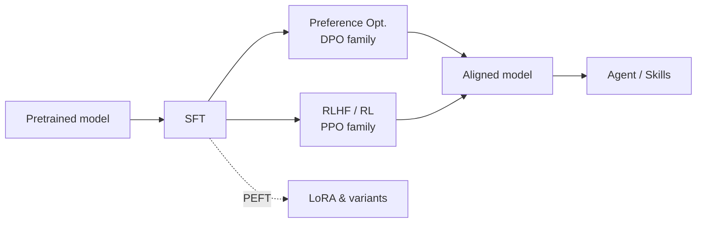

# LLM Compass <Badge type="tip" text="At a Glance" />

**A knowledge compass for LLM training algorithms** — this single page covers every algorithm: one sentence, the core formula, and when to use it. Build a full mental map in five minutes; click "Details →" for derivations, pseudocode, and tuning notes.

[How to use this compass →](/en/guide/) · [Notation →](/en/guide/notation)

## Supervised Fine-Tuning

### SFT

Supervised fine-tuning on instruction–response pairs turns a base model into an instruction follower.

$$
\mathcal{L}_{\text{SFT}} = -\mathbb{E}_{(x, y)} \left[ \sum_{t} \log \pi_\theta(y_t \mid x, y_{<t}) \right]
$$

**When to use**: the first step of all post-training. [Details →](/en/sft/)

Key engineering sub-topics: [Full Fine-Tuning](/en/sft/full-finetuning) · [Data Construction](/en/sft/data-construction) · [Chat Template](/en/sft/chat-template) · [Sequence Packing](/en/sft/packing) · [Loss Masking](/en/sft/loss-masking)

## LoRA & Variants

### LoRA

Freeze $W_0$ and train only the low-rank update $\Delta W = BA$; trainable parameters drop below 1%, and the adapter merges back at inference with zero overhead.

$$
h = W_0 x + \frac{\alpha}{r} B A x
$$

**When to use**: the default for memory-constrained fine-tuning. [Details →](/en/lora/lora)

### QLoRA

Store the frozen base in 4-bit NF4, dequantize on the fly for compute; the LoRA adapter trains as usual.

$$
h = \mathrm{dequant}(W_0^{\text{NF4}})\, x + \frac{\alpha}{r} B A x
$$

**When to use**: fine-tuning large models on a single GPU / very low memory, trading training speed. [Details →](/en/lora/qlora)

### DoRA

Decompose weights into magnitude × direction: train the magnitude directly, update the direction via LoRA — learning dynamics closer to full fine-tuning.

$$
W = m \cdot \frac{W_0 + BA}{\lVert W_0 + BA \rVert_c}
$$

**When to use**: chasing quality at low rank. [Details →](/en/lora/dora)

### AdaLoRA

Parameterize the update in SVD form $\Delta W = P \Lambda Q$ and prune singular values by importance, allocating the rank budget to the modules that need it.

**When to use**: tight parameter budgets with uneven module importance. [Details →](/en/lora/adalora)

### rsLoRA

Change the scaling factor from $\alpha/r$ to $\alpha/\sqrt{r}$ so the update scale no longer decays at high rank.

$$
h = W_0 x + \frac{\alpha}{\sqrt{r}} B A x
$$

**When to use**: a one-line free win at rank ≥ 64. [Details →](/en/lora/rslora)

### LoRA+

Give the $B$ matrix a much larger learning rate ($\eta_B = \lambda \eta_A$, $\lambda \approx 16$), correcting the inherently asymmetric gradient scales of the two matrices.

**When to use**: a free speedup for any LoRA run. [Details →](/en/lora/lora-plus)

### PiSSA

Initialize $B, A$ from the principal singular components of $W_0$ (freezing the residual), so training starts along the most important directions.

**When to use**: faster convergence; pairs with quantization to shrink quantization error. [Details →](/en/lora/pissa)

## Preference Optimization (DPO Family)

### DPO

Solve the KL-constrained RLHF objective in closed form, collapsing "train an RM + run RL" into a single classification loss.

$$
\mathcal{L}_{\text{DPO}} = -\mathbb{E} \left[ \log \sigma \left( \beta \log \frac{\pi_\theta(y_w|x)}{\pi_{\text{ref}}(y_w|x)} - \beta \log \frac{\pi_\theta(y_l|x)}{\pi_{\text{ref}}(y_l|x)} \right) \right]
$$

**When to use**: the default alignment method when paired preference data is available. [Details →](/en/dpo/dpo)

### IPO

Under deterministic preferences DPO pushes the reward gap to infinity; IPO switches to a squared loss that pulls the gap toward a fixed target.

$$
\mathcal{L}_{\text{IPO}} = \mathbb{E} \left[ \left( \log \frac{\pi_\theta(y_w|x)\,\pi_{\text{ref}}(y_l|x)}{\pi_\theta(y_l|x)\,\pi_{\text{ref}}(y_w|x)} - \frac{1}{2\tau} \right)^2 \right]
$$

**When to use**: when DPO clearly overfits the preference data. [Details →](/en/dpo/ipo)

### KTO

No paired data required — one sample plus a good/bad label; the loss borrows loss aversion from prospect theory.

**When to use**: only binary feedback (thumbs up/down) is available. [Details →](/en/dpo/kto)

### ORPO

SFT loss + odds-ratio penalty: a single stage that "learns to answer + aligns preferences" with no reference model.

$$
\mathcal{L}_{\text{ORPO}} = \mathcal{L}_{\text{SFT}}(y_w) - \lambda \log \sigma \left( \log \frac{\text{odds}_\theta(y_w|x)}{\text{odds}_\theta(y_l|x)} \right)
$$

**When to use**: skipping the two-stage SFT → DPO pipeline. [Details →](/en/dpo/orpo)

### SimPO

Reference-free: the implicit reward becomes the length-normalized average logprob, plus a target margin $\gamma$.

$$
\mathcal{L}_{\text{SimPO}} = -\mathbb{E}\left[\log \sigma\!\left(\frac{\beta}{|y_w|}\log \pi_\theta(y_w|x) - \frac{\beta}{|y_l|}\log \pi_\theta(y_l|x) - \gamma\right)\right]
$$

**When to use**: tight memory, or plagued by length inflation. [Details →](/en/dpo/simpo)

### CPO

Approximate the reference with a uniform prior to get an upper bound of the DPO loss, plus an SFT term to prevent chosen-probability collapse.

$$
\mathcal{L}_{\text{CPO}} = -\mathbb{E}\left[\log \sigma\left(\beta \log \pi_\theta(y_w|x) - \beta \log \pi_\theta(y_l|x)\right)\right] - \mathbb{E}\left[\log \pi_\theta(y_w|x)\right]
$$

**When to use**: reference-free training that must preserve generation quality (e.g., translation). [Details →](/en/dpo/cpo)

## RLHF / Reinforcement Learning

The shared RL objective:

$$
\max_{\pi_\theta} \; \mathbb{E}_{y \sim \pi_\theta} \left[ r(x, y) \right] - \beta \, \mathbb{D}_{\text{KL}}\!\left[ \pi_\theta \,\|\, \pi_{\text{ref}} \right]
$$

### Reward Model

Train a scoring model on preference data with the Bradley-Terry loss; it supplies the reward for RL.

$$
\mathcal{L}_{\text{RM}} = -\mathbb{E} \left[ \log \sigma \left( r_\phi(x, y_w) - r_\phi(x, y_l) \right) \right]
$$

**When to use**: the prerequisite of RLHF; its quality caps the RL ceiling. [Details →](/en/rlhf/reward-model)

### PPO

Clip the importance-sampling ratio to bound each policy update; advantages via GAE (requires training a critic).

$$
\mathcal{L}_{\text{PPO}} = -\mathbb{E}_t \left[ \min \left( \rho_t A_t, \; \mathrm{clip}(\rho_t, 1\pm\epsilon) A_t \right) \right]
$$

**When to use**: classic RLHF; ample resources and token-level credit assignment needed. [Details →](/en/rlhf/ppo)

### GRPO

Drop the critic: sample a group of responses per prompt; the group-standardized reward is the advantage.

$$
\hat{A}_i = \frac{r_i - \mathrm{mean}(\{r_j\})}{\mathrm{std}(\{r_j\})}
$$

**When to use**: the current mainstream for reasoning RL (the DeepSeek-R1 recipe). [Details →](/en/rlhf/grpo)

### RLOO

Back to REINFORCE: each response uses the mean reward of the other $k{-}1$ as its baseline — unbiased, no critic.

$$
\nabla \mathcal{J} = \frac{1}{k} \sum_{i} \Big( r_i - \tfrac{1}{k-1}\textstyle\sum_{j \neq i} r_j \Big) \nabla \log \pi_\theta(y_i | x)
$$

**When to use**: the simplest unbiased group-sampling option. [Details →](/en/rlhf/rloo)

### REINFORCE++

REINFORCE plus PPO's stabilizers (token-level KL, clip, global-batch advantage normalization) — no group sampling needed.

**When to use**: lightweight option when the sampling budget is one response per prompt. [Details →](/en/rlhf/reinforce-plus-plus)

## Agent & Skills

### Tool Use Training

Teach the model to issue schema-correct function calls and digest the results; mostly SFT, with preference optimization refining call decisions. [Details →](/en/agent/tool-use)

### Agent Skills

Package procedures and tool knowledge into "instructions + scripts + resources" skill bundles — loaded on demand, no weight changes. [Details →](/en/skills/)

### Agentic RL

Extend the episode from single-turn generation to multi-turn "generate → execute → observe" loops, optimizing the policy against task-outcome rewards. [Details →](/en/agent/agentic-rl)

### Multi-Agent

Planner / executor / reviewer agents collaborate; orchestration patterns and credit assignment are the core problems. [Details →](/en/agent/multi-agent)
