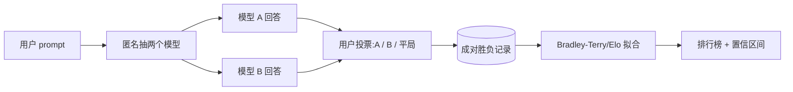

# Arena / Elo 与人类偏好评测

> **一句话**：Chatbot Arena（LMArena）让用户匿名两两对战模型并投票，用 Bradley-Terry / Elo 把成千上万次投票聚合成一个排行榜，把"人类更喜欢谁"量化成可比较的分数。
> 关键年份：Chatbot Arena（Chiang et al. 2024, arXiv:2403.04132）；The Leaderboard Illusion（2025, arXiv:2504.20879）。
> 前置阅读：[评测总览](/eval/)、[LLM-as-a-Judge](/eval/llm-as-judge)、[标准化基准](/eval/benchmarks)。

静态基准（MMLU、GSM8K 等）有标准答案、可自动判分，但有两个天生的麻烦：一是题目和答案会泄漏进训练数据（污染），二是"答对一道选择题"和"用户真正觉得这个回答好用"之间隔着一条鸿沟。Arena 式评测换了一个思路——不去问"对不对"，而是直接问"你更喜欢哪个"，用大规模真人投票来逼近真实偏好。

## 它怎么工作

Chatbot Arena 的交互很简单：用户输入一个 prompt，平台从模型池里**匿名**抽两个模型 A、B 并排出回答，用户选出更好的一个（也可以选平局或"都不好"）。投票后才揭晓是哪两个模型。匿名是关键设计——它避免用户因为品牌信仰而偏袒某家模型。

单次投票只是一个噪声很大的两两比较。要把海量的两两胜负聚合成一个全局排名，需要一个统计模型。Arena 早期用在线 **Elo**（源自国际象棋评级），后来改用 **Bradley-Terry（BT）** 做离线极大似然估计，统计上更稳、且能给出置信区间。

### Bradley-Terry / Elo 的核心（定性）

两者都假设每个模型有一个隐含实力分 $\theta_i$，模型 $i$ 战胜 $j$ 的概率是实力差的逻辑斯蒂函数：

$$
P(i \succ j) = \frac{1}{1 + e^{-(\theta_i - \theta_j)}} = \sigma(\theta_i - \theta_j)
$$

- **Elo** 是这一思想的**在线增量**版本：每场对局后按预测与实际结果的偏差更新分数，分差每拉开约 400 分，强者胜率约为 10:1。它对对局顺序敏感、结果会漂移。
- **Bradley-Terry** 是同一概率模型的**批量极大似然**版本：把全部历史投票一起拟合 $\{\theta_i\}$，与对局顺序无关，并可用 bootstrap 给出每个模型分数的置信区间。Arena 目前的"Arena Score"即基于 BT。

直觉上，最终分数就是"在和所有其他模型混战时，这个模型的整体获胜倾向"。

### Style Control（风格控制）

由于用户偏好容易被回答的长度、排版（markdown、加粗、列表）等表面风格带偏，LMArena 后来引入 **style control**：在 BT 回归里把"风格特征"作为协变量显式建模并扣除其影响，从而估计剔除风格后的"内容实力"。带 / 不带 style control 的榜单常有明显名次差异。

## 优点：为什么大家盯着它看

| 维度 | Arena / 人类偏好 | 静态基准 |
| --- | --- | --- |
| 贴近真实使用 | 高，直接测人类偏好 | 中，测特定能力 |
| 抗数据污染 | 强，prompt 实时来自真实用户、难以提前刷题 | 弱，题库会泄漏进训练集 |
| 任务覆盖 | 开放、长尾自然分布 | 固定、可控但窄 |
| 可复现 / 自动化 | 弱，依赖人和流量 | 强，一键跑 |
| 判分维度 | 整体偏好（单一标量） | 客观正确性（可分项） |

核心卖点是**贴近真实偏好 + 难以污染**：题目来自真实用户的活流量，模型很难像背 benchmark 那样针对性刷分；而"人更喜欢哪个"恰恰是产品最终想优化的目标。

## 局限：偏好不等于正确

Arena 的强项也是它的软肋——它测的是**偏好**，不是**真值**。要把它当作唯一标尺前，需要清楚几个系统性偏差：

- **偏好 ≠ 正确**。在用户不具备专业判断的领域（医学、法律、复杂代码），一个**自信、流畅但错误**的回答可能赢过一个谨慎正确的回答。投票测的是"看起来好"，不一定是"是对的"。
- **风格 / 讨好（sycophancy）带偏**。更长、排版更漂亮、语气更顺从迎合的回答天然占优。style control 能缓解但无法根除——这也是为什么需要它的原因。
- **长尾任务覆盖不足**。投票分布由真实流量主导，集中在日常对话、写作、轻量编程；agent、长上下文、特定行业等场景样本稀疏，对应分数置信度低。
- **可能过拟合 arena**。当一个榜单成为事实标准，就会有人针对它优化。[The Leaderboard Illusion](https://arxiv.org/abs/2504.20879)（arXiv:2504.20879）指出，部分厂商可私下并行测试多个变体、择优公开，加上模型下线（deprecation）会破坏 BT 模型的假设，可能让排名失真。LMArena 在[回应](https://lmarena.ai/blog/our-response/)中称，新流量持续涌入会稀释预测试带来的优势，效应随时间趋近于零。双方数字以原文为准。
- **粒度粗**。最终是单一标量分，难以告诉你"它在哪类任务上强、哪类弱"，也无法直接驱动定向优化。

## 实践：按自己的任务建评测

外部榜单回答的是"对大众平均偏好谁更强"，而你关心的是"在**我的**业务场景里谁更适合"。两者经常不一致。务实的做法是把公开 Arena 当**初筛信号**，再自建私有评测：

1. **从真实日志取 prompt**。从线上请求里抽样、脱敏，构造贴合你分布的评测集——这是抗污染、贴近真实的根本，外部任何榜单都替代不了。
2. **复刻 Arena 范式做内部对战**。对候选模型/版本做匿名两两对战，让标注员或领域专家投票，再用 Bradley-Terry 拟合内部 Elo。这能在你自己的任务分布上得到可比分数，并随版本迭代追踪相对强弱。
3. **人审 + LLM 评委混合**。全量人工太贵。可用 [LLM-as-a-Judge](/eval/llm-as-judge) 做规模化的成对评判跑批量回归，定期用人工投票校准评委、检测它自身的位置偏置 / 长度偏置。
4. **偏好之外补客观维度**。用 [标准化基准](/eval/benchmarks) 与带标准答案的私有测试集补上"正确性"，避免只盯偏好导致模型学会"讨好但不可靠"。
5. **固定协议、给置信区间**。锁死 prompt 集、采样参数、评判 rubric，报告分数时带 bootstrap 置信区间——别把噪声当成进步。

一句话总结：Arena 提供了目前最贴近真实偏好、最难污染的公开信号，但它测的是"被喜欢"而非"正确"。把它当指南针而非唯一标尺，真正能指导决策的，是按你自己任务分布建起来的私有评测体系。

## 参考文献

- Chiang et al. *Chatbot Arena: An Open Platform for Evaluating LLMs by Human Preference.* 2024. arXiv:2403.04132
- Singh et al. *The Leaderboard Illusion.* 2025. arXiv:2504.20879
- Bradley, R. A., & Terry, M. E. *Rank Analysis of Incomplete Block Designs.* 1952.（Bradley-Terry 模型原始工作）
- LMArena. *Statistical Extensions of the Bradley-Terry and Elo Models / Style Control.* news.lmarena.ai
