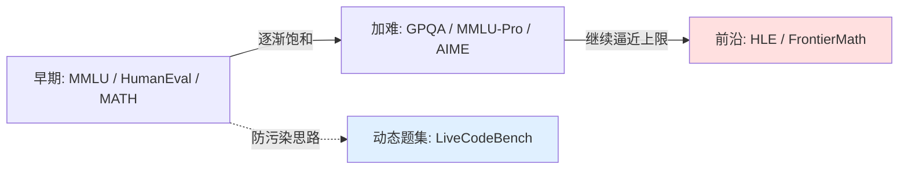

# 基准与数据污染

> **一句话**：基准是衡量模型能力的标尺，但标尺会被"看过答案"污染、也会随能力进步而饱和——读分数前先问它怎么测、题从哪来、有没有泄漏。
> 关键年份：MMLU (2009.03300, 2020)、MATH (2103.03874, 2021)、HumanEval (2107.03374, 2021)、SWE-bench (2310.06770, 2023)、GPQA (2311.12022, 2023)、GAIA (2311.12983, 2023)、HLE (2501.14249, 2025)。
> 前置阅读：[评估总览](/eval/)、[Agent 总览](/agent/)、[LLM-as-Judge](/eval/llm-as-judge)

基准（benchmark）回答的是"这个模型在某类任务上有多强"。但一个被反复忽视的事实是：**分数只在"题目从未进过训练集"且"评测协议一致"时才可比**。本页梳理常见能力基准、基准饱和后的演进方向，以及绕不开的数据污染问题。

## 常见能力基准全景

按考察的能力维度，把主流基准粗分为几类。下表所列规模与数字来自原始论文，后续版本与排行榜请以官方为准。

| 维度 | 基准 | 形式 | 关键事实 |
| --- | --- | --- | --- |
| 通用知识 | MMLU (2009.03300) | 4 选 1 多选 | 57 个学科，约 1.6 万题；曾是事实标准 |
| 通用知识（升级） | MMLU-Pro | 多选（10 选项） | 加大干扰项、剔除噪声题，缓解 MMLU 饱和（以官方为准） |
| 研究生级推理 | GPQA (2311.12022) | 多选 | 448 题，生物/物理/化学；博士专家约 65%，非专家联网仅约 34%（"Google-proof"） |
| 数学 | MATH (2103.03874) | 解答题 | 1.25 万道竞赛题（AMC/AIME 来源），带分步解 |
| 数学（竞赛） | AIME | 整数答案 | 每年新题，常用作高难数学指标（以官方为准） |
| 代码 | HumanEval (2107.03374) | 函数补全 | 164 题，pass@k 功能正确性；随 Codex 一同提出 |
| 代码（防污染） | LiveCodeBench (2403.07974) | 在线刷新 | 持续从 LeetCode/AtCoder/Codeforces 抓新题，按时间窗切分 |
| 综合推理 | BBH (BIG-Bench Hard) | 混合 | 从 BIG-Bench 中挑出当时模型难解的子集 |
| 软件工程 | SWE-bench (2310.06770) | 修代码 | 2294 个真实 GitHub issue，跨 12 个 Python 仓库 |
| 通用助手/Agent | GAIA (2311.12983) | 工具使用 | 需推理+多模态+网页浏览；人类约 92% vs 当时 GPT-4(带插件) 约 15% |

几点工程上的提醒：

- **多选 vs 生成**：MMLU/GPQA 是多选，答案落在固定选项里，**评测可以靠 logprob 选最大项，也可以靠生成后正则抽取**，两种协议分数能差好几个点。MATH/HumanEval 是生成式，前者要做答案规范化匹配，后者靠**单元测试执行**判对错（`pass@k`）。
- **agent 类基准**（SWE-bench、GAIA）测的是"端到端能不能把活干完"，结果强依赖脚手架（工具、检索、迭代轮数），脱离 harness 谈分数没有意义。SWE-bench 后续衍生出人工核验过的 Verified 子集，用来排除题目本身有问题的样本（以官方为准）。

## 饱和与"向更难处走"

基准有生命周期。当 SOTA 在某个基准上逼近人类或逼近满分，区分度消失，它就**饱和**了——MMLU 就是典型，旗舰模型普遍刷到很高，新模型之间已难以拉开差距。于是评测前沿不断向"更难、更新、更抗污染"迁移：

代表性的"更难"方向（具体数字与排名以官方为准）：

- **HLE（Humanity's Last Exam，2501.14249）**：定位为"封闭式学术基准的终点"，约 2500 道跨学科题，由近千名各领域专家供题，答案唯一且可验证、但无法靠检索速答。设计目标就是让当前前沿模型也只能拿到较低分，从而保留区分度。
- **FrontierMath**：研究级数学题，由数学家命题并验证，刻意做成**抗污染、极难**，普通竞赛题难度的模型在上面表现会断崖式下降（定性，以官方为准）。

趋势很清楚：**基准的"半衰期"在变短**。一个新基准发布后若广为流传，很快会以各种形式渗入下一代训练语料，从"测能力"退化为"测记忆"。

## 数据污染：分数失真的头号原因

**数据污染（data contamination / leakage）**指评测题目（或其答案、近似变体）出现在了训练数据中。后果是模型可能在"背题"而非"解题"，分数虚高、且无法泛化。来源很常见：题目本身挂在公开网页、被搬进各种数据集、被合成数据二次引用，乃至被人主动塞进训练集刷榜。

### 怎么检测

| 方法 | 思路 | 局限 |
| --- | --- | --- |
| n-gram / 子串重叠 | 在训练语料里搜测试题的连续片段，重叠率高即疑似泄漏 | 只能抓"原文照搬"，改写/翻译后失效；需要能访问训练数据 |
| canary 字符串 | 数据集内嵌一个独特标识串，若模型能复现它说明见过该数据 | 依赖发布方主动埋点，且只证明"见过文件"不直接等于"背了答案" |
| 动态 / 最新题集 | 用训练截止之后才产生的题（如 LiveCodeBench 按时间切分、当年新 AIME） | 题目会过期，需要持续运营更新 |
| 性能差分 | 比较"旧题 vs 同分布新题"的分数，明显下滑提示污染 | 需要可比的干净对照集，归因不一定唯一 |
| 提示扰动 | 改写题面/打乱选项，若分数大跌提示模型在记答案而非推理 | 也可能误伤对表述敏感的正常推理 |

形式化地，可以把污染检测看作估计某测试样本 $x$ 出现在训练分布中的"被见过"概率 $P(x \in \mathcal{D}_{\text{train}})$；n-gram 重叠、成员推断（membership inference）等都是它的不同近似。但要强调：**没有任何单一方法是充分的**，实践中往往组合多种信号交叉印证。

## 为什么"自报分数"要谨慎

模型卡或博客里的基准分，是营销与科研的混合体，照单全收有几类典型坑：

- **测法不公开或不一致**：few-shot 数、CoT 与否、答案抽取规则、采样温度都会改变结果，不对齐就不可比。
- **题集可能已污染**：尤其老牌公开基准，"高分"未必代表能力。
- **挑有利配置上报**：报 pass@100 而非 pass@1、只报擅长子集、用更强的脚手架跑 agent 基准，都会放大数字。
- **过拟合到基准**：针对榜单做数据筛选/格式对齐，分数涨了但真实泛化未必。

工程实践上的建议：**优先看第三方独立评测与防污染/动态基准**；自测时固定并公开评测协议；对 agent 类结果连同 harness 一起报告；对主观质量类任务，配合 [LLM-as-Judge](/eval/llm-as-judge) 但要清楚它的偏置。把基准当成"必要的体检指标"，而不是"能力的唯一真相"。

## 参考文献

- Hendrycks et al. *Measuring Massive Multitask Language Understanding (MMLU)*. arXiv:2009.03300
- Hendrycks et al. *Measuring Mathematical Problem Solving With the MATH Dataset*. arXiv:2103.03874
- Chen et al. *Evaluating Large Language Models Trained on Code (HumanEval/Codex)*. arXiv:2107.03374
- Jimenez et al. *SWE-bench: Can Language Models Resolve Real-World GitHub Issues?* arXiv:2310.06770
- Rein et al. *GPQA: A Graduate-Level Google-Proof Q&A Benchmark*. arXiv:2311.12022
- Mialon et al. *GAIA: a benchmark for General AI Assistants*. arXiv:2311.12983
- Jain et al. *LiveCodeBench: Holistic and Contamination Free Evaluation of LLMs for Code*. arXiv:2403.07974
- Phan et al. *Humanity's Last Exam (HLE)*. arXiv:2501.14249
