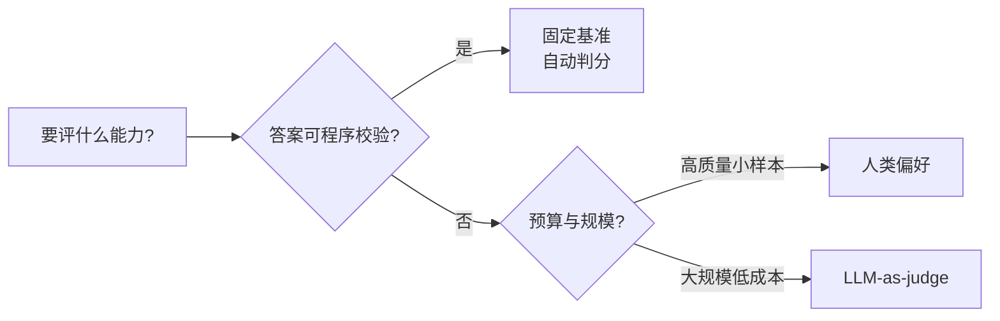

# 评测（Evaluation）总览

> **一句话**：评测的难点不在跑分，而在"这个分数能不能代表你真正关心的能力"——开放生成、主观判断、能力多维让任何单一指标都会失真。
> 关键年份：MMLU（2020，arXiv:2009.03300）、LLM-as-Judge / MT-Bench / Chatbot Arena（2023，arXiv:2306.05685）、The Leaderboard Illusion（2025，arXiv:2504.20879）。
> 前置阅读：[SFT 总览](/sft/)、[RLHF 总览](/rlhf/)、[Agent 总览](/agent/)

训练算法的每一次迭代，最终都要被一个问题拷问：模型变好了吗？这个问题看似简单，却是整个 LLM 工程中最容易自欺的环节。本章不堆砌榜单分数，而是讲清楚评测为什么难、有哪几类方法、它们各自会在什么地方骗你。

## 为什么 LLM 评测这么难

传统机器学习里评测是"已解决问题"：分类有 accuracy/F1，检测有 mAP，标准答案唯一，指标客观。LLM 把这套范式打碎了，原因有三。

**开放生成，没有唯一答案。** 给定"写一封道歉邮件"，合格的输出有无穷多种。你无法用字符串匹配判分，连 BLEU、ROUGE 这类基于参考答案的重叠指标都会严重低估模型——它们惩罚了所有"对但和参考不一样"的回答。生成任务的正确性是一个集合，而不是一个点。

**主观性。** "哪个回答更好"常常取决于人的偏好、语气、价值取向。同一份回答，不同标注者打分可以差很多；同一个标注者在不同时间也未必一致。评测对象本身带有主观维度，意味着"金标准"未必存在。

**能力多维且相互纠缠。** 一个模型同时承载知识、推理、代码、指令遵循、安全、多语言、长上下文、工具调用等能力。这些维度并不正相关——数学变强可能伴随冗长啰嗦，安全对齐可能牺牲有用性（helpfulness vs. harmlessness 的经典张力）。用一个标量去概括"模型好不好"，本质上是把高维向量投影到一维，必然丢失信息。

## 三类评测方法

应对上述困难，业界形成三条主线，各有适用边界。

| 方法 | 怎么判分 | 优点 | 劣势 |
| --- | --- | --- | --- |
| 固定基准（自动判分） | 题库 + 可程序化校验的答案（多选、精确匹配、单测） | 便宜、可复现、可回归 | 只覆盖封闭题型；易被污染；与真实体验脱节 |
| 人类偏好 | 真人对两个回答投票/打分 | 最贴近"用户觉得好" | 慢、贵、噪声大、难复现；众包标注质量参差 |
| LLM-as-judge | 用强模型当裁判打分或两两比较 | 快、便宜、可扩展到开放生成 | 有系统性偏置；裁判本身可能错；可被"讨好裁判"利用 |

**固定基准**是回归测试的主力。MMLU（arXiv:2009.03300）覆盖 57 个学科的多选题，靠选项匹配自动判分；代码评测如 HumanEval 用单元测试（pass@k）判对错。它们的价值在于自动、可复现、能纳入 CI；局限在于只能测能被程序校验的封闭题型，且公开题库极易被训练数据污染。

**人类偏好**是开放任务的金标准近似。Chatbot Arena 让真人盲测两个匿名模型并投票，用 Bradley-Terry 模型（Elo 风格评分）聚合成排名（arXiv:2306.05685）。它最接近"用户实际体验"，但慢、贵、噪声大，且众包人群的偏好未必等于你的目标用户。

**LLM-as-judge**是前两者的折中：用 GPT-4 这类强模型充当裁判，对开放回答打分或两两比较。MT-Bench / Chatbot Arena 那篇工作系统研究了它，发现强裁判与人类偏好的一致率可超过 80%（arXiv:2306.05685）。代价是裁判带有系统性偏置——位置偏好（偏向先出现的回答）、长度偏好（偏爱更长更啰嗦的答案）、自我偏好（偏爱风格像自己的输出）。详见 [LLM-as-judge](/eval/llm-as-judge)。

## 两大顽疾：数据污染与基准饱和

无论用哪种方法，有两个结构性问题会系统性地高估模型。

**数据污染（contamination）：训练集见过测试题。** LLM 的预训练语料动辄抓取整个互联网，而公开基准的题目和答案早就散落网上。一旦测试题进了训练集，模型是在"背答案"而非"做题"。研究显示这一现象普遍存在：在 MMLU 上，对缺失选项的"补全"实验中 GPT-4 的精确命中率高达约 57%，强烈暗示记忆痕迹（相关分析见 arXiv:2311.09783）；后续工作（如 MMLU-CF，arXiv:2412.15194）专门构造抗污染题库来重测世界知识。更隐蔽的是改写式污染——把原题换种说法仍能命中记忆（arXiv:2311.04850），让简单的 n-gram 去重失效。**对策**：用模型发布之后才创建的题、私有保留集、定期换题、动态生成，而不是相信一个万年不变的公开榜单。

**基准饱和与 Goodhart 定律：刷榜 ≠ 真能力。** "当一个指标变成目标，它就不再是好指标。" 当某个基准被广泛优化，分数会冲顶但鉴别力丧失——所有强模型都接近满分，差异落在噪声里。更糟的是定向过拟合：针对榜单调数据、调格式、甚至策略性提交，能在排名上获益却不对应真实能力提升。"The Leaderboard Illusion"（arXiv:2504.20879）就剖析了 Chatbot Arena 排名中的此类结构性问题。一个推论是：**基准分数高，只能证明"在这个基准上分数高"，不能直接外推到你的任务。**

## 本章导航

| 页面 | 讲什么 | 何时看 |
| --- | --- | --- |
| [基准与自动判分](/eval/benchmarks) | 主流固定基准（知识/推理/代码等）、pass@k 等判分指标、污染检测 | 搭建可复现的回归评测 |
| [LLM-as-judge](/eval/llm-as-judge) | 用强模型当裁判：打分制 vs. 两两比较、各类偏置与缓解 | 要低成本评开放生成 |
| [Arena 与人类偏好](/eval/arena) | 盲测对战、Bradley-Terry/Elo 评分、置信区间与排名陷阱 | 关心真实用户偏好 |
| [Agent 评测](/agent/) | 多步任务、工具调用、环境交互的评测难点 | 评测 agent 而非单轮对话 |

## 一条纪律：评测要回到你的真实任务

本站不堆砌榜单分数，原因正在于此：公开榜单的数字会被污染和饱和侵蚀，且天然回答的是"在这个公开题库上表现如何"，而不是"在你的业务上表现如何"。把别人的榜单分当成自己系统的验收标准，是最常见也最昂贵的自欺。

务实的做法是：**先定义你真正关心的任务和失败模式，构造贴近线上分布、模型没见过的私有评测集，再选合适的判分方式**（能自动校验就自动判分，开放生成就上 LLM-as-judge 或人评，关键决策再补人类偏好）。公开基准用来做粗筛和回归，最终拍板的，永远是你自己任务上的表现。

## 参考文献

- Hendrycks et al. *Measuring Massive Multitask Language Understanding (MMLU)*. arXiv:2009.03300
- Zheng et al. *Judging LLM-as-a-Judge with MT-Bench and Chatbot Arena*. arXiv:2306.05685
- Deng et al. *Investigating Data Contamination in Modern Benchmarks for Large Language Models*. arXiv:2311.09783
- Yang et al. *Rethinking Benchmark and Contamination for Language Models with Rephrased Samples*. arXiv:2311.04850
- Zhao et al. *MMLU-CF: A Contamination-free Multi-task Language Understanding Benchmark*. arXiv:2412.15194
- Singh et al. *The Leaderboard Illusion*. arXiv:2504.20879
