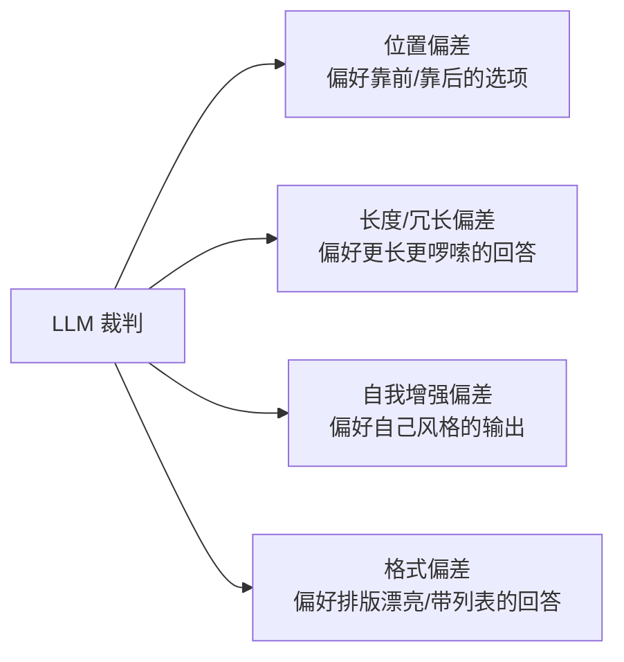

# LLM-as-judge：用大模型当裁判

> **一句话**：用一个强模型（通常 GPT-4 级别）替代人工，对模型输出做对比或打分，用可扩展、可解释的方式逼近人类偏好——但它带着一身可预测的偏差，得知道何时信、何时别信。
> 关键年份：MT-Bench / Chatbot Arena（Zheng et al. 2023，arXiv:2306.05685）；G-Eval（Liu et al. 2023，arXiv:2303.16634）。
> 前置阅读：[评测总览](/eval/)、[Chatbot Arena 与人类偏好](/eval/arena)、[奖励模型](/reasoning/reward-models)

开放式生成任务（对话、写作、总结、代码解释）很难用 BLEU/ROUGE 或选择题准确率来衡量，因为"好"是多维且主观的；而人工标注又慢又贵。LLM-as-judge 的核心主张是：一个足够强的模型，在判断"哪个回答更好"这件事上，可以达到与人类标注者之间相当的一致性。Zheng et al. 2023 给出了这一范式被广泛接受的实证依据——GPT-4 作为裁判与人类偏好的一致率超过 80%，与人类标注者彼此之间的一致水平相当。

## 两种判法：pairwise 与 pointwise

裁判任务通常落到两种范式上。

| 范式 | 输入 | 输出 | 适用 | 主要风险 |
| --- | --- | --- | --- | --- |
| **Pairwise（A/B 对比）** | 同一 prompt 下两个回答 | 哪个更好 / 平局 | 模型对比、排名、构造偏好对 | 位置偏差最突出 |
| **Pointwise（打分）** | 单个回答（可附 reference / rubric） | 标量分数（如 1~10）或多维评分 | 绝对质量评估、回归监控、过滤数据 | 分数漂移、缺乏锚点、校准困难 |

经验上，**pairwise 比 pointwise 更稳**：人和模型都更擅长"二选一"而非"打绝对分"。pointwise 容易出现分数压缩（大多数样本挤在 7~9 分）、不同批次间不可比、对 rubric 措辞高度敏感。但 pairwise 的代价是 $O(n^2)$ 的比较量；规模化时常退化为单次比较 + Elo/Bradley-Terry 聚合（见 [Chatbot Arena](/eval/arena)）。还有一种折中——**reference-guided**：给裁判一个参考答案（例如 GPT-4 预先生成的标准解），在数学/推理题上能显著降低误判。

## MT-Bench：多轮开放式评测

MT-Bench 是 Zheng et al. 2023 提出的多轮问答基准，含 80 个高质量、覆盖 8 个类别（写作、角色扮演、推理、数学、代码、知识抽取等）的两轮问题。它专门考察**多轮对话能力**：第二轮的 follow-up 会检验模型是否记得上下文、能否顺着用户意图深入。评测时由 GPT-4 对回答打分或做 pairwise 对比。MT-Bench 的价值在于把"模型聊得好不好"这一难以量化的能力，变成了一个可复现、可比较的数字，至今仍是指令微调/对齐工作的常用快速体检项。

## 典型偏差：裁判会系统性地犯错

LLM 裁判的错误不是随机噪声，而是**有方向、可预测**的系统偏差，这正是危险之处。

- **位置偏差（position bias）**：同样两个回答，仅交换 A/B 顺序，裁判的偏好可能翻转。Zheng et al. 明确报告了这一现象——许多模型有固定偏向第一个（或第二个）选项的倾向。
- **长度 / 冗长偏差（verbosity bias）**：更长、信息更密、看起来更"全面"的回答更易被判为更好，即使内容并未更正确。这与 RLHF 中的长度作弊（length hacking）同源。
- **自我增强偏差（self-enhancement bias）**：裁判倾向于偏好与自己风格相似的输出——GPT-4 当裁判时会系统性地高估 GPT-4 自己的回答。这使得"用 A 模型当裁判去评 A 模型"存在结构性利益冲突。
- **格式偏差（format bias）**：带 Markdown 标题、项目符号、加粗的回答更讨喜，排版会被误当成质量。

此外还有**有限推理能力**：在数学、逻辑、需要精确事实核对的题上，裁判自己就可能算错、看走眼，从而做出错误评判。

## 缓解手段

没有银弹，但下列做法能把偏差压到可接受范围：

- **位置交换（swap / two-game）**：每对回答跑两次（A 在前、B 在前），只有两次结论一致才算数，不一致判平局。这是对抗位置偏差最有效、最常用的一招。
- **CoT 评分**：让裁判先写理由再给结论（G-Eval 的核心思路之一），通常能提升与人类的一致性，尤其在推理类任务上。
- **rubric / 评分细则**：把"好"拆成可勾选的维度（相关性、事实性、完整性、安全性…），降低 pointwise 的随意性。配合 reference 答案效果更佳。
- **多裁判投票（ensemble / panel）**：用多个不同家族的模型当裁判取多数票或均值，可稀释单一模型的自我增强偏差。
- **控长 / 去格式**：评测前去除 Markdown、或在 prompt 中要求裁判"忽略长度与排版，只看内容"，缓解冗长与格式偏差。
- **校准与抽检**：用一小批人工标注做 anchor，定期检查裁判与人类一致率是否仍在阈值之上。

## G-Eval：把裁判流程标准化

G-Eval（Liu et al. 2023，arXiv:2303.16634）是 pointwise 范式的代表作。它以 GPT-4 为骨干，用 **chain-of-thought + form-filling**：先让模型根据任务定义自动生成评估步骤（CoT），再按这些步骤填表式打分。在文本摘要任务（SummEval）上，G-Eval 报告与人类判断的 Spearman 相关达到 0.514，大幅超越此前基于 n-gram 或嵌入的自动指标。它确立了"reference-free + CoT + 结构化打分"成为后续大量 LLM 评测器（如各类 LLM judge 库）的模板。

## 裁判与奖励模型的关系

LLM-as-judge 和 [奖励模型](/reasoning/reward-models) 做的是同一件事的两种形态：都在为"回答好不好"赋一个可比较的信号。区别在于——奖励模型是**专门训练**的打分器（吃偏好数据微调出标量头），主要服务于 RLHF/最佳-of-N 的高吞吐打分；LLM-as-judge 则是**用通用模型 + prompt** 直接当裁判，开箱即用、可解释、易迭代，但更慢、更贵、偏差更需人工兜底。实践中两者常互补：用强裁判生成偏好对去训练奖励模型，再用奖励模型大规模打分。

## 何时可信，何时别信

**相对可信**：开放式对话/写作的**相对排名**（pairwise + 位置交换）；裁判与被评模型不同家族；做了 CoT 和 rubric；并用人工抽检校准过。这类场景下，强裁判与人类一致率可达 80%+。

**应当警惕**：需要精确事实/数学正确性的判定（裁判自己可能算错）；用同一家族模型评自己（自我增强）；纯 pointwise 绝对分数跨批次对比；裁判可能被长度或漂亮排版带偏的场景；以及任何**直接拿裁判分数当 KPI** 的做法——一旦被优化目标盯上，裁判偏差就会被系统性利用（Goodhart's law）。一个稳妥的底线：LLM-as-judge 适合做**快速、可扩展的趋势性信号**，但关键决策仍需人工或多源交叉验证。

## 参考文献

- Zheng et al., *Judging LLM-as-a-Judge with MT-Bench and Chatbot Arena*, 2023, arXiv:2306.05685
- Liu et al., *G-Eval: NLG Evaluation using GPT-4 with Better Human Alignment*, 2023, arXiv:2303.16634
