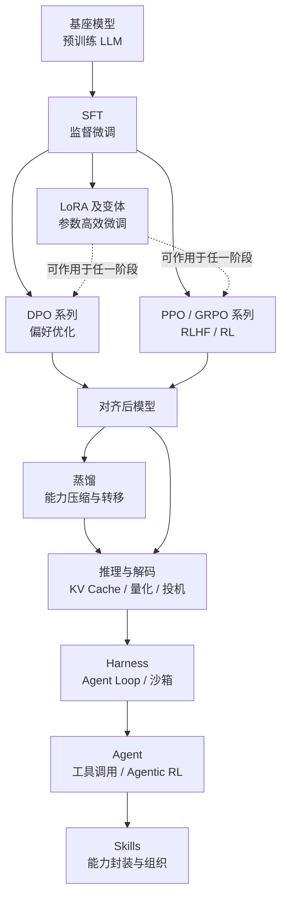

# 导读：如何使用本知识库

> **一句话**：LLM Compass 是一份面向算法工程师的「LLM 后训练算法地图」——只收录讨论度高、工程上真正会用到的出名算法，每个算法一页，结构统一、彼此互链。

本站不追求"大而全"。学术界每年产出成百上千篇对齐与微调论文，但工程实践中反复被提及、被复现、被写进训练框架默认配置的算法是少数。本站的收录标准只有一条：**它在工业界或开源社区有足够高的讨论度与采用度**。冷门的、只在单篇论文里出现过一次的方法，原则上不收。这样做的代价是覆盖面有限，收益是：你看到的每一页，都是值得真正花时间读懂的内容。

## 知识体系总览

从一个预训练基座模型，到一个能对齐人类偏好、会用工具的可用模型，中间要经过若干阶段。下图给出全站的章节地图，也是后训练流水线的主干：

这条主干并非严格的线性流程。LoRA 是一类参数高效微调技术，可以叠加在 SFT、DPO、RLHF 任意阶段之上；蒸馏既可以发生在对齐之前（用大模型造数据），也可以发生在对齐之后（压缩已对齐模型）；Harness / Agent / Skills 三章则关注"模型训好之后如何被组织成能干活的系统"。

## 三条阅读路线

不同背景的读者，建议走不同路线。

**新手路线（从零建立全局观）**：先读本页与 [符号约定](/guide/notation)，再按主干顺序走一遍——[SFT 总览](/sft/) → [LoRA](/lora/lora) → [DPO](/dpo/dpo) → [RLHF 总览](/rlhf/) → [PPO](/rlhf/ppo)。这条线帮你把"基座 → 微调 → 对齐"的因果链串起来，理解每一步在解决什么问题。每个总览页都有该章的导航与脉络，不要跳过。

**进阶路线（精读家族变体差异）**：你已经懂主干算法，想搞清楚同一家族内各变体的取舍。建议横向对比阅读：DPO 家族里 [IPO](/dpo/ipo) / [KTO](/dpo/kto) / [SimPO](/dpo/simpo) / [ORPO](/dpo/orpo) / [CPO](/dpo/cpo) 各自改了 DPO 的哪一部分；策略梯度家族里 [GRPO](/rlhf/grpo) / [DAPO](/rlhf/dapo) / [GSPO](/rlhf/gspo) / [RLOO](/rlhf/rloo) / [REINFORCE++](/rlhf/reinforce-plus-plus) 如何在 PPO 基础上去掉 Critic、改造优势估计与重要性采样;LoRA 家族里 [QLoRA](/lora/qlora) / [DoRA](/lora/dora) / [PiSSA](/lora/pissa) / [rsLoRA](/lora/rslora) 分别优化了显存、表达力还是初始化。每页的"与 baseline 对比"表格是这条路线的抓手。

**查表路线（带着问题来速查）**：你在写训练代码或调参，需要快速确认某个公式、某个超参的取值范围、或某两个方法的区别。直接用顶部搜索定位到具体算法页，跳到"方法与公式""调参与实践经验"两节即可。所有公式遵循统一的 [符号约定](/guide/notation)，不必担心跨页符号打架。

## 每页的标准结构

为了让查阅高效，所有算法页采用统一模板：

1. **开头引用块**——一句话定义 + 论文出处 + 前置阅读链接；
2. **直觉与动机**——这个方法想解决 baseline 的什么痛点；
3. **方法与公式**——核心损失/目标函数及推导关键步骤；
4. **与 baseline 对比**——表格形式列出差异点；
5. **实现要点**——落地时的关键细节，必要时附简短伪代码；
6. **调参与实践经验**——超参取值、常见坑、经验法则；
7. **参考文献**——原始论文。

## 各章一句话定位

| 章节 | 回答的核心问题 |
| --- | --- |
| [基座模型](/base-models/) | 主流开源/闭源基座各自的架构取舍与定位 |
| [SFT](/sft/) | 怎么让基座模型学会听指令、按格式回答 |
| [LoRA](/lora/) | 怎么用更少显存和可训练参数完成微调 |
| [DPO 系列](/dpo/) | 怎么不训 RM、不跑在线 RL 就对齐人类偏好 |
| [RLHF / RL](/rlhf/) | 怎么用强化学习把模型能力继续往上推 |
| [蒸馏](/distillation/) | 怎么把大模型的能力压缩/转移到小模型 |
| [推理与解码](/inference/) | 怎么让训好的模型推得更快、更省显存 |
| [Harness](/harness/) | 怎么搭出让模型循环思考、执行、观测的执行框架 |
| [Agent](/agent/) | 怎么训练和组织会用工具、能自主决策的模型 |
| [Skills](/skills/) | 怎么把可复用能力封装成模型可调用的"技能" |

## 关于符号

正文所有公式统一使用 [符号约定](/guide/notation) 中的记号体系：$x$ 表示 prompt、$y$ 表示回答、$\pi_\theta$ 表示待训练策略、$\pi_{\text{ref}}$ 表示参考模型，等等。建议先花两分钟通读符号页，后续阅读会顺畅很多。
