# 执行循环与上下文管理（Agent Loop & Context Engineering）

> **一句话**：agent loop 是「模型生成动作 → 环境执行 → 观察回填 → 继续生成」的循环（ReAct, 2022 的工程化）；harness 的核心工作是管好循环中那份不断膨胀的消息历史——上下文是有限资源，$\mathcal{C}(s_t)$ 怎么构建直接决定成功率和成本。
>
> 论文：*ReAct* (2022) · *SWE-agent* (2024) · *OpenHands* (2024) ·
> 前置阅读：[Harness 总览](/harness/)、[Tool Use 训练](/agent/tool-use)

## 1. 直觉与动机

agent 与一次性生成的本质区别在于**环境反馈**：Anthropic 把 agent 定义为「LLM 在循环中基于环境反馈使用工具」，每一步都能从环境拿到 ground truth（工具调用结果、代码执行输出）来评估进展，而不是一口气生成后听天由命。Claude Code 把这个循环描述为三阶段：**gather context**（搜索、读文件）→ **take action**（编辑、运行命令）→ **verify results**(跑测试、检查)，每次工具调用的返回都喂回循环、影响下一个决策，可以串联数十个动作并自我纠偏，用户可随时打断转向。

学术源头是 ReAct（2022）：模型交替生成思考（thought）与动作（action），环境返回观察（observation）后回填继续。SWE-agent、OpenHands、Claude Code 的 loop 都是它的工程化变体，差异集中在三处：**接口设计**（给模型什么动作可用）、**状态管理**（历史怎么存）、**上下文策略**（历史怎么进 prompt）。

上下文策略之所以成为核心问题，是因为 context window 不是越满越好。Anthropic 称之为 **context rot**：上下文 token 数增加时，模型从中准确召回信息的能力下降，根源是 transformer 的 $n^2$ 成对注意力被越拉越薄。所以上下文是**边际收益递减的有限资源**，"context engineering" 的定义就是「在 LLM 推理过程中策划并维护最优 token 集合的策略集」——它取代了一次性的 prompt engineering，成为 loop 每一轮都要做的事。

## 2. 方法与公式

### 2.1 循环的形式化

OpenHands 的 event stream 架构把状态定义为按时间排序的全部事件（动作与观察，含用户交互），agent 抽象为一个 `step(state) → action` 函数。记第 $t$ 步状态为事件流 $s_t$，策略（LLM）为 $\pi_\theta$，执行环境为 $\mathcal{E}$，上下文构建函数为 $\mathcal{C}$：

$$
a_t \sim \pi_\theta\big(\cdot \mid \mathcal{C}(s_t)\big), \qquad o_t = \mathcal{E}(a_t), \qquad s_{t+1} = s_t \oplus (a_t, o_t)
$$

循环在模型不再发起工具调用（任务完成或转回用户）、达到最大迭代数或预算上限时终止。**harness 的全部上下文管理都浓缩在 $\mathcal{C}$ 里**：朴素实现 $\mathcal{C}(s_t) = s_t$（全历史原样拼接）既贵又差——见 §5 的消融数字。


> 图源：Wang et al., *OpenHands: An Open Platform for AI Software Developers as Generalist Agents*, [arXiv:2407.16741](https://arxiv.org/abs/2407.16741)（用于学习注解，版权归原作者）

```mermaid
flowchart TD
    A[组装上下文 C&#40;s_t&#41;<br/>system prompt + 历史 + 工具定义] --> B[LLM 生成<br/>思考 + 工具调用]
    B --> C{有工具调用?}
    C -->|否| H[输出回答 / 交回用户]
    C -->|是| D[沙箱执行动作]
    D --> E[观察规范化后回填历史]
    E --> F{超出上下文预算?}
    F -->|否| A
    F -->|是| G[折叠旧观察 / LLM 总结]
    G --> A
```



### 2.2 $\mathcal{C}$ 的四级手段

按侵入性从低到高：

**(1) 截断与折叠**。SWE-agent 的做法：最近 5 条 observation 之外的更早 observation 各折叠成一行；空输出统一替换为 "Your command ran successfully and did not produce any output"；除最近一条外的历史格式错误消息全部省略。论文称这样「保留计划与动作历史的关键信息、减少无用上下文、避免展示过期文件内容」。Anthropic 把对应的 tool result clearing（清掉已执行过的旧工具原始结果）称为「最安全、最轻量的 compaction 形式」。

**(2) LLM 总结（compaction / condensation）**。OpenHands 的 LLMSummarizingCondenser：事件数超过 `max_size` 阈值时触发，`keep_first` 保留最初若干事件（system prompt 与初始用户消息），最近消息保留原文，中间较旧事件交给 LLM 总结（重点编码用户目标、已完成进展、剩余工作、关键文件与失败测试）：

$$
\mathcal{C}(s_t) = \underbrace{(e_1, \dots, e_k)}_{\text{keep\_first}} \;\oplus\; \underbrace{\mathrm{summ}(e_{k+1}, \dots, e_m)}_{\text{LLM 总结}} \;\oplus\; \underbrace{(e_{m+1}, \dots, e_n)}_{\text{最近原文}}
$$

Claude Code 的 auto-compact 顺序是「先清旧工具输出，必要时再总结对话」，总结时保留架构决策、未解决 bug、实现细节，丢弃冗余工具输出；用户可用 `/compact <instructions>` 定向控制保留内容。

**(3) 外置记忆（structured note-taking）**。把状态写到 context window 之外的存储、之后按需拉回：显式 todo list（被反复提示「频繁查看」，作为对抗 context rot 的锚点）、CLAUDE.md（每次会话注入的持久指令）、进度文件（Anthropic 的长程任务 harness 用 initializer agent 首轮搭环境、coding agent 之后每会话做增量，全靠外置工件跨会话传递状态）。检索一侧，Claude Agent SDK 主张 **agentic search**——用 grep/glob 等命令按需检索而非整文件加载，认为语义向量检索虽然更快，但「更不准、更难维护、更不透明」（需要分块和 embedding 索引维护）。

**(4) 子 agent 上下文隔离**。子 agent 用独立的 context window 探索（可消耗数万 token），只回传约 1,000–2,000 token 的浓缩摘要进主历史；OpenHands 用 AgentDelegateAction 做同类任务委派（如 CodeActAgent 把网页任务交给 BrowsingAgent）。代价核算见 [多 Agent](/agent/multi-agent)：Anthropic 的多 agent 研究系统效果比单 agent 好 90.2%，但 token 消耗约为普通 chat 的 15 倍。

## 3. 与 baseline 对比

baseline 取朴素的「全历史拼接」loop。三个代表系统的取舍（更完整的对比见 [代表系统对比](/harness/systems)）：

| 维度 | 朴素 loop | SWE-agent | OpenHands | Claude Code |
| --- | --- | --- | --- | --- |
| 状态表示 | 消息数组 | 历史 + 折叠规则 | event stream（action/observation 全记录） | 扁平消息历史 |
| 上下文策略 | 无 | 仅最近 5 条完整 observation，其余折叠为一行 | LLM condenser：keep_first + 中段总结 + 近期原文 | 先清旧工具输出，再按需总结（auto-compact） |
| 行动空间 | 任意文本 | 定制 ACI 命令（search/open/edit，带 linter） | CodeAct：可执行 Python / bash / 浏览器 | 内置工具 + Bash + subagent |
| 范式 | — | ReAct（每步 thought + action） | step(state) → action | gather → act → verify |

值得注意：SWE-agent 的消融显示「保留全部完整历史」反而比「仅保留最近 5 条完整 observation」**更差**（15.0% vs 18.0%）——更多上下文不等于更好，这是 context rot 的直接证据。

## 4. 实现要点

```python
history = [user_task]
while True:
    msgs = condense(history)                  # C(s_t)：折叠旧观察 / 触发总结
    resp = llm(system_prompt, msgs, tools)    # 生成 thought + tool_calls
    if not resp.tool_calls:
        break                                 # 无动作 = 完成或交回用户
    for call in resp.tool_calls:
        obs = sandbox.execute(call)           # 隔离执行，见 /harness/sandbox
        obs = normalize(obs)                  # 截断超长输出；空输出替换为明确提示
        history += [resp, tool_result(obs)]
    if exceeded_budget(history):
        break                                 # 最大步数 / 成本上限
```

- **observation 规范化**：超长工具输出必须截断或分页——单个超大输出会让总结后的窗口立即重新填满，Claude Code 对这种情况直接停掉 auto-compact 并报 thrashing 错误；空输出要替换成明确的成功提示，避免模型把「没有输出」误判为失败。
- **格式错误处理**：解析失败触发重试，且历史中只保留最近一条错误消息（SWE-agent 做法），防止错误示范污染后续生成。
- **prompt caching 友好**：历史保持 append-only，压缩尽量延迟触发（OpenHands 刻意延迟 condensation 以多命中缓存）；system prompt 把全局可缓存段与会话动态段分开拼装。
- **验证内建进循环**：给 agent 可运行的 check——规则式反馈（lint / test）最可靠，视觉反馈（截图）适合 UI，LLM judge 适合模糊标准但不稳健；更进一步可用 fresh-context 子 agent 做对抗式 review，「干活的 agent 不给自己打分」。
- **保持单循环**：据第三方逆向分析（minusx），Claude Code 刻意只留一个主循环加扁平历史，至多一层 subagent 分支（subagent 不能再派生），理由是可调试性远比复杂的多 agent 编排重要——任何额外复杂度都会让调试难一个量级。

## 5. 调参与实践经验

- **折叠与窗口大小的量化收益**（SWE-agent 在 SWE-bench Lite 的消融，基线 18.0%）：保留全部完整历史降到 15.0%；文件查看窗口 100 行最优，30 行降到 14.3%，整文件 12.7%；edit 去掉 linter guardrail 降到 15.0%，完全没有 edit 命令只剩 10.3%。51.7% 的轨迹至少出现一次失败编辑，整体编辑成功率 90.5%，但一次失败之后骤降到 57.2%——guardrail 的真正价值是阻断级联失败。
- **compaction 的量化收益**（OpenHands 官方博客）：condensation 激活后单轮 API 成本降到基线一半以下，token 增长从二次方变为线性；SWE-bench 解题率 54% vs 基线 53%——约 2 倍降本且无性能损失。压缩阈值（`max_size`）调太低会频繁触发总结、丢失细节，调太高则单轮成本失控。
- **步数预算**：SWE-agent 的行为分析结论是 "agents succeed quickly and fail slowly"——成功实例中位 12 步 / \$1.21，失败实例均值 21 步 / \$2.52，93% 的成功提交发生在预算耗尽之前。盲目加大步数预算收益有限，钱更应该花在接口与上下文设计上。
- **多 agent 成本核算**：Anthropic 内部评测中 token 用量单独解释 80% 的性能方差；按问题复杂度伸缩 agent 数——简单事实查找 1 个 agent、3–10 次工具调用就够。
- **小模型分流**：据 minusx 测量（第三方分析，非官方数字），Claude Code 超过一半的 LLM 调用走小模型（haiku 级），处理读大文件、解析网页、git 历史、对话摘要等低难度环节——loop 里并非每一步都需要最强模型。

## 6. 参考文献

- Yao et al., 2022. *ReAct: Synergizing Reasoning and Acting in Language Models.* arXiv:2210.03629
- Yang et al., 2024. *SWE-agent: Agent-Computer Interfaces Enable Automated Software Engineering.* arXiv:2405.15793
- Wang et al., 2024. *OpenHands: An Open Platform for AI Software Developers as Generalist Agents.* arXiv:2407.16741
- Wang et al., 2024. *Executable Code Actions Elicit Better LLM Agents.* arXiv:2402.01030
- Anthropic, 2024. *Building Effective Agents.*
- Anthropic, 2025. *Effective Context Engineering for AI Agents.*
- Anthropic, 2025. *How We Built Our Multi-Agent Research System.*
- minusx. *What Makes Claude Code So Damn Good.*（第三方逆向分析）
