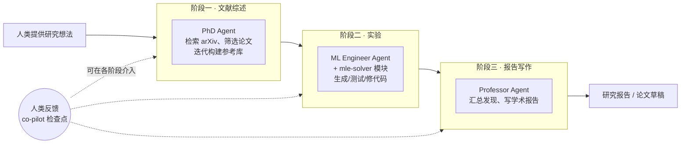

# Agent Laboratory

> **一句话**：AMD 与 Johns Hopkins 的 Samuel Schmidgall 等人 2025 年初提出的开源研究流水线（arXiv:2501.04227），把研究拆成「文献综述 → 实验 → 报告写作」三段，由拟人化的多 agent 协作完成，并支持全自动与人在环（co-pilot）两种模式。
> 提出年份：2025 · 机构/团队：AMD / Johns Hopkins（Samuel Schmidgall 等） · 会议/来源：arXiv:2501.04227

## 它要解决什么

定位与 [The AI Scientist](/harness/auto-agents/ai-scientist) 不同：Agent Laboratory 的口号不是「取代研究者」，而是「**辅助人类研究者把自己的研究想法落地**」。它假设人类已经有了研究 idea，系统负责把这个 idea 走完从查文献、做实验到写报告的繁琐流程，让研究者把时间花在创造性构思而非工程苦力上。因此它特别强调 **co-pilot 模式**——人可以在关键检查点介入、给反馈、纠正 agent 的决策。

## 工作流 / 架构

整个系统是一条三阶段流水线，每个阶段由专门角色的 agent 负责：

> 图源：Schmidgall et al., *Agent Laboratory: Using LLM Agents as Research Assistants*, [arXiv:2501.04227](https://arxiv.org/abs/2501.04227) / [GitHub](https://github.com/SamuelSchmidgall/AgentLaboratory)（用于学习注解，版权归原作者）

几个关键设计：

- **拟人化角色分工**：用「PhD / ML Engineer / Professor」对应文献综述、实验、写作三种工作，符合 [多 Agent](/agent/multi-agent) 的角色编排思路。这种把抽象流程映射到熟悉职业角色的做法，好处是每个 agent 的 system prompt 可以围绕一个清晰的职责来写，减少角色混淆——这与 [Agent Harness](/harness/) 强调的「工具与提示按职责收敛」是一致的工程直觉。
- **mle-solver 模块**：实验阶段的核心，能自主生成、测试、迭代修正 ML 代码——这是把「想法」变成「可运行实验」的引擎。
- **文献检索与参考库构建**：PhD agent 用 arXiv 等资源检索论文，并通过迭代精炼建立高质量参考库，为后续实验与写作提供依据。
- **双模式**：autonomous 模式全程无人介入跑完流水线；co-pilot 模式在预设检查点收人类反馈来调整决策。检查点的存在很关键——它把「全自动」从一个全或无的开关，变成了可调节的人机协作连续谱，研究者可以在文献库不满意时、或实验方向跑偏时及时纠偏，而不必等整条流水线跑完才发现问题。这也是它比纯黑箱系统更适合真实科研工作流的原因。

## 能力与已知局限

**能力（基于来源）**：

- 覆盖研究流程的三大段（综述 / 实验 / 报告），是少数开源、可被研究者直接拿来用的端到端框架之一。
- 后端 LLM 可替换，作者报告了不同后端在成功率与成本上的差异（如更强的推理模型成功率更高、更通用的模型更省钱）。具体数字请以原论文为准。
- co-pilot 模式让它更像一个务实的助手而非「黑箱论文生成器」，降低了对全自动结果的盲目信任。
- 同一团队后续还提出 AgentRxiv（arXiv:2503.18102），探索让多个 Agent Laboratory 实例协作、共享研究成果，把单 agent 流水线推向协作式自治研究。

**局限**：

- 与所有端到端科研 agent 一样，产出质量受限于底层 LLM，存在引用准确性、实验设计合理性、结论可靠性等问题。
- 实验阶段依赖代码自动生成与执行，复现性与正确性需人工验证；这也是 co-pilot 模式存在的原因。
- 它定位为「研究助手」，不主张产出可直接发表的成果——这与 AI Scientist 追求「过同行评审」的叙事有本质区别。

（本页不引用未经核实的成功率/成本数字；定量结果以官方论文为准。）

## 与同类对比

- 与 [The AI Scientist / v2](/harness/auto-agents/ai-scientist)：AI Scientist 追求全自动产出可发表论文并以「过评审」为里程碑；Agent Laboratory 更克制，强调人机协作、辅助而非替代，且开源易上手。
- 与 [AIDE](/harness/auto-agents/aide)：AIDE 只解决实验/ML 工程这一段（把指标做高），Agent Laboratory 的 ML Engineer + mle-solver 类似于内置了一个轻量版同类能力，但外面还包了综述与写作两段。
- 与 [Google AI co-scientist](/harness/auto-agents/ai-co-scientist)：两者都强调与人协作，但 co-scientist 面向真实学科的假设生成、不跑 ML 实验代码；Agent Laboratory 面向 ML 研究本身、核心是写代码做实验。

## 参考链接

- Agent Laboratory 论文（arXiv:2501.04227）：<https://arxiv.org/abs/2501.04227>
- 项目主页：<https://agentlaboratory.github.io/>
- 代码仓库：<https://github.com/SamuelSchmidgall/AgentLaboratory>
- AgentRxiv（协作式自治研究，arXiv:2503.18102）：<https://arxiv.org/abs/2503.18102>
