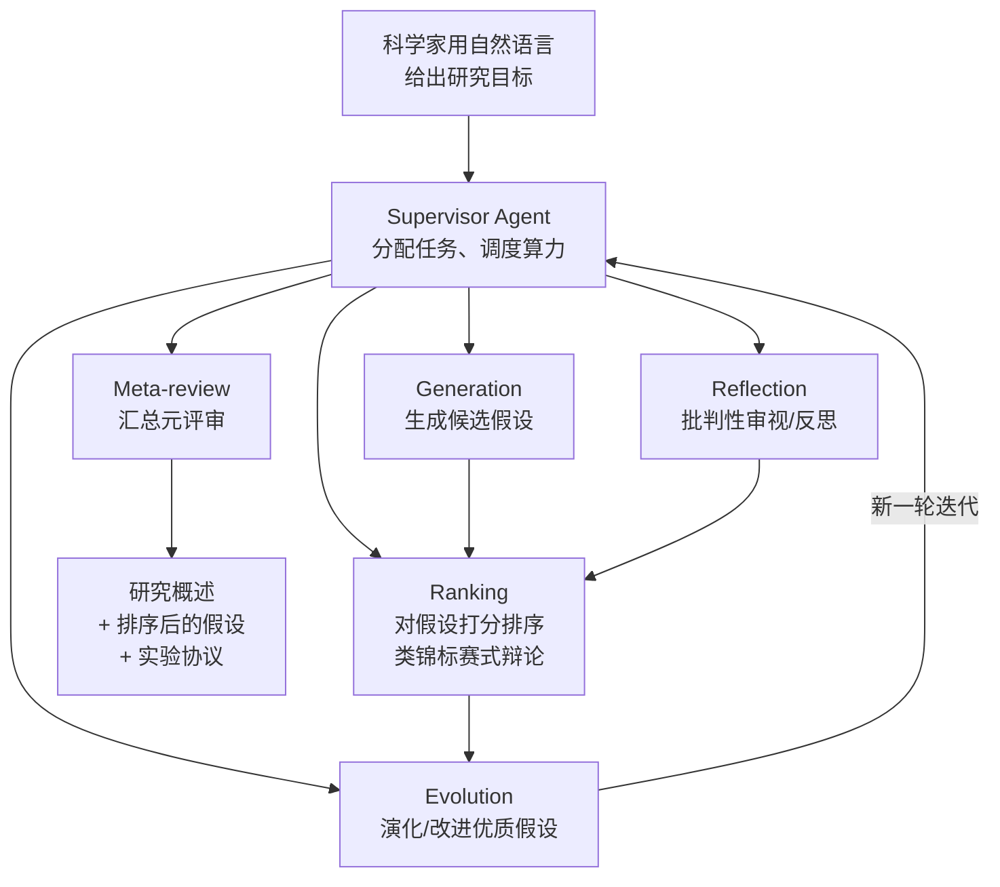

# Google AI co-scientist

> **一句话**：Google / DeepMind 2025 年发布的多 agent AI 系统（arXiv:2502.18864），基于 Gemini 2.0，作为「虚拟科研合作者」帮真实科学家生成新颖假设、研究方案与实验协议；它不写论文也不跑 ML 训练，而是用「生成—辩论—进化」的方式加速生物医药等学科的发现。
> 提出年份：2025 · 机构/团队：Google / DeepMind · 会议/来源：arXiv:2502.18864

## 它要解决什么

前面几类 agent（[AI Scientist](/harness/auto-agents/ai-scientist)、[AIDE](/harness/auto-agents/aide)）的战场是 ML 自身——写 ML 代码、跑 ML 实验。Google AI co-scientist 瞄准的是**真实自然科学（以生物医药为主）的假设生成**：科学家用自然语言描述一个研究目标，系统帮他产出值得验证的新假设、详细的研究概述和可执行的实验协议。

它的定位关键词是 **co-scientist（合作者）而非 autonomous scientist（自治科学家）**：它不替科学家做实验、下结论，而是扩展科学家的思路、加速「提出好假设」这一最依赖经验与直觉的环节。设计理念是模仿科学方法本身的推理过程，并通过扩展 test-time compute（推理时算力）来提升假设质量。

## 工作流 / 架构

系统是一个由 **Supervisor agent（主管 agent）** 调度的多 worker agent 架构，各 worker 分工对应科学方法的不同环节：

核心机制是 **generate–debate–evolve（生成—辩论—进化）**：先大量生成候选假设，再让 agent 之间相互辩论、批判、打分排序，把优质假设保留并进化成更好的版本，多轮迭代后收敛出高质量的研究提案。这种「靠多 agent 辩论 + 自我批判 + 排序竞争」来逼近好结果的思路，是 [多 Agent](/agent/multi-agent) 编排在科学发现场景的典型应用。

> 图源：Gottweis et al., *Towards an AI co-scientist*, [arXiv:2502.18864](https://arxiv.org/abs/2502.18864)（用于学习注解，版权归原作者）

值得注意的是它对 **test-time compute（推理时算力）** 的用法：Ranking 环节采用类似锦标赛的两两对比辩论，让假设在反复较量中分出高下，而不是让模型一次性给出最终答案。这把「想得更久 = 想得更好」的扩展规律落到了科学推理上——给系统更多辩论与反思的预算，就能从同一批候选里筛出更扎实的假设。与 [AIDE](/harness/auto-agents/aide) 在代码空间里搜索类似，co-scientist 是在**假设空间**里做搜索与筛选，只是它的「评分函数」不是客观指标，而是 agent 之间的批判性辩论。

## 能力与已知局限

**能力（基于来源）**：

- 面向**真实学科**而非 ML 自身：Google 已与研究者在抗微生物耐药性、植物免疫、肝纤维化等课题上测试。
- 据 Google 介绍，系统产出过经湿实验验证的新药物重定位候选（针对急性髓系白血病 AML），并在两天内复现了一项关于细菌基因转移机制、此前需十余年常规研究才得出的未发表结论。这些是 Google 报告的案例性结果，体现其能产生真实科学价值。
- 通过扩展推理时算力提升假设质量——更多「思考/辩论」预算换更好的假设。

**局限**：

- **不闭环**：它产出的是假设和方案，真正的实验验证、结论判定仍由人类科学家完成；它是加速器而非替代者。
- **未开源、闭源 Gemini 后端**：可访问性与可复现性受限，外部难以独立核验其全部声明。
- **领域偏向**：公开案例集中在生物医药，向其他学科的泛化程度仍待观察。
- 与所有 LLM 系统一样，存在幻觉风险——生成的假设/引用需人类专家严格筛查，不能盲信。

（本页只复述 Google 公开报告的案例，不引用未经核实的定量 benchmark。）

## 与同类对比

- 与 [The AI Scientist](/harness/auto-agents/ai-scientist) / [Agent Laboratory](/harness/auto-agents/agent-laboratory)：那两者面向 ML 研究、要自己写代码跑实验并产出论文；co-scientist 面向真实自然科学、只做假设与方案、与人协作不闭环。
- 与 **PaperQA2**（FutureHouse）：两者都属「科学发现/文献」一档且偏生物医药，但 PaperQA2 专注文献检索与综合（自称在文献任务上超过博士/博后），co-scientist 专注从研究目标出发生成**新假设**——一个偏「读懂已知」，一个偏「提出未知」。
- 与 [AIDE](/harness/auto-agents/aide)：完全不同档位——AIDE 优化已知指标的 ML 工程，co-scientist 在开放的科学问题上生成假设，没有单一可优化指标。

## 参考链接

- Towards an AI co-scientist 论文（arXiv:2502.18864）：<https://arxiv.org/abs/2502.18864>
- Google Research 官方博客：<https://research.google/blog/accelerating-scientific-breakthroughs-with-an-ai-co-scientist/>
- Google DeepMind 博客：<https://deepmind.google/blog/co-scientist-a-multi-agent-ai-partner-to-accelerate-research/>
- PaperQA2 / FutureHouse（同类文献 agent）：<https://github.com/Future-House/paper-qa>
