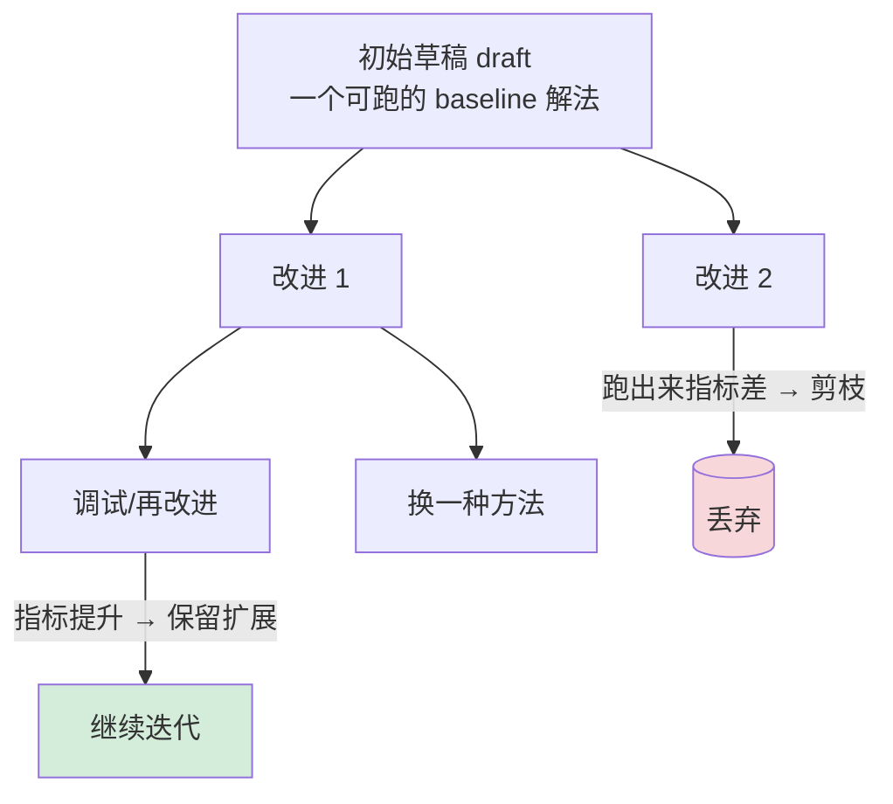

# AIDE（AI-Driven Exploration）

> **一句话**：Weco AI 提出的 ML 工程 agent（arXiv:2502.13138），把「写代码—跑—改」的过程建成一棵 **代码方案树（tree search）**，系统性地起草、调试、迭代解法，目标是在 Kaggle 竞赛与 ML benchmark 上把指标做到尽可能高；它是 OpenAI MLE-bench 上的标杆 scaffolding。
> 提出年份：2025（论文 2025-02） · 机构/团队：Weco AI · 会议/来源：arXiv:2502.13138

## 它要解决什么

与写论文的端到端科研 agent 不同，AIDE 聚焦更窄也更可验证的一档——**机器学习工程（ML engineering）**：给定一个数据集和任务描述，自己写出能跑的 ML 代码、训练模型、调参、迭代，把验证指标做高。这正是「自动 ML / 自训练」这一档最务实的形态：因为目标有客观 ground truth（竞赛排名、验证集分数），它的进展可以被干净地量化，不像「论文质量」那样难以评判。

AIDE 把 ML 工程抽象成一个**在代码空间中的搜索问题**：每一版解法是搜索空间里的一个点，目标是高效地找到指标最优的那个点，同时尽量少浪费算力在没前途的方向上。

## 工作流 / 架构

核心是 **solution tree（解法树）** + 树搜索策略：

工作循环大致是：

1. **draft（起草）**：先生成一个能跑通的 baseline 解法作为树根。
2. **debug（调试）**：解法报错就修，确保它至少能跑出一个指标。
3. **improve（改进）**：在表现好的节点上派生新解法（换模型、调特征、改超参等），形成树的分支。
4. **search（搜索）**：用树搜索策略决定下一步在哪个节点上扩展——保留有前途的分支、丢弃失败的，从而把有限算力集中在最可能提升指标的方向上。

这种「保留好分支、剪掉坏分支」的思路，与 [The AI Scientist-v2](/harness/auto-agents/ai-scientist) 的 agentic tree search 同源，也是 [执行循环](/harness/agent-loop) 中「从环境反馈迭代」在 ML 工程上的强化版——每次跑出的指标就是来自环境的 ground truth。

> 图源：Jiang et al., *AIDE: AI-Driven Exploration in the Space of Code*, [arXiv:2502.13138](https://arxiv.org/abs/2502.13138)（用于学习注解，版权归原作者）

为什么要用树而不是单线迭代？因为 ML 工程的搜索空间极大且充满死路：一个看似合理的改动可能让指标变差，而单线迭代一旦走进死胡同就很难回头。树结构让 agent 能「记住」每条分支的历史与指标，在某个方向走不通时回退到更早的好节点重新展开，本质上是用一点记账开销换取对算力的高效分配。这也呼应了 [Agent Harness](/harness/) 的核心命题：同一个底层模型，配上更聪明的搜索/上下文管理，产出可以差出一个量级。

## 能力与已知局限

**能力（基于来源）**：

- 在 Kaggle 竞赛评测中，AIDE 的平均表现超过相当一部分人类选手、在约一半被评测的竞赛里排在人类中位数之上（具体百分比以官方论文为准）。
- 它是 **OpenAI MLE-bench 的标杆 scaffolding**：MLE-bench 用 75 个 Kaggle 竞赛衡量 agent 的 ML 工程能力，论文报告的最佳设置是「o1-preview + AIDE scaffolding」，并在相当比例的竞赛上达到 Kaggle 铜牌水平（具体比例见 MLE-bench 论文）。AIDE 也出现在 METR 的 RE-bench 等 AI 研发评测中。
- 树搜索带来的可解释性：每个解法及其指标都被记录在树里，便于复用有前途的方法、快速放弃失败的尝试。

**局限**：

- 只解决「把指标做高」，不涉及提出新科学问题或写论文——能力边界比端到端科研 agent 窄得多。
- 受 **pre-training contamination（预训练污染）** 影响：很多 Kaggle 竞赛的解法可能已在训练语料里，benchmark 成绩可能虚高，MLE-bench 专门讨论过这一点。
- 树搜索消耗大量算力（反复跑实验），成本随搜索预算上升；结果对随机性与计算预算敏感。
- 在没有干净指标、目标开放的真实研究任务上，这种「优化已知指标」的范式不直接适用。

## 与同类对比

- 与 [The AI Scientist](/harness/auto-agents/ai-scientist) / [Agent Laboratory](/harness/auto-agents/agent-laboratory)：AIDE 是它们「实验/ML 工程」那一段的专精版与标杆——后两者要在这一段做的事，AIDE 做得更深更可量化，但它不管选题和写作。
- 与 **DS-Agent**（ICML'24）：DS-Agent 用案例推理（CBR）从 Kaggle 经验迁移做数据科学，AIDE 则靠树搜索在代码空间里探索；两者都瞄准自动数据科学，路线不同。
- 与 **AutoML-Agent**（arXiv:2410.02958）：AutoML-Agent 是面向「从数据检索到可部署模型」全流程 AutoML 的多 agent 框架，覆盖面更宽；AIDE 更聚焦竞赛/benchmark 式的指标优化。
- 与 **MLE-bench / MLAgentBench**：这俩是「考卷」（评测环境）而非 agent，AIDE 是在它们上面被对比的「考生」之一。

## 参考链接

- AIDE 论文（arXiv:2502.13138）：<https://arxiv.org/abs/2502.13138>
- 代码仓库：<https://github.com/WecoAI/aideml>
- 项目主页：<https://www.aide.ml/>
- MLE-bench（OpenAI，arXiv:2410.07095）：<https://arxiv.org/abs/2410.07095> / 介绍：<https://openai.com/index/mle-bench/>
- MLAgentBench（Stanford SNAP）：<https://github.com/snap-stanford/MLAgentBench>
