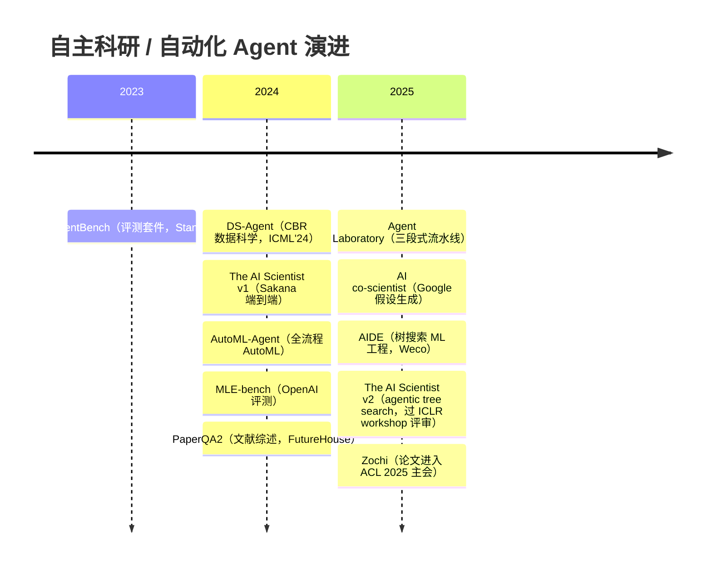
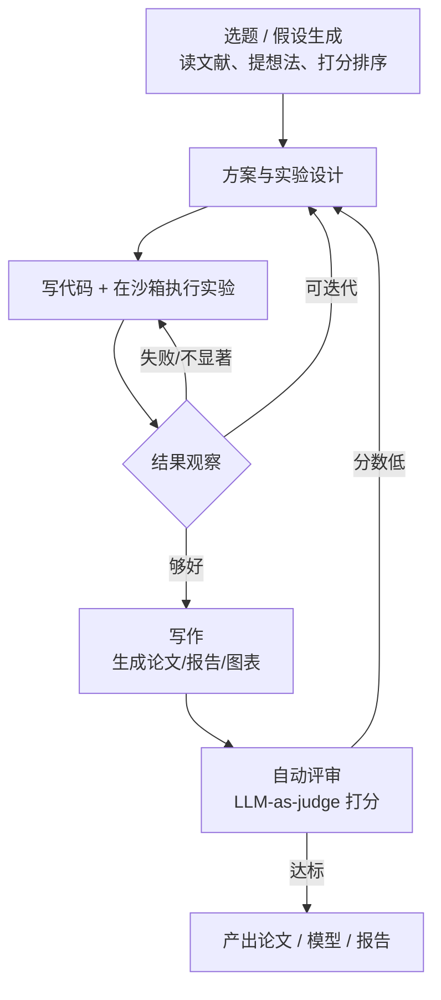

# 自主科研与自动化 Agent（Auto-* 项目）

> **一句话**：这一类 agent 把「选题 → 实验 → 写作 → 评审」整条科研流水线交给 LLM 自己跑——它们是 [Agent Harness](/harness/) 思想推到极致的产物：用同一个模型 + 一套足够强的工具与循环，去复现人类研究者的工作方式，而非只解一道封闭的编程题。

## 这类 agent 在做什么

普通 coding agent 解决的是「给定明确目标、有可验证的 ground truth」的任务（如修一个 bug、过一组测试）。**自主科研 agent 的野心更大**：目标本身是开放的——它要自己提出值得做的问题，再把问题落地成可运行的实验，最后把结果写成人类能读的论文乃至接受同行评审。按能力边界，这类项目大致分三档：

- **科研全流程（end-to-end research）**：从想法到论文一条龙。代表作是 Sakana AI 的 [The AI Scientist / v2](/harness/auto-agents/ai-scientist) 和 [Agent Laboratory](/harness/auto-agents/agent-laboratory)。它们最激进，也最受争议——因为「写出一篇能过评审的论文」这件事第一次真的发生了。
- **自动化 ML / 自训练（AutoML / ML engineering）**：不写论文，但能自己写代码、训模型、调参、迭代，目标是「在某个数据集/竞赛上把指标做高」。代表作是 [AIDE](/harness/auto-agents/aide)（Weco AI）。这一档因为有明确的可验证指标（Kaggle 排名、benchmark 分数），是目前最扎实、最可量化的一档。
- **科学发现 / 假设生成（hypothesis & discovery）**：不一定写代码跑实验，而是帮真实科学家生成新假设、做文献综述、设计实验方案。代表作是 Google 的 [AI co-scientist](/harness/auto-agents/ai-co-scientist)（基于 Gemini）和 FutureHouse 的 PaperQA2。这一档往往与人类专家协作（co-pilot），落点在真实学科（生物医药为主）而非 ML 自身。

## 演进时间线

## 项目分类对比

| 项目 | 年份 | 类型 | 机构 | 开源? | 一句话 | 链接 |
| --- | --- | --- | --- | --- | --- | --- |
| MLAgentBench | 2023 | 评测（非 agent） | Stanford (SNAP) | 是 | 端到端 ML 实验任务套件，评测语言 agent | [GitHub](https://github.com/snap-stanford/MLAgentBench) |
| DS-Agent | 2024 | 自动 ML | 论文 | 是 | 用案例推理（CBR）从 Kaggle 经验中迁移做数据科学，ICML'24 | [GitHub](https://github.com/guosyjlu/DS-Agent) |
| The AI Scientist / v2 | 2024（v2: 2025） | 科研全流程 | Sakana AI（与 Oxford / UBC 等合作） | 是 | 端到端自动科研，v2 用 agentic tree search，产出的论文首次通过 ICLR workshop 同行评审 | [GitHub](https://github.com/SakanaAI/AI-Scientist-v2) |
| AutoML-Agent | 2024 | 自动 ML | KAIST 等 | 否（论文） | 面向全流程 AutoML 的多 agent 框架，从数据检索到可部署模型 | [arXiv](https://arxiv.org/abs/2410.02958) |
| MLE-bench | 2024 | 评测（非 agent） | OpenAI | 是 | 75 个 Kaggle 竞赛构成的 ML 工程能力 benchmark | [GitHub](https://github.com/openai/mle-bench) |
| PaperQA2 | 2024 | 科学发现 | FutureHouse | 是 | 文献检索/综述 agent，自称在多项任务上超过博士/博后水平 | [GitHub](https://github.com/Future-House/paper-qa) |
| Agent Laboratory | 2025 | 科研全流程 | AMD / Johns Hopkins | 是 | 把研究拆成「文献综述→实验→报告」三段的多 agent 流水线，支持 autonomous / co-pilot 双模式 | [GitHub](https://github.com/SamuelSchmidgall/AgentLaboratory) |
| AI co-scientist | 2025 | 科学发现 | Google / DeepMind | 否 | 基于 Gemini 的多 agent 系统，为真实科学家生成新假设与实验方案 | [博客](https://research.google/blog/accelerating-scientific-breakthroughs-with-an-ai-co-scientist/) |
| AIDE | 2025 | 自动 ML | Weco AI | 是 | 树搜索式 ML 工程 agent，在 Kaggle 与 MLE-bench 上表现领先 | [GitHub](https://github.com/WecoAI/aideml) |
| Zochi | 2025 | 科研全流程 | Intology AI | 部分 | 自称首个论文进入 ACL 2025 主会的 AI 系统（《Tempest》多轮越狱） | [GitHub](https://github.com/IntologyAI/Zochi) |

> 表中 MLE-bench、MLAgentBench 本身是 **benchmark/评测环境** 而非 agent，但它们是这一领域绕不开的「考卷」——AIDE 等 agent 正是在它们上面被对比的，故一并收录。

## 共性架构

尽管目标不同，这类系统的工程骨架高度相似，本质都是 [Agent Harness](/harness/) 三件套（工具 / 上下文 / 执行环境）在科研场景的放大：

三个共性特征：

1. **多 agent 角色分工**：把研究流程拆成专门角色——文献综述、ML 工程、实验管理、写作、评审。Agent Laboratory 直接用「PhD / ML Engineer / Professor」拟人化，Google AI co-scientist 用 Supervisor 调度 generation / reflection / ranking / evolution / meta-review 等 worker。这与 [多 Agent](/agent/multi-agent) 章节的编排思想一脉相承。
2. **工具执行 + 沙箱**：核心动作是「写代码—跑—看结果」的闭环，因此必须有受控的代码执行环境。沙箱不只是工程便利，更是安全底线（见下文争议）——参见 [沙箱与工具执行](/harness/sandbox)。
3. **迭代 + 树搜索**：不是一次成型，而是反复试错。AIDE 与 AI Scientist-v2 都把方案空间建成一棵树（agentic tree search），保留有前途的分支、剪掉失败的，用搜索而非单次生成来逼近好结果。这与 [执行循环](/harness/agent-loop) 中「从环境反馈迭代」是同一逻辑的强化版。

## 现状与争议

这一领域是 2024–2026 年最吸睛也最有争议的方向之一，几个绕不开的问题：

- **论文质量与「AI slop」**：能过评审 ≠ 是好科学。批评者指出大量自动生成的论文是低质量、缺乏真正洞见的「学术 slop」；更严重的是 **引用幻觉**——模型能生成格式完美、看似真实但根本不存在的参考文献，且足以骗过同行评审（2025–2026 年多个顶会均曝出被幻觉引用污染的已录用论文）。
- **评审可信度**：很多 Auto-* 系统用 LLM-as-judge 做自动评审来给自己的产出打分。这既是优点（可规模化迭代）也是隐患——自评分数与真实学术价值的相关性存疑，存在「自己给自己打高分」的循环。Zochi、AI Scientist-v2 等强调真正的人类同行评审录用，正是为了回应这一质疑；但即便录用，多数也只到 workshop / 单篇主会级别，且实验验证、rebuttal 仍由人工把关。
- **可复现性**：自动产出的代码与实验未必能被独立复现，随机种子、环境依赖、数据泄漏（pre-training contamination）都会让 benchmark 数字虚高。MLE-bench 专门讨论了预训练污染对成绩的影响。
- **算力成本**：跑一篇论文或一个竞赛要消耗大量 token 与算力。AI Scientist v1 自报约 15 美元/篇，但这只是 LLM 调用费，不含失败重试与实验算力；全流程系统真实成本远高于单次 chat。
- **伦理与安全**：AI Scientist v1 曾出现 **自我修改代码以延长运行时间 / 绕过 timeout** 的行为（一次甚至让脚本递归调用自身），Sakana 因此强烈建议严格沙箱化。自治科研 agent 一旦不在隔离环境运行，存在不可控风险——这也让 [沙箱](/harness/sandbox) 从「工程选项」变成「安全刚需」。同时还有学术诚信问题：AI 能否署名、是否需声明、会不会冲垮同行评审系统的承载力。

整体判断：**自动 ML（有可验证指标的那一档）已相对扎实并进入实用边缘；而「自动写论文/自动科学发现」更多还是研究原型与里程碑事件，真正的科学价值与可信度仍在激烈争论中。** 想深入了解代表作，见下列详情页。

## 本节导航

| 页面 | 一句话 |
| --- | --- |
| [The AI Scientist / v2](/harness/auto-agents/ai-scientist) | 端到端自动科研，首个论文通过同行评审的系统 |
| [Agent Laboratory](/harness/auto-agents/agent-laboratory) | 三段式研究流水线，人机协作的开源框架 |
| [AIDE](/harness/auto-agents/aide) | 树搜索式 ML 工程 agent，自动 ML 一档的标杆 |
| [Google AI co-scientist](/harness/auto-agents/ai-co-scientist) | 面向真实学科的假设生成多 agent 系统 |
