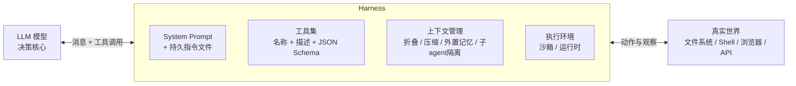

# Agent Harness 总览

> **一句话**：Harness 是包在 LLM 外面的那层工程——工具集、上下文管理、执行环境三件套，决定了同一个模型是「只会聊天」还是「能自己把活干完」。

## Harness 是什么

Claude Code 官方文档把自身明确定位为模型外围的 "agentic harness"：它提供工具、上下文管理和执行环境，"turn a language model into a capable coding agent"。也就是说，模型只负责决策，harness 负责其余一切：

- **工具集**：模型能发起哪些动作、schema 与描述怎么写、结果怎么回传（训练侧视角见 [Tool Use 训练](/agent/tool-use)）；
- **上下文管理**：有限的 context window 里放什么、何时压缩、何时外置（[执行循环与上下文管理](/harness/agent-loop)）；
- **执行环境**：动作在哪里执行、如何隔离、观察如何回收（[沙箱与工具执行](/harness/sandbox)）。

判别标准来自 Anthropic《Building Effective Agents》（2024）：**agent 是「LLM 在循环中基于环境反馈使用工具」**，每一步从环境获得 ground truth（工具调用结果、代码执行输出）来评估进展；与之相对的 workflow 是用预定义代码路径编排 LLM 与工具。Harness 关注前者——把循环本身做好，而不是替模型把路径写死。同文还强调：最成功的实现「不是用复杂框架，而是用简单、可组合的模式」搭出来的。

## 本章导航

| 页面 | 回答的问题 |
| --- | --- |
| [执行循环与上下文管理](/harness/agent-loop) | loop 的标准形态是什么？历史无限膨胀怎么治？ |
| [沙箱与工具执行](/harness/sandbox) | 动作在哪里执行？怎么隔离风险、怎么把观察回传？ |
| [代表系统对比](/harness/systems) | Claude Code / SWE-agent / OpenHands 各自怎么取舍？ |

## 为什么 harness 是和权重同量级的杠杆

SWE-agent（NeurIPS 2024）提出 **Agent-Computer Interface（ACI）** 概念：LM agent 是一类新的「终端用户」，应该为它专门设计接口，而不是沿用为人类设计的 Linux shell 或 IDE。证据是同一个 GPT-4 Turbo：

- 接定制 ACI 后在 SWE-bench 解决 12.47%，非交互式 RAG 基线只有 3.8%；
- SWE-bench Lite 上定制 ACI 18.0% vs 只给 Linux shell 11.0%——**模型没变，接口带来 64% 相对提升**。

Anthropic 也报告过仅靠改进工具描述就提升了 Claude 在 SWE-bench 的成绩。换句话说，harness 是与模型权重同量级的性能杠杆，而且迭代成本远低于重新训练。SWE-agent 总结的四条 ACI 设计原则——动作简单易懂、动作紧凑高效（导航/编辑合并为单一动作）、环境反馈信息充分但简洁、用 guardrail（如 linter 拦截错误编辑）阻断错误传播——是这一章反复出现的母题。

## 设计原则速查

| 组件 | 原则 | 出处 |
| --- | --- | --- |
| System prompt | 「right altitude」：足够具体以引导行为，又足够灵活留出启发空间；不硬编码 if-else，也不给空泛口号；用 XML 标签 / Markdown 标题分节 | Anthropic 上下文工程 |
| 工具描述 | 极其详细的 description 是工具性能最重要的因素，每个工具至少 3–4 句：做什么、何时用、参数含义、限制 | Anthropic 工具使用文档 |
| 工具集合 | 更多工具不一定更好：整合高频工作流为单个工具，而不是逐一包装 API endpoint；前缀命名空间防混淆；返回语义化内容而非裸 UUID | Anthropic《Writing Effective Tools for Agents》 |
| 工具成本 | 工具定义本身占上下文（第三方测量 Claude Code 内置工具描述约 9,400 token），因此 MCP 工具默认只挂名字、用到时才加载定义 | Claude Code 官方文档 |
| 上下文 | 上下文是边际收益递减的有限资源（context rot）；按需检索（agentic search）优先于整文件加载 | Anthropic 上下文工程 |
| 验证 | 给 agent 可运行的 check：规则式反馈（lint/test）最可靠，视觉反馈（截图）次之，LLM judge 适合模糊标准但不稳健 | Claude Agent SDK |
| 持久指令 | CLAUDE.md 类文件只放「广泛适用且模型猜不到」的内容；臃肿会导致真正的指令被忽略；偶发性领域知识放 [Skills](/skills/) 按需加载 | Claude Code 最佳实践 |

## 与训练侧的关系

本章讲**推理时工程**：不动权重，靠接口和上下文把现有模型的能力兑现。与之互补的训练侧主题：

- [Tool Use 训练](/agent/tool-use)：让模型学会在正确时机发起符合 schema 的调用；
- [Agentic RL](/agent/agentic-rl/)：把整条 loop 当作 RL 环境直接优化策略，此时 harness 就是 rollout 环境，接口设计直接决定探索效率；
- [多 Agent](/agent/multi-agent)：编排多个 loop——Anthropic 的多 agent 研究系统在内部评测上比单 agent 好 90.2%，但 token 消耗约为普通 chat 的 15 倍，收益与成本都要算；
- [Skills](/skills/design)：在不重训的前提下给 harness 注入领域知识的另一条路径。

## 参考文献

- Yang et al., 2024. *SWE-agent: Agent-Computer Interfaces Enable Automated Software Engineering.* arXiv:2405.15793
- Wang et al., 2024. *OpenHands: An Open Platform for AI Software Developers as Generalist Agents.* arXiv:2407.16741
- Anthropic, 2024. *Building Effective Agents.*
- Anthropic, 2025. *Effective Context Engineering for AI Agents.*
- Anthropic. *Writing Effective Tools for Agents — with Agents.*
- Claude Code 官方文档. *How Claude Code Works* / *Best Practices.*
