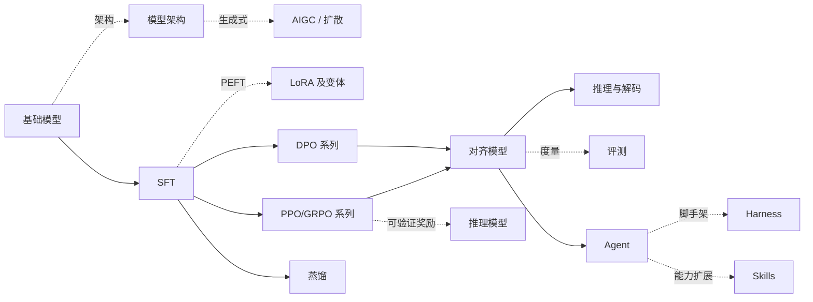

# LLM Compass <Badge type="tip" text="全景速览" />

**LLM 训练算法知识图谱** —— 这一页过完全部算法：每个算法只给「一句话 + 核心公式 + 适用场景」，五分钟建立全图认知。需要推导、伪代码和调参经验时点「详细 →」深入对应页面。本站只收**讨论度高、用得最多的出名算法**。

[如何阅读本知识库 →](/guide/) · [符号约定 →](/guide/notation)

## 基础模型

一切后训练的起点。开源模型以技术报告 / 论文为准，闭源模型以官方博客 / 模型卡为准；各厂商页按 语言 / VL / 思考 / Omni 系列梳理完整谱系。

| 厂商 | 一句话定位 | 详细 |
| --- | --- | --- |
| Qwen（阿里） | 谱系最全、全系 Apache-2.0 的开源标杆 | [→](/base-models/qwen) |
| DeepSeek | MoE + MLA 低成本路线，前沿旗舰全开源 | [→](/base-models/deepseek) |
| GLM（智谱） | 双语与 agentic 见长，旗舰开放权重 | [→](/base-models/glm) |
| Llama（Meta） | 开源生态奠基者，社区预训练参考底座 | [→](/base-models/llama) |
| Kimi（月之暗面） | 长上下文与 agentic，MoE 开源旗舰 | [→](/base-models/kimi) |
| MiniMax | 混合 / 线性注意力探索 + 生成式媒体矩阵 | [→](/base-models/minimax) |
| Step（阶跃星辰） | 原生多模态与生成线全栈 | [→](/base-models/stepfun) |
| Gemini（Google） | 原生多模态 + 超长上下文，闭源主线 + Gemma 开源 | [→](/base-models/gemini) |
| Claude（Anthropic） | agentic 编码标杆，纯闭源 API | [→](/base-models/claude) |
| OpenAI | 综合能力标杆，闭源主线 + gpt-oss 开源辐射 | [→](/base-models/openai) |

完整横向对比与选型建议见 [基础模型总览 →](/base-models/)。

## 模型架构

模型"长什么样"——现代 decoder-only LLM 的解剖结构，以及从 2017 原始 Transformer 到今天的关键演进。基础模型页里散落的 GQA/MLA/MoE/稀疏注意力等概念，这一篇集中讲清。

- **Transformer 基础**：自注意力 + FFN + 残差/归一化的解码块，decoder-only 范式。 [详细 →](/architecture/transformer)
- **注意力变体**：MHA → MQA → GQA → MLA，围绕 KV cache 的高效化。 [详细 →](/architecture/attention)
- **稀疏与线性注意力**：滑窗 / NSA / MoBA / 线性注意力 / Mamba 混合，服务长上下文。 [详细 →](/architecture/sparse-attention)
- **位置编码与归一化**：RoPE / ALiBi、RMSNorm、Pre-Norm。 [详细 →](/architecture/positional-norm)
- **MoE 混合专家**：稀疏门控、负载均衡、共享/细粒度专家。 [详细 →](/architecture/moe)
- **VLM / Omni**：视觉编码器 + 连接器 + LLM；扩展到全模态与流式。 [VLM →](/architecture/vlm) · [Omni →](/architecture/omni)

总览见 [模型架构总览 →](/architecture/)。

## 生成式模型 / AIGC

LLM 之外的另一条主线——图像 / 视频是怎么生成出来的。以扩散模型为主干，从原理到落地。

- **扩散模型基础**：前向加噪、反向去噪、DDPM / DDIM / score-based。 [详细 →](/aigc/diffusion-basics)
- **Latent Diffusion / Stable Diffusion**：潜空间扩散 + 文本条件 + CFG。 [详细 →](/aigc/latent-diffusion)
- **架构演进**：U-Net → DiT，Flow Matching / Rectified Flow（SD3 / Flux）。 [详细 →](/aigc/dit-flow)
- **条件控制与定制**：ControlNet / LoRA / IP-Adapter / DreamBooth。 [详细 →](/aigc/control)
- **采样加速与蒸馏**：DPM-Solver / Consistency / LCM / Turbo。 [详细 →](/aigc/acceleration)
- **视频与多模态生成**：Sora 式 DiT 时空 patch、SVD / Wan / Veo。 [详细 →](/aigc/video)

总览见 [AIGC 总览 →](/aigc/)。

## SFT 监督微调

### SFT

用「指令-回答」数据做有监督微调，让基座模型学会听指令。

$$
\mathcal{L}_{\text{SFT}}(\theta) = -\mathbb{E}_{(x, y) \sim \mathcal{D}} \left[ \sum_{t=1}^{|y|} \log \pi_\theta(y_t \mid x, y_{<t}) \right]
$$

**适用**：一切后训练的第一步。 [详细 →](/sft/)

关键工程子主题：[全量微调](/sft/full-finetuning) · [数据构造](/sft/data-construction) · [Chat Template](/sft/chat-template) · [序列 Packing](/sft/packing) · [Loss Masking](/sft/loss-masking)

## LoRA 及变体

### LoRA

冻结 $W_0$，只训练低秩增量 $\Delta W = BA$，可训练参数降至 1% 以下，推理时可合并、零开销。

$$
h = W_0 x + \frac{\alpha}{r} B A x
$$

**适用**：显存受限微调的默认选择。 [详细 →](/lora/lora)

### QLoRA

基座权重量化为 4-bit NF4 存储、计算时反量化，LoRA 适配器照常训练。

$$
h = \mathrm{dequant}(W_0^{\text{NF4}})\, x + \frac{\alpha}{r} B A x
$$

**适用**：单卡/极低显存微调大模型，能换训练速度。 [详细 →](/lora/qlora)

### DoRA

权重分解为幅值 × 方向：幅值直接训练、方向走 LoRA，学习行为更像全量微调。

$$
W = m \cdot \frac{W_0 + \frac{\alpha}{r} B A}{\left\lVert W_0 + \frac{\alpha}{r} B A \right\rVert_c}
$$

**适用**：低 rank 下追效果。 [详细 →](/lora/dora)

### AdaLoRA

SVD 形式参数化 $\Delta W = P \Lambda Q$，按重要性动态裁剪奇异值，把秩预算分给最需要的模块。

**适用**：参数预算紧、各模块重要性差异大。 [详细 →](/lora/adalora)

### rsLoRA

缩放因子从 $\alpha/r$ 改为 $\alpha/\sqrt{r}$，大 rank 时更新尺度不再衰减。

$$
h = W_0 x + \frac{\alpha}{\sqrt{r}} B A x
$$

**适用**：rank ≥ 64 时一行代码的免费提升。 [详细 →](/lora/rslora)

### LoRA+

给 $B$ 矩阵更大的学习率（$\eta_B = \lambda \eta_A$，$\lambda \approx 16$），修正两矩阵天然不对称的梯度尺度。

**适用**：任何 LoRA 训练的免费加速。 [详细 →](/lora/lora-plus)

### PiSSA

用 $W_0$ 的主奇异成分初始化 $B, A$（残差冻结），从"最重要的方向"起步训练。

**适用**：追求更快收敛；可与量化结合减小量化误差。 [详细 →](/lora/pissa)

## DPO 系列

### DPO

把 RLHF 的 KL 约束目标求出闭式解，"训 RM + 跑 RL"塌缩成一个分类损失。

$$
\mathcal{L}_{\text{DPO}} = -\mathbb{E} \left[ \log \sigma \left( \beta \log \frac{\pi_\theta(y_w|x)}{\pi_{\text{ref}}(y_w|x)} - \beta \log \frac{\pi_\theta(y_l|x)}{\pi_{\text{ref}}(y_l|x)} \right) \right]
$$

**适用**：有成对偏好数据时的默认对齐方案。 [详细 →](/dpo/dpo)

### IPO

DPO 在确定性偏好下会把 reward 差推向无穷；IPO 改用平方损失，把差拉向固定目标。

$$
\mathcal{L}_{\text{IPO}} = \mathbb{E} \left[ \left( \log \frac{\pi_\theta(y_w|x)\,\pi_{\text{ref}}(y_l|x)}{\pi_\theta(y_l|x)\,\pi_{\text{ref}}(y_w|x)} - \frac{1}{2\tau} \right)^2 \right]
$$

**适用**：DPO 明显过拟合偏好数据时。 [详细 →](/dpo/ipo)

### KTO

不要成对数据，单条样本 + 好/坏标签即可；损失借鉴前景理论的损失厌恶。

**适用**：只有点赞/点踩类二元反馈。 [详细 →](/dpo/kto)

### ORPO

SFT 损失 + odds ratio 惩罚，单阶段同时"学会回答 + 对齐偏好"，无 reference model。

$$
\mathcal{L}_{\text{ORPO}} = \mathcal{L}_{\text{SFT}}(y_w) - \lambda \log \sigma \left( \log \frac{\text{odds}_\theta(y_w|x)}{\text{odds}_\theta(y_l|x)} \right)
$$

**适用**：想省掉 SFT → DPO 两阶段流程。 [详细 →](/dpo/orpo)

### SimPO

去 reference，隐式 reward 改为长度归一化的平均 logprob，加目标 margin $\gamma$。

$$
\mathcal{L}_{\text{SimPO}} = -\mathbb{E}\left[\log \sigma\!\left(\frac{\beta}{|y_w|}\log \pi_\theta(y_w|x) - \frac{\beta}{|y_l|}\log \pi_\theta(y_l|x) - \gamma\right)\right]
$$

**适用**：显存紧张、被长度膨胀困扰。 [详细 →](/dpo/simpo)

### CPO

用均匀先验近似 reference 得到 DPO 上界，加 SFT 项防止 chosen 概率塌缩。

$$
\mathcal{L}_{\text{CPO}} = -\mathbb{E}\left[\log \sigma\left(\beta \log \pi_\theta(y_w|x) - \beta \log \pi_\theta(y_l|x)\right)\right] - \mathbb{E}\left[\log \pi_\theta(y_w|x)\right]
$$

**适用**：去 reference 且需要稳住生成质量（翻译等）。 [详细 →](/dpo/cpo)

## PPO / GRPO 系列

RL 阶段共同的优化目标：

$$
\max_{\pi_\theta} \; \mathbb{E}_{y \sim \pi_\theta} \left[ r(x, y) \right] - \beta \, \mathbb{D}_{\text{KL}}\!\left[ \pi_\theta \,\|\, \pi_{\text{ref}} \right]
$$

### Reward Model

在偏好数据上用 Bradley-Terry 损失训练打分模型，作为 RL 的奖励来源。

$$
\mathcal{L}_{\text{RM}} = -\mathbb{E} \left[ \log \sigma \left( r_\phi(x, y_w) - r_\phi(x, y_l) \right) \right]
$$

**适用**：RLHF 的前置组件；质量决定 RL 上限。 [详细 →](/rlhf/reward-model)

### PPO

裁剪重要性采样比值限制每步更新幅度，优势用 GAE（需训练 critic）。

$$
\mathcal{L}_{\text{PPO}} = -\mathbb{E}_t \left[ \min \left( \rho_t A_t, \; \mathrm{clip}(\rho_t, 1\pm\epsilon) A_t \right) \right]
$$

**适用**：经典 RLHF；资源充足、需要 token 级 credit assignment。 [详细 →](/rlhf/ppo)

### GRPO

去掉 critic：同 prompt 采样一组回答，组内标准化 reward 即优势。

$$
\hat{A}_i = \frac{r_i - \mathrm{mean}(\{r_j\})}{\mathrm{std}(\{r_j\})}
$$

**适用**：推理任务 RL 的当前主流（DeepSeek-R1 路线）。 [详细 →](/rlhf/grpo)

### DAPO

GRPO 的工程修正四件套：clip-higher、动态采样、token 级策略梯度损失、超长奖励整形。

**适用**：长思维链、大规模可验证奖励 RL。 [详细 →](/rlhf/dapo)

### GSPO

把重要性比值从 token 级改为**序列级**，缓解 GRPO 在 MoE 上的训练不稳定。

**适用**：MoE 模型上的大规模 RL。 [详细 →](/rlhf/gspo)

### RLOO

回归 REINFORCE：每个回答用其余 $k{-}1$ 个的平均 reward 做基线，无偏、无 critic。

$$
\nabla \mathcal{J} = \frac{1}{k} \sum_{i} \Big( r_i - \tfrac{1}{k-1}\textstyle\sum_{j \neq i} r_j \Big) \nabla \log \pi_\theta(y_i | x)
$$

**适用**：追求简单与无偏的组采样方案。 [详细 →](/rlhf/rloo)

### REINFORCE++

REINFORCE + PPO 的稳定化技巧（token 级 KL、clip、全局 batch 优势归一化），无需组采样。

**适用**：采样预算紧（每 prompt 一条）时的轻量方案。 [详细 →](/rlhf/reinforce-plus-plus)

## 蒸馏

### 黑盒蒸馏（数据 / CoT）

只用教师模型的输出文本（含思维链）构造数据微调学生，无需 logits——R1 蒸馏小模型即此路线。

**适用**：教师只有 API、师生 tokenizer 不同、跨架构蒸馏。 [详细 →](/distillation/black-box)

### 白盒蒸馏（logits KL）

对齐师生的输出分布，最小化 KL 散度（前向 KL / 反向 KL，on-policy 如 GKD）。

$$
\mathcal{L}_{\text{KD}} = \mathbb{D}_{\text{KL}}\!\left[ p_{\text{teacher}} \,\|\, p_{\text{student}} \right]
$$

**适用**：师生同词表、能拿到教师 logits，追求更高保真。 [详细 →](/distillation/white-box)

### 推理蒸馏（R1-Distill / s1 / LIMO）

用强推理模型生成的长思维链做 SFT，把"会推理"迁移到小模型；核心经验是数据质量/结构 ≫ 数量，常比在小模型上直接 RL 更划算。

**适用**：让小模型获得 o1/R1 级思维链能力。 [详细 →](/distillation/reasoning)

总览与选型见 [蒸馏总览 →](/distillation/)。

## 训练系统 / 分布式

模型大到单卡放不下时，怎么把训练切到成百上千张卡上。

- **数据并行**：DDP / ZeRO / FSDP，分片优化器状态省显存。 [详细 →](/training-systems/data-parallel)
- **模型并行**：张量并行（Megatron）+ 流水并行 + 3D 并行。 [详细 →](/training-systems/model-parallel)
- **显存与吞吐优化**：混合精度、梯度检查点、梯度累积。 [详细 →](/training-systems/efficiency)

总览见 [训练系统总览 →](/training-systems/)。

## 推理模型（Reasoning）

o1 / R1 这条线——让模型先想再答、用长思维链 + 推理时算力换正确率。

- **Test-time scaling**：长 CoT、自洽性、budget forcing。 [详细 →](/reasoning/test-time-scaling)
- **RLVR**：用可验证奖励做 RL，R1 的纯 RL 配方。 [详细 →](/reasoning/rlvr)
- **过程/结果奖励**：PRM vs ORM、Let's Verify、Math-Shepherd。 [详细 →](/reasoning/reward-models)
- **搜索与验证**：Tree of Thoughts、MCTS（rStar）。 [详细 →](/reasoning/search)

总览见 [推理模型总览 →](/reasoning/)。

## 推理与解码

### KV Cache 与 PagedAttention

缓存历史 token 的 K/V 避免重算；PagedAttention 分页管理显存、消除碎片（vLLM 路线）。

**适用**：几乎所有自回归推理部署的基础。 [详细 →](/inference/kv-cache)

### 量化（GPTQ / AWQ / FP8）

把权重 / 激活降到低 bit，省显存、提吞吐，尽量保持精度。

**适用**：显存受限部署、提升单卡承载量。 [详细 →](/inference/quantization)

### 投机解码（含 MTP）

小草稿模型 / MTP 头并行起草、大模型一次验证多 token，无损加速生成；MTP 把"预测多 token"做进预训练，自带自投机 draft。

**适用**：降低生成延迟，不改变输出分布。 [详细 →](/inference/speculative-decoding)

### 推理框架与服务引擎

vLLM / SGLang / TensorRT-LLM 把分页 KV、continuous batching、prefix caching、P/D 分离整合成高吞吐低延迟的服务系统。

**适用**：模型选型之后的"怎么把它高效地部署 / serving 出去"。 [详细 →](/inference/frameworks)

总览见 [推理与解码总览 →](/inference/)。

## 评测 Evaluation

模型到底行不行，怎么量。基准、人评、用大模型当裁判，各有坑。

- **基准与数据污染**：MMLU/GPQA/SWE-bench…，以及刷榜与污染问题。 [详细 →](/eval/benchmarks)
- **LLM-as-judge**：用大模型打分的偏差与缓解。 [详细 →](/eval/llm-as-judge)
- **Arena / Elo**：匿名对战 + 人类偏好排名。 [详细 →](/eval/arena)

总览见 [评测总览 →](/eval/)。

## Harness

Agent 的脚手架与执行环境——决定模型"能做什么、出错能否兜底"。

- **执行循环与上下文管理**：gather context → act → verify 的 agent loop 与上下文治理。 [详细 →](/harness/agent-loop)
- **沙箱与工具执行**：隔离强度谱系（容器 / gVisor / microVM）与 prompt injection 防御。 [详细 →](/harness/sandbox)
- **代表系统对比**：SWE-agent / OpenHands / Claude Code / Copilot 的设计分叉。 [详细 →](/harness/systems)
- **自主科研与自动化 Agent**：AI Scientist / Agent Laboratory / AIDE / AI co-scientist——让 agent 自己跑实验、写论文。 [详细 →](/harness/auto-agents/)

总览见 [Harness 总览 →](/harness/)。

## Agent

### Tool Use 训练

教模型按 schema 发起函数调用并消化返回结果；SFT 为主、偏好优化修正调用决策。 [详细 →](/agent/tool-use)

### Agentic RL

episode 从单轮生成扩展为多轮「生成 → 执行 → 反馈」，以任务结果验证为 reward 做策略优化。 [详细 →](/agent/agentic-rl/)

代表方向：[检索与工具 RL（Search-R1 系）](/agent/agentic-rl/search-rl) · [软件工程 RL（SWE-RL）](/agent/agentic-rl/swe-rl) · [Web 长程导航 RL](/agent/agentic-rl/web-agent-rl) · [训练稳定性](/agent/agentic-rl/stability)

### 代表性 Agent 框架

开源 1 万星以上的开发框架与 agent 产品横向对比：LangChain / LangGraph / LlamaIndex / AutoGen / CrewAI / MetaGPT，以及 Claude Agent SDK / Claude Code / Codex / OpenClaw / Hermes。 [总览与对比 →](/agent/frameworks/)

### Deep Research

把「检索 → 阅读 → 综合 → 引证」打包成长程自动调研，是 agent 的重要里程碑。闭源代表 [OpenAI Deep Research](/agent/deep-research/openai-deep-research)；国产与开源刷榜代表 [Tongyi DeepResearch（阿里）](/agent/deep-research/tongyi-deepresearch) · [REDSearcher（小红书）](/agent/deep-research/redsearcher)，另有 MiroFlow / Marco / O-Researcher 等。 [总览 →](/agent/deep-research/)

### 多智能体

planner / executor / reviewer 分工协作，编排模式与 credit assignment 是核心问题。 [详细 →](/agent/multi-agent)

## Skills

### Agent Skills 体系

把流程、工具用法打包成「指令 + 脚本 + 资源」的技能包（SKILL.md + 渐进式披露 + 触发机制），按需加载、不改权重。 [详细 →](/skills/)

### 技能设计与评测

如何写出可触发、可组合、可评测的技能包。 [详细 →](/skills/design)

### AutoSkill：技能自迭代

让 agent 从自身轨迹中自动沉淀、复用、改写技能，把一次性经验固化成可复用能力。 [详细 →](/skills/autoskill/)

### Skills vs RAG vs 微调

三种"给模型补能力"路线的边界与取舍。 [详细 →](/skills/vs-rag-finetune)
