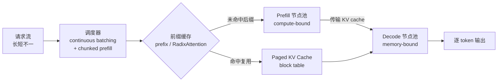

# 推理框架与服务引擎（vLLM / SGLang / TensorRT-LLM）

> **一句话**：推理框架的价值不在于发明某一项新算法，而在于把 PagedAttention、continuous batching、prefix caching、PD 分离等分散的优化机制工程化成一个"高吞吐 + 低延迟"的服务系统——vLLM 易用通用、生态最广，SGLang 强在前缀复用（RadixAttention）与结构化输出，TensorRT-LLM 走 NVIDIA 编译式极致优化。
>
> 关键年份：Orca 2022（OSDI，iteration-level scheduling）· vLLM/PagedAttention 2023（SOSP，arXiv:2309.06180）· SGLang/RadixAttention 2023（arXiv:2312.07104）· TensorRT-LLM 2023 起 · DistServe / Mooncake 与 PD 分离 2024 · vLLM V1 引擎重构 2025
> 前置阅读：[推理优化总览](/inference/) · [KV Cache 与 PagedAttention](/inference/kv-cache) · [投机解码](/inference/speculative-decoding) · [量化](/inference/quantization)

## 1. 为什么需要"框架"：从零散优化到服务系统

[推理优化总览](/inference/) 与 [KV Cache](/inference/kv-cache) 已经拆过单点机制：PagedAttention 解决显存碎片、量化压缩权重与 KV、投机解码绕过 memory-bound 的 decode。但把一个模型真正"服务"起来，面对的是另一类问题：成百上千条长短不一、随时到达又随时结束的请求，如何在一块（或一群）GPU 上既不让算力闲置、又不让单个请求的延迟爆掉。这正是推理框架要回答的，单点 kernel 优化无法替代。

理解框架时有一个有用的分层：**engine（引擎）** vs **server（服务层）**。

- **engine** 负责"一步前向怎么算最快、一批请求怎么排":KV cache 的分页管理、attention/MLP kernel、调度器（决定每一步把哪些请求、各处理多少 token 喂进 GPU）。
- **server** 负责"对外怎么服务":HTTP/gRPC 接口（通常兼容 OpenAI API）、请求队列与限流、tokenizer、采样参数解析、多副本路由、指标监控。

vLLM、SGLang、TensorRT-LLM 都同时提供这两层，但侧重不同：vLLM/SGLang 的 engine 与 server 一体且开箱即用；TensorRT-LLM 偏 engine（生成高度优化的编译产物），生产部署常配合 NVIDIA Triton / Dynamo 作为 server 层。

## 2. 三大引擎逐一拆解

### 2.1 vLLM：PagedAttention 起家的通用基座

vLLM 由 UC Berkeley 团队在 PagedAttention 论文（Kwon et al., SOSP 2023, arXiv:2309.06180）中提出，核心是把操作系统的虚拟内存分页搬进 KV cache 管理——把每条序列的 cache 切成固定大小的物理块、用 block table 映射，使 KV 显存浪费从早期系统的 60%–80% 降到 4% 以下，并天然支持跨候选/跨请求的块共享（机制细节见 [KV Cache](/inference/kv-cache)）。论文报告在同等延迟下吞吐达到当时 FasterTransformer/Orca 的 2–4 倍。

凭借这个起点，vLLM 逐步集成了 continuous batching、自动前缀缓存（automatic prefix caching）、chunked prefill、张量/流水并行、广泛的量化与投机解码支持，成为社区事实标准与生态最广的引擎。

**vLLM V1（2025）** 是一次核心架构重写（2025 年 1 月发布 alpha，blog 2025-01-27）。要点：

- **统一调度器**：取消 prefill 与 decode 的硬性阶段区分，把"每一步给每个请求处理多少 token"表示为一个简单的 `{request_id: num_tokens}` 字典，prefill 与 decode token 可在同一步内自由混合。
- **chunked prefill 默认开启**:大 prompt 被切成小块，与 decode 请求拼在同一批里跑，动态平衡 compute-bound（prefill）与 memory-bound（decode），同时改善 TTFT 与吞吐。
- **近零开销的前缀缓存**:基于 hash 的前缀缓存 + 常数时间的 LRU 淘汰，即使命中率很低也几乎不带来额外开销，因此可以默认常开。

V1 同时配合社区对 **PD 分离**（见 §3.4）的支持，朝着大规模分布式服务演进。Red Hat 报告在 0.8.1 切换到 V1 引擎后有可观的性能提升（具体数字随模型/硬件而异，以官方版本说明为准）。

### 2.2 SGLang：RadixAttention 与结构化输出

SGLang 的标志性机制是 **RadixAttention**（arXiv:2312.07104）。它用一棵 **radix tree（基数树/前缀树）** 组织所有活跃与历史请求的 KV cache：对每个新请求，在树中查找最长可复用前缀，只把"未命中的后缀"送进 prefill 计算路径。相比 vLLM 早期那种以单请求为中心的前缀复用，radix tree 把前缀复用做成了一等公民，特别适合 few-shot prompt、多轮对话、agent 工具循环、tree-of-thought 这类**前缀高度重叠**的负载。

SGLang 的第二个差异化是**结构化/约束输出**：内置高效的约束解码（如 JSON schema、正则约束），通过压缩有限状态机等手段在生成时强制语法，对函数调用 / 结构化抽取场景友好。配合其 frontend DSL，可以方便地编排带分支、并行、复用的复杂生成程序。

2025 年 SGLang 在大规模分布式上也很激进：它给出了首个开源的 DeepSeek V3/R1 大规模专家并行 + PD 分离实现，官方报告在 96 块 GPU 上达到约 52.3K input tokens/s 与 22.3K output tokens/s（官方 blog 数据，相对 vanilla 张量并行约 5×；具体以版本与硬件为准）。其 PD 分离支持 Mooncake、NIXL 作为 KV 传输引擎。

### 2.3 TensorRT-LLM：NVIDIA 的编译式极致优化

与前两者"运行时框架"的路线不同，TensorRT-LLM（NVIDIA，2023 年起）走的是**编译式（ahead-of-time）**路线：把模型结构与权重针对特定 GPU SKU、批大小区间、序列长度区间，**编译成一张优化过的 CUDA kernel graph（engine 产物）**，把 kernel 融合、精度、内存布局都固化下来换取极致的硬件利用率。代价是灵活性——构建 engine 需要一次较长的编译（社区资料常见 25–45 分钟量级），换硬件或换形状区间通常要重新构建。

它同样实现了服务化所需的核心机制，在 TensorRT-LLM 语境里 continuous batching 被称为 **in-flight batching**（context 阶段与 generation 阶段动态混合调度）。最大卖点是与 NVIDIA 新硬件的低比特能力深度绑定：

- **FP8**：H100 及之后的 Hopper/Blackwell 上，相比 FP16 可显著提升吞吐、约减半显存，精度损失小；
- **FP4**：Blackwell（如 B200）支持直接加载 FP4 权重并走优化过的 FP4 kernel；近期版本还在 Hopper/Blackwell 上扩展了 FP8 MLA、FP4/FP8 decode kernel 等。

定位很清楚：当你的部署锁定 NVIDIA 新卡、追求极限吞吐 / 最低延迟、且能接受编译与运维成本时，TensorRT-LLM 是上限最高的选项。生产中常与 Triton Inference Server / NVIDIA Dynamo 搭配做服务层。

## 3. 贯穿各框架的服务化关键技术（框架视角）

下面四项是所有现代引擎共有的"地基"。其中 continuous batching 的原理与 FlashAttention 已在 [推理优化总览](/inference/) 详述，这里只做框架视角的串联，避免重复。

### 3.1 Continuous batching（持续批处理）

源头是 **Orca（OSDI 2022）** 的 iteration-level scheduling：调度粒度从"整个请求"细化到"单次迭代"——某条序列生成结束就立刻让位，新请求随时插入填补空位，而不是让整批傻等最长的请求。它把 static batching 下被浪费的 GPU 周期填满，是吞吐提升的基础，如今是 vLLM、SGLang、TensorRT-LLM（in-flight batching）、TGI 的标配。

### 3.2 Chunked prefill（分块预填充）

朴素调度里一个长 prompt 的 prefill 会独占一整步、阻塞所有 decode，造成 TPOT 抖动。chunked prefill 把长 prefill 切成小块，与 decode token 拼进同一批，让每步的 token 预算在 compute-bound 的 prefill 与 memory-bound 的 decode 之间动态平衡，从而同时改善吞吐与尾延迟。在 vLLM V1 中默认开启。

### 3.3 Prefix caching（前缀缓存）

跨请求复用相同前缀的 KV，避免重复 prefill：system prompt、few-shot 示例、多轮对话历史、agent 的长工具上下文都是高复用前缀。两条典型实现：vLLM 的 hash-based automatic prefix caching（V1 中做到近零开销 + 常数时间淘汰）、SGLang 的 RadixAttention（基数树查最长匹配前缀）。命中越多，TTFT 越低、有效吞吐越高。

### 3.4 Prefill / Decode（P/D）分离

prefill 是 compute-bound、decode 是 memory-bound，二者放在同一组 GPU 上会相互干扰（长 prefill 拖慢 decode 的平滑出字）。**PD 分离**把它们拆到不同 GPU 池：prefill 节点专心处理 prompt，把算好的 KV cache 通过网络传给 decode 节点继续自回归生成。代表工作是 **DistServe**（Zhong et al., OSDI 2024，按阶段独立配置并行度与资源以优化 goodput）与 **Mooncake**（arXiv:2407.00079，Moonshot/Kimi 的 KVCache-centric 分离架构，论文称在特定模拟场景吞吐最高提升约 525%）。2024–2025 间，PD 分离已成为大规模服务的主流方向，vLLM、SGLang 等均已支持。

## 4. 横向对比

| 引擎 | 核心机制 | 路线 | 适用场景 | 易用性 |
| --- | --- | --- | --- | --- |
| **vLLM** | PagedAttention、continuous batching、自动前缀缓存、V1 统一调度 | 运行时框架，通用 | 通用高吞吐服务、生态最广、快速接入新模型 | 高（OpenAI 兼容、开箱即用） |
| **SGLang** | RadixAttention 前缀树复用、约束/结构化输出、PD 分离 | 运行时框架，前缀复用见长 | 多轮对话、agent、few-shot、结构化/函数调用、大规模 EP+PD | 中高（前端 DSL + OpenAI 兼容） |
| **TensorRT-LLM** | 编译式 kernel graph、in-flight batching、FP8/FP4 | 编译式，NVIDIA 专属 | 锁定 NVIDIA 新卡、追求极限吞吐 / 最低延迟 | 中（需编译 + 常配 Triton/Dynamo） |

其他值得一提：**LMDeploy**（OpenMMLab，TurboMind 引擎，量化与中文模型支持好）、**TGI**（Hugging Face Text Generation Inference，生态集成好）、**NVIDIA Dynamo**（面向多节点分布式推理的新一代服务层，原生支持 PD 分离与 KV 路由）。

## 5. 选型建议

- **快速起步 / 通用服务 / 想要最广模型与功能覆盖**：选 **vLLM**，OpenAI 兼容、社区活跃、V1 后调度与前缀缓存都已默认优化。
- **agent、多轮、few-shot、结构化输出，前缀高度重叠**：选 **SGLang**，RadixAttention 的前缀复用和约束解码是真实增益。
- **部署绑定 NVIDIA 新卡、要榨干 FP8/FP4、能接受编译与运维成本**：选 **TensorRT-LLM**（+ Triton/Dynamo）。
- **超大模型 + 高并发 + 严格 SLO**：在上述基础上启用 **PD 分离**（vLLM / SGLang）或走 Dynamo / Mooncake 思路的分布式 KV 架构。
- 务实做法：先用 vLLM 跑通基线，再针对具体瓶颈（前缀复用 → SGLang；硬件极致 → TensorRT-LLM；规模 → PD 分离）做替换或扩展，并用自己的真实流量做 benchmark（公开数字随版本/硬件波动很大，不要直接照搬）。

## 6. 参考文献

- Yu et al. *Orca: A Distributed Serving System for Transformer-Based Generative Models.* OSDI 2022.（iteration-level / continuous batching）
- Kwon et al. *Efficient Memory Management for Large Language Model Serving with PagedAttention.* SOSP 2023, arXiv:2309.06180.（vLLM / PagedAttention）
- Zheng et al. *SGLang: Efficient Execution of Structured Language Model Programs.* arXiv:2312.07104.（RadixAttention / 结构化输出）
- Zhong et al. *DistServe: Disaggregating Prefill and Decoding for Goodput-optimized LLM Serving.* OSDI 2024.（PD 分离）
- Qin et al. *Mooncake: A KVCache-centric Disaggregated Architecture for LLM Serving.* arXiv:2407.00079.（KVCache-centric PD 分离）
- vLLM V1 架构博客（2025-01-27）、vLLM / SGLang / TensorRT-LLM 官方文档与版本说明（FP8/FP4、in-flight batching、PD 分离支持以官方版本为准）。
