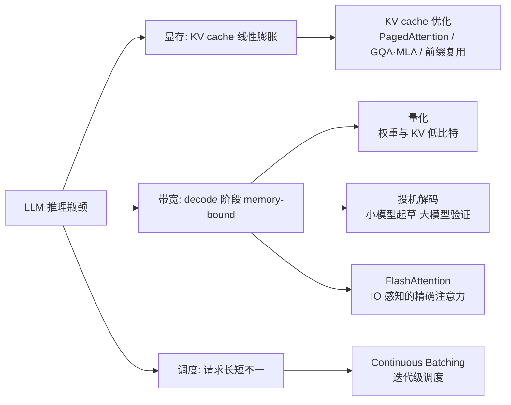
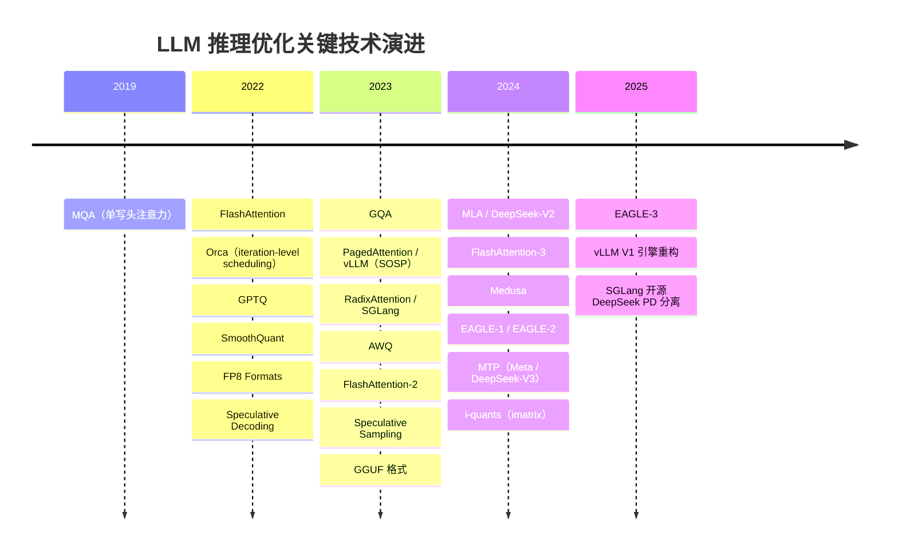

# 推理优化总览

> **一句话**：LLM 推理的本质矛盾是 decode 阶段 memory-bound——吞吐被 KV cache 显存容量和 HBM 带宽卡住，而非算力；现代推理引擎（vLLM、SGLang 等）的几乎所有优化都围绕"省显存、省带宽、填满 GPU"三件事展开。

## 1. 推理为什么难：prefill 与 decode 的不对称

一次请求分两个阶段，性质完全不同：

- **Prefill**：prompt $x$ 的全部 token 并行做一次前向，矩阵乘充分饱和，是 **compute-bound**；它决定首 token 延迟（TTFT）。
- **Decode**：自回归逐 token 生成 $y_t$，每步只处理 1 个 token，却要把全部权重和该序列迄今的 KV cache 从 HBM 读一遍，算术强度极低，是 **memory-bound**；它决定每 token 延迟（TPOT）和总吞吐。

提高 decode 吞吐的标准手段是增大 batch、让一次权重读取服务更多序列，但 batch 上限由 KV cache 显存决定——以 Llama 2 7B 为例，FP16 下一条 4096 token 的序列就要约 2GB KV cache（计算见 [KV Cache](/inference/kv-cache)）。于是三类瓶颈浮现：

1. **显存**：KV cache 随 batch × 序列长度线性增长，限制并发；
2. **带宽**：decode 每步都要搬运权重 + KV，GPU 算力大量闲置；
3. **调度**：请求长短差异巨大，朴素的 static batching 让整批等最长的请求。

## 2. 优化版图

| 页面 | 解决什么问题 | 核心思路 |
| --- | --- | --- |
| [KV Cache](/inference/kv-cache) | KV cache 是什么、为何成为瓶颈、三条优化路线 | 用显存换计算；GQA/MLA 压缩、PagedAttention 分页、prefix caching 复用 |
| [量化](/inference/quantization) | 权重/激活/KV 的低比特表示 | 减少搬运字节数，直接缓解 memory-bound |
| [投机解码](/inference/speculative-decoding) | 单请求 decode 延迟 | 小模型/MTP 头起草多个 token，大模型一次并行验证 |
| [推理框架与服务引擎](/inference/frameworks) | 把上述优化整合成高吞吐低延迟的服务系统 | vLLM / SGLang / TensorRT-LLM；continuous batching、chunked prefill、prefix caching、P/D 分离 |

### 关键技术演进时间线

## 3. 引擎侧两项关键技术速览

以下两项是理解现代推理引擎绕不开的基础（引擎与框架的整体对比另见 [推理框架与服务引擎](/inference/frameworks)，本节只讲技术本身）。

### Continuous batching：调度粒度从请求降到迭代

技术源头是 **Orca**（Yu et al., OSDI 2022）提出的 *iteration-level scheduling*：以单次 decode 迭代而非整个请求为调度粒度——某条序列生成完立即返回、腾出的槽位即刻插入新请求，配合 selective batching（只对部分算子做 batching）。Orca 在同等延迟下比 NVIDIA FasterTransformer 吞吐提升 36.9 倍。

广为流传的 "23x" 出自 Anyscale 2023 年的基准博客，需要正确解读：在长度方差最大的负载下，vLLM（continuous batching **+** PagedAttention 显存优化）比朴素 static batching 吞吐高 23 倍；纯 continuous batching 实现（TGI、Ray Serve）约 8 倍，FasterTransformer 的优化版 static batching 约 4 倍。即 23x 是调度与显存优化叠加的结果，不是 continuous batching 单独的功劳。

### FlashAttention：IO 感知的精确注意力

FlashAttention（Dao et al., 2022, arXiv:2205.14135）是**精确**算法而非近似：通过 tiling 把注意力计算拆成能装进片上 SRAM 的小块，在线 softmax 累积结果，避免把 $N \times N$ 注意力矩阵物化到 HBM，使注意力的额外显存从随序列长度二次增长降为线性。v1 将 GPT-2（seq 1K）训练加速 3 倍；**FlashAttention-2**（2023）优化并行划分，比 v1 快约 2 倍，A100 上达理论峰值 FLOPs 的 50–73%；**FlashAttention-3**（2024）针对 H100 用 warp specialization 异步化与 FP8，比 v2 再快 1.5–2 倍，FP16 达 740 TFLOPs/s。

注意区分：FlashAttention 省的是注意力分数矩阵的物化与 HBM 读写，**不减少 KV cache 本身**；它与 PagedAttention、量化等优化正交，现代引擎通常全部叠加使用。

## 4. 实践建议

- **引擎选型**：在线服务直接从 vLLM / SGLang 这类 "continuous batching + paged KV" 引擎起步，PagedAttention 论文报告同等延迟下吞吐为 FasterTransformer/Orca 的 2–4 倍，官方基准比 HuggingFace Transformers 最高 24 倍。各引擎定位与取舍见 [推理框架与服务引擎](/inference/frameworks)。
- **先看负载特征再选优化**：长 prompt + 短输出（RAG、文档问答）→ prefix caching 和 prefill 优化收益最大；短 prompt + 长输出（创作、推理链）→ decode 侧的投机解码与量化更关键。
- **延迟与吞吐的取舍**：单请求延迟敏感（交互式应用）用[投机解码](/inference/speculative-decoding)；吞吐敏感（离线批处理）拉大 batch、配合 KV cache [量化](/inference/quantization)。
- **显存预算**：部署前估算 权重 + KV cache + 激活 三部分，其中 KV cache 是唯一随负载动态增长的项，估算方法见 [KV Cache](/inference/kv-cache)。
