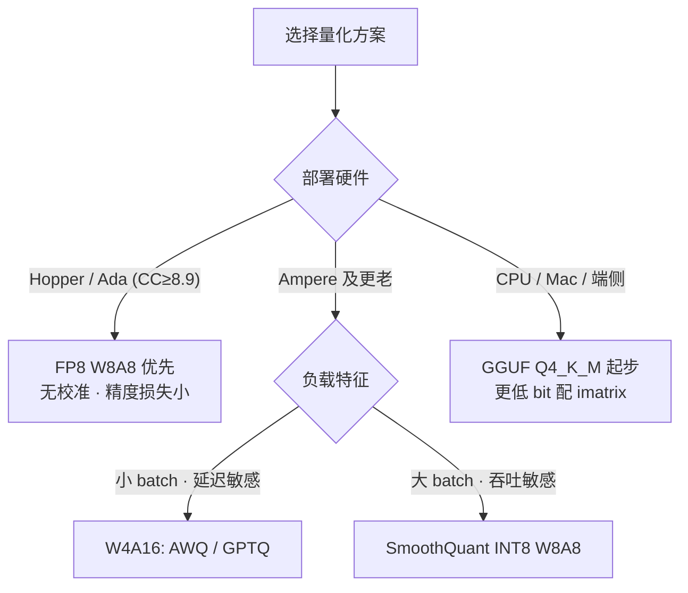

# 模型量化（Quantization）

> **一句话**：把权重（以及激活、KV cache）从 FP16 压到 8/4/3 bit，直接减少 decode 阶段每步必须从 HBM 搬运的字节数和显存占用——量化是对 memory-bound 瓶颈最"对症"的优化。代表工作：*GPTQ*（2022）、*SmoothQuant*（2022）、*AWQ*（2023）、*FP8 Formats for Deep Learning*（2022）。
>
> 关键年份：FP8 Formats 2022（NVIDIA/Arm/Intel，arXiv:2209.05433）· GPTQ 2022（IST Austria，arXiv:2210.17323，ICLR 2023）· SmoothQuant 2022（MIT，arXiv:2211.10438，ICML 2023）· AWQ 2023（MIT，arXiv:2306.00978，MLSys 2024）· GGUF 格式 2023-08（llama.cpp）
> 前置阅读：[推理优化总览](/inference/)、[KV Cache](/inference/kv-cache)

## 1. 直觉与动机

Decode 阶段每生成一个 token 都要把全部权重从 HBM 读一遍（见[推理优化总览](/inference/)），吞吐直接正比于"每 token 搬运的字节数"。量化的收益因此非常直接：INT4 权重的体积是 FP16 的 1/4，理论上 decode 带宽需求降 4 倍；显存上 7B 模型权重从 14 GB 降到约 4 GB（含缩放因子开销），既能把大模型塞进消费级显卡，也能把省出的显存让给 KV cache、换更大的 batch。

技术上分两条路线：

1. **Weight-only（W4A16 / W3A16）**：只量化权重，kernel 在计算前把权重反量化回 FP16 再做矩阵乘。省显存与带宽、不省计算，适合小 batch decode 这种 memory-bound 场景。代表：GPTQ、AWQ、GGUF 系列。
2. **权重 + 激活（W8A8）**：权重和激活都量化到 INT8 或 FP8，GEMM 直接跑在 8-bit Tensor Core 上，带宽与算力双省，对 compute-bound 的 prefill 和大 batch 同样有效。代表：SmoothQuant（INT8）、FP8。

LLM 量化的根本难点是**激活离群值（outliers）**：少数通道的激活幅值比其余通道大一到两个数量级，per-tensor 均匀量化会让绝大多数通道的有效精度被这几个通道挤掉；而权重分布平坦得多、相对易量化。下面几个方法本质上都在回答同一个问题：**不重训的前提下，如何把有限的比特预算分给真正重要的数值**。

## 2. 方法与公式

$b$-bit 均匀量化把浮点数映射到整数格点再还原：

$$
\hat w = s\cdot\Big(\operatorname{clamp}\big(\lfloor w/s \rceil + z,\ 0,\ 2^b-1\big) - z\Big)
$$

缩放因子 $s$ 与零点 $z$ 的统计粒度（per-tensor / per-channel / per-group，常见 group size 128）决定误差上限。各方法的差异在于：**最小化什么误差、用什么信息分配精度**。

### GPTQ：逐层二阶误差补偿

GPTQ（Frantar et al., 2022，ICLR 2023）是 one-shot weight-only 训练后量化（PTQ）：对每个线性层，在校准激活 $X$ 上最小化输出误差 $\min_{\hat W}\|WX-\hat WX\|_F^2$。它继承 OBQ 的思路——每量化一个权重，就用 Hessian $H=2XX^\top$ 的信息更新其余未量化权重来补偿误差；并通过三项工程改造（所有行按同一固定顺序量化、批量延迟更新、Cholesky 预计算）把复杂度压到可处理超大模型：约 4 个 GPU 小时即可把 175B 模型量化到 3-4 bit 且精度损失可忽略，首次让 175B 模型在单张 GPU 上做生成式推理；配套 kernel 相对 FP16 在 A100 上约 3.25x、A6000 上约 4.5x 提速，并可探索 2-bit/三值的极端量化。

### AWQ：按激活幅值找出 1% 关键通道，用缩放保护

AWQ（Lin et al., 2023，MLSys 2024 Best Paper）的核心观察：权重并非同等重要——仅保护约 1% 的显著（salient）通道就能大幅降低量化误差，且显著性应按**激活分布**识别（激活大的通道对应的权重更关键），而非权重自身大小。把这 1% 留成 FP16 的混合精度方案对硬件不友好，AWQ 改用数学等价的 per-channel 缩放：显著通道权重乘 $s>1$ 后再量化（相对量化误差变小），激活侧除以 $s$ 抵消；在 $s = s_X^{\alpha}$ 的单参数族上网格搜索 $\alpha$ 最小化输出误差。全程不做反向传播、不做逐层重构，因此对校准集不敏感、泛化性好。配套的 TinyChat 推理框架在桌面/移动 GPU 上相对 Hugging Face FP16 有 3 倍以上加速。


> 图源：Lin et al., *AWQ: Activation-aware Weight Quantization for LLM Compression and Acceleration*, arXiv:2306.00978（用于学习注解，版权归原作者）

### SmoothQuant：把激活的量化难度迁移给权重

SmoothQuant（Xiao et al., 2022，ICML 2023）走 W8A8 路线，training-free。利用恒等变换 $Y=(X\operatorname{diag}(s)^{-1})(\operatorname{diag}(s)W)$，激活按通道除以 $s$、权重乘以同一 $s$，把 outlier 造成的量化难度从激活"平滑"地搬到权重上：

$$
s_j=\frac{\max|X_j|^{\alpha}}{\max|W_j|^{1-\alpha}}
$$

$\alpha$ 是迁移强度，论文对 OPT、BLOOM 等模型用 0.5 作均衡默认值，激活离群更严重的模型（如 GLM-130B）需调到 0.75。校准只需统计每通道激活最大值。实测最高 1.56x 加速、2x 显存节省，可让 530B 模型在单节点内服务；已集成进 TensorRT-LLM、FasterTransformer、ONNX Runtime 等。

### FP8：用浮点格式天然吸收动态范围

FP8 双格式由 NVIDIA/Arm/Intel 合著论文（arXiv:2209.05433）提出：**E4M3**（1 符号 + 4 指数 + 3 尾数，放弃表示 infinity 换更大动态范围，最大约 ±448，保留 NaN）精度优先，惯例用于前向的权重/激活；**E5M2**（1+5+2，遵循 IEEE-754，最大约 ±57344，支持 ±inf/NaN）范围优先，用于训练反向的梯度。推理量化基本只用 E4M3。指数位让 FP8 自带非均匀格点——小值密、大值疏，对 outlier 比 INT8 宽容得多，通常不需要 SmoothQuant 式的难度迁移。硬件上 H100（Hopper）与 Ada（compute capability ≥ 8.9）的 Tensor Core 原生支持两种格式、配 FP32/FP16 累加器；vLLM 的 FP8 W8A8 报告约 2x 显存节省、最高约 1.6x 吞吐提升且精度影响极小，支持 llm-compressor 的 FP8_DYNAMIC 方案（权重 static per-channel + 激活 dynamic per-token，**无需校准数据**）和在线动态量化（`quantization="fp8"`，除 lm_head 外的 Linear 权重转为 per-tensor scale 的 E4M3）。

### GGUF 与 k-quants / i-quants：本地推理生态

llama.cpp 的量化体系自成一派，面向 CPU、Apple Silicon 与消费级 GPU：

- **GGUF 格式**（PR #2398，2023-08 合并，breaking change）：单文件自包含张量、架构超参与 tokenizer；带类型的 key-value 元数据可向后兼容地扩展；按可配置对齐布局，支持 mmap 快速加载。
- **k-quants**（PR #1684，2023-06）：2-6 bit 块量化加"量化混合"（quantization mixes）——如 Q4_K_M 中大部分张量用 4-bit，部分注意力/嵌入相关张量保留更高精度。
- **imatrix / i-quants**（PR #4861，2024-01）：在代表性语料上收集校准统计（importance matrix），让量化器把精度分配给对损失影响最大的权重，思想上与 GPTQ/AWQ 的"按重要性分配比特"同源。imatrix 对低 bit 收益最大，对 IQ2_XXS、IQ2_XS、Q2_K_S 等极低 bit 量化是**强制要求**，否则输出质量极差。

## 3. 与 baseline 对比

| 方法 | 路线 | 典型位宽 | 校准数据 | 主要加速场景 | 典型部署 |
| --- | --- | --- | --- | --- | --- |
| GPTQ | weight-only，二阶补偿 | 3/4-bit | 需要（Hessian 统计） | 小 batch decode | vLLM / TGI 等 |
| AWQ | weight-only，激活感知缩放 | 4-bit | 需要（仅激活幅值） | 小 batch decode、端侧 GPU | vLLM / TensorRT-LLM / TinyChat |
| SmoothQuant | W8A8（INT8） | 8-bit | 需要（激活 max） | prefill 与大 batch | TensorRT-LLM / FasterTransformer |
| FP8 | W8A8（浮点） | 8-bit | 可不需要（dynamic） | Hopper/Ada 全场景 | vLLM / SGLang / TensorRT-LLM |
| GGUF k/i-quants | weight-only 块量化 | 2-6 bit | 可选（极低 bit 必需 imatrix） | CPU / 本地端侧 | llama.cpp / Ollama |

关键取舍：weight-only 低 bit 压缩率高、对单请求延迟收益直接，但大 batch 下计算仍是 FP16；W8A8 压缩率固定 2x，却能真正调用 8-bit Tensor Core，在高吞吐服务里上限更高。GPTQ 与 AWQ 同为 W4A16，区别在误差建模：GPTQ 靠二阶重构补偿、对校准集依赖更强；AWQ 只做缩放搜索、更简单稳健。

## 4. 实现要点

```python
# SmoothQuant 的离线难度迁移（示意）
act_max = calibrate_per_channel_absmax(model, calib_set)   # 每通道激活 |X|_max
for linear in model.linears:
    s = act_max[linear] ** alpha / linear.weight.abs().max(dim=0) ** (1 - alpha)
    prev_layernorm.weight /= s        # 缩放折叠进前一个 LayerNorm，推理零开销
    linear.weight *= s                # 之后对 W、X 分别做普通 INT8 量化
```

- **kernel 决定真实收益**：weight-only 的反量化必须 fuse 进 GEMM kernel（如 Marlin、AWQ kernel），否则量化模型可能比 FP16 还慢；选方法前先确认目标引擎/硬件有无对应 kernel。
- **校准集**：几百条贴近线上分布的样本即可；GPTQ 对校准分布更敏感（有重构步骤），AWQ 相对鲁棒。
- **不量化的部分**：embedding 与 lm_head 通常保留高精度（vLLM 在线 FP8 也显式排除 lm_head）；GGUF 的量化混合同理对敏感张量保高 bit。
- **KV cache 也可量化**（如 FP8 KV cache），与权重量化正交、可叠加，见 [KV Cache](/inference/kv-cache)。

## 5. 调参与实践经验



- **SmoothQuant 的 $\alpha$ 必须按模型调**：论文默认 0.5 只适用于 OPT/BLOOM 一代；官方仓库对较新模型的推荐是 Llama-2-7B/13B 与 Llama-3 用 0.85、Llama-2-70B 用 0.9、Mistral-7B 与 Mixtral-8x7B 用 0.8、Falcon 用 0.6-0.7。
- **4-bit 是质量/压缩的常见甜点**；3-bit 及以下误差快速放大，需要 imatrix 或 GPTQ 类更强的误差补偿，且务必逐任务验证。
- **评测纪律**：困惑度（PPL）变化小不代表下游无损，量化后要在自己的核心任务上做端到端评测，尤其是多步推理、代码这类对个别 token 错误敏感的场景。
- **延迟 vs 吞吐**：单请求延迟敏感选 W4A16（可再叠加[投机解码](/inference/speculative-decoding)）；吞吐敏感的大 batch 服务，W8A8 的算力收益更重要。

## 6. 参考文献

- Frantar et al., 2022. *GPTQ: Accurate Post-Training Quantization for Generative Pre-trained Transformers.* arXiv:2210.17323
- Lin et al., 2023. *AWQ: Activation-aware Weight Quantization for LLM Compression and Acceleration.* arXiv:2306.00978
- Xiao et al., 2022. *SmoothQuant: Accurate and Efficient Post-Training Quantization for Large Language Models.* arXiv:2211.10438
- Micikevicius et al., 2022. *FP8 Formats for Deep Learning.* arXiv:2209.05433
- llama.cpp PR #2398（GGUF 格式）、PR #1684（k-quants）、PR #4861（importance matrix）
- vLLM 文档：FP8 W8A8 量化
