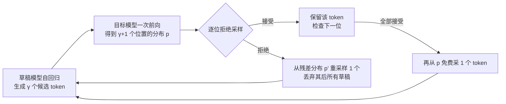

# 投机解码（Speculative Decoding）

> **一句话**：让小草稿模型先猜 $\gamma$ 个 token，目标大模型一次前向并行验证，配合拒绝采样在数学上严格保持目标分布——输出不变、decode 加速 2-3 倍起步。论文：*Fast Inference from Transformers via Speculative Decoding*（2022，ICML 2023）。
>
> 关键年份：Speculative Decoding 2022（Google，arXiv:2211.17192，ICML 2023）· Speculative Sampling 2023（DeepMind，arXiv:2302.01318）· Medusa 2024（Princeton/Together，arXiv:2401.10774）· EAGLE-1 2024（arXiv:2401.15077，ICML 2024）· EAGLE-2 2024（EMNLP 2024）· MTP 2024（Meta multi-token prediction arXiv:2404.19737 · DeepSeek-V3 arXiv:2412.19437）· EAGLE-3 2025（arXiv:2503.01840）
> 前置阅读：[推理优化总览](/inference/)、[KV Cache](/inference/kv-cache)

## 1. 直觉与动机

Decode 阶段是 memory-bound：一次前向处理 1 个 token 和处理 $\gamma+1$ 个 token 的耗时几乎相同——时间都花在把权重与 KV cache 从 HBM 搬进片上，算力大量闲置。换句话说，**验证多个候选 token 近乎免费，贵的是串行地一个一个生成**。

另一个观察是 token 难度的不均匀：大量 token（语法功能词、固定搭配、对 prompt 的复述）小模型也能猜对，但标准自回归强迫大模型对每个 token 付出同样代价。投机解码借用 CPU 投机执行的思想：让便宜的草稿模型沿"预测路径"先走几步，大模型一次性验证，错了再回滚。

剩下的关键难题是正确性：草稿 token 采自草稿分布 $q$，如何保证最终输出严格服从目标分布 $p$？这由 speculative sampling 的拒绝采样规则解决。该思想由 Leviathan et al.（Google，arXiv:2211.17192）与 Chen et al.（DeepMind，arXiv:2302.01318）独立提出：前者在 T5-XXL 上获得 2-3x 加速且输出与标准解码完全一致；后者用 modified rejection sampling 在 Chinchilla 70B 的分布式 setup 上获得 2-2.5x 加速，均不改模型、不重训。

## 2. 方法与公式

### 主循环



每轮：草稿模型从当前前缀出发自回归生成 $\gamma$ 个 token；目标模型对"前缀 + $\gamma$ 个草稿"做**一次**前向，同时拿到全部 $\gamma+1$ 个位置的分布；然后从左到右逐位验证。最好情况一轮产出 $\gamma+1$ 个 token，最坏情况也有 1 个（拒绝位的重采样），**不会比标准解码慢在 token 数上**。

### 无损的接受规则（speculative sampling）

记某位置目标分布为 $p(x)$、草稿分布为 $q(x)$，草稿 token $x\sim q$：

- 若 $q(x)\le p(x)$：直接接受；
- 否则以概率 $1-\dfrac{p(x)}{q(x)}$ 拒绝，并从残差分布重采样：

$$
p'(x)=\operatorname{norm}\big(\max(0,\ p(x)-q(x))\big)
$$

直觉：$q$ 高估的 token 按 $p/q$ 比例打折通过，被打掉的概率质量恰好等于残差分布补回的部分。Leviathan 论文附录 A.1 证明如此得到的样本**严格服从 $p(x)$**——对任意草稿模型成立，$q$ 的好坏只影响速度、不影响正确性。贪心解码（温度 0）时规则退化为逐位精确匹配。

### 加速比的解析形式

定义单个草稿 token 的接受率 $\beta=\mathbb{E}_{x\sim q}\min\!\big(1,\tfrac{p(x)}{q(x)}\big)=\sum_x\min(p(x),q(x))$，即 $1$ 减去 $p,q$ 间的总变差型散度。在 i.i.d. 假设下记 $\alpha=\mathbb{E}[\beta]$，每轮目标模型前向产出的 token 数是上限 $\gamma+1$ 的截断几何变量，期望为

$$
\mathbb{E}(\#\text{tokens})=\frac{1-\alpha^{\gamma+1}}{1-\alpha}
$$

设 $c$ 为草稿与目标模型单步耗时之比，端到端加速因子为

$$
\text{speedup}=\frac{1-\alpha^{\gamma+1}}{(1-\alpha)(\gamma c+1)}
$$

两点结论：分子随 $\gamma$ 边际递减、分母线性增长，所以 $\gamma$ 存在最优值，$\alpha$ 不够高时盲目加大 $\gamma$ 反而变慢；$c$ 是草稿模型选型的硬约束——草稿太大，即使接受率高也不划算。

### Medusa：多解码头 + 树注意力（非无损）

Medusa（Cai et al., 2024）不要独立草稿模型：在主干最后隐状态上接 $K$ 个轻量解码头，第 $k$ 个头直接预测 $t+k+1$ 位置的 token；各头 top 候选组合成树，用树注意力（每个节点只 attend 自己的祖先路径）一次前向并行验证多条候选续写。Medusa-1 冻结主干只训头，实测 >2.2x；Medusa-2 与主干联合微调，2.3-3.6x。

验证上 Medusa 用 **typical acceptance** 替代拒绝采样：按目标分布的熵设动态阈值——熵高时放宽、熵低时收紧，超过阈值即接受。它不保证输出与目标分布严格一致，**是有损方案**，用放弃精确分布匹配换更高接受率；仅在温度 0 时退化为精确匹配验证。

### EAGLE：特征层外推，当前事实标准

- **EAGLE-1**（Li et al., 2024，ICML 2024）：在目标模型倒数第二层（second-to-top-layer）的特征层做自回归外推，比 token 层更有规律；同时把提前一个时间步的 token 序列（含已采样 token）一并输入，消除采样随机性带来的特征不确定性。草稿网络复用目标模型的 embedding 与 LM head，中间只有一个 FC 降维层加单个 decoder 层（7B 目标约 0.24B、70B 目标约 0.99B 参数）。验证沿用标准 speculative sampling，**可证无损**；LLaMA2-Chat 70B 上加速 2.7-3.5x，贪心下首 token 接受率约 0.75-0.85，平均每轮接受约 3.6-4.5 个 token。
- **EAGLE-2**（2024，EMNLP 2024）：发现草稿模型置信度能较准地近似 token 接受率，据此做 context-aware 的动态草稿树扩展与重排序（替代静态树）；3.05-4.26x，比 EAGLE-1 快 20-40%，仍无损。
- **EAGLE-3**（2025）：放弃"预测下一步特征"的约束、改为直接预测 token，并用 training-time test 融合目标模型低/中/高多层特征，使草稿网络能从训练数据规模化中持续获益；最高 6.5x，SGLang 中 batch size 64 下吞吐仍提升 1.38x。


> 图源：Li et al., *EAGLE: Speculative Sampling Requires Rethinking Feature Uncertainty*, arXiv:2401.15077（用于学习注解，版权归原作者）

EAGLE 系列已合入 vLLM、SGLang、TensorRT-LLM、MLC-LLM 等 15+ 主流框架，是目前工程上的默认选择。

### MTP（多 token 预测）：训练目标兼自投机 draft

前面几种方法都是**事后**给一个训练好的模型外挂草稿；**MTP（Multi-Token Prediction）**则把"预测多个未来 token"直接做进**预训练目标**——模型在训练时除了预测下一个 token，还并行/串行地预测再往后的若干 token。它一举两得：既给训练加密了监督信号（每个位置承担更多预测任务，被证明在大模型上能提升主模型质量），又天然得到一组"预测未来 token 的头"，推理时**无需独立草稿模型**即可做自投机（self-speculative）解码。

- **Meta 的 multi-token prediction**（Gloeckle et al., 2024, arXiv:2404.19737）：在共享主干上接 $n$ 个独立输出头，一次前向并行预测未来 $n$ 个 token。论文发现该目标在**较大模型**上收益更明显（代码等生成任务尤甚），且用这些头做自投机解码可获得约 **3x** 的推理加速（原文报告，随设置而变）。
- **DeepSeek-V3 的 MTP**（arXiv:2412.19437, 2024-12）：采用**顺序式** MTP 模块（保留完整因果链，逐个预测后续 token）densify 训练信号、提升主模型表现；推理时这些 MTP 模块可直接复用为自投机的 draft，官方报告第二个 token 的接受率约 **85%–90%**、端到端 decode 提速约 **1.8x**（以技术报告为准）。

与 Medusa / EAGLE 的关系：三者推理形态高度相通——都是"主干 + 轻量未来-token 预测头 + 一次验证"。区别在于 **MTP 的头是在预训练阶段就一起学的**（因此还能反哺主模型质量），而 Medusa/EAGLE 通常是对一个既有模型**额外训练**草稿头。在已用 MTP 预训练的模型（如 DeepSeek-V3）上，自投机几乎是"免费搭车"；其无损性同样取决于验证是否走严格的拒绝采样。

## 3. 与 baseline 对比

| 维度 | 标准自回归 | 独立草稿模型（Leviathan/Chen） | Medusa | EAGLE 系列 |
| --- | --- | --- | --- | --- |
| 草稿来源 | — | 同 tokenizer 的小模型 | 主干 + $K$ 个解码头 | 特征层轻量草稿网络 |
| 额外训练 | 无 | 需现成或自训小模型 | 训头（Medusa-1 可冻结主干） | 训约 0.24-1B 的草稿层 |
| 分布保持 | — | 无损（拒绝采样） | typical acceptance，**非无损** | 无损（拒绝采样） |
| 候选结构 | — | 单链 | 静态树 | 树，EAGLE-2 起动态树 |
| 论文典型加速 | 1x | 2-3x | 2.2-3.6x | 2.7-6.5x |
| 额外显存 | — | 整个小模型 + 其 KV | 头部参数 | 草稿层（共享 embedding/LM head） |

## 4. 实现要点

```python
def speculative_step(prefix, draft, target, gamma):
    xs, qs = [], []
    for _ in range(gamma):                      # 串行：γ 次小模型前向
        q = draft(prefix + xs);  x = sample(q)
        xs.append(x); qs.append(q)
    ps = target(prefix + xs)                    # 并行：1 次大模型前向，γ+1 个分布
    out = []
    for i, x in enumerate(xs):
        if random() < min(1, ps[i][x] / qs[i][x]):
            out.append(x)                       # 接受
        else:
            out.append(sample(norm_clamp(ps[i] - qs[i])))   # 残差重采样
            return out                          # 拒绝即截断，回滚其后 KV
    out.append(sample(ps[gamma]))               # 全接受，免费多得 1 个
    return out
```

- **KV cache 回滚**：拒绝位置之后的草稿与目标 KV 必须作废；分页式 KV 管理（见 [KV Cache](/inference/kv-cache)）下即释放对应 block。
- **tokenizer 必须一致**：这是独立草稿路线的最大约束（跨家族模型词表对不上）；Medusa/EAGLE 直接长在主干上，天然规避。
- **树形验证需要专门的 attention mask**：让每个候选节点只看到其祖先路径，一次前向同时验证整棵树。
- **batch size 与收益负相关**：大 batch 下 GPU 趋向 compute-bound，"验证免费"的前提弱化，加速比明显低于单请求场景（EAGLE-3 在 batch 64 仍有 1.38x，但远低于其单请求数字）；离线大吞吐批处理通常不开投机解码。
- **正确性自检**：greedy 下开/关投机解码的输出应逐 token 一致（Chen et al. 的措辞是"在硬件数值精度内"一致，浮点归约顺序可能造成个别差异）。

## 5. 调参与实践经验

- **先看 $\alpha$ 再定 $\gamma$**：上线前在真实流量样本上量接受率；$\alpha$ 高才值得加大 $\gamma$，按 speedup 公式或直接网格搜索定 $\gamma$（框架默认值通常在 3-5 一带，应据实测调整）。
- **草稿模型选型盯住 $c$**：草稿单步耗时要远小于目标模型，通常选小 1-2 个数量级的同家族模型；若没有合适的现成小模型，训一个 EAGLE 草稿层比从头训小模型便宜得多。
- **路线选择**：手头有同 tokenizer 小模型且不想训练 → 独立草稿（零训练成本，先验证收益）；追求最高加速且能接受一次性训练 → EAGLE（框架支持最成熟）；对采样分布严格性有要求（评测、RL rollout 等）→ 避开 Medusa 的 typical acceptance，用无损路线。
- **负载特征决定收益**：模板化文本、代码补全、对长 prompt 的复述类任务草稿命中率高、收益大；高温度、高熵的开放创作任务接受率下降，收益打折。
- **与量化叠加**：投机解码减少目标模型前向次数，[量化](/inference/quantization)减少每次前向的字节搬运，两者正交，延迟敏感场景常同时启用。

## 6. 参考文献

- Leviathan et al., 2022. *Fast Inference from Transformers via Speculative Decoding.* arXiv:2211.17192（ICML 2023）
- Chen et al., 2023. *Accelerating Large Language Model Decoding with Speculative Sampling.* arXiv:2302.01318
- Cai et al., 2024. *Medusa: Simple LLM Inference Acceleration Framework with Multiple Decoding Heads.* arXiv:2401.10774
- Li et al., 2024. *EAGLE: Speculative Sampling Requires Rethinking Feature Uncertainty.* arXiv:2401.15077（ICML 2024）
- Li et al., 2024. *EAGLE-2: Faster Inference of Language Models with Dynamic Draft Trees.* arXiv:2406.16858（EMNLP 2024）
- Li et al., 2025. *EAGLE-3: Scaling up Inference Acceleration of Large Language Models via Training-Time Test.* arXiv:2503.01840
- Gloeckle et al., 2024. *Better & Faster Large Language Models via Multi-token Prediction.* arXiv:2404.19737
- DeepSeek-AI, 2024. *DeepSeek-V3 Technical Report*（含顺序式 MTP 训练目标与自投机推理）. arXiv:2412.19437
