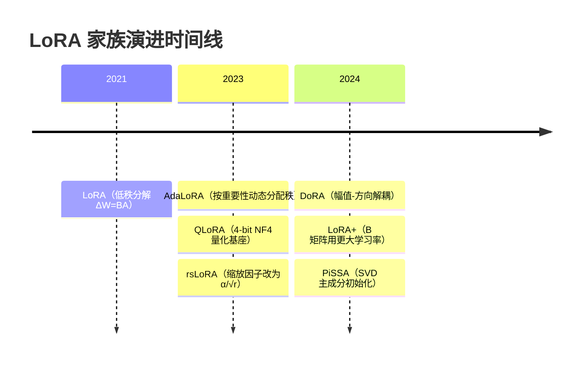
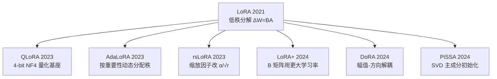
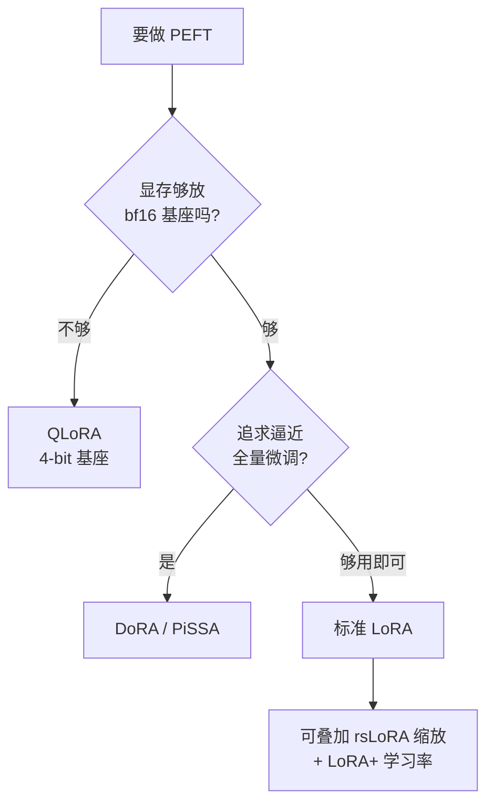

# LoRA 及变体总览

> **一句话**：LoRA 用一对低秩矩阵近似权重更新，把可训练参数压到 1% 以下且推理零延迟；各变体围绕「初始化、缩放、量化、秩分配、幅值-方向解耦」继续打磨同一个低秩骨架。

参数高效微调（PEFT）的目标是：在不更新全部权重的前提下让大模型适配下游任务，从而把优化器状态显存、checkpoint 体积、任务切换成本都砍掉一个数量级。早期方案有 Adapter（在层间插入小瓶颈 MLP）和 Prefix/Prompt-tuning（学习虚拟 token），但它们要么引入额外的推理延迟，要么挤占有效上下文长度。[LoRA](/lora/lora) 在 2021 年给出了一个更干净的答案：把权重更新约束为低秩，训练完可直接合并回原权重，推理阶段与全量微调完全等价。此后几乎所有 PEFT 改进都建立在这个低秩骨架之上。

## 演进时间线

## 家族演化图

## 一条主线，五个改进方向

LoRA 的前向是 $h = W_0 x + \frac{\alpha}{r} B A x$：冻结基座 $W_0$，只训练秩为 $r$ 的 $B$、$A$。所有变体都在动这个式子的某个零件。

- **降显存（量化）**：[QLoRA](/lora/qlora) 把 $W_0$ 存成 4-bit NF4，前向时按块反量化参与计算，显存大头从基座本身被压掉，让 65B 级别模型可在单张 48GB 卡上微调。
- **改缩放**：原始 LoRA 用 $\alpha/r$ 缩放，秩增大时该因子反而压制了梯度。[rsLoRA](/lora/rslora) 改用 $\alpha/\sqrt{r}$，使高秩配置训练稳定、效果随秩单调提升。
- **改学习率**：[LoRA+](/lora/lora-plus) 指出 $A$、$B$ 维度不对称应使用不同学习率，给 $B$ 设更大的 lr（通常 16 倍）以加速收敛、提升上限。
- **改初始化**：标准 LoRA 用「$A$ 高斯、$B$ 零」从零起步；[PiSSA](/lora/pissa) 改为对 $W_0$ 做 SVD，用主奇异成分初始化 $A$、$B$，让低秩分量从一开始就承载权重的主要能量，收敛更快。
- **改结构**：[DoRA](/lora/dora) 把权重拆成「幅值 × 方向」，幅值直接训练、方向用 LoRA 更新，使学习模式更接近全量微调；[AdaLoRA](/lora/adalora) 则放弃固定秩，按各模块重要性动态裁剪奇异值，把有限的参数预算分配给更需要的层。

## 变体对比

| 方法 | 核心改动 | 相对 LoRA 的额外开销 | 主要收益 | 年份 |
| --- | --- | --- | --- | --- |
| [LoRA](/lora/lora) | $\Delta W = BA$ 低秩分解 | — | 参数降至 ~0.1%-1%，推理零延迟 | 2021 |
| [QLoRA](/lora/qlora) | 基座 NF4 量化 + 双重量化 + 分页优化器 | 反量化算力，速度变慢 | 基座显存 ~4 倍压缩 | 2023 |
| [AdaLoRA](/lora/adalora) | 按重要性动态分配秩 | 重要性打分与剪枝逻辑 | 同等参数预算下效果更好 | 2023 |
| [rsLoRA](/lora/rslora) | 缩放因子改为 $\alpha/\sqrt{r}$ | 无 | 高秩下训练稳定、效果不饱和 | 2023 |
| [LoRA+](/lora/lora-plus) | $B$ 用更大学习率 | 无 | 收敛更快、效果上限更高 | 2024 |
| [DoRA](/lora/dora) | 幅值与方向解耦更新 | 幅值向量 $m$（约 +0.01% 参数）+ 范数计算 | 低秩下更接近全量微调 | 2024 |
| [PiSSA](/lora/pissa) | 用 $W_0$ 主奇异成分初始化 | 一次性 SVD 预处理 | 收敛更快、效果更好 | 2024 |

## 选型决策

可按约束条件自上而下选择：

实践上的几条经验：

- **显存是硬约束时优先 QLoRA**：用反量化的算力换基座显存，是单卡跑大模型的默认选项；显存宽裕则用 bf16 基座的标准 LoRA，训练更快。
- **想尽量逼近全量微调用 DoRA 或 PiSSA**：尤其在低秩（$r=4\sim8$）预算下，二者相对原始 LoRA 的差距更明显。
- **rsLoRA 与 LoRA+ 几乎零成本、可正交叠加**：前者只改缩放公式，后者只改一组学习率，可与上面任意方案组合。

## 共同超参

无论哪个变体，下面几个旋钮都要调：

- **秩 $r$**：常见 8~64。收益随 $r$ 递减；任务越偏离预训练分布、需要记忆的新知识越多，越需要更大的秩。
- **缩放 $\alpha$**：经验上设 $\alpha = 2r$（原始公式）或配合 rsLoRA。$\alpha/r$ 的有效值近似等同于在放大 LoRA 分支的学习率。
- **目标模块**：最小集是注意力的 $q,v$ 投影；追效果可加 $k,o$ 直至全部 Linear（含 MLP），覆盖越全效果越接近全量但参数越多。
- **学习率**：通常比全量微调大一个数量级（$1\text{e-}4 \sim 5\text{e-}4$ 量级），因为只更新少量参数。
- **LoRA dropout**：小数据集上加 0.05~0.1 抑制过拟合。

## LoRA 与全量微调的效果差距

在指令微调、风格对齐这类「不引入大量新知识」的任务上，配置得当的 LoRA 往往能逼近甚至匹配全量微调；而在需要大量灌入新领域知识的持续预训练式任务上，固定低秩会成为瓶颈，此时应增大 $r$、扩大目标模块，或考虑 [全量微调](/sft/full-finetuning)。DoRA / PiSSA 等变体的价值正在于缩小这一差距。统一的符号约定见 [记号表](/guide/notation)。

## 参考文献

- Hu et al., 2021. *LoRA: Low-Rank Adaptation of Large Language Models.* arXiv:2106.09685
- Dettmers et al., 2023. *QLoRA: Efficient Finetuning of Quantized LLMs.* arXiv:2305.14314
- Liu et al., 2024. *DoRA: Weight-Decomposed Low-Rank Adaptation.* arXiv:2402.09353
