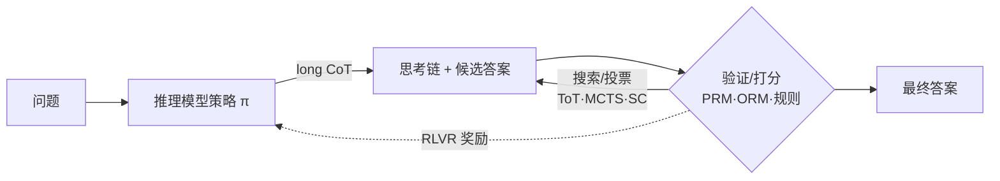
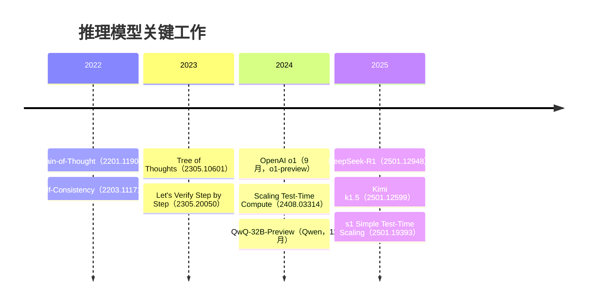

# 推理模型（Reasoning）总览

> **一句话**：推理模型先「想」再「答」——用长思维链（long CoT）配合推理时多花算力（test-time compute）换取更高的正确率，再用 RLVR 把这种「会推理」的行为固化到权重里。
> 关键年份：CoT（2201.11903，2022）→ ToT（2305.10601）/ Let's Verify（2305.20050，2023）→ o1（OpenAI，2024-09）/ Scaling Test-Time Compute（2408.03314）→ DeepSeek-R1（2501.12948，2025）/ Kimi k1.5（2501.12599）/ s1（2501.19393）。
> 前置阅读：[RLHF/GRPO](/rlhf/grpo)、[推理能力蒸馏](/distillation/reasoning)、[符号约定](/guide/notation)

## 什么是「推理模型」

普通 chat 模型（如 GPT-4o、原始指令微调模型）的解码过程基本是「读完问题直接生成答案」，token 的产出与正确性无显式因果关系——它在用一遍前向传播逼近答案。**推理模型**（reasoning model，又称 large reasoning model / slow-thinking model）的范式不同：它在给出最终答案前，先生成一段通常很长、可自我反思与回溯的中间推理过程（long chain-of-thought），再据此收敛到答案。代表是 OpenAI o1（2024-09-12 发布 o1-preview，2024-12-05 发布正式版）与开源的 DeepSeek-R1。

二者的核心差异可以概括为：

| 维度 | 普通 chat 模型 | 推理模型 |
| --- | --- | --- |
| 推理形态 | 短回答，CoT 需 prompt 诱导 | 原生输出长 CoT，含反思/回溯/验证 |
| 算力—正确率关系 | 基本固定，加 token 收益有限 | 单调可换：思考越久，难题正确率越高 |
| 训练信号 | 偏好对齐（RLHF/DPO） | 可验证奖励（RLVR）+ 长 CoT |
| 典型任务 | 通用对话、写作 | 数学、代码、科学等可判定难题 |
| 代价 | 延迟低、token 少 | 延迟高、token 多（思考占大头） |

直观地说，推理模型把「思考」显式化成可消耗算力的 token 序列，于是出现了一条新的扩展曲线：在固定模型参数下，单题正确率随推理时算力 $C_{\text{test}}$ 增长。设单题准确率为 $\mathrm{Acc}$，经验上

$$\mathrm{Acc} \approx f(\log C_{\text{test}}),$$

在相当大的算力区间内近似单调递增——这正是「test-time scaling」一词的由来。

## 两条主线

推理模型的能力来自两条相互交织的主线。

**主线一：test-time scaling（推理时多花算力）。** 不改权重，仅在推理阶段投入更多计算来提升正确率。手段包括：多次采样后投票（Self-Consistency，2203.11171）、Best-of-N 配合验证器打分、树/图搜索（ToT、MCTS），以及让模型直接生成更长的思考链。Snell 等的《Scaling LLM Test-Time Compute Optimally》（2408.03314，2024）系统论证了：在合适的算力分配下，推理时扩展可以比单纯堆参数更划算（文中报告 >4× 的算力效率优势，以原文为准）。

**主线二：训练模型学会长推理（RLVR）。** 把「会推理」这件事写进权重，让模型默认就输出高质量长 CoT，而不是每次靠 prompt。主流做法是 **RLVR（Reinforcement Learning with Verifiable Rewards）**：用规则可判定的奖励（数学答案对错、代码是否通过测试）作为信号，用 GRPO 等算法优化策略。DeepSeek-R1（2501.12948）证明了即便几乎只靠 RL（其 R1-Zero 不依赖 SFT 冷启动）也能自发涌现自我反思、验证、策略切换等推理行为；Kimi k1.5（2501.12599）则强调长上下文扩展 + RL 的组合。

两条主线并非二选一：训练把单条思考链的质量做高（主线二），推理时再叠加采样/搜索把算力进一步换成正确率（主线一）。

## 奖励、验证与搜索的定位

推理模型生态里有几类彼此独立又常组合使用的组件，理清它们的定位很重要。

- **ORM（Outcome Reward Model，结果奖励）**：只看最终答案对不对，信号稀疏但便宜、抗作弊，是 RLVR 在数学/代码上最常用的形态（规则判分本质就是一种 ORM）。
- **PRM（Process Reward Model，过程奖励）**：对推理的每一步打分。OpenAI 的《Let's Verify Step by Step》（2305.20050，2023）表明过程监督在难数学题上优于结果监督。PRM 信息密集、利于细粒度搜索，但标注与训练成本高、易被「钻空子」。
- **搜索（Search）**：在推理时用结构化方式探索多条思路。Tree of Thoughts（ToT，2305.10601）把思考组织成可分支、可回溯的树；MCTS 用价值估计引导扩展。搜索通常需要一个验证器（PRM/ORM）来给节点打分。

一句话区分：**ORM/PRM 是「怎么判好坏」，搜索是「怎么探索」，RLVR 是「怎么把好的固化进权重」。** 三者在不同页面展开。

## 本章导航

| 页面 | 主题 | 关键问题 |
| --- | --- | --- |
| [推理模型总览](/reasoning/)（本页） | 范式与全景 | 推理模型是什么、两条主线、组件定位 |
| [Test-Time Scaling](/reasoning/test-time-scaling) | 推理时扩展 | Self-Consistency / Best-of-N / 长 CoT 如何换正确率 |
| [RLVR](/reasoning/rlvr) | 可验证奖励强化学习 | R1 / Kimi 如何用 RL 训出长推理 |
| [奖励与验证](/reasoning/reward-models) | PRM / ORM | 过程 vs 结果监督、奖励作弊 |
| [搜索](/reasoning/search) | ToT / MCTS | 树/图搜索如何配合验证器 |

## 发展脉络（timeline）

几个时间锚点：CoT 与 Self-Consistency（2022）奠定「写出步骤 + 多数投票」的基础；ToT 与 Let's Verify（2023）把搜索与过程验证引入推理；2024 年 o1 把长 CoT + test-time 计算做成产品级推理模型，Snell 等同年从原理上论证推理时扩展的价值；2025 年开源阵营集中爆发——DeepSeek-R1 与 Kimi k1.5 给出可复现的 RLVR 路线，QwQ、s1 等则展示了小模型/小数据复现推理能力的可能（s1 仅用约 1000 条高质量样本微调 32B，以原文为准）。

至此，「推理模型 = 长 CoT × test-time 算力 × RLVR」的轮廓已清晰。后续四页将分别深入：推理时如何花算力、训练时如何用可验证奖励、奖励怎么设计、搜索怎么组织。

## 参考文献

- Wei et al. *Chain-of-Thought Prompting Elicits Reasoning in Large Language Models.* arXiv:2201.11903
- Wang et al. *Self-Consistency Improves Chain of Thought Reasoning in Language Models.* arXiv:2203.11171
- Yao et al. *Tree of Thoughts: Deliberate Problem Solving with Large Language Models.* arXiv:2305.10601
- Lightman et al. *Let's Verify Step by Step.* arXiv:2305.20050
- Snell et al. *Scaling LLM Test-Time Compute Optimally can be More Effective than Scaling Model Parameters.* arXiv:2408.03314
- DeepSeek-AI. *DeepSeek-R1: Incentivizing Reasoning Capability in LLMs via Reinforcement Learning.* arXiv:2501.12948
- Kimi Team. *Kimi k1.5: Scaling Reinforcement Learning with LLMs.* arXiv:2501.12599
- Muennighoff et al. *s1: Simple Test-Time Scaling.* arXiv:2501.19393
- OpenAI. *Introducing OpenAI o1.*（o1-preview 2024-09-12；正式版 2024-12-05）
- Qwen Team. *QwQ-32B-Preview.*（2024-11）
