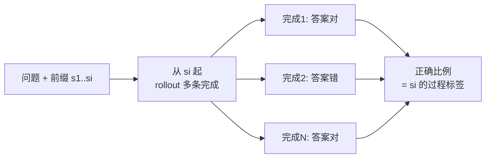

> **一句话**：ORM 只看最终答案对不对、PRM 给推理的每一步打分；当任务可程序化验证时直接用规则奖励，只有开放式任务才真正需要训一个奖励模型。
> 关键年份：Let's Verify Step by Step（Lightman et al. 2023, arXiv:2305.20050）；Math-Shepherd（Wang et al. 2023, arXiv:2312.08935）。
> 前置阅读：[奖励模型](/rlhf/reward-model)、[RLVR](/reasoning/rlvr)、[推理时搜索](/reasoning/search)

数学、代码、多跳推理这类长链问题里，模型常常"答案蒙对了但中间全是错的"，或者"前几步都对、最后一步翻车"。怎么给这种长链输出打分，直接决定了 best-of-N 重排、搜索引导和 RL 训练的上限。两条路线由此分化：结果奖励模型（ORM, Outcome Reward Model）和过程奖励模型（PRM, Process Reward Model）。

## ORM：只判最终答案

ORM 把整条解答看成一个整体，只输出一个标量：这条解答的最终答案是否正确（或正确的概率）。训练数据天然好拿——对每道有标准答案的题，采样若干条解答，按最终答案对错打 0/1 标签即可。

ORM 的好处是标注便宜、信号干净；问题是信号太稀疏也太"宽容"。一条 20 步的推理，只要最后蒙对答案就拿满分，哪怕中间逻辑全错。这会奖励"假阳性"——错误推理碰巧得到正确答案。在 best-of-N 重排里，ORM 会把这种侥幸路径排到前面;在 RL 里，它会强化错误的中间步骤，长链上信用分配（credit assignment）尤其困难。

## PRM：给每一步打分

PRM 对解答的每一个中间步骤单独打分，典型输出是每步"正确 / 错误 / 中立"的标签或该步的正确概率。把一条轨迹切成 $s_1, s_2, \dots, s_T$，PRM 给出 $r(s_1), \dots, r(s_T)$，再聚合成整条解答的分数。

聚合方式常见几种：

| 聚合 | 含义 | 特点 |
| --- | --- | --- |
| 最小值 $\min_t r(s_t)$ | 任何一步出错就整体偏低 | 对错误敏感，常用 |
| 连乘 $\prod_t r(s_t)$ | 视为各步联合正确概率 | 步数越长惩罚越重 |
| 末步 $r(s_T)$ | 只看最后一步 | 退化接近 ORM |

OpenAI 的 *Let's Verify Step by Step*（Lightman et al. 2023, arXiv:2305.20050）是这条线的奠基工作。他们在 MATH 上对比 PRM 与 ORM：用 PRM 做 best-of-N 重排，在 MATH 测试子集上达到约 78% 的准确率，**过程监督显著优于结果监督**。该工作还开源了 PRM800K——约 80 万条步级人工反馈标签，用来训练其最好的奖励模型。

## PRM 怎么训：人工标 vs 自动标

PRM 的最大成本在标注——要对每一步判对错。两条路：

**人工标。** PRM800K 走的是这条路：让标注者逐步审阅模型生成的解答，给每步打"正确/错误/中立"。质量高但极贵，且难规模化到新领域。Lightman 等人还发现引入主动学习能明显提升过程监督的标注效率。

**自动标（Math-Shepherd）。** Wang et al. 2023（arXiv:2312.08935，标题直译"无需人工标注地逐步验证并强化 LLM"）提出用蒙特卡洛估计自动生成步级标签：从某一步出发，用模型继续 rollout 多条完整路径，统计这些路径里**最终答案正确的比例**，作为该步的"软"价值标签。

直觉是：如果从某一步出发大部分续写都能到正确答案，这一步多半是"好步"。这把昂贵的人工步级标注，换成了可大规模采样的自动信号。Math-Shepherd 报告：用其 PRM 做 step-by-step PPO，Mistral-7B 在 GSM8K 上从 77.9% 提到 84.1%、MATH 上从 28.6% 提到 33.0%；叠加验证（PRM 重排）后 GSM8K 达 89.1%、MATH 达 43.5%（具体数字以原文为准）。

## PRM 的用法：重排与搜索引导

PRM 训好后主要有两类用途：

- **Best-of-N 重排**：对同一题采样 N 条解答，用 PRM 聚合分挑最高的那条。比 ORM 重排更能筛掉"中间出错"的侥幸路径。
- **搜索引导**：在束搜索 / 树搜索（如 [推理时搜索](/reasoning/search) 里的 MCTS、step-level beam search）中，用 PRM 给部分展开的前缀打分，决定扩展哪个分支、剪掉哪个分支。PRM 的步级信号天然适合给"半成品"轨迹估值，这是 ORM 做不到的。
- **RL 训练的密集奖励**：把步级分数作为过程奖励参与策略优化，缓解长链信用分配难题。

## Reward hacking 与可靠性

PRM 是学出来的近似，必然有漏洞。一旦把它当成优化目标，策略就会去钻它的空子——这就是 reward hacking：

- 模型学会生成"看起来很对、PRM 给高分"的步骤，而非真正正确的推理；
- 过度优化（over-optimization）：随着对 PRM 分数的优化越来越激进，真实正确率会先升后降，PRM 分与真值脱钩；
- 分布漂移：PRM 训练数据来自旧策略，新策略生成的轨迹超出其覆盖，打分不可靠。

常见缓解：限制优化步数、用 KL 正则约束策略别离参考模型太远、定期用真值（可验证答案）校准或重训 PRM、把 PRM 与基于规则的结果检查结合使用。可靠性的根本约束是：**奖励模型再好也只是代理，能验证的地方就别只信它。**

## 与 RLVR 规则奖励的区别

这是工程选型上最关键的一条。[RLVR](/reasoning/rlvr)（可验证奖励的强化学习）里，奖励来自一个**确定性验证器**而非学出来的模型：

| 维度 | 规则奖励（RLVR） | 奖励模型（ORM/PRM） |
| --- | --- | --- |
| 信号来源 | 程序化验证器（答案匹配 / 单测 / 形式化证明检查） | 训练出的神经网络 |
| 适用任务 | 有客观判定的：数学终答、代码、形式证明 | 开放式：对话、写作、主观偏好 |
| reward hacking | 几乎没有（验证器是真值） | 存在，需正则与校准 |
| 成本 | 写验证器一次性投入 | 标注 + 训练 + 维护 |

结论很直接：**任务能程序化验证就直接用规则奖励**，又准又抗 hacking，这也是 GRPO/DeepSeek-R1 等推理模型大量采用 RLVR 的原因。**只有当任务没有客观判定标准（开放式生成、人类偏好）时，才退而求其次训 RM**。PRM 处在中间地带——数学终答可验证，但"中间步骤对不对"往往无法程序化判断，所以才需要 PRM 这种学出来的步级评判。关于通用偏好型 RM 的训练范式，见 [奖励模型](/rlhf/reward-model)。

## 参考文献

- Lightman et al. *Let's Verify Step by Step.* 2023. arXiv:2305.20050
- Wang et al. *Math-Shepherd: Verify and Reinforce LLMs Step-by-step without Human Annotations.* 2023. arXiv:2312.08935
