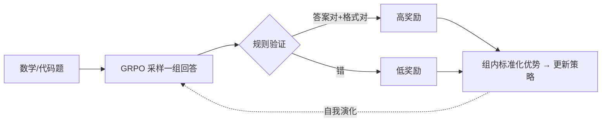

# RLVR：可验证奖励的强化学习

> **一句话**：当一道题的答案能被程序自动判对错时，就直接把"对/错"当奖励去做 RL，跳过人类偏好和奖励模型——模型为了拿到这个奖励，会自发学会写更长、更会自我检查的思维链。
> 关键年份：2024 GRPO/DeepSeekMath（arXiv:2402.03300）；2025-01 DeepSeek-R1（arXiv:2501.12948）、Kimi k1.5（arXiv:2501.12599）。
>
> 前置阅读：[GRPO](/rlhf/grpo)、[RLHF 总览](/rlhf/)、[推理任务的奖励模型](/reasoning/reward-models)

## 为什么要"可验证奖励"

经典 [RLHF](/rlhf/) 的链路是：标注人类偏好 → 训一个 [奖励模型（RM）](/rlhf/reward-model) → 用 RM 的打分做 PPO。这套机制为"对齐人类口味"（有用、无害、礼貌）而生，但放到数学和代码这类**有客观对错**的推理任务上，它有两个硬伤：

1. **RM 是被学出来的近似函数**，本身有误差、可被钻空子（reward hacking）。模型完全可能学会写出"看起来很对"却答案错误的推理。
2. **人类偏好标注既贵又慢**，且人类未必判得出一长串推导哪一步错了。

RLVR（Reinforcement Learning with Verifiable Rewards）的核心主张极其朴素：**如果正确性可以被自动验证，就别再去学一个 RM 了，直接用验证结果当奖励。**

- 数学题：把模型最终答案抽出来，和标准答案做字符串/数值匹配（或交给符号验证器）。
- 代码题：跑单元测试，全过给 1，否则给 0。
- 形式化证明：交给 Lean/Coq 等证明检查器。

奖励从"一个神经网络的打分"变成"一个确定性程序的判定"。它不会被语言花招欺骗，可无限规模化、零标注成本，而且**几乎无偏**——这正是把 RL 训练规模真正拉起来的前提。

$$
r(x, y) = \mathbb{1}[\text{verify}(x, \text{answer}(y)) = \text{correct}]
$$

## DeepSeek-R1-Zero：纯 RL 能逼出长推理

DeepSeek-R1（arXiv:2501.12948）最反直觉的结论是：**不需要任何监督微调（SFT）冷启动，仅靠 RL 就能让基座模型涌现出强推理能力。** 他们直接在 DeepSeek-V3-Base 上跑 RL，得到的模型叫 **R1-Zero**。

配方的关键全在"奖励怎么设计"：

| 奖励项 | 内容 | 作用 |
| --- | --- | --- |
| **准确性奖励** | 规则验证答案是否正确（数学比对答案、代码跑测试用例） | 提供学习信号的主力 |
| **格式奖励** | 强制把思考过程放进 `<think>…</think>`，答案放进指定标签 | 让推理可被解析、便于抽取答案 |

注意这里**没有用神经网络 RM，也没有用过程奖励模型（PRM）**——R1 论文明确指出 PRM 容易被 reward hacking 且训练复杂，因此只用规则奖励。算法上用的是 [GRPO](/rlhf/grpo)：对同一题采样一组回答，用组内 reward 的标准化值当优势，省掉 critic。本页讲"用它训推理"，算法细节见 GRPO 页。

随着训练推进，R1-Zero 出现了几个**没有被显式设计、却自发涌现**的行为：

- 回答长度（CoT token 数）随训练步数持续增长——模型自己发现"想得更久"能换来更高正确率；
- 自发学会**反思、回溯、验证**：写到一半推翻自己重来。论文把其中一个典型片段称为 **"aha moment"**（模型突然写出"等等，让我重新想想"之类的话）。

这是 RLVR 最有说服力的地方：长思维链不是被人喂出来的，而是**为了拿奖励被优化出来的**。

### 从 R1-Zero 到 R1

R1-Zero 虽强，但可读性差（中英混杂、格式混乱）。完整的 **DeepSeek-R1** 因此加了多阶段流水线：先用少量**冷启动 SFT 数据**把语言整顺，再做面向推理的 RL，接着用 RL 模型生成数据做拒绝采样 + SFT，最后再来一轮覆盖全场景的 RL。可以理解为：**RLVR 负责把推理能力逼出来，SFT/对齐负责把它打磨得可用。** 之后再把 R1 的长 CoT 蒸馏进小模型，见 [推理能力蒸馏](/distillation/reasoning)。

## Kimi k1.5：另一条 RLVR 路线

几乎同期，月之暗面的 **Kimi k1.5**（arXiv:2501.12599）给出了一套独立的 RL 配方，结论高度一致：**把 RL 规模化，是 next-token 预测之外的另一个增长维度。** 其配方要点（数值以原文为准）：

- **长上下文扩展**：把 RL 的上下文窗口推到很大（论文为 128k 量级），让模型有空间写长推理；并通过 **partial rollouts（部分轨迹复用）** 提升长序列的采样效率。
- **简化的算法**：明确**不依赖 MCTS、价值函数、过程奖励模型**——和 R1 一样走"规则化可验证奖励 + 简单策略优化"的路线。
- **long2short**：用训出来的长 CoT 模型去改进短 CoT 模型，在更短的输出预算下逼近长链推理的效果。

R1 和 k1.5 几乎在同一周放出，又得出"纯 RL + 可验证奖励能逼出长推理"的相同结论，等于互相做了一次独立复现。

| 维度 | DeepSeek-R1(-Zero) | Kimi k1.5 |
| --- | --- | --- |
| 起点 | R1-Zero 纯 RL，无 SFT；R1 加冷启动 | RL 为主 |
| 算法 | GRPO（无 critic） | 简化策略优化，无 MCTS/value/PRM |
| 奖励 | 规则：准确性 + 格式 | 可验证奖励为主 |
| 特色 | "aha moment" 自发涌现 | 长上下文、partial rollouts、long2short |

## 奖励设计与 reward hacking 风险

"可验证"不等于"没有漏洞"。RLVR 把 reward hacking 的战场从"骗过 RM"转移到"钻验证器的空子"，常见坑：

- **只看最终答案，不看过程**：模型可能蒙对答案，或在思维链里写错却恰好答对，奖励照样给。靠规则奖励无法惩罚错误推导——这也是社区争论"要不要上 PRM"的根源。
- **格式奖励被刷**：若格式奖励权重过高，模型会先把格式凑满拿稳分，反而挤压对正确性的探索。
- **答案抽取/匹配脆弱**：等价但写法不同（`1/2` vs `0.5`、含单位）会被误判为错，给出噪声信号；验证器越松，越容易被"碰瓷"。
- **可验证域有限**：开放式写作、安全对齐等无客观对错的任务用不了 RLVR，仍需偏好式 RM。实践中通常是 **RLVR（推理域）+ 偏好 RM（通用对齐域）混合**。

工程上的经验做法：准确性奖励为主、格式奖励权重压小并在训练后期退火；验证器尽量严谨（数值归一化、符号比对、代码沙箱跑全量测试）；必要时辅以语言一致性等轻量惩罚项抑制退化。

## 小结

RLVR 把"奖励来自哪里"这件事，从"学一个 RM 去近似人类偏好"换成了"用一个确定性程序判定正确性"。正是这个看似工程化的替换，让 RL 训练得以无标注、大规模地跑起来，并直接催生了 R1-Zero 的"aha moment"和 k1.5 的长 CoT——长推理是被奖励优化出来的涌现行为，而非被监督喂出来的。它的边界也很清楚：只在有客观对错的域里成立，且把 reward hacking 的风险从"骗 RM"换成了"钻验证器"。

## 参考文献

- DeepSeek-AI. *DeepSeek-R1: Incentivizing Reasoning Capability in LLMs via Reinforcement Learning.* arXiv:2501.12948, 2025.
- Kimi Team. *Kimi k1.5: Scaling Reinforcement Learning with LLMs.* arXiv:2501.12599, 2025.
- Shao et al. *DeepSeekMath: Pushing the Limits of Mathematical Reasoning in Open Language Models.*（提出 GRPO）arXiv:2402.03300, 2024.
