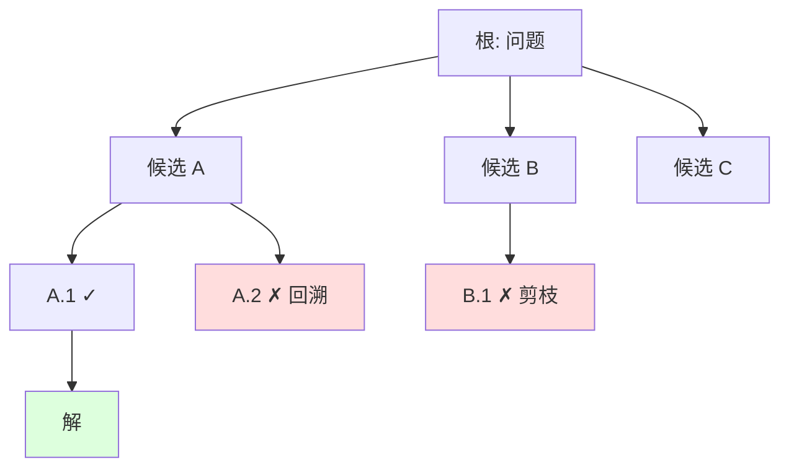

> **一句话**：当问题需要试探、回溯与全局取舍时，把单链 CoT 升级为「生成候选 → 评估打分 → 选择/回溯」的搜索循环，往往比一条路走到黑更划算。
> 关键年份：Self-Consistency（2022, arXiv:2203.11171）、Tree of Thoughts（2023, arXiv:2305.10601）、Graph of Thoughts（2023, arXiv:2308.09687）、rStar（2024, arXiv:2408.06195）。
> 前置阅读：[测试时扩展](/reasoning/test-time-scaling)、[推理中的奖励模型](/reasoning/reward-models)、[推理总览](/reasoning/)

## 为什么单链 CoT 不够

链式思维（CoT）让模型把推理写成一条从左到右的 token 序列。这是它的优点，也是它的天花板：**生成是自回归的、不可回退的**。一旦前几步的方向选错，后续 token 只能在错误前提上继续展开，模型没有「擦掉重来」的机制。

对于「需要探索 + 前瞻 + 早期决策权重大」的任务——24 点、填字、规划、多步搜索式数学——这种局限尤其明显。Tree of Thoughts 论文（Yao et al., 2023）正是用这类任务作为反例：CoT 与多数投票在 Game of 24 上表现很差，而引入搜索后大幅改善。

解决思路是把推理从「一条线」变成「一棵树/一张图」，并显式地做三件 CoT 不做的事：**枚举多个候选、对候选打分、在分数指引下选择或回溯**。

## Tree of Thoughts：状态扩展 + 评估 + 回溯

ToT 把问题求解建模成在「思维状态」上的搜索。一个状态是已经形成的部分解（一段连贯的中间推理），搜索过程由四个可插拔组件构成：

1. **思维分解**：把任务切成若干步，每步产出一个「thought」（一行算式、一个段落计划、一格填字等）。
2. **思维生成器**：在当前状态下采样 $k$ 个候选下一步（sample 或 propose）。
3. **状态评估器**：用 LLM 自身给候选打分——可以是直接估值（value，如「这条路还能不能到 24」），也可以是候选间的投票（vote）。
4. **搜索算法**：用 BFS 或 DFS 组织扩展；当某分支被评估为死路时**回溯**到上层换一个候选。

形式上，每一步在候选集合 $\{s_1,\dots,s_k\}$ 上用评估函数 $V(s)$ 做选择，整体探索的状态数远小于穷举，因为差分支被评估器**提前剪枝**。代价是每个状态都要额外调用 LLM 做生成与打分，token 开销随宽度 $k$ 和深度成倍上涨。

## Graph of Thoughts：从树到图（简述）

Graph of Thoughts（Besta et al., 2023）把 ToT 的树进一步泛化为**任意有向图**：thought 是顶点，依赖关系是边。相比树，图额外支持两类操作——**聚合**（把多个 thought 合并成一个，如归并多个子排序结果）与**精炼**（沿反馈环对同一 thought 反复改写）。论文在排序等任务上报告相对 ToT 的质量与成本改善（具体增益以原文为准）。直觉上，当子问题之间存在「可合并」的结构时，图比树更贴合问题的真实依赖。

## MCTS 引导推理：把搜索预算花在刀刃上

ToT 的 BFS/DFS 是相对简单的搜索；当分支因子大、深度深时，需要更聪明的预算分配。**蒙特卡洛树搜索（MCTS）** 用「选择 → 扩展 → 模拟 → 回传」四步，靠 UCB 类准则在「利用已知高价值分支」与「探索新分支」之间平衡，把有限的 rollout 集中到更有希望的子树。

把 MCTS 套到推理上的代表工作（定性，数字以原文为准）：

- **rStar**（Qi et al., 2024, arXiv:2408.06195）：让小模型用一组「类人推理动作」增广 MCTS 来生成候选轨迹，再由另一个能力相当的小模型作为**判别器**去核验；两个模型相互一致（mutual consistency）的轨迹被认为更可信。亮点是**不做微调、不依赖更强模型**就提升小模型推理。
- 此后一类「自演化 + 过程奖励 + 树搜索」的数学推理工作（如 rStar-Math，arXiv:2501.04519）进一步把搜索得到的高质量轨迹回灌训练，形成搜索与学习的循环。

这里的关键依赖是**评估信号**：MCTS 的价值回传需要一个能区分好坏中间步骤的评估器——可以是 LLM 自评、判别模型，或专门训练的过程奖励模型（PRM）。评估器越准，搜索的边际收益越高；评估器是噪声，搜索就退化成昂贵的随机游走。详见 [推理中的奖励模型](/reasoning/reward-models)。

## Self-Consistency：无显式搜索的「投票」

不是所有收益都要靠显式搜索。**Self-Consistency**（Wang et al., 2022, arXiv:2203.11171）是最轻量的一档：对同一道题用温度采样生成 $N$ 条独立 CoT，丢掉中间过程、只对**最终答案**做多数投票。

$$\hat{a} = \arg\max_{a} \sum_{i=1}^{N} \mathbb{1}[\text{answer}(r_i) = a]$$

它的前提是「一道复杂题往往有多条不同推理路径通向同一个正确答案」，因此正确答案在采样里更容易形成共识。原文在 GSM8K、SVAMP、AQuA 等基准上报告了显著提升（如 GSM8K +17.9%，数字以原文为准）。

可以把它看作一次**没有树结构、没有中间评估、没有回溯的搜索**：只在叶子层做聚合。它便宜、易实现、几乎无需评估器；代价是无法剪枝、不能在中途纠偏，纯靠采样多样性碰运气。

**Verifier-guided** 是它的加权升级：用一个验证器/奖励模型给每条轨迹打分，做加权投票或 best-of-$N$ 选优，而非简单计票。这一步把「投票」往「搜索」推进了半格——开始用评估信号，但仍不回溯、不展开树。

## 一张表：从投票到搜索

| 方法 | 结构 | 中间评估 | 回溯 | 评估器需求 | 相对成本 |
| --- | --- | --- | --- | --- | --- |
| 单链 CoT | 一条链 | 无 | 无 | 无 | 1× |
| Self-Consistency | $N$ 条独立链 | 无（仅叶子投票） | 无 | 无 | $N$× |
| Verifier-guided / Best-of-N | $N$ 条独立链 | 仅叶子打分 | 无 | 需验证器 | $N$× + 验证 |
| Tree of Thoughts | 树 | 每个状态 | 有 | LLM 自评 | 高（随宽×深） |
| Graph of Thoughts | 图 | 每个节点 + 聚合 | 有 | LLM 自评 | 高 |
| MCTS 引导（rStar 等） | 树 + 价值回传 | 每个节点 | 有 | PRM / 判别器 | 很高 |

## 何时值得上搜索：成本 vs 收益

搜索不是越多越好，它把 token 开销和延迟成倍放大。决策可参考几条经验：

- **答案可验证性**。终态有廉价、可靠的判定（代码能跑、方程能代入、定理可检查）时，搜索/best-of-$N$ 收益最高——验证便宜，选优近乎免费午餐。
- **评估器质量**。中间步骤能被靠谱打分（好的 PRM 或自评），才适合 ToT/MCTS 这种依赖中间评估的方法；否则退回到只在叶子投票的 Self-Consistency 更稳。
- **问题结构**。需要前瞻、回溯、早期决策权重大的任务（规划、组合搜索、难数学）才吃得下树搜索的开销；事实问答、简单算术上 Self-Consistency 往往就够。
- **预算曲线**。先沿便宜的一档（CoT → Self-Consistency → verifier 加权）爬，确认收益还在涨，再考虑上 ToT/MCTS。同等 token 预算下，"加宽采样 + 投票" 常常是性价比基线，显式树搜索要赢过它才值得引入复杂度。这与 [测试时扩展](/reasoning/test-time-scaling) 里「算力换准确率」的取舍是同一枚硬币的两面。

一句话收尾：**搜索的收益上限由评估信号的质量决定**。没有好的 verifier/PRM，再花哨的树也只是更贵的猜测。

## 参考文献

- Wang et al. *Self-Consistency Improves Chain of Thought Reasoning in Language Models.* arXiv:2203.11171 (2022).
- Yao et al. *Tree of Thoughts: Deliberate Problem Solving with Large Language Models.* arXiv:2305.10601 (2023, NeurIPS 2023).
- Besta et al. *Graph of Thoughts: Solving Elaborate Problems with Large Language Models.* arXiv:2308.09687 (2023).
- Qi et al. *Mutual Reasoning Makes Smaller LLMs Stronger Problem-Solvers (rStar).* arXiv:2408.06195 (2024, ICLR 2025).
- Guan et al. *rStar-Math: Small LLMs Can Master Math Reasoning with Self-Evolved Deep Thinking.* arXiv:2501.04519 (2025).
