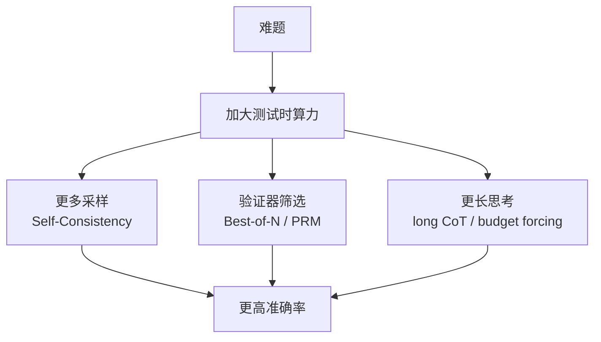

> **一句话**：与其只把模型练得更大，不如在推理那一刻让它"想得更多"——通过显式思维链、多采样投票、验证器筛选乃至强制延长思考，把额外的算力转化为更高的准确率。
> 关键年份：CoT (Wei et al. 2022, arXiv:2201.11903)；Self-Consistency (Wang et al. 2022, arXiv:2203.11171)；Scaling Test-Time Compute (Snell et al. 2024, arXiv:2408.03314)；s1 budget forcing (2025, arXiv:2501.19393)。
> 前置阅读：[推理总览](/reasoning/)、[推理时搜索](/reasoning/search)、[推理与部署](/inference/)

## 为什么要在测试时加算力

传统标度律关注的是**训练时**算力：更多参数、更多数据、更多预训练步数换来更低的损失。但对于一个**已经训好**的模型，面对一道难题，我们还能不能在推理那一刻继续提升表现？答案是肯定的。把单次贪心解码换成"生成更长的推理、采样更多候选、用验证器挑出最优解"，准确率往往会随着投入的 token/采样数继续爬升。这就是**测试时计算扩展（test-time scaling, TTS）**的核心动机。

它的吸引力在于经济性：训练一个更大的模型是一次性的巨额前置投入，而测试时算力是按需付费的——只在难题上多花、在简单题上少花。Snell et al. (2024) 正是系统量化了这一取舍。

## 思维链：让算力"显式化"

最早把推理过程变成可见 token 的是**链式思考提示（Chain-of-Thought, CoT）**（Wei et al. 2022）。做法极简：在 few-shot 示例里给出"问题 → 中间推理步骤 → 答案"，模型便会模仿着先写推理再给结论。关键发现是 CoT 是一种**涌现能力**——只有当模型规模足够大时，它才显著生效，在算术、常识、符号推理上大幅领先直接作答。

CoT 的本质是把"思考"摊开成 token 序列，相当于给模型一块可读写的草稿纸。每多写一步，就是多花一点测试时算力，这是后续一切扩展手段的地基。

## Self-Consistency：多采样投票

CoT 默认用贪心解码，只走一条路。**Self-Consistency**（Wang et al. 2022）指出：一道难题往往有多条不同的正确推理路径殊途同归。于是改用带温度的采样生成 $N$ 条推理链，对**最终答案**做多数投票（边缘化掉中间过程）：

$$\hat{y} = \arg\max_{y} \sum_{i=1}^{N} \mathbb{1}[a_i = y]$$

其中 $a_i$ 是第 $i$ 条采样链的答案。这是最简单的一种 TTS——不需要额外训练，仅靠加大采样数就能稳定提升。原文在 GSM8K 上相比 CoT 提升约 +17.9%（以原文为准），在多个算术与常识基准上同样显著。它的局限是只看答案出现频率，无法判断"少数派但正确"的情况。

## Best-of-N 与验证器筛选

投票之外的另一条路是**用验证器（verifier）打分挑选**。生成 $N$ 个候选，让一个评分模型给每个候选打分，取最高分者即 **Best-of-N (BoN)**。验证器可以是：

- **结果奖励模型（ORM）**：只看最终答案对不对的概率；
- **过程奖励模型（PRM）**：给推理的**每一步**打分，更细粒度地定位错误。

有了过程级信号，还能配合搜索做更聪明的分配，例如对一棵推理树做束搜索 / 前瞻搜索（详见[推理时搜索](/reasoning/search)）。投票 vs. 验证器的对比：

| 方法 | 是否需训练 | 选择信号 | 典型短板 |
|---|---|---|---|
| Self-Consistency 投票 | 否 | 答案频率 | 忽略"少数正确" |
| Best-of-N + ORM | 需训 ORM | 结果分 | 不知错在哪一步 |
| Best-of-N + PRM / 树搜索 | 需训 PRM | 步级分 | 训练标注成本高 |

## Long CoT：模型自发的长链反思

前述方法都是在**外部**反复调用一个不会反思的模型。新一代推理模型（如 OpenAI o1 一类）走的是另一条路：让模型在**单次**生成里自发产出极长的思维链，包含自我怀疑、回溯、换路、复核等行为。这种"长思维链（long CoT）"把搜索与验证**内化**进了模型自身的解码过程，往往通过强化学习训练得到（参见[推理总览](/reasoning/)）。

## Budget Forcing：强制它想得更久（s1）

如何在推理时**控制**这种长思考的预算？**s1**（Muennighoff et al. 2025）给出了一个朴素而有效的答案——**budget forcing（预算强制）**：

- 想**省**算力：到达 token 上限时强行插入结束标记，让模型立刻收尾；
- 想**多**算力：当模型试图结束时，把结束标记替换成 "Wait" 等词反复追加，逼它继续思考、复查答案,常能纠正先前的错误推理。

s1 仅用 **1000** 条高质量样本（s1K，按难度、多样性、质量筛选）对 Qwen2.5-32B-Instruct 做监督微调，配合 budget forcing 即得到 s1-32B。原文报告它在竞赛数学（MATH、AIME24）上超过 o1-preview 最多达 27%；通过 budget forcing 延长思考，AIME24 准确率可从 50% 外推到 57%（以原文为准）。这说明**测试时算力是一个可以单独旋转的旋钮**，且模型、数据、代码全部开源。

## 推理时算力 vs. 加大模型：怎么取舍

Snell et al. (2024) 的核心结论是：**在难度合适的题目上，把固定的算力预算投到测试时，可以比把同样算力投到更大模型上更划算。**他们提出"compute-optimal"策略——根据题目难度自适应地分配测试时算力（简单题少采样、难题多搜索），相比朴素的 Best-of-N 基线，达到同等效果的测试时算力效率可提升 **4 倍以上**（以原文为准）。

但取舍并非一边倒：

- TTS 对**当前模型能力可及**的难题增益最大；若题目远超模型基础能力，再多采样也救不回来，此时**更大/更强的基础模型**仍不可替代。
- 测试时算力是**按 query 付费**的边际成本，高频在线服务下累积开销可能反超一次性的扩参成本，需结合 QPS 与延迟预算权衡（参见[推理与部署](/inference/)）。
- 长 CoT 会显著拉长延迟，存在"过度思考"风险——在简单题上浪费 token 甚至改错答案。

实践上，二者是**互补**而非替代：先用合适规模的模型打底，再用 TTS 把难题的天花板顶上去，并用难度估计来动态分配预算。

## 参考文献

- Wei et al. *Chain-of-Thought Prompting Elicits Reasoning in Large Language Models.* arXiv:2201.11903 (2022).
- Wang et al. *Self-Consistency Improves Chain of Thought Reasoning in Language Models.* arXiv:2203.11171 (2022).
- Snell et al. *Scaling LLM Test-Time Compute Optimally can be More Effective than Scaling Model Parameters.* arXiv:2408.03314 (2024).
- Muennighoff et al. *s1: Simple test-time scaling.* arXiv:2501.19393 (2025).
