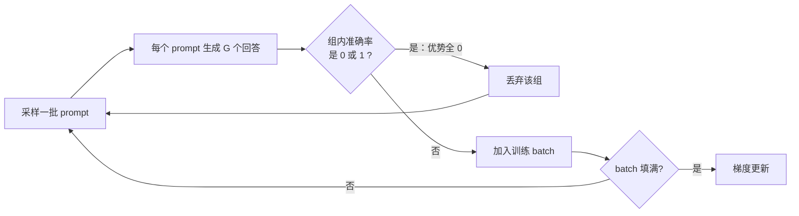

# DAPO（Decoupled Clip and Dynamic Sampling Policy Optimization）

> **一句话**：对 GRPO 做四处外科手术——抬高裁剪上界、过滤零梯度样本组、token 级损失归一化、超长样本奖励塑形——开源完整复现并超越 R1 级别的推理 RL 训练。论文 *DAPO: An Open-Source LLM Reinforcement Learning System at Scale*（ByteDance Seed & 清华 AIR，2025）。
> 提出年份：2025 · 机构/团队：ByteDance Seed & 清华大学 AIR · 会议/来源：arXiv:2503.14476
>
> 前置阅读：[GRPO](/rlhf/grpo)、[PPO](/rlhf/ppo)

## 直觉与动机

DeepSeek-R1 证明大规模 RL 能让 base 模型涌现长链推理，但技术报告隐去了大量训练细节，社区用朴素 [GRPO](/rlhf/grpo) 很难复现。DAPO 团队在 [Qwen2.5-32B](/base-models/qwen) base 模型上实测：直接跑 GRPO 在 AIME 2024 上只有约 30 分，且伴随三类系统性病灶：

1. **熵坍缩**：策略熵快速下降、采样趋同、探索停止。根因之一是 PPO/GRPO 对称裁剪的上界 $1+\epsilon$ 对低概率 token 的抑制过强——论文给的例子：$\epsilon=0.2$ 时，$\pi_{\theta_{\text{old}}}=0.01$ 的 token 最多升到 0.012，而 $\pi_{\theta_{\text{old}}}=0.9$ 的可以升到 1.08。"富者愈富"，承担探索功能的低概率 token 永远长不起来。
2. **有效梯度消失**：训练推进后，越来越多 prompt 的 $G$ 个采样全对或全错，组内优势全为 0、无梯度，batch 内有效样本数持续缩水，梯度噪声变大。
3. **长度相关的病理**：GRPO 的 sample-level loss 先在样本内部对 token 取平均，长回复中单个 token 的权重被稀释，超长低质量样本（重复、乱码）惩罚不足；同时超长被截断的样本被一刀切判负，把"推理合理只是没写完"也惩罚了，引入奖励噪声。

DAPO 对每个病灶各开一刀，四项叠加后用 Qwen2.5-32B 在 AIME 2024 达到 50 分，超过 DeepSeek-R1-Zero-Qwen-32B 的 47 分，且训练步数减少 50%。整套系统基于 verl 实现，连同 DAPO-Math-17K 数据集（17K 道数学题，答案统一转成整数便于规则判分）完全开源——这是它作为"系统论文"的另一半价值。

## 方法与公式

DAPO 的目标函数在 GRPO 骨架上改三处（解耦裁剪、动态采样约束、token 级归一化），并**去掉 KL 项**：

$$
\mathcal{J}_{\text{DAPO}}(\theta) = \mathbb{E}_{(x,a)\sim\mathcal{D},\ \{y_i\}_{i=1}^{G}\sim\pi_{\theta_{\text{old}}}(\cdot|x)} \left[ \frac{1}{\sum_{i=1}^{G}|y_i|} \sum_{i=1}^{G}\sum_{t=1}^{|y_i|} \min\Big( \rho_{i,t}\hat{A}_{i,t},\ \mathrm{clip}\big(\rho_{i,t},\ 1-\epsilon_{\text{low}},\ 1+\epsilon_{\text{high}}\big)\hat{A}_{i,t} \Big) \right]
$$

$$
\text{s.t.}\quad 0 < \big|\{\, y_i \mid \texttt{is\_equivalent}(a, y_i) \,\}\big| < G
$$

其中 $\rho_{i,t} = \frac{\pi_\theta(y_{i,t}\mid x, y_{i,<t})}{\pi_{\theta_{\text{old}}}(y_{i,t}\mid x, y_{i,<t})}$，优势沿用 GRPO 的组内标准化 $\hat{A}_{i,t} = \frac{r_i - \mathrm{mean}(\{r_j\}_{j=1}^G)}{\mathrm{std}(\{r_j\}_{j=1}^G)}$（序列级广播到每个 token）。逐项拆解：

**1）Clip-Higher（解耦裁剪）**：把对称区间 $[1-\epsilon, 1+\epsilon]$ 解耦为 $[1-\epsilon_{\text{low}},\ 1+\epsilon_{\text{high}}]$，只抬高上界（实验取 $\epsilon_{\text{low}}=0.2$、$\epsilon_{\text{high}}=0.28$），给低概率 token 的概率上升留出空间，缓解熵坍缩；下界不动，避免把某些 token 的概率过猛地压向 0。

**2）Dynamic Sampling（动态采样）**：即目标函数中的约束条件——过采样并丢弃组内准确率为 0 或 1 的 prompt（这些组优势全 0、无有效梯度），持续补充采样直到 batch 填满有效样本，保证每个 batch 的有效梯度样本数稳定。



**3）Token-Level Policy Gradient Loss**：GRPO 的归一化是 $\frac{1}{G}\sum_i \frac{1}{|y_i|}\sum_t(\cdot)$——每个样本权重相等；DAPO 改为 $\frac{1}{\sum_i |y_i|}\sum_i\sum_t(\cdot)$——每个 token 权重相等。长回复对梯度的影响与其 token 数成正比，长样本里的重复、乱码模式能被足额惩罚，长样本里的优质推理模式也能被足额奖励，抑制长 CoT 训练中熵和长度的不健康增长。

**4）Overlong Reward Shaping**：两个互补策略。其一 **Overlong Filtering**——对仅因超长被截断的样本直接 mask 掉 loss，不让"没写完"污染奖励信号。其二 **Soft Overlong Punishment**——在正确性奖励之外叠加分段长度惩罚：

$$
R_{\text{length}}(y)=
\begin{cases}
0, & |y| \le L_{\max}-L_{\text{cache}} \\[4pt]
\dfrac{(L_{\max}-L_{\text{cache}})-|y|}{L_{\text{cache}}}, & L_{\max}-L_{\text{cache}} < |y| \le L_{\max} \\[8pt]
-1, & |y| > L_{\max}
\end{cases}
$$

在最后 $L_{\text{cache}}$ 个 token 的缓冲区内惩罚从 0 线性滑到 $-1$（实验取 $L_{\max}=16384$、$L_{\text{cache}}=4096$，最大生成长度 20480）。


> 图源：Yu et al., *DAPO: An Open-Source LLM Reinforcement Learning System at Scale*, arXiv:2503.14476（用于学习注解，版权归原作者）

此外两个值得注意的设计决策：**去掉 KL 正则**——长 CoT 推理训练中策略本就要远离初始分布，KL 约束意义有限且白费一份 $\pi_{\text{ref}}$ 前向；**规则奖励**——答案对错二值判分，不用 [Reward Model](/rlhf/reward-model)，从源头规避 reward hacking。

## 与 baseline 对比

| 维度 | GRPO | DAPO |
| --- | --- | --- |
| 裁剪区间 | 对称 $1\pm\epsilon$（0.2） | 解耦：$\epsilon_{\text{low}}=0.2$、$\epsilon_{\text{high}}=0.28$ |
| 采样组的使用 | 全部入 batch（全对/全错组贡献零梯度） | 过滤准确率 0/1 的组，过采样补满 |
| loss 归一化 | sample-level（样本内先平均） | token-level（按总 token 数归一） |
| KL 项 | 有（$\beta\,\mathbb{D}_{\text{KL}}$） | 无 |
| 截断样本 | 一刀切判负 | mask loss + 软长度惩罚 |
| AIME 2024（Qwen2.5-32B） | 约 30 分（朴素实现） | 50 分，且步数比 R1 方案少 50% |

## 实现要点

```python
# DAPO 单步训练骨架（基于 verl 的逻辑）
batch = []
while len(batch) < target_size:                    # Dynamic Sampling
    for x, answer in sample_prompts():
        ys  = policy.generate(x, n=G)
        acc = [verify(answer, y) for y in ys]      # 规则奖励：对/错
        if 0 < sum(acc) < G:                       # 过滤零梯度组
            r = [a + soft_len_penalty(y) for a, y in zip(acc, ys)]
            batch.append((x, ys, r))

adv  = group_normalize(rewards)                    # (r - mean) / std，组内
mask = not_truncated(ys)                           # Overlong Filtering
loss = -(min(rho * adv,
             clip(rho, 1 - eps_low, 1 + eps_high) * adv)
         * mask).sum() / mask.sum()                # token-level 归一化
```

- 动态采样会增加生成开销，但生成可与过滤流水线化；论文观察总收敛耗时并未显著变差，因为有效梯度变密、所需步数变少。
- 长度惩罚作用在 reward 上（参与组内标准化之前），截断 mask 作用在 loss 上，两者位置不要搞混。
- token-level loss 在分布式实现里要注意归一化分母是**全组（或全 batch）总 token 数**，跨 GPU 求和后再除，否则各卡权重不一致。

## 调参与实践经验

- **$\epsilon_{\text{high}}$ 别贪**：0.28 是论文值；继续抬高会放大 off-policy 噪声，熵不降反爆。监控指标首选策略熵——健康曲线是缓慢下降或平台，不是断崖。
- **四项技术增益可叠加**：论文消融显示每项都有正贡献，从朴素 GRPO 的约 30 分逐步堆到 50 分；优先级上 Dynamic Sampling 和 Clip-Higher 对最终分数影响最直接。
- **去 KL 需要可验证奖励兜底**：规则判分天然防 hacking，才敢放开 KL。若你的奖励来自 RM，去 KL 前要三思（参考 [RLHF 总览](/rlhf/) 的优化目标）。
- **数据侧同样关键**：答案统一为整数（DAPO-Math-17K 的做法）让规则解析近乎无噪；判分器的假阴性会直接变成优势噪声。
- 这套技巧大多与具体算法正交：Clip-Higher、动态过滤、token 级归一化在 [GSPO](/rlhf/gspo)、[REINFORCE++](/rlhf/reinforce-plus-plus) 等框架下同样常被复用，已是推理 RL（含 [Agentic RL](/agent/agentic-rl/)）的默认工具箱。

## 参考文献

- Yu et al., 2025. *DAPO: An Open-Source LLM Reinforcement Learning System at Scale.* arXiv:2503.14476
- Shao et al., 2024. *DeepSeekMath: Pushing the Limits of Mathematical Reasoning in Open Language Models.* arXiv:2402.03300
- DeepSeek-AI, 2025. *DeepSeek-R1: Incentivizing Reasoning Capability in LLMs via Reinforcement Learning.* arXiv:2501.12948
- 项目主页（代码与 DAPO-Math-17K 数据集）：dapo-sia.github.io
