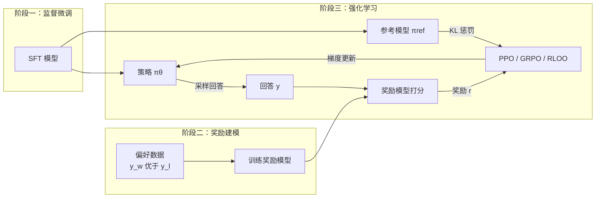
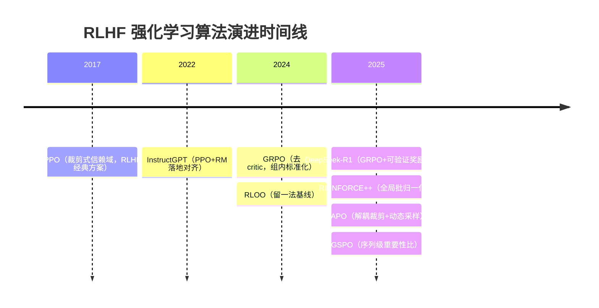

# RLHF / 强化学习总览

> **一句话**：用奖励信号（人类偏好或可验证规则）通过强化学习继续优化语言模型，让模型对齐人类意图或最大化任务正确率；PPO 是经典完整方案，GRPO/RLOO 等变体的核心改进是去掉 critic、降低显存与工程开销。

RLHF（Reinforcement Learning from Human Feedback）是把"人类喜欢什么"这一难以写进损失函数的目标，转化为可优化信号的框架。SFT 阶段模型只学会"模仿示范"，而 RLHF 让模型在自己采样的回答上根据好坏反馈调整分布，从而超出示范数据的上限——这也是 InstructGPT（Ouyang et al., 2022）让 GPT-3 真正变得"听话"的关键一步。

## 经典三阶段流程

三个阶段环环相扣：SFT 模型同时作为策略 $\pi_\theta$ 的初始化和参考模型 $\pi_{\text{ref}}$；奖励模型 $r_\phi$ 在人类偏好对 $(y_w, y_l)$ 上训练，提供阶段三的奖励来源；强化学习阶段反复"采样—打分—更新"，把奖励分数转化为策略改进。

## 统一优化目标

所有 RLHF 算法本质上都在优化"高奖励 + 不偏离原模型太远"这一目标：

$$
\max_{\pi_\theta} \; \mathbb{E}_{x \sim \mathcal{D},\, y \sim \pi_\theta(\cdot|x)} \big[ r_\phi(x, y) \big] - \beta \, \mathbb{D}_{\text{KL}}\!\left[ \pi_\theta(\cdot|x) \,\|\, \pi_{\text{ref}}(\cdot|x) \right]
$$

KL 项有两重作用：一是防止策略为了刷高奖励而"钻奖励模型的空子"（reward hacking）；二是约束分布漂移，避免模型遗忘 SFT 学到的语言能力、退化成乱码。$\beta$ 越大越保守。值得注意的是，[DPO](/dpo/dpo) 家族正是发现这一目标存在闭式最优解，从而绕过显式 RL，直接在偏好数据上做监督式优化——这是与本版块平行的另一条技术路线。

## 两类奖励：人类偏好 vs 可验证奖励

经典 RLHF 的奖励来自 [Reward Model](/rlhf/reward-model)，它从人类偏好数据中学到一个标量打分函数。但 RM 本身会被攻击、有长度偏置、在分布外打分失真。近年随着推理模型的兴起，**RLVR（Reinforcement Learning with Verifiable Rewards）** 成为另一主流：对数学、代码等有标准答案的任务，直接用规则判定对错作为奖励（如答案是否正确、单测是否通过），不再需要训练 RM。DeepSeek-R1（DeepSeek-AI, 2025）正是用 [GRPO](/rlhf/grpo) + 可验证奖励把推理能力推到新高度。本版块的算法（PPO/GRPO/RLOO 等）对两类奖励都适用，区别只在 reward 的来源。

## 算法演化线与选型

| 算法 | 年份 | Critic/Value | 优势估计 | 同时驻留模型 | 代表使用方 |
| --- | --- | --- | --- | --- | --- |
| [PPO](/rlhf/ppo) | 2017 | 需要 | GAE，token 级 | 4（policy/ref/RM/critic） | InstructGPT |
| [GRPO](/rlhf/grpo) | 2024 | 不需要 | 组内相对，序列级 | 3 | DeepSeekMath / R1 |
| [RLOO](/rlhf/rloo) | 2024 | 不需要 | 留一法基线 | 3 | OpenRLHF |
| [REINFORCE++](/rlhf/reinforce-plus-plus) | 2025 | 不需要 | 全局批基线 | 3 | 开源社区 |
| [DAPO](/rlhf/dapo) | 2025 | 不需要 | 组内相对（多项修正） | 3 | 大规模长思维链 RL |
| [GSPO](/rlhf/gspo) | 2025 | 不需要 | 序列级重要性比 | 3 | Qwen |

演化主线非常清晰：PPO 是完整但昂贵的起点（4 个模型同时驻留显存），其后的所有变体几乎都在做一件事——**去掉 critic**。GRPO 用"同一 prompt 采样一组、组内标准化"来替代 value 函数提供基线，[RLOO](/rlhf/rloo) 用留一法、[REINFORCE++](/rlhf/reinforce-plus-plus) 用全局批均值做同样的事。[DAPO](/rlhf/dapo) 与 [GSPO](/rlhf/gspo) 则针对 GRPO 在长序列、长思维链场景暴露的具体问题（长度归一化偏置、token 级比值噪声、训练不稳定）做修正。

**选型经验**：
- 通用对齐、奖励信号稠密且来自 RM：PPO 仍是最稳的方案，但工程门槛高。
- 数学/代码等可验证任务、追求简洁与显存友好：首选 GRPO 系列。
- 显存极度受限或想要最简实现：RLOO / REINFORCE++。
- 大规模长思维链训练遇到不稳定：参考 DAPO / GSPO 的具体修正。
- 只有离线偏好数据、不想搭 RL 基础设施：直接走 [DPO](/dpo/dpo) 家族。

## 子主题导航

- [Reward Model](/rlhf/reward-model)：奖励从哪里来，以及它的种种坑（reward hacking、长度偏置、ORM vs PRM）
- 算法演化：[PPO](/rlhf/ppo) → [GRPO](/rlhf/grpo) → [DAPO](/rlhf/dapo) / [GSPO](/rlhf/gspo) → [RLOO](/rlhf/rloo) → [REINFORCE++](/rlhf/reinforce-plus-plus)
- 平行路线：[DPO 家族](/dpo/)，符号体系见 [记号约定](/guide/notation)

## 参考文献

- Ouyang et al., 2022. *Training language models to follow instructions with human feedback (InstructGPT).* arXiv:2203.02155
- Schulman et al., 2017. *Proximal Policy Optimization Algorithms.* arXiv:1707.06347
- Shao et al., 2024. *DeepSeekMath: Pushing the Limits of Mathematical Reasoning in Open Language Models.* arXiv:2402.03300
- DeepSeek-AI, 2025. *DeepSeek-R1: Incentivizing Reasoning Capability in LLMs via Reinforcement Learning.* arXiv:2501.12948
