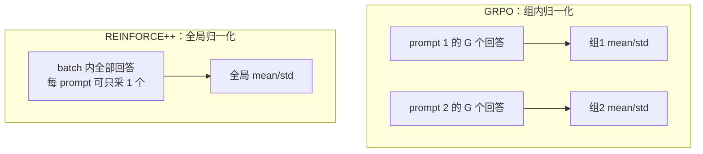

# REINFORCE++

> **一句话**：critic-free 的 REINFORCE 加固版——保留 PPO 的 token 级 KL 惩罚与 clip，把优势放到**整个 global batch** 上归一化（而非 GRPO 的按 prompt 分组），单 prompt 单采样也能训。论文 *REINFORCE++*（2025；v1 副标题 *A Simple and Efficient Approach for Aligning Large Language Models*，最新版改题为 *Stabilizing Critic-Free Policy Optimization with Global Advantage Normalization*）。
> 提出年份：2025 · 机构/团队：OpenRLHF 作者（Jian Hu 等） · 会议/来源：arXiv:2501.03262
>
> 前置阅读：[PPO](/rlhf/ppo)、[RLOO](/rlhf/rloo)、[GRPO](/rlhf/grpo)

## 直觉与动机

critic-free 方法都要回答同一个问题：**没有 value 网络，基线从哪来？** [GRPO](/rlhf/grpo) 和 [RLOO](/rlhf/rloo) 的答案是"同 prompt 多采样、组内互为基线"，但这有两个代价：

1. **采样预算被绑定**：每个 prompt 必须采 $G$ 个回答才能构造基线；同样的生成预算下，能覆盖的 prompt 多样性变少。
2. **组内统计量噪声大且有偏**：组大小通常只有 8~64，mean/std 是小样本统计；GRPO 除以组内 std 还引入难度偏差——全组接近全对或全错的 prompt 奖励方差极小，除以小 std 后优势被异常放大，模型容易在过易/过难样本上过拟合，这也是 std 下溢需要 $\varepsilon$ 平滑的根源。

REINFORCE++ 的回答是：**基线与归一化统计量取自整个 global batch**。batch 内所有 prompt 的全部 token 共享同一组 $\mu_{\text{batch}}, \sigma_{\text{batch}}$——样本量大一个量级以上，统计更稳；所有 prompt 用同一个缩放尺度，不存在组级的不一致加权。最新版论文进一步论证：这种全局归一化带来的偏差随 batch 增大而减小。同时，它保留 PPO 中真正廉价有效的两个稳定件——PPO-clip（限制单步更新幅度、容许 minibatch 复用）和 token 级 KL 惩罚（防止漂离 $\pi_{\text{ref}}$）——只把最贵的 critic 砍掉。论文声称的定位是：比 GRPO 更稳定，比 PPO 更高效。



## 方法与公式

**第一步：token 级奖励塑形**（与 PPO-RLHF 相同）。序列末端的奖励分数加上逐 token 的 KL 惩罚：

$$
r_t = \mathbb{1}[t = T]\, r_\phi(x, y) - \beta\,\mathrm{KL}(t), \qquad \mathrm{KL}(t) = \log \frac{\pi_{\theta_{\text{old}}}(y_t \mid x, y_{<t})}{\pi_{\text{ref}}(y_t \mid x, y_{<t})}
$$

**第二步：reward-to-go 作为优势**。取 $\gamma=1$、不做 bootstrapping，token $t$ 的优势就是它之后的累计奖励：

$$
A_t = r_\phi(x, y) - \beta \sum_{i=t}^{T} \mathrm{KL}(i)
$$

**第三步：全局优势归一化**（核心创新）。在整个 global batch 的所有 token 上统计均值与标准差：

$$
\hat{A}_t = \frac{A_t - \mu_{\text{batch}}}{\sigma_{\text{batch}}}
$$

**第四步：PPO-clip 代理目标**（没有 critic）：

$$
\mathcal{L}(\theta) = -\mathbb{E}_t \left[ \min\Big( \rho_t \hat{A}_t,\ \mathrm{clip}(\rho_t,\, 1-\epsilon,\, 1+\epsilon)\, \hat{A}_t \Big) \right], \qquad \rho_t = \frac{\pi_\theta(y_t \mid x, y_{<t})}{\pi_{\theta_{\text{old}}}(y_t \mid x, y_{<t})}
$$

**REINFORCE++-baseline 变体**（面向可验证奖励的推理任务）：当任务需要每 prompt 多采样时（如数学题，奖励是对/错），先用组均值移除 prompt 难度的位移，再做全局归一化：

$$
A_i = r_i - \mathrm{mean}(\{r_j\}_{j=1}^{G}), \qquad \hat{A}_i = \frac{A_i - \mu_{\text{batch}}}{\sigma_{\text{batch}}}
$$

组均值负责"这道题本身多难"的去位移（这一步与 RLOO 同源、无偏），全局统计负责缩放——刻意避开 GRPO 按组除 std 的偏差来源。两个变体的分工：通用 RLHF（奖励来自 RM、prompt 多样、单采样即可）用 REINFORCE++；数学/代码等可验证奖励的推理训练用 REINFORCE++-baseline。


> 图源：Hu et al., *REINFORCE++*, arXiv:2501.03262（用于学习注解，版权归原作者）

## 与 baseline 对比

| 维度 | PPO | GRPO | RLOO | REINFORCE++ |
| --- | --- | --- | --- | --- |
| Critic | 需要 | 不需要 | 不需要 | 不需要 |
| 基线/归一化 | value 网络 | 组内 mean/std | 留一均值 | global batch 的 mean/std |
| 每 prompt 采样数 | 1 | $G$ | $k$ | 1 即可（baseline 版为 $G$） |
| 难度偏差（组 std） | — | 有 | 无 | 无 |
| clip / minibatch 复用 | 有 | 有 | 通常无 | 有 |
| token 级 KL | 在 reward 中 | 在 loss 中（独立项） | 在 reward 中 | 在 reward 中 |
| 统计量样本数 | — | 组内 $G$ 个 | 组内 $k$ 个 | 全 batch（偏差随 batch 增大而减小） |

## 实现要点

```python
# REINFORCE++ 单步（通用版，每 prompt 采 1 个回答）
kl       = logp_old - logp_ref                     # [B, T] token 级 KL
reward_t = -beta * kl
reward_t[:, -1] += rm_score                        # 末 token 加序列奖励

A = reward_t.flip(-1).cumsum(-1).flip(-1)          # gamma=1 的 reward-to-go
A = (A - A[mask].mean()) / (A[mask].std() + 1e-8)  # 全局 batch 归一化

loss = ppo_clip_loss(logp_new, logp_old, A, eps)   # 无 critic 的 clip 目标
```

- **归一化范围是关键实现细节**：分布式训练下 $\mu_{\text{batch}}, \sigma_{\text{batch}}$ 必须在所有 DP rank 间 all-reduce 后统计（global batch 而非 per-GPU micro-batch），否则各卡尺度不一致，等价于引入随机学习率。
- mask 要正确：统计与 loss 都只覆盖 response token，不含 prompt 与 padding。
- 该算法由 OpenRLHF 作者提出，OpenRLHF 内置 `reinforce++` / `reinforce++-baseline` 两种优势估计器，verl 等框架也已支持；与 PPO 共享绝大部分代码路径（只是去掉 critic 分支），从 PPO 迁移成本很低。
- 显存驻留 3 个模型（policy / ref / RM；规则奖励场景只剩 2 个），与 GRPO 持平、低于 PPO。

## 调参与实践经验

- **batch size 越大越受益**：全局归一化的偏差随 batch 增大而减小，是少数"加卡就变稳"的算法设计；小 batch（如几十条）下全局统计与组内统计差异不大，优势不明显。
- $\beta$ 与 $\epsilon$ 可沿用 PPO 的经验值起步；KL 在 reward 里随 reward-to-go 累积，意味着越靠前的 token 承受越多 KL 压力，$\beta$ 不宜过大。
- 推理任务**不要用通用版硬上**：单采样 + 全局归一化无法消除 prompt 难度位移（难题永远负优势、易题永远正优势），会学成"难度分类器"；这正是 baseline 变体先减组均值的原因。
- 引用注意：arXiv:2501.03262 的标题与作者列表随版本变化明显（v1 单作者 Jian Hu，v9 四位作者且改题），对照他人实验时先确认其针对的版本与变体（通用版 vs baseline 版），二者行为差异很大。
- 与 [DAPO](/rlhf/dapo) 的 token 级损失归一化、Clip-Higher，以及动态采样等技巧正交，可组合使用；序列级比值的思路则见 [GSPO](/rlhf/gspo)。

## 参考文献

- Hu et al., 2025. *REINFORCE++: Stabilizing Critic-Free Policy Optimization with Global Advantage Normalization.* arXiv:2501.03262（v1 标题为 *A Simple and Efficient Approach for Aligning Large Language Models*）
- Williams, 1992. *Simple Statistical Gradient-Following Algorithms for Connectionist Reinforcement Learning.*
- Schulman et al., 2017. *Proximal Policy Optimization Algorithms.* arXiv:1707.06347
