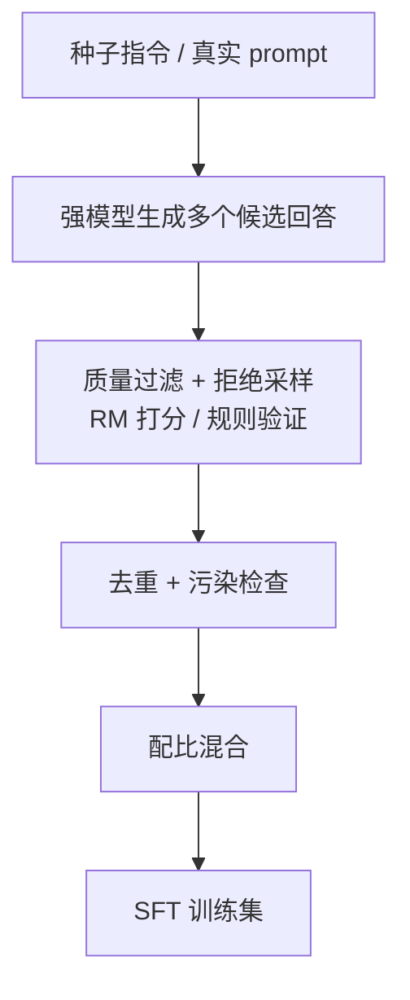

# SFT 数据构造

> **一句话**：SFT 的效果上限主要由数据决定——质量、多样性、配比比数据量更重要。这一页讲数据从哪来、怎么洗、怎么配比。论文：*LIMA: Less Is More for Alignment*（2023）、*Self-Instruct*（2022）。
> 代表工作年份：2022（Self-Instruct，arXiv:2212.10560）、2023（LIMA，arXiv:2305.11206）· 机构/团队：Self-Instruct（UW 等）、LIMA（Meta AI）
>
> 前置阅读：[SFT 总览](/sft/)；对照 [全量微调](/sft/full-finetuning)、[蒸馏](/distillation/)

## 直觉与动机

在 SFT 阶段，"调数据"的边际收益远大于"调超参"。原因在 [SFT 总览](/sft/) 提过的表层对齐假说：模型的知识几乎都在预训练阶段习得，SFT 主要是教它"用哪种方式作答"。既然是在激活已有能力，**示范的质量与覆盖**就成了决定性因素。

最具代表性的证据是 LIMA（Zhou et al., 2023）：仅用 **1000 条人工精选**的高质量对话样本微调 65B 模型，无任何 RL，就得到了能与当时顶级模型一较高下的对话能力。它给出的结论是"质量 + 多样性 > 数量"——少量但风格统一、覆盖多样、答案优质的样本，胜过海量噪声数据。

但这条结论有适用边界。LIMA 式的"少而精"在**通用对话与风格对齐**上成立；当目标是**注入硬核能力**（代码、数学、长链推理、工具调用）时，单纯靠少量样本远远不够，需要大规模、难度足、答案可验证的数据。现代头部模型（[Qwen](/base-models/qwen)、[DeepSeek](/base-models/deepseek) 等）的 SFT 数据普遍是"通用对话少而精 + 能力数据大规模合成"的混合体。三个维度始终要同时盯：

- **质量**：答案正确、格式规范、风格统一、无安全问题；
- **多样性**：任务类型、指令措辞、难度、长度、领域、语种都要铺开，避免模型只会一种套路；
- **配比**：各类数据的相对比例直接决定模型能力分布，是最容易被忽视却最影响最终表现的旋钮。

## 数据来源

三条主要来源，实践中混合使用：

**1. 人工标注。** 质量上限最高、最贵。关键在标注规范设计：明确角色设定、回答风格、拒答边界、格式要求，并配合多轮校验与一致性抽检。LIMA 证明了精标小数据的威力，适合打磨通用对话的"风格基线"。

**2. 开源数据集。** 起步快，但需注意三点：(a) **许可证**——不少数据集禁止商用或带病毒式条款，蒸馏自闭源模型的输出常受 ToS 限制；(b) **质量参差**——早期开源指令集噪声大，需重过滤；(c) **同质化**——大量数据集互相抄录，去重后有效量可能远低于标称。

**3. 合成数据**，当前的主力来源：

- **Self-Instruct**（Wang et al., 2022）：用少量种子指令引导 LLM 自举生成大量新指令与回答，再过滤。开创了"用模型造指令数据"的范式。
- **蒸馏强模型**：用更强的教师模型对 prompt 生成答案当训练目标，详见 [黑盒蒸馏](/distillation/black-box)。注意教师模型的输出许可与事实风险。
- **Rejection sampling（拒绝采样）**：对同一 prompt 采样多个回答，用 [Reward Model](/rlhf/reward-model) 或可验证规则（如代码跑通、数学答案正确）筛出最优者作为 SFT 目标。这是把"能力可验证"转化为高质量数据的高效手段，DeepSeek、Llama 系等都重度使用。
- **Evol-Instruct**：对已有指令做"加难度、加约束、复杂化"的演化，提升数据难度分布。

## 质量过滤与去重

合成与开源数据必须经过严格清洗，否则噪声会被模型忠实学会：

- **规则过滤**：长度异常（过短/截断/超长）、语种不符、含乱码或拒答模板（"作为 AI 我无法…"误入答案）、明显格式错误，先用规则一刀切掉。
- **模型打分过滤**：用 [Reward Model](/rlhf/reward-model) 或 LLM-as-judge 给样本打质量分，砍掉低分尾部。这是把"质量"自动化的主力手段。
- **去重**：精确去重（hash）处理完全重复；近似去重用 **MinHash + LSH** 或 SimHash 找出高相似样本。高度同质的数据会让模型过拟合到少数模式。
- **数据污染检查（最关键的纪律）**：必须检查训练数据是否包含评测集（如 GSM8K、MMLU、HumanEval）的题目或其变体。污染会让 benchmark 虚高、误导决策。常用 n-gram 重叠或 embedding 检索做污染扫描。

## 配比与课程

数据配比是 SFT 阶段最重要的设计决策之一，没有放之四海的最优解，需按目标模型定位实验确定。几个维度：

- **任务类型配比**：通用对话、代码、数学/推理、知识问答、安全/拒答、角色扮演、工具调用等各占多少。能力强的方向往往需要喂更多对应数据；安全数据通常占比不大但不可或缺。配比直接塑造模型的能力画像。
- **多语言配比**：目标语种按预期使用占比分配；小语种数据稀缺时常靠翻译或合成补齐，但要警惕翻译腔污染风格。
- **难度分布**：太简单学不到东西，太难答案不可靠。理想是覆盖梯度难度，并保证难样本的答案确实正确（拒绝采样在此发挥作用）。
- **长度分布**：注意避免"长答案 = 好答案"的隐性偏置渗入数据，否则会被后续 [DPO/SimPO](/dpo/simpo) 阶段放大成长度黑客。

**多阶段 SFT（课程式）**也很常见：先用大规模通用数据建立广覆盖的基础能力，再用小批高质量数据做风格与对齐的精修；或先通用后领域。后一阶段学习率更小、数据更精，目的是"定调"而非"补课"。

## 实验与调参经验

- **规模—效果曲线**：通用对话能力对数据量很快饱和（LIMA 的千级样本即说明问题）；硬核能力（代码/数学）则对规模和难度更敏感，扩数据仍有收益。先小数据快速验证配比，再决定要不要扩量。
- **常见脏数据模式**：截断的回答、答非所问、套话开场白同质化、数学步骤对但最终答案错、代码不可运行、把"拒答"误标成正面答案、教师模型幻觉编造事实。这些靠规则 + 模型打分 + 抽样人工复核组合拦截。
- **格式一致性**：special token、换行、Markdown 风格要统一，否则模型会过拟合到格式噪声，详见 [Chat Template](/sft/chat-template)。
- **小步快跑**：固定一个评测集（覆盖各能力维度且与训练数据无污染），每次只动一个配比或来源，观察增量。数据迭代是 SFT 中性价比最高的工作。
- **与下游阶段协同**：SFT 数据的偏置会被 [DPO](/dpo/) / [RLHF](/rlhf/) 继承甚至放大，因此长度、风格、安全等问题应尽量在数据阶段就解决，不要寄望后续阶段兜底。

## 参考文献

- Zhou et al., 2023. *LIMA: Less Is More for Alignment.* arXiv:2305.11206
- Wang et al., 2022. *Self-Instruct: Aligning Language Models with Self-Generated Instructions.* arXiv:2212.10560
- Xu et al., 2023. *WizardLM: Empowering Large Language Models to Follow Complex Instructions.*（Evol-Instruct）arXiv:2304.12244
- Taori et al., 2023. *Stanford Alpaca: An Instruction-following LLaMA Model.*
