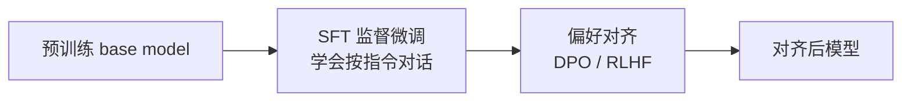
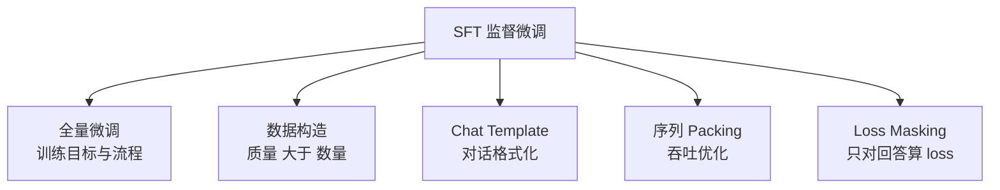

# SFT 监督微调总览

> **一句话**：用高质量的「指令-回答」数据对预训练模型做有监督微调，让它从"续写器"变成会按指令对话的助手——这是后训练（post-training）的第一阶段，也是后续 [DPO](/dpo/dpo) / [RLHF](/rlhf/) 的起点。
>
> 前置阅读：[符号约定](/guide/notation)

## SFT 在 pipeline 中的位置

预训练模型（base model）在海量文本上学到的是 next-token 预测能力：给它一段文字它会接着写下去，但它不知道"该停下来回答用户"，也不知道把回答组织成助手该有的语气和格式。SFT（Supervised Fine-Tuning，监督微调，也叫 instruction tuning）用成对的「prompt $x$ → 期望回答 $y$」数据继续训练，把模型的输出分布拉到"按指令作答"这个子空间里。

一条典型的现代后训练流水线是：

SFT 的作用是**奠定能力与行为基线**：注入指令遵循、格式规范、领域知识、安全边界的初步形态。它无法解决的是"两个都还行的回答里哪个更好"这类相对偏好问题——那是 [DPO](/dpo/) 与 [RLHF](/rlhf/) 接手的部分。换句话说，SFT 教模型"什么是合格答案"，偏好对齐教模型"什么是更好的答案"。绝大多数公开的对齐方法（DPO、PPO、GRPO 等）都默认从一个已经 SFT 过的模型出发。

## 核心目标函数

SFT 的训练目标就是标准的自回归负对数似然（NLL），与预训练同形，但**只在回答 token 上计算 loss**：

$$
\mathcal{L}_{\text{SFT}}(\theta) = -\mathbb{E}_{(x, y) \sim \mathcal{D}} \left[ \sum_{t=1}^{|y|} \log \pi_\theta(y_t \mid x, y_{<t}) \right]
$$

这里 $x$ 是 prompt，$y=(y_1,\dots,y_{|y|})$ 是目标回答，$\pi_\theta$ 是被微调的模型。prompt 部分的 token 参与 attention（作为上文），但不进入求和——这就是 [Loss Masking](/sft/loss-masking) 要解决的核心问题。表面上 SFT 和预训练只差一个 mask，但实践上两者在数据分布（结构化对话 vs 自由文本）、学习率（小 1~2 个数量级）、epoch 数（通常 1~3 而非单遍海量数据）、以及模板格式（special token 标记角色）上都有本质区别。

## 版块地图

| 页面 | 内容 |
| --- | --- |
| [全量微调](/sft/full-finetuning) | 标准 SFT 流程、显存构成、超参、与继续预训练及 [LoRA](/lora/lora) 的取舍 |
| [数据构造](/sft/data-construction) | 数据来源、质量过滤与去重、配比、合成数据 |
| [Chat Template](/sft/chat-template) | 对话模板、special token、多轮拼接 |
| [序列 Packing](/sft/packing) | 多样本拼接、attention 隔离、吞吐收益 |
| [Loss Masking](/sft/loss-masking) | 哪些 token 算 loss、多轮对话的 mask 策略 |

## 两条主线：能力线与对齐线

理解 SFT 可以分成两个看待角度，它们对应了社区里两种数据哲学：

- **能力注入视角**：SFT 是把代码、数学、推理、工具调用等具体能力"教"给模型。这条线追求覆盖广、难度足、答案正确，数据量往往很大（数十万到数百万条），常通过 [蒸馏](/distillation/) 强模型、rejection sampling 自动产出。Qwen、DeepSeek 等模型的技术报告都属于这一路线。

- **行为对齐视角**：SFT 只是给模型"示范"助手该有的风格与格式，激活的是预训练阶段已经习得的知识，因此少量高质量样本就够。LIMA（Zhou et al., 2023）用 1000 条精选样本微调 65B 模型即得到强对话能力，是这一观点的代表性证据——它提出的 *Superficial Alignment Hypothesis*（表层对齐假说）认为模型的知识几乎全在预训练阶段获得，SFT 主要是在教它"用哪种子分布作答"。

实践中两条线并不矛盾：通用对话 + 风格部分走"少而精"，硬核能力（代码/数学）走"大规模合成 + 质量过滤"。具体配比见 [数据构造](/sft/data-construction)。

## 常见 failure mode

- **灾难性遗忘**：学习率过大或 epoch 过多，模型在窄域数据上过拟合，丢失预训练的通用能力。缓解手段是降 lr、限 epoch、在 SFT 数据里掺入通用数据或回放预训练样本。
- **过拟合模板**：模型死记数据里的固定开场白、固定结构（"当然！以下是…"），泛化变差甚至复读。源头通常是数据多样性不足或单一来源占比过高。
- **重复与退化**：训练目标只奖励"贴近参考答案"，对生成多样性无约束，过训后容易出现重复生成，需配合解码策略与适度正则。
- **长度偏置**：若数据中优质答案普遍偏长，模型会学到"长=好"，这一偏置会被后续 [DPO](/dpo/simpo) 阶段进一步放大，值得在数据阶段就关注。

## 参考文献

- Ouyang et al., 2022. *Training Language Models to Follow Instructions with Human Feedback.* arXiv:2203.02155（InstructGPT）
- Zhou et al., 2023. *LIMA: Less Is More for Alignment.* arXiv:2305.11206
- Wei et al., 2022. *Finetuned Language Models Are Zero-Shot Learners.*（FLAN）
- Wang et al., 2022. *Self-Instruct: Aligning Language Models with Self-Generated Instructions.* arXiv:2212.10560
