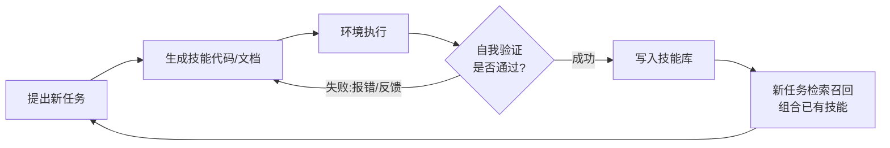
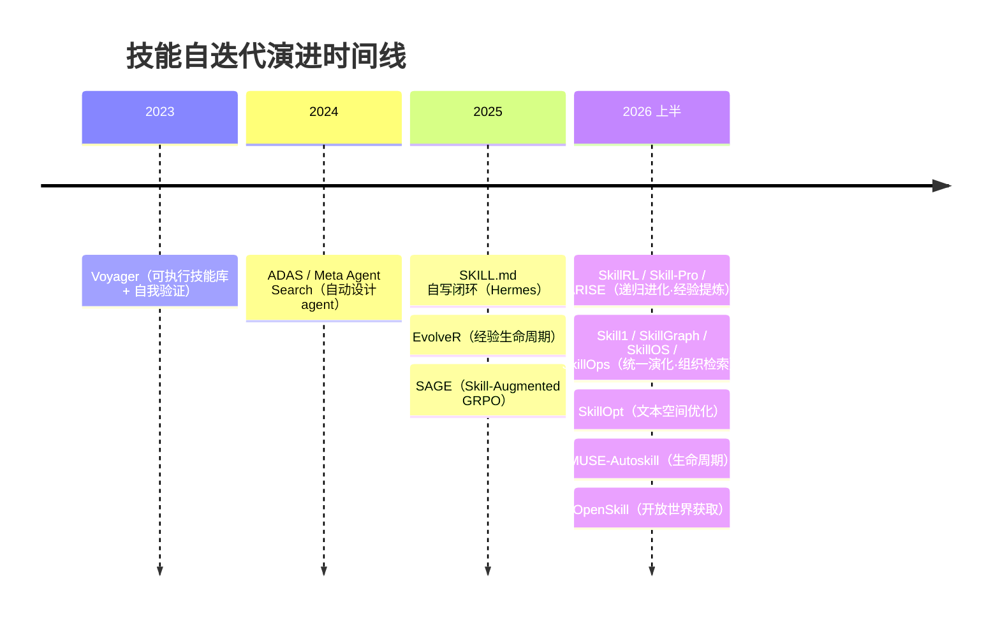

# AutoSkill：技能的自动生成与自迭代

> **一句话**：AutoSkill 关注的是让 agent 自己产生、沉淀、复用、改进 skill——把一次次成功轨迹固化为可复用的程序或文档，再用闭环反馈持续打磨，使能力随运行时间累积而非保持静态。
> 演进脉络：Voyager 2023（arXiv:2305.16291）· ADAS / Meta Agent Search 2024（arXiv:2408.08435）· SKILL.md 自写闭环（Hermes）约 2025 · 2026 起系统化，分化出**经验到 Skill / 递归进化 / 组织与检索 / 生命周期管理 / 文本空间优化**五类范式。

前置阅读：[Agent Skills 体系](/skills/)。本页讨论的是 skill 的"生产者"问题——当 skill 不再由人手写、而是由 agent 在解决任务的过程中自动析出时，该如何设计这套自迭代机制。它与人工撰写 skill（[技能设计与评测](/skills/design)）以及参数化的能力注入（[Skill vs RAG/微调](/skills/vs-rag-finetune)）互为补充。

## 为什么需要自迭代

人工写 skill 的瓶颈很直接：覆盖面有限、跟不上任务分布漂移、难以把"只有跑过才知道的坑"沉淀下来。AutoSkill 的核心论点是——agent 在执行中天然产生大量带反馈的轨迹，这些轨迹里隐含了可复用的过程性知识（procedural knowledge）。如果能把成功轨迹归纳成 skill、把失败轨迹归纳成教训，能力就能随运行时间单调累积，而不必每次都从零推理。这与微调路线的区别在于：技能以**外部化的代码或文档**形式存在，不改动模型权重，因而可解释、可组合、可热插拔，也天然规避了灾难性遗忘。

这一思路最具代表性的早期原型是 [Voyager](https://arxiv.org/abs/2305.16291)（arXiv:2305.16291，2023）：它在 Minecraft 里做开放式终身学习，全程不微调、只黑盒查询 GPT-4，用**自动课程 + 可执行技能库 + 自我验证迭代**三件套，把通过验证的代码技能存入向量库、按语义检索召回组合。其闭环至今仍是这一范式的模板：

要点在于"只有通过验证的技能才入库"——这道闸门保证库的质量，避免噪声轨迹污染后续检索；技能可被后续技能直接调用，则带来组合性，能力呈复利式增长。2023–2025 年，Voyager（代码技能）、SKILL.md 自写闭环（自然语言技能，[Hermes](/agent/frameworks/hermes) 等）、ADAS（自动设计 agent 本身）把"agent 自己写技能"这件事跑通；2026 年起，一批工作开始把它**系统化、工程化**。

## 五类范式：2026 的技能自迭代全景

按"技能从哪来 → 怎么持续演化 → 怎么组织检索 → 怎么全周期管 → 怎么逐字改好"这条生命周期主线，2026 年的工作大致分化为五类。这套划分与 *SoK: Agentic Skills*（arXiv:2602.20867）、*A Comprehensive Survey on Agent Skills*（arXiv:2605.07358）等综述按"表示 / 获取 / 检索 / 演化"梳理技能层的视角一致。它们的共同前提是：把技能当作**冻结模型之外、可演化的外部状态**，差异在于"演化的是哪一环"。

| 类别 | 代表方法 | 核心机制 | 详细 |
| --- | --- | --- | --- |
| **经验到 Skill** | EvolveR · SAGE · Skill-Pro(ProcMEM) · OpenSkill | 从成功/失败轨迹（或开放世界资料）提炼可复用 skill；Skill-Pro 进一步把 skill 结构化为可执行的 procedural memory | [OpenSkill →](/skills/autoskill/openskill) |
| **Skill 递归进化** | SkillRL · Skill1 · ARISE | skill bank 与 agent policy 共同演化；靠失败反馈或 credit signal 持续生成、修正、检索 skill | — |
| **Skill 组织与检索** | SkillGraph · SkillOS · SkillOps | 从 flat skill bank 走向图结构、技能策展（curation）、路由（routing）、技能库工程化 | [SkillOS →](/skills/autoskill/skillos) · [SkillOps →](/skills/autoskill/skillops) |
| **生命周期管理** | MUSE-Autoskill | creation / memory / management / evaluation / refinement，全周期维护 skill | — |
| **文本空间优化** | SkillOpt | 把 skill 文档看成可优化的外部状态，用 validation-gated edit 持续改写 | [SkillOpt →](/skills/autoskill/skillopt) |

一个便于记忆的口诀：**经验到 Skill 管"取"、递归进化管"长"、组织与检索管"理"、生命周期管"养"、文本空间优化管"改"**。下面逐类展开。

### 一、经验到 Skill（从轨迹提炼）

这一类回答"技能从哪来"：把 agent 跑出来的轨迹（乃至开放世界的文档/代码/网页）蒸馏成可复用单元。

- **EvolveR**（[arXiv:2510.16079](https://arxiv.org/abs/2510.16079)，2025-10，浙大 / 上海 AI Lab）：定义一条完整的经验生命周期——在线交互收集轨迹 → 离线自蒸馏（offline self-distillation）把轨迹提炼为抽象的策略性原则库 → 再用 RL 学会把这些原则应用到新任务，使 agent 不是简单模仿历史，而是基于"学到的原则"演化。
- **SAGE**（Skill-Augmented GRPO，[arXiv:2512.17102](https://arxiv.org/abs/2512.17102)）：把技能库系统性地接入 RL，用 Skill-Augmented GRPO 做自演化；在 AppWrold 上以更少交互步数与更少 token 取得更高的场景目标完成率（数字以原文为准）。
- **Skill-Pro / ProcMEM**（[arXiv:2602.01869](https://arxiv.org/abs/2602.01869)，2026-02）：把"被动的情节叙事"形式化为带激活 / 执行 / 终止条件的可执行 Skill（Skill-MDP），并提出 **Non-Parametric PPO**——用语义梯度产候选、用 PPO Gate 做技能验证，在不更新参数、极致内存压缩下保证可复用性。
- **OpenSkill**（[arXiv:2606.06741](https://arxiv.org/abs/2606.06741)，2026-06）：把"获取来源"从自身轨迹推广到**开放世界**——在无人工监督下从文档 / 仓库 / 网页提取知识与验证锚点，合成可迁移技能，并用自建虚拟任务在缺乏标准答案时自我验证。**详见 [OpenSkill 专页](/skills/autoskill/openskill)**。

### 二、Skill 递归进化（技能库与策略共演化）

这一类的特征是：技能库不再是 RL 之外的静态附件，而是**与 agent policy 在训练中一起演化**——靠验证失败或 credit signal 持续生成、修正、检索技能。

- **SkillRL**（[arXiv:2602.08234](https://arxiv.org/abs/2602.08234)，2026-02，aiming-lab）：用经验蒸馏构建层次化 **SkillBank**（成功轨迹→策略模式、失败轨迹→教训；分通用技能与任务特定技能），配自适应检索；其**递归进化机制**让技能库在 RL 中分析验证失败、与策略共同演化（相对原始轨迹存储有显著 token 压缩）。
- **Skill1**（[arXiv:2605.06130](https://arxiv.org/abs/2605.06130)，2026-05）：训练**单一策略统一演化**技能的"选择—使用—蒸馏"三环——所有学习都来自单个任务结果信号，用其低频趋势 credit 选择、高频波动 credit 蒸馏，解决以往只优化生命周期一部分留下的瓶颈；在 ALFWorld 报告约 97.5% 成功率（以原文为准）。
- **ARISE**（[arXiv:2603.16060](https://arxiv.org/abs/2603.16060)）：Agent Reasoning with Intrinsic Skill Evolution，在分层强化学习框架下让技能内生地演化，把推理与技能进化耦合在一起。

### 三、Skill 组织与检索（从 flat bank 到图结构）

当技能数量上千，"扁平技能库 + 向量检索"会遇到冗余、依赖混乱、召回不准的问题。这一类把重心放在**技能库的结构与治理**：图结构、策展、路由、工程化运维。

- **SkillGraph**（[arXiv:2605.12039](https://arxiv.org/abs/2605.12039)，2026-05）：把技能库表示为图，技能间用**前置（prerequisite）/ 增强（enhancement）/ 共现（co-occurrence）**等显式关系相连，支持依赖感知的检索与结构化更新，在多步组合任务上提升复用、减少冗余。
- **SkillOS**（[arXiv:2605.06614](https://arxiv.org/abs/2605.06614)，2026-05，Google / UIUC）：冻结 executor + 可训练 **curator**，用 RL 学习"何时 insert / update / delete 技能"的**策展策略**。**详见 [SkillOS 专页](/skills/autoskill/skillos)**。
- **SkillOps**（[arXiv:2605.13716](https://arxiv.org/abs/2605.13716)，2026-05，Emory）：把技能库当作会"长 bug、会腐化"的软件系统，用 typed Skill Contract + 层次化生态图 + 多维健康度诊断做持续**运维**，且执行期几乎零额外 LLM 调用。**详见 [SkillOps 专页](/skills/autoskill/skillops)**。

> 此外，*Graph-of-Skills*（arXiv:2604.05333）、*SkillDAG*（arXiv:2606.03056）、*GraSP*（arXiv:2604.17870）等也在探索"依赖感知的大规模技能检索 / 组合"，与本类同属一脉。

### 四、生命周期管理（全周期维护）

这一类不偏向某一环，而是把技能当作有**完整生命周期**的工件统一管理：创建 → 记忆 → 组织管理 → 评测 → 精炼。

- **MUSE-Autoskill**（[arXiv:2605.27366](https://arxiv.org/abs/2605.27366)，2026-05）：在统一生命周期下让 agent 按需创建、跨任务存储复用、高效组织选择、并用单元测试与运行时反馈持续精炼技能；通过运行循环内置的 `skill_create` 工具把创建与执行紧耦合，消除"创建—使用"错配，并为每个技能积累技能级记忆。
- 这一范式的**轻量先声**是 [Hermes](/agent/frameworks/hermes) 等的 **SKILL.md 自写闭环**（约 2025）：agent 在解题中持续维护记忆，积累一定工具调用后**暂停反思**，新建或改写一份人类可读的 SKILL.md，循环为"创建 → 使用 → 观察差距 → 改进"。因 agent 自主写文件，工程上通常加一道 **write approval** 闸门——这是无人值守自迭代落地的安全要点。

### 五、文本空间优化（把技能文档当权重改）

前四类关注"要不要这条技能""技能怎么组织"，这一类则把镜头怼到单条技能的**正文措辞**上——把技能文档当作可优化变量，像优化权重一样迭代改写。

- **SkillOpt**（[arXiv:2605.23904](https://arxiv.org/abs/2605.23904)，2026-05，Microsoft）：自称首个系统性、可控的技能**文本空间优化器**——用打分后的 rollout 驱动对技能文档的有界编辑（add/delete/replace），只有留出验证分严格提升才接受修改，部署时零额外推理调用。**详见 [SkillOpt 专页](/skills/autoskill/skillopt)**。
- **相邻路线**：自动 prompt 优化把"喂给模型的指令"当优化对象，代表有 APE（生成并打分候选指令）、OPRO（用 LLM 自身作优化器）、ProTeGi（自然语言"文本梯度"）、DSPy（把 prompt 当可编译程序，用 MIPRO 等优化器调优）；TextGrad / GEPA / EvoSkill 等则是 SkillOpt 在论文中对比的同类文本空间优化方法。更上一层把**agent 结构本身**当优化对象的 ADAS（[arXiv:2408.08435](https://arxiv.org/abs/2408.08435)，2024）则把"复利"思想抬升到了"agent 设计库"层面。

## 演进时间线

## 设计要点与边界

把五类范式抽象出来，自迭代系统反复出现同一段三段式：**从轨迹析出 → 验证/筛选 → 入库/复用**。落地时几个关键决策：

1. **入库/接受闸门**：是先验证再入库（Voyager 的自我验证、Skill-Pro 的 PPO Gate、SkillOpt 的 validation-gated edit）还是先入库再人审（Hermes 的 write approval）。没有闸门，库会被低质技能稀释，检索召回反而拖累表现。
2. **粒度与去重**：技能太细则碎片化、检索噪声大；太粗则复用率低。需要识别"反复出现的成功结构"再抽象为稳定单元，并合并近重复技能——这正是 SkillGraph / SkillOps 这类"组织与检索"工作的着力点。
3. **检索质量**：技能库的价值最终取决于"对的时候召回对的技能"，因此 skill 描述（用于建索引的 metadata）的质量往往比技能正文更决定成败——这点与人工写 skill 的[评测](/skills/design)关注点一致。
4. **演化的是哪一环**：选（策展）、长（与策略共演化）、理（组织检索）、养（生命周期）、改（文本优化）各有侧重，实际系统常组合多环——例如 SkillOpt 产出的工件交给 SkillOS 策展、由 SkillOps 运维。
5. **与 RAG/微调的关系**：自动生成的 skill 仍是"上下文注入"路线，适合快速沉淀显式过程；当某类能力被反复、稳定地用到，将其下沉为微调可能更省 token、更鲁棒。三者权衡见 [Skill vs RAG/微调](/skills/vs-rag-finetune)。

一句话总结：AutoSkill 把"人写一次、agent 用很多次"翻转为"agent 自己写、自己用、自己改"；闭环的质量闸门、技能库的组织检索、以及演化覆盖到哪几环，决定了这种自迭代到底是能力复利还是噪声累积。

## 参考文献

**综述 / 分类**
- *SoK: Agentic Skills — Beyond Tool Use in LLM Agents* — [arXiv:2602.20867](https://arxiv.org/abs/2602.20867)
- *A Comprehensive Survey on Agent Skills: Taxonomy, Techniques, and Applications* — [arXiv:2605.07358](https://arxiv.org/abs/2605.07358)

**经验到 Skill / 递归进化**
- Voyager: An Open-Ended Embodied Agent with Large Language Models — [arXiv:2305.16291](https://arxiv.org/abs/2305.16291) · [项目主页](https://voyager.minedojo.org/) · [GitHub](https://github.com/MineDojo/Voyager)
- EvolveR: Self-Evolving LLM Agents through an Experience-Driven Lifecycle — [arXiv:2510.16079](https://arxiv.org/abs/2510.16079)
- SAGE: Reinforcement Learning for Self-Improving Agent with Skill Library — [arXiv:2512.17102](https://arxiv.org/abs/2512.17102)
- Skill-Pro / ProcMEM: Learning Reusable Skills from Experience via Non-Parametric PPO — [arXiv:2602.01869](https://arxiv.org/abs/2602.01869)
- SkillRL: Evolving Agents via Recursive Skill-Augmented Reinforcement Learning — [arXiv:2602.08234](https://arxiv.org/abs/2602.08234) · [GitHub](https://github.com/aiming-lab/SkillRL)
- Skill1: Unified Evolution of Skill-Augmented Agents via Reinforcement Learning — [arXiv:2605.06130](https://arxiv.org/abs/2605.06130)
- ARISE: Agent Reasoning with Intrinsic Skill Evolution in Hierarchical RL — [arXiv:2603.16060](https://arxiv.org/abs/2603.16060)

**组织与检索 / 生命周期 / 文本优化**
- SkillGraph: Skill-Augmented RL for Agents via Evolving Skill Graphs — [arXiv:2605.12039](https://arxiv.org/abs/2605.12039)
- SkillOS: Learning Skill Curation for Self-Evolving Agents — [arXiv:2605.06614](https://arxiv.org/abs/2605.06614)（[本站专页](/skills/autoskill/skillos)）
- SkillOps: Managing LLM Agent Skill Libraries as Self-Maintaining Software Ecosystems — [arXiv:2605.13716](https://arxiv.org/abs/2605.13716)（[本站专页](/skills/autoskill/skillops)）
- MUSE-Autoskill: Self-Evolving Agents via Skill Creation, Memory, Management, and Evaluation — [arXiv:2605.27366](https://arxiv.org/abs/2605.27366)
- SkillOpt: Executive Strategy for Self-Evolving Agent Skills — [arXiv:2605.23904](https://arxiv.org/abs/2605.23904)（[本站专页](/skills/autoskill/skillopt)）
- OpenSkill: Open-World Self-Evolution for LLM Agents — [arXiv:2606.06741](https://arxiv.org/abs/2606.06741)（[本站专页](/skills/autoskill/openskill)）

**基础范式**
- Automated Design of Agentic Systems (ADAS / Meta Agent Search) — [arXiv:2408.08435](https://arxiv.org/abs/2408.08435)
- Hermes Agent Skills System（自写 SKILL.md 闭环）— [官方文档](https://hermes-agent.nousresearch.com/docs/user-guide/features/skills) · [GitHub](https://github.com/NousResearch/hermes-agent)
- 自动 prompt 优化综述视角 — [Automatic Prompt Optimization, Cameron R. Wolfe](https://cameronrwolfe.substack.com/p/automatic-prompt-optimization) · [DSPy](https://github.com/stanfordnlp/dspy)
