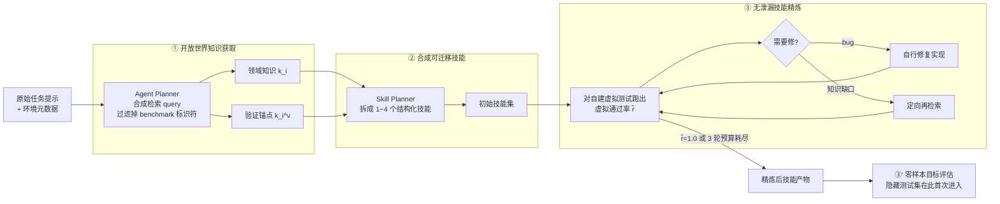

# OpenSkill：开放世界中的技能自演化

> **一句话**：OpenSkill 关注在没有人工标注、没有 curated 技能库、没有成功轨迹、也没有现成 verifier 信号的**开放世界**里，agent 如何只凭任务提示就完成自演化——它从文档、代码仓库、网页里自动抓取"领域知识 + 验证锚点（verification anchor）"，把它们合成为**可跨模型迁移**的技能，再用自建的虚拟任务在缺乏标准答案的条件下自我验证、自我打磨。
> 提出年份：2026（arXiv:2606.06741，2026-06）· 机构：Lehigh / UIC 等 · 作者：Zhiling Yan, Lichao Sun, Philip S. Yu 等
> 前置阅读：[AutoSkill 总览](/skills/autoskill/) · [SkillOS](/skills/autoskill/skillos) · [Deep Research](/agent/deep-research/)

## 问题：自演化通常需要的监督，开放世界里没有

[AutoSkill 总览](/skills/autoskill/) 里反复出现的三段式是"从轨迹析出 → 验证/筛选 → 入库/复用"。无论是 Voyager 的自我验证、还是 SkillOS 的策展式 RL，背后都隐含一套**学习基础设施**：要么有 curated 的技能/示例，要么有成功轨迹可归纳，要么有一个能给出对错信号的 verifier（哪怕是环境返回的 reward）。

但真实部署场景往往什么都没有。OpenSkill 把约束推到极致——它假设运行时手上只有**原始任务提示（raw task prompts）**，没有 curated skills、没有 successful trajectories、也没有 verifier signals。在这种"开放世界"里，前面那些自演化范式的闸门全都失灵：没有标准答案，agent 凭什么判断自己产出的技能是对的？这正是 OpenSkill 要回答的核心问题。

直接用目标任务的答案去监督是不可行的，因为评测的隐藏测试集本就不该被 agent 看到；而如果让 agent 反向去"猜"隐藏测试，又会变成对评测的过拟合（reverse-engineering hidden supervision）。OpenSkill 的破局思路是：**把"验证"这件事从目标答案上解耦出来**，改为锚定在开放世界里那些独立可查、与具体任务答案无关的客观事实上。

## 核心闭环：acquire → synthesize → refine

OpenSkill 是一条三阶段流水线，前两阶段在"无目标监督"下完成，隐藏测试集**只在最后一步评估时才进入**。

**① Acquire（开放世界知识获取）**。一个 Agent Planner 从任务指令与环境元数据中合成研究 query，并显式过滤掉 benchmark 标识符以**防止答案泄漏**。检索同时产出两类东西：一般领域知识 \(k_i\)，以及关键的**验证锚点** \(k_i^v\)。随后 Skill Planner 把这些知识拆解为 1~4 个结构化技能。

**② Synthesize（合成可迁移技能）**。基座 agent 把获取到的知识合成为初始技能集，目标可写作 \(\hat{S}_i = f(I_i, E_i, K)\)，即由指令 \(I_i\)、环境 \(E_i\) 和知识 \(K\) 产出技能。注意技能被刻意做成**与具体模型无关**的产物，这是后面跨模型迁移的前提。

**③ Refine（用自建虚拟任务精炼）**。技能集对自生成的虚拟测试套件反复迭代，用**虚拟通过率（virtual pass rate）** \(\tilde{r}\) 作为质量代理：

$$\tilde{r}^{(j)} = \frac{1}{|\tilde{T}_i|} \sum_k \tilde{t}_{i,k}\big(\pi_\theta(\cdots)\big)$$

当需要改进时，一个诊断分类器（Gap-vs-Bug）判定失败到底来自实现 bug（标为 SELF-FIXABLE，自行修复）还是知识缺口（标为 NEEDS-DR，触发定向再检索）。循环在 \(\tilde{r}=1.0\) 或耗尽 3 轮预算时终止。

## 为什么"验证锚点"和"无标准答案也能验证"是关键

整套设计的支点是 **verification anchor**。论文把它定义为"可独立验证、供后续质量评估使用的锚点"，具体形式包括：官方文档里的参考数值、知名数据集的统计不变量（statistical invariants）、领域标准里的交叉验证流程、以及库函数文档规定的预期输出格式。举几个直白的例子——某个公开数据集**已知的行数**、某个标准指标的**取值范围**、某个库函数**文档规定的输出格式**。

这些锚点的共同特征是：它们独立于目标任务的答案，却足以约束一个正确解必须满足的客观性质。基于锚点，一个 **Independent Verifier**（隔离的、独立的 LLM 会话）要么按任务规则独立重算出期望值，要么直接从检索到的锚点取值，最终产出一份 **pytest 形式的确定性相等断言脚本**。

之所以坚持"grounded 在锚点而非目标答案"，是因为这同时满足两个看似矛盾的要求：既**避免了反向工程隐藏测试监督**（agent 拿不到也不去猜标准答案），又能提供**有意义的质量信号**（断言来自客观事实）。这就是开放世界自演化能成立的根本——把验证从"对答案"转成"对客观锚点"。

## 跨模型迁移与 verifier 对齐的实验结论

OpenSkill 在三个 benchmark 上评估：**SkillsBench**（覆盖 Software、Office、Science、Media、Cybersecurity、Finance、Robotics、Energy、Manufacturing、Health、Math 共 11 个任务域）、**SocialMaze**（六个社会推理子任务）、**ScienceWorld**（交互式科学实验环境）。论文报告它在 no-supervision 约束下取得了三个 benchmark 上最优的自动化通过率。

两条结论尤其值得工程师关注：

- **技能可跨模型迁移**。把生成的技能部署到四个不同的目标模型（Haiku 4.5、Qwen 3 Coder、DeepSeek V3、Mistral Large 3）上，无需针对模型做适配，OpenSkill 技能在全部目标模型上都拿到最高 reward，相对 no-skill 基线提升 **5.5%~14.8 个百分点**。在 SkillsBench 上，OpenSkill 跨目标 agent 达到 43.6%~42.1%，已逼近人类专家技能的 44.5%~44.8%。

- **自建 verifier 与 ground-truth 对齐**。尽管虚拟 verifier **从未接触过**真实答案，它与 ground-truth 结果显著相关：精确率 56.9%、召回率 80.5%、总体一致率 60.7%，统计关联显著（p=0.035）；更说明问题的是覆盖度分析——它覆盖了 **88.9% 的真实测试意图**（135 个里命中 120 个）。换句话说，锚定客观事实自建出来的验证，确实能在没有标准答案时大体捕捉到"什么算对"。

## 与 SkillOS / SkillOpt / SkillOps 的差异：差在"获取"

放回 [AutoSkill](/skills/autoskill/) 的版图里，几条路线分工不同：

| 路线 | 重心 | 一句话 |
| --- | --- | --- |
| [SkillOS](/skills/autoskill/skillos) | 策展（curation） | 用 RL 决定哪些技能值得留、怎么组织检索 |
| [SkillOpt](/skills/autoskill/skillopt) | 优化（optimization） | 把技能当作可优化对象（乃至等价于权重）去调 |
| [SkillOps](/skills/autoskill/skillops) | 运维（ops） | 技能库的工程化：版本、去重、监控、热插拔 |
| **OpenSkill** | **获取（acquisition）** | **从开放世界自动取到知识 + 验证锚点，再合成技能** |

差异点很清楚：SkillOS/SkillOpt/SkillOps 大体都假设"技能或其原料已经在手上"，工作集中在筛、调、管；而 OpenSkill 把问题前移到了**源头**——当一个 agent 连 curated 技能、成功轨迹、verifier 信号都没有时，如何**从开放世界（文档 / 代码仓库 / 网页）凭空获取**出可用的知识与验证依据。它和 [Deep Research](/agent/deep-research/) 是近亲：都依赖主动检索式的信息获取，区别在于 OpenSkill 的检索产物最终要被固化成可执行、可迁移、可自验证的技能，而不是一份报告。

## 参考文献

- OpenSkill: Open-World Self-Evolution for LLM Agents — [arXiv:2606.06741](https://arxiv.org/abs/2606.06741)（2026-06）· 作者：Zhiling Yan, Dingjie Song, Hanrong Zhang, Wei Liang, Yuxuan Zhang, Yutong Dai, Lifang He, Philip S. Yu, Ran Xu, Xiang Li, Lichao Sun · 代码：GitHub `OpenLAIR/OpenSkill`
- 相关阅读：[AutoSkill 总览](/skills/autoskill/) · [SkillOS](/skills/autoskill/skillos) · [SkillOpt](/skills/autoskill/skillopt) · [SkillOps](/skills/autoskill/skillops) · [Deep Research](/agent/deep-research/)
