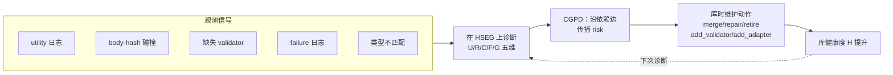

# SkillOps：把技能库当作可自维护的软件生态

> **一句话**：SkillOps 把 agent 的技能库当成一套会"长 bug、会腐化"的软件系统——技能随增删改、复用、打补丁、依赖漂移而累积"skill technical debt"，于是用 typed Skill Contract 把每个技能写成可检查的契约、用 Hierarchical Skill Ecosystem Graph 把整库组织成图、再从 utility / compatibility / risk / validation 等维度持续诊断库的健康度并自动修复。它给 skill 生命周期补上了一个长期缺位的"运维 / SRE"视角。
> 提出年份：2026（arXiv:2605.13716，2026-05）· 机构：Emory 等 · 作者：Hongji Pu, Xinyuan Song, Liang Zhao
> 前置阅读：[AutoSkill 总览](/skills/autoskill/) · [SkillOS](/skills/autoskill/skillos) · [SkillOpt](/skills/autoskill/skillopt)

[AutoSkill 总览](/skills/autoskill/) 讨论的是技能怎么被"生产"出来——agent 从轨迹里自动析出、验证、入库、复用。但生产只是开始：一个长期运行的 agent，其技能库会像任何活的代码仓库一样不断被增删改。SkillOps 关心的正是这之后的问题——**库本身会随时间腐化，谁来运维它？**

## 一、问题：技能库也会累积技术债

软件工程里有个朴素观察：代码不会因为写完就静止，它会随需求变更、依赖升级、补丁叠加而积累"技术债"。SkillOps 把这套直觉原样搬到技能库上，提出 **skill technical debt（技能技术债）** 这一概念：当 agent 不断添加新技能、复用旧技能、给坏掉的技能打补丁、上游依赖发生变化时，库层面会沉淀出一类**库级缺陷**。典型表现包括：

- 大量低价值技能膨胀检索池，把"对的技能"挤出召回；
- 近重复（near-duplicate）技能彼此竞争，降低检索精度；
- 技能间接口类型不匹配，组合时悄悄断链；
- 运行时已经损坏（empirical failure 高）的技能仍留在库里；
- 技能缺少验证器（validator），错误产物无人拦截，沿依赖链向下游传播。

关键在于：这些都不是单个技能"写错了"，而是**库作为一个整体随演化而退化**——这正对应软件里"单个函数没问题、但系统腐化了"的场景。既然类比成立，治理手段也可以照搬：把每个技能写成可静态检查的契约，把整库建成可分析的图，再定期跑诊断与自动修复。

## 二、核心抽象：Skill Contract 与生态图

**typed Skill Contract（带类型的技能契约）**。SkillOps 把每个技能 $s \in \mathcal{S}$ 写成一个五元组：

$$s = (P, O, A, V, F)$$

- **P（Preconditions）**：调用前必须满足的前置条件；
- **O（Operation）**：可执行的操作过程本身；
- **A（Artifact）**：技能产出的**带类型**产物；
- **V（Validator）**：对产物 A 的正确性检查；当 $V=\varnothing$ 时即代表一个"验证缺口（validation gap）"；
- **F（Failure modes）**：已知失败模式。

这层抽象的价值在于：技能不再是一段不透明的代码或文档，而是一份可机读、可静态检查的契约——相关性、可用性、可组合性、本地可验证性都能直接从契约结构上判断，而**不必真的把技能跑一遍**。

**Hierarchical Skill Ecosystem Graph（HSEG，分层技能生态图）**。SkillOps 用两层图组织整库：

- **外层 Graph-of-Graphs**：把技能之间用四类带类型的关系连成图——依赖（$\to_{\text{dep}}$，技能 $i$ 的产物满足技能 $j$ 的前置）、兼容（$\to_{\text{comp}}$，$i$ 的输出类型匹配 $j$ 的输入类型）、冗余（$\to_{\text{red}}$，暴露等价接口）、替代（$\to_{\text{alt}}$，同目标不同实现）。
- **内层 Skill Graph**：每个技能本身又是一张在 $(P,O,A,V,F)$ 五个组件上的契约图。

把库表示成图之后，"诊断库健康度"就变成了"在图上跑分析"——这是 SkillOps 区别于纯启发式清理的关键。

## 三、健康度诊断的几个维度

SkillOps 给每个技能打几个 $[0,1]$ 区间的可观测分数，再聚合成全库健康度。论文给出的维度包括：

- **Utility $U(s)$**：近期任务调用中"成功用到 $s$"的比例——抓低价值技能；
- **Redundancy $R(s)$**：$s$ 所在最大 $\to_{\text{red}}$ 簇的归一化规模——抓近重复；
- **Compatibility $C(s)$**：与 $s$ 相连的依赖边中同时也是兼容边的比例——抓接口错配；
- **Failure-Risk $F(s)$**：$s$ 的经验失败率——抓运行时已损坏、需修复的技能；
- **Validation-Gap $G(s)$**：即 $\mathbf{1}[V_s=\varnothing]$——抓缺验证器的技能。

全库健康度大致是各维度的加权平均（论文用均匀权重）：

$$H(\mathcal{L}) = \frac{1}{|\mathcal{S}|}\sum_{s}\big(w_U\,U(s) + w_R\,(1-R(s)) + \dots\big)$$

诊断之上还有一层 **ContractGraph-Propagated Diagnosis（CGPD）**：风险不只看本地，还沿依赖边传播——

$$R^{(t+1)}(s) = (1-\alpha)\,R_{\text{loc}}(s) + \alpha\cdot \max_{s'} R^{(t)}(s')$$

这样一来，**上游技能高风险会"传染"下游**，系统得以在故障真正发生前，就抢先给受影响的技能插入验证器。诊断完成后，库时（library-time）维护循环执行一组带类型的修复动作：`merge`（合并冗余对）、`repair`（用执行反馈重写 $O_s$）、`retire`（退役长期失败/过时技能）、`add_validator`（补 $V$）、`add_adapter`（给不兼容接口插类型转换 shim）、`instantiate`（给参数化技能绑定具体参数）。

## 四、为什么"执行期几乎零额外 LLM 调用"是卖点

很多"让 agent 自我反思 / 自我诊断"的方案，本质是在任务执行链路里再塞一轮甚至多轮 LLM 调用——延迟和 token 成本都直接转嫁到每一次任务上。SkillOps 刻意避开了这条路：

它的诊断**靠可观测信号而非 LLM 判断**——utility 日志、body-hash 碰撞（查近重复）、缺失的 validator、failure 日志、类型不匹配，这些都是规则可读的结构化信号。因此**任务时（task-time）执行不增加任何额外 LLM 调用**。

诊断与维护被推迟到与任务解耦的"库时"批处理里，且这套规则版维护循环本身 LLM 成本也极低——论文报告，在 $N=2000$ 规模下，跑一次完整维护更新只用约 9 次 LLM 调用、约 10.8K token，而这点开销会被随后大量下游任务**摊薄**。

这对工程落地很关键：长期运行的 agent 最怕"为了维护库而拖慢每一次推理"。SkillOps 把维护成本从"每任务在线开销"挪成"周期性离线开销"，等于把技能库的治理做成了一个可以半夜跑的运维任务，而非任务链路上的负担。

## 五、实验（数字均来自论文）

SkillOps 在 **ALFWorld** 上评测，使用约 229 个 SkillsBench 技能，库规模从 200 扩到 2000，每个 seed 约 185 个任务实例、三个独立 seed。两种用法：

- **作为独立 agent**：成功率达 **79.5%**，对比最强 baseline `LLM_Skill_Planner` 的 **70.6%**。论文摘要表述为高出 **8.8 个百分点**，正文 / 表格给出的精确值为 **+8.9 pp**（79.5 − 70.6），且这一提升伴随**零额外推理调用**——两个数字略有出入，此处如实保留，以论文为准。
- **作为插件层**：把 SkillOps 作为维护层叠加到已有检索式 agent 上时，提升约 **+0.68 ~ +2.90 pp**（如 Hybrid Retrieval +2.90 pp、Dense +1.12 pp、BM25 +1.00 pp）。
- **可扩展性 / 抗退化**：在注入退化的压力测试下系统保持稳定，2000 技能规模仍维持约 **80.5%** 成功率，而纯检索 baseline 在噪声增大时显著退化。

值得注意的是后两点：插件增益说明 SkillOps 是 **method-agnostic 的可叠加层**，不要求你换掉现有检索 / 规划方法；抗退化曲线则正面印证了"技术债"叙事——当库被故意污染、规模拉大时，没有维护的库会塌，而做了运维的库扛得住。

## 六、与 SkillOS / SkillOpt / OpenSkill 的视角差异

把同一族工作摆在一起，差异在于它们各自盯着技能生命周期的哪一段：

- **OpenSkill：开放世界获取**——解决"技能从哪来"，在开放环境里持续发现 / 习得新能力；
- **[SkillOpt](/skills/autoskill/skillopt)：优化**——解决"单个技能怎么更好"，对已有技能做参数 / 实现层面的打磨；
- **[SkillOS](/skills/autoskill/skillos)：策展**——解决"库怎么组织、怎么调度"，偏运行时的编排与策展；
- **SkillOps：运维**——解决"库怎么不腐化"，把整库当软件生态做持续诊断与修复。

一个有用的对照是软件团队：OpenSkill 像"招新功能需求"，SkillOpt 像"重构某个模块"，SkillOS 像"产品 / 架构编排"，而 SkillOps 就是那个**跑 CI、看监控、修线上、还技术债的 SRE**。四者互补——能获取、能优化、能编排，但只要库在长期演化，就总需要有人做运维。

## 参考文献

- SkillOps: Managing LLM Agent Skill Libraries as Self-Maintaining Software Ecosystems — [arXiv:2605.13716](https://arxiv.org/abs/2605.13716)（Hongji Pu, Xinyuan Song, Liang Zhao，2026-05）
- 前置：[AutoSkill 总览](/skills/autoskill/) · [SkillOS](/skills/autoskill/skillos) · [SkillOpt](/skills/autoskill/skillopt)
