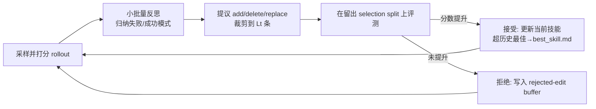

# SkillOpt：把技能当权重来优化

> **一句话**：SkillOpt 把一份"技能文档"当作冻结 agent 的**外部可训练状态**——由一个独立的优化器模型读取打分后的 rollout，对技能文档做有界（bounded）的增/删/改编辑，并且只有当编辑严格提升了留出验证分时才被接受，从而把权重空间优化的那套纪律（学习率、择优、回退）原样搬到自然语言技能上。
> 提出年份：2026（arXiv:2605.23904，2026-05）· 机构：Microsoft · 作者：Bei Liu, Dongdong Chen, Chong Luo 等
> 前置阅读：[AutoSkill 总览](/skills/autoskill/) · [SkillOS](/skills/autoskill/skillos) · [Agentic RL](/agent/agentic-rl/)

## 一、问题：人写技能 / 一次性生成技能为什么不够

论文的出发点是对当前技能（agent skill）三种来源的批评：**人工手写**、**LLM 一次性生成（one-shot）**、以及**松散自改写的演化（loosely controlled self-revision）**。它指出这三者都有同一个根本缺陷——没有一个像深度学习优化器那样对待技能，因而**都不能保证在反馈下相对初始版本可靠地变好**。

这正是 [AutoSkill](/skills/autoskill/) 那一类自迭代方法的痛点所在：Voyager 靠自我验证入库、Hermes 靠定期反思改写 SKILL.md，闸门确实存在，但改写步幅、改写是否真的让整体变好，缺乏一个权重优化那样的可复现约束。SkillOpt 的主张是：技能应当被当作冻结 agent 的**外部状态来"训练"**，用让权重空间优化可复现的同一套纪律去管它。

## 二、核心思想：技能即可优化文本，"executive strategy"是什么

SkillOpt 自称是**首个系统性的、可控的技能文本空间优化器**（first systematic controllable text-space optimizer for agent skills，此为论文原话）。它的关键约束是：**目标模型保持冻结**，被优化的只有一份单一的技能文档（skill document）。部署时这套机制**不增加任何推理时的额外模型调用**——优化只发生在训练阶段，上线后就是一份静态文档。

所谓 executive strategy（执行式策略），可以理解为它把技能优化做成一个有纪律的"propose-and-test"闭环：优化器**提议**有界编辑，验证闸门**裁决**是否接受，再辅以学习率预算、拒绝缓冲、慢速/元更新等机制保证训练稳定。它和"让 agent 自由改写自己的技能"最大的区别，就在于每一步改动都受预算约束、且都要过验证分这一关。

## 三、方法：打分 rollout → 有界文本编辑 → 验证择优接受

论文中优化器模型一轮更新大致包含以下环节（数值为论文给出的默认设置）：

1. **小批量反思（minibatch reflection）**：把成功与失败的 rollout 分开，各自切成小批量（默认 size 8），归纳**反复出现的模式**而不是针对单条轨迹打补丁。
2. **编辑提议（edit proposal）**：生成结构化的 add / delete / replace 操作，在修补常见失败模式的同时保留已经奏效的过程。
3. **分层合并（hierarchical merging）**：把"失败驱动"与"成功驱动"的编辑分别归并，再合并，并以纠错优先。
4. **有界选择（bounded selection）**：按预期效用对合并后的编辑池排序，并裁剪到学习率预算之内（论文：clips it to the top $L_t$ edits）。

这里的 $L_t$ 就是**文本学习率（textual learning rate）**——每一步最多施加的编辑条数。论文支持 constant / linear / cosine / autonomous 等多种调度，默认用从 4 衰减到 2 的 cosine 调度（默认每步约 4 条编辑）。

**验证择优接受**是整个机制的闸门：每个候选技能都在一个留出的 selection split 上评测。论文规则原文是——若候选分高于当前 selection 分，则它成为新的当前技能；若还超过历史最佳，则写入 `best_skill.md`；否则**拒绝**。形式化地说，设 $S(\cdot)$ 为留出验证分，候选 $s'$ 仅当 $S(s') > S(s_{\text{cur}})$ 时被接受，这与"只有降低验证损失才更新"的优化器纪律同构。

围绕这个闸门，论文还加了三件让训练稳定的部件：

- **拒绝编辑缓冲（rejected-edit buffer）**：epoch 内本地缓冲被拒的编辑及其分数影响，喂给本 epoch 后续的反思调用，让优化器避免重复犯同样的错、专注未解决的失败。
- **epoch 级慢速 / 元更新（slow/meta update）**：epoch 末尾，用上一 epoch 与当前 epoch 的技能在同一批训练样本上对照，分成改进 / 回退 / 持续失败 / 稳定成功几类，把"纵向指引（longitudinal guidance）"写入一个受验证闸门保护的区域；优化器侧还维护一份**永不部署的 meta skill**，把模式总结进未来的反思提示。

## 四、与 TextGrad / GEPA / EvoSkill / Trace2Skill 的关系

SkillOpt 属于"文本空间优化"这一大家族，但定位不同：

- **TextGrad / GEPA（prompt 优化）**：它们优化的是 prompt 本身，缺少把改动当作持久工件、并逐步用留出数据做闸门的迭代约束。SkillOpt 优化的是一份**持久技能文档**，且每一步都过验证闸门。
- **EvoSkill（技能演化）**：论文以 GPT-5.5 + Codex 的 SpreadsheetBench 为例，EvoSkill 相对无技能基线 +40.0 分，SkillOpt 在其之上再 +17.5 分（67.5 → 85.0），差距归因于 SkillOpt 的有界文本学习与拒绝编辑记忆。
- **Trace2Skill（轨迹蒸馏）**：它从轨迹挖掘经验但**不做验证**；SkillOpt 让所有编辑都过留出性能闸门，防止有害提议累积。

一句话归纳差异：同样是在不动权重的前提下改"文本"，SkillOpt 把**有界步幅 + 验证择优 + 拒绝记忆**三件事一起做齐，这正是它对标"优化器纪律"的地方。文本空间优化的更广脉络可参见 [AutoSkill 总览](/skills/autoskill/) 中对 ProTeGi / OPRO / DSPy 等的梳理。

## 五、实验与结论（数字均来自论文）

论文的评测覆盖 **6 个 benchmark × 7 个目标模型 × 3 个执行 harness**：

- benchmark：SearchQA、SpreadsheetBench、OfficeQA、DocVQA、LiveMathematicianBench、ALFWorld；
- 目标模型：GPT-5.5、GPT-5.4、GPT-5.4-mini、GPT-5.4-nano、GPT-5.2、Qwen3.5-4B、Qwen3.6-35B-A3B；
- harness：direct chat（单次 system-prompt 调用）、Codex、Claude Code。

主要结论（论文数据）：

- 在全部 **52 个 (model, benchmark, harness) 评测单元上取得最佳或并列最佳**，并在逐单元对比中胜过 human、one-shot LLM、Trace2Skill、TextGrad、GEPA、EvoSkill 等所有技能来源；相对"逐单元挑最优方法"的 oracle 还要再高约 +5.4 分。
- 在 **GPT-5.5** 上，相对无技能基线的平均提升：direct chat **+23.5** 分、Codex 内 **+24.8** 分、Claude Code 内 **+19.1** 分。
- 学到的技能工件长度在 379–1,995 token 之间；六个 benchmark 各自只需 1–4 条被接受的编辑就能取得 +9.6 到 +39.0 分的提升。导出的 `best_skill.md` 记录的是**过程性规则**（如"先检查工作簿结构"）而非样本特定指令，因而可跨模型、跨 harness 迁移。

## 六、与 SkillOS（策展）、SkillOps（运维）的分工

把技能体系拆成三层来看更清楚，SkillOpt 只负责其中"训练"这一环：

- **SkillOpt（优化）**：在反馈下把一份技能文档**优化得更好**——对应本文的打分→编辑→验证闭环。
- **[SkillOS](/skills/autoskill/skillos)（策展）**：技能的组织、检索、版本与组合，决定"什么时候召回哪份技能"。
- **SkillOps（运维）**：技能上线后的部署、监控、回滚与生命周期管理。

SkillOpt 产出的 `best_skill.md` 正是交给 SkillOS 策展、由 SkillOps 运维的那份工件；三者合起来才构成"生产—组织—运营"的完整技能闭环。其与微调、RAG 等参数化能力注入路线的权衡，见 [Skill vs RAG/微调](/skills/vs-rag-finetune)。

## 七、参考文献

- SkillOpt: Executive Strategy for Self-Evolving Agent Skills — [arXiv:2605.23904](https://arxiv.org/abs/2605.23904)（2026-05，Microsoft）
- 文本空间 / prompt 优化相邻工作：TextGrad、GEPA、OPRO、ProTeGi、DSPy（综述视角见 [AutoSkill 总览](/skills/autoskill/)）
- 技能自迭代范式对照：Voyager — [arXiv:2305.16291](https://arxiv.org/abs/2305.16291)；ADAS / Meta Agent Search — [arXiv:2408.08435](https://arxiv.org/abs/2408.08435)
