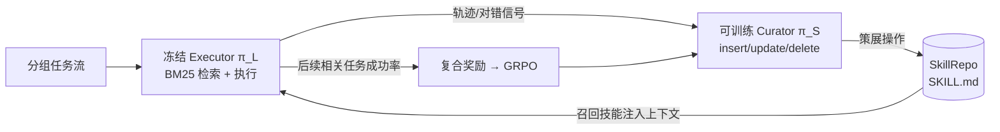

# SkillOS：自演化 agent 的技能策展

> **一句话**：SkillOS 把"会不会用技能"和"该往技能库里写什么"拆成两个角色——冻结一个负责检索与执行的 executor，单独训练一个 curator，用强化学习去学一套对外部技能库（SkillRepo）的"策展"策略，让技能随交互流不断演化。
> 提出年份：2026（arXiv:2605.06614，2026-05）· 机构：Google / UIUC 等 · 作者：Siru Ouyang, Jun Yan, Yanfei Chen, Rujun Han, Zifeng Wang, Jiawei Han, Tomas Pfister, Chen-Yu Lee 等
> 前置阅读：[AutoSkill 总览](/skills/autoskill/) · [Agent Skills 体系](/skills/) · [Agentic RL](/agent/agentic-rl/)

## 一、它解决什么问题

当下大多数 LLM agent 在面对流式到来的任务时，仍然是**一次性求解器（one-off problem solver）**：每个任务从零开始推理，解完即弃，无法把上一题踩过的坑沉淀给下一题。可复用技能本是自演化的天然载体，但论文指出，真正的瓶颈不在"能不能产生技能"，而在**高质量的技能策展（skill curation）**——决定何时新增、何时改写、何时删除，以及让整个库随时间保持精炼而非膨胀。

已有方案在这件事上各有短板：要么依赖**人工策展**，要么写死**启发式的技能操作规则**，要么只针对**短时程（short-horizon）**的单步技能操作做训练。它们共同的困难是——策展的回报是**间接且延迟的**：你现在往库里写的一条技能，价值要等到后续某个相关任务被它救下来才体现。这种长时程、稀疏、延迟的信用分配，恰恰是启发式和短时程训练学不动的，也正是 SkillOS 用 RL 想啃下的核心。

## 二、核心思路：executor / curator 分工 + 技能库作为外部可演化存储

SkillOS 是一个**经验驱动的 RL 训练配方**，把系统拆成两个解耦的策略：

- **冻结的 executor $\pi_{\mathcal{L}}$**：用 BM25 从 SkillRepo 检索相关技能，再以"任务 + 环境状态 + 召回技能"为条件采样动作完成任务。它**不参与训练**——这保证学到的策展能力是模型无关的，而非被某个 executor 的偏好绑死。
- **可训练的 curator $\pi_{\mathcal{S}}$**：观察执行轨迹、对错信号、被召回的技能，然后生成结构化的策展操作——`insert_skill` / `update_skill` / `delete_skill`，对外部的 **SkillRepo** 进行增删改。

技能本身采用 **SKILL.md 格式**，与 [Agent Skills 体系](/skills/) 一脉相承：(i) **YAML frontmatter** 给出技能名与"何时该用"的自然语言描述（这部分进检索索引），(ii) **Markdown 正文**承载可执行知识与启发式。这种纯文本表示天然支持版本管理与人工审计。

闭环的关键在于：**早期轨迹更新 SkillRepo，后续相关任务用来评估这次更新到底有没有用**——这把"策展质量"翻译成了可优化的奖励信号。

## 三、方法细节：curator 怎么被训练，技能怎么演化

**分组任务流（grouped task streams）。** SkillOS 不在孤立任务上训练，而是构造"一组相关任务顺序求解"的训练实例。论文用 Gemini-2.5-Pro 给任务标注技能相关属性，再据此把任务划分成组：组内**靠前的经验所析出的技能，由后续相关任务能否被它解出来检验**。这正是把策展奠基在长期效用上的机制设计。

**复合奖励（composite reward）。** 单一的"任务成功"信号太稀疏，论文把奖励拆成四路加权组合：

1. **任务结果**——对组内剩余任务的平均成功率，$r^{\text{task}} = \frac{1}{|G|-1}\sum_{i=2}^{|G|}\mathbb{1}(\xi_i)$，衡量这次策展对后续任务的真实增益；
2. **函数调用有效性**——策展操作中能合法执行成功的比例；
3. **内容质量**——用 LLM-as-Judge（论文用 Qwen3-32B）给技能写得好不好打分；
4. **压缩项**——$r^{\text{comp}} = \frac{1}{|G|}\sum_i\left(1 - |\mathcal{S}_i|/|\chi_i|\right)$，鼓励精简、抑制库膨胀。

各路以超参加权（论文给出 $\lambda_f=1.0,\ \lambda_u=0.1,\ \lambda_c=0.05$）。

**RL 算法。** curator 用 **GRPO** 优化：对每组任务做 $N$ 次独立 rollout，优势用组内均值作基线 $A^n = r^n - \frac{1}{N}\sum_{n'=1}^{N} r^{n'}$，再套裁剪代理目标 $\mathcal{L}=\mathbb{E}_n\big[\min(\rho^n A^n,\ \mathrm{clip}(\rho^n, 1-\epsilon, 1+\epsilon)A^n)\big]$。实现上 curator 与训练用 executor 均基于 Qwen3-8B，用 verl 框架在 16 张 H100 上训练（ALFWorld 约 3 天、推理任务 2.5 天、WebShop 5 天）。

**技能如何演化。** 论文的定性分析指出：训练后的 curator 带来**更有针对性的技能使用**，而 SkillRepo 里的技能会随时间**演化成结构更丰富的 Markdown 文件，编码出更高层的"元技能"（meta-skills）**——即不再是零散步骤记录，而是被组织、抽象、提炼过的可复用知识。

## 四、实验与结论

覆盖**多轮 agentic 任务**（ALFWorld 家务、WebShop 购物模拟）与**单轮推理任务**（AIME24/25、GPQA-Diamond，训练数据取自 DeepMath-103k）。基线含无记忆（No Memory）、强记忆方法 ReasoningBank 与 MemP，以及未训练的 SkillOS-base、用 Gemini-2.5-Pro 当 curator 的 SkillOS-gemini。论文报告的真实结论：

- **一致优于 memory-free 与强 memory-based 基线**，在效果与效率上都更好。ALFWorld（Qwen3-8B executor）平均成功率 61.2，高于 ReasoningBank 的 55.7，同时把平均步数从 21.0 降到 18.9（约 10% 的效率提升）。WebShop 上得分 40.6 对 MemP 的 35.7。推理任务三数据集平均 79.7% 对 MemP 的 69.1%。
- **跨 executor 泛化**：curator 只用 Qwen3-8B 训练，却能把 Gemini-2.5-Pro 在 ALFWorld 的平均成功率从 66.4 提升到 80.2——说明学到的是与 executor 无关的策展策略。
- **跨域泛化**：同一套训练配方在 agentic 与 reasoning 两类任务上都成立；但论文也观察到**agentic 任务的增益明显大于推理任务**，提示过程性技能在序列动作任务里比抽象推理启发式更易复用。

> 数字均引自 arXiv:2605.06614 论文报告，不同设置下的完整表格以原文为准。

## 五、与本库其它工作的关系

放进 [AutoSkill](/skills/autoskill/) 的谱系里看，SkillOS 给出的是**"策展即被学习的 RL 策略"**这一独特切面，与几条相邻路线对比一句话即可点出差异：

- 对 [SkillOpt（技能即权重优化）](/skills/autoskill/skillopt)：SkillOpt 走"优化"视角，把能力下沉进参数；SkillOS 坚持技能停留在**外部可审计的文本**，只学如何管理它。
- 对 [SkillOps（技能库工程化运维）](/skills/autoskill/skillops)：SkillOps 是"运维"视角，关注库的工程化治理与生命周期；SkillOS 是把"增删改"这套运维动作**端到端学出来**。
- 对 [OpenSkill（开放世界自演化）](/skills/autoskill/openskill)：OpenSkill 偏"开放世界获取"，强调在无界环境里不断发现新技能；SkillOS 的焦点不在获取广度，而在**策展质量与长期效用的信用分配**。

相比 [AutoSkill 总览](/skills/autoskill/) 里 Voyager 的"自我验证才入库"和 Hermes 的"定期反思 + write approval"等启发式闸门，SkillOS 的贡献在于把这道闸门从人工规则升级为**用延迟回报训练出来的策略**。

## 参考文献

- SkillOS: Learning Skill Curation for Self-Evolving Agents — Siru Ouyang, Jun Yan, Yanfei Chen, Rujun Han, Zifeng Wang, Jiawei Han, Tomas Pfister, Chen-Yu Lee 等 — [arXiv:2605.06614](https://arxiv.org/abs/2605.06614)（2026-05）
