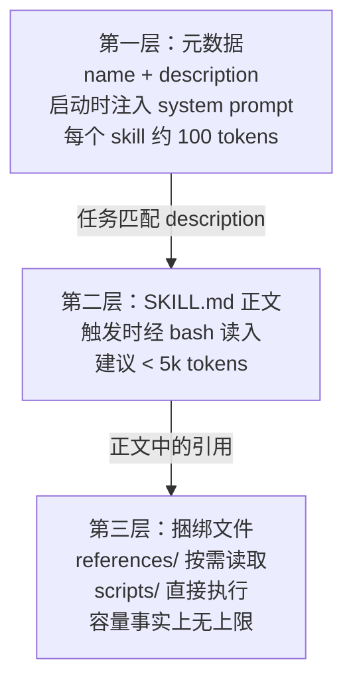
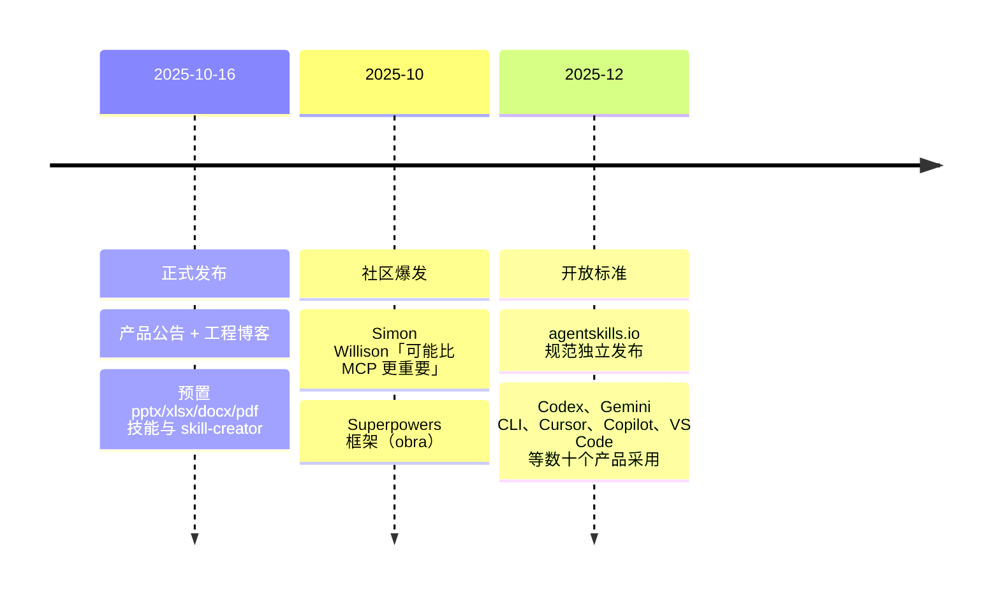

# Agent Skills 体系总览

> **一句话**：Skill 是一个以 SKILL.md 为入口的文件夹，把流程知识、脚本和资源组织成 agent 可动态发现、按需加载的能力单元——本质是「用文件系统做上下文管理」。

## 是什么

Anthropic 于 2025 年 10 月 16 日发布 Agent Skills，官方定义是 "organized folders of instructions, scripts, and resources that agents can discover and load dynamically"——agent 可以动态发现并加载的、由指令/脚本/资源组成的组织化文件夹。同时落地三个平面：Claude apps（Pro/Max/Team/Enterprise）、Claude Code 和 API（`/v1/skills` 端点 + 三个 beta header）。

最小形态非常简单：**一个目录 + 一个 SKILL.md**。SKILL.md 以 YAML frontmatter 开头，仅两个必填字段 `name` 和 `description`，之后是 Markdown 正文指令。可选再带三类约定子目录：

| 目录 | 用途 | token 消耗时机 |
| --- | --- | --- |
| `scripts/` | 可执行代码，固化确定性、重复性操作 | 执行时脚本本身不进上下文，只有输出消耗 token |
| `references/` | 参考文档（API 规范、schema、领域知识） | 模型按需 read 时才进上下文 |
| `assets/` | 用于产出物的文件：模板、图标、字体 | 通常完全不进上下文 |

没有新协议、没有服务端组件——skill 就是带元数据的 Markdown 加可选脚本，依赖的只是 agent 已有的文件系统和代码执行工具。

## 核心机制：渐进式披露

Skills 要解决的核心矛盾是：agent 需要的领域知识总量远超上下文窗口容量。它的答案是三层按需加载（progressive disclosure）：

三层的精妙之处在于成本结构：第一层是 $N$ 个 skill 的常驻开销（每个约 100 tokens），第二层只在触发时支付，第三层中脚本走「执行」而非「阅读」路径——工程博客因此断言，由于 agent 拥有文件系统和代码执行工具，"the amount of context that can be bundled into a skill is effectively unbounded"。

触发不依赖任何特殊机制：Claude 在 system prompt 里看到所有已装 skill 的 name + description，判断当前任务匹配后，调用 Bash 工具读取该 skill 的 SKILL.md，再顺着正文引用按需读文件、跑脚本。这与 [Agent Loop](/harness/agent-loop) 的「模型自主决策下一步动作」是同一套范式——skill 的加载本身就是一次普通的工具调用。

社区最常引用的卖点是与 MCP 的 token 经济学对比：Simon Willison 指出 GitHub 官方 MCP 单项就要消耗数万 token 的工具定义，而每个 skill 静息状态只占几十个 token；且 skill 只是 Markdown，"nothing at all preventing them from being used with other models"——模型无关。

## 产品定位：三个关键词

2025-10-16 的产品公告强调三点：

- **可组合**（composable）：多个 skill 可叠加，Claude 自动识别任务需要哪些 skill 并协调使用；
- **可移植**（portable）：同一格式通用于 Claude apps、Claude Code、API，一次构建到处使用；
- **高效**（efficient）：只在需要时加载需要的部分。

## 生态时间线

官方公共仓库 [anthropics/skills](https://github.com/anthropics/skills) 提供 17 个技能（含 skill-creator、mcp-builder、webapp-testing 及 docx/pdf/pptx/xlsx 文档四件套）、规范与最小模板，已积累十几万 star；社区侧 Jesse Vincent 的 Superpowers 以 skill 形式分发 TDD、系统化调试、子代理开发等工程方法论，star 数甚至超过官方仓库，并支持 Claude Code、Codex CLI、Gemini CLI 等多 host。2025 年 12 月格式升级为开放标准（agentskills.io），治理移交独立仓库 agentskills/agentskills——Skills 从 Claude 特性变成了跨 agent 产品的通用扩展格式。

## 本章导航

| 页面 | 内容 |
| --- | --- |
| [技能设计与评测](/skills/design) | SKILL.md 解剖、触发机制细节、官方撰写最佳实践、评测驱动的迭代方法 |
| [Skills vs RAG vs 微调](/skills/vs-rag-finetune) | 三种知识/能力注入途径的机制对比与选型决策 |

## 与其他章节的关系

- Skills 是 [Agent Loop](/harness/agent-loop) 的上下文供给侧：harness 决定模型能调什么工具，skill 决定模型在特定任务上「知道怎么做」。
- 与 [Tool Use](/agent/tool-use) 的区别：tool calling 是训练进权重的结构化调用**能力**，skill 是纯上下文注入的流程**知识**——前者管「会不会调」，后者管「调了之后按什么章法做事」。
- skill 携带的 `scripts/` 需要代码执行环境，其隔离与权限控制见 [沙箱](/harness/sandbox)。注意运行时差异：API 容器无网络访问、不能运行时装包；Claude Code 拥有完整网络访问。
- 安全上官方将安装 skill 类比为安装软件：恶意 skill 可导致数据外泄，使用前应审计其脚本依赖、捆绑资源和涉及外部网络源的指令。

## 参考文献

- Anthropic, 2025. *Equipping agents for the real world with Agent Skills.* anthropic.com/engineering
- Anthropic, 2025. *Introducing Agent Skills.* claude.com/blog/skills
- Agent Skills 开放标准规范：agentskills.io/specification
- Simon Willison, 2025. *Claude Skills are awesome, maybe a bigger deal than MCP.* simonwillison.net
