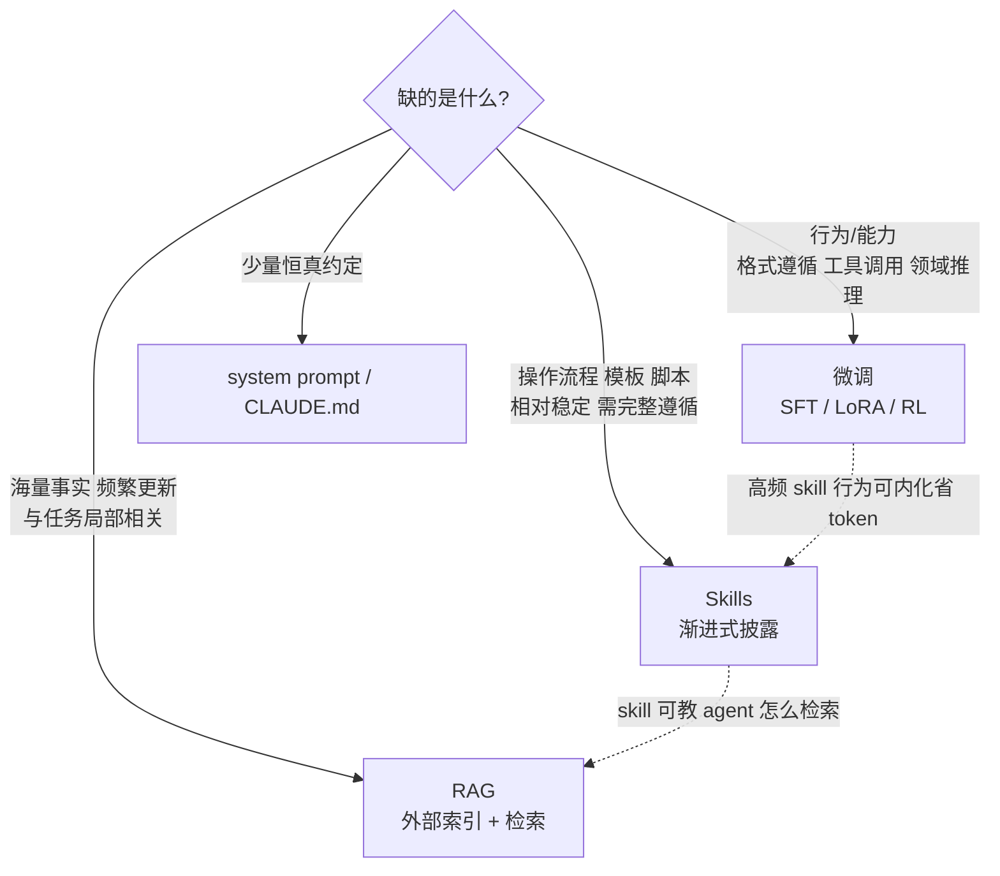

# Skills vs RAG vs 微调

> **一句话**：三者都在回答「如何让模型获得它没有的知识或能力」——微调写进权重 $\pi_\theta$，RAG 按相似度检索进上下文，Skills 把流程性知识组织成文件由模型主动按需取用；选型的核心变量是知识类型（陈述性 vs 程序性）、更新频率和 token 预算。
> 对比三方的代表性工作年份：RAG 2020（arXiv:2005.11401）· LoRA 2021（arXiv:2106.09685）· Agent Skills 2025（Anthropic，2025-10-16 发布）
>
> 前置阅读：[Agent Skills 体系](/skills/)、[SFT 总览](/sft/)

## 直觉与动机

LLM 落地最常见的两类抱怨：「模型不知道我们的私域知识」和「模型不按我们的章法做事」。两者听起来相似，本质却是不同类型的知识缺口：

- **陈述性知识**（declarative，"是什么"）：产品文档、内部 wiki、客户数据、最新事实。特征是量大、碎片化、持续更新、与单次任务只有局部相关。
- **程序性知识**（procedural，"怎么做"）：发布流程、代码规范、报告模板、领域操作步骤。特征是结构化、相对稳定、一旦相关就需要完整加载并严格遵循。
- **行为/能力**（"做得到吗"）：输出格式的稳定遵循、工具调用、领域语体、推理能力。这类无法靠「告知」获得，需要改变模型本身。

三种技术分别是这三类缺口的原生解法，混用则各有代价——用微调灌时效性事实，每次更新都要重训；用 RAG 喂操作流程，检索器按相似度切片返回，流程被切碎、步骤丢失；用 skill 装百万级文档库，模型靠目录浏览找不到针。

## 方法与机制对比

**微调**改变参数本身。[全参 SFT](/sft/full-finetuning) 或 [LoRA](/lora/lora) 在任务数据上最小化损失得到 $\pi_{\theta'}$，知识被压缩进权重，推理时零额外上下文成本。擅长内化行为：格式、语体、[工具调用能力](/agent/tool-use)、领域推理；不擅长存放需要逐字精确、频繁更新的事实（参数化记忆有损且不可控）。能力对齐进一步还有 [DPO 家族](/dpo/) 与 [RLHF](/rlhf/)，蒸馏场景见 [黑盒蒸馏](/distillation/black-box)。

**RAG**把知识放在外部索引，生成时检索拼接：

$$
p(y \mid x) = \pi_\theta\big(y \mid x,\ \mathrm{retrieve}_k(x)\big)
$$

知识更新只需更新索引，秒级生效；规模上限取决于检索系统而非上下文窗口。代价是基建（切片、embedding、索引、重排）和检索质量风险——召回错了，再强的模型也答不对。

**Skills**是上下文注入的第三种形态：既不常驻（区别于 system prompt），也不靠相似度检索（区别于 RAG），而是**模型自主的 agentic 取用**——启动时只见各 skill 约 100 tokens 的元数据，任务匹配时主动读 SKILL.md，再顺着引用读文件、执行脚本（机制详见 [技能设计与评测](/skills/design)）。两点本质差异：

1. **取用单位是「完整的能力包」而非「相似度切片」**。RAG 返回的是与 query 语义相近的片段；skill 触发后加载的是作者精心组织的完整流程 + 脚本 + 模板，结构不会被检索器打碎。
2. **检索器是模型本身**。没有 embedding 召回环节，靠 description 匹配与文件系统导航。这省掉了整套检索基建，但也意味着规模上限受限于「模型读目录做决策」的能力——几十到几百个 skill 可行，百万文档不可行。



## 与 baseline 对比

| 维度 | 微调（SFT/LoRA） | RAG | Skills |
| --- | --- | --- | --- |
| 知识载体 | 权重 $\pi_\theta$ | 外部索引 | 文件夹（Markdown + 脚本） |
| 最适知识类型 | 行为、能力、风格 | 陈述性事实，量大更新快 | 程序性流程、模板、工具链 |
| 更新成本 | 重训 + 评估 + 部署 | 更新索引，近实时 | 改文件即生效 |
| 推理期 token 开销 | 零 | 每次检索结果均计费 | 静息约 100 tokens/skill，触发才加载正文 |
| 规模上限 | 训练数据规模 | 索引规模（可至海量） | 受模型导航能力限制（数十至数百个） |
| 所需基建 | 训练管线、GPU | 切片/embedding/索引/重排 | 文件系统 + 代码执行（agent 已有） |
| 可审计性 | 黑盒，难归因 | 中（可溯源到召回片段） | 高（纯文本，diff 可读） |
| 跨模型可移植 | 不可（绑定基座） | 可 | 可（开放标准，纯 Markdown） |
| 典型失败模式 | 灾难性遗忘、过时 | 召回错误、切片断章 | undertrigger、不遵循 |
| 能否赋予新能力 | 能 | 不能 | 不能（只能引导既有能力） |

注意 Skills 的边界：它**不能让模型做权重里做不到的事**。基座 [tool use](/agent/tool-use) 能力差、指令遵循弱，再好的 SKILL.md 也救不了——skill 假设「模型已经聪明，只缺你的上下文」。

## 实现要点

三者组合是常态而非例外，典型分工：

```text
微调   → 基座能力：格式遵循、tool calling、领域语体（一次性投入）
RAG    → 事实供给：产品知识、实时数据（skill 正文里可以写"先调检索工具"）
Skills → 流程编排：什么时候检索、检索后按什么模板产出、调哪个脚本校验
```

- **Skills 指挥 RAG**：常见模式是 skill 教 agent 怎么用检索——查询改写技巧、该查哪个库、结果如何交叉验证。程序性知识包裹陈述性知识的入口。
- **Skills 反哺微调**：长期高频触发的 skill 行为，可以采样成功轨迹做 SFT 把它内化进权重，省掉每次的加载成本——相当于把「上下文里的流程」蒸馏回参数（思路同 [黑盒蒸馏](/distillation/black-box) 的数据生成）。反过来，微调前先用 skill 快速验证「这个行为模型带提示能不能做对」，能做对才值得训。
- **迁移成本不对称**：skill 是纯 Markdown，开放标准已被 Codex、Gemini CLI、Cursor 等数十个产品采用，换基座近乎零成本；LoRA adapter 换基座要重训；RAG 居中（索引可复用，prompt 拼接要适配）。

## 调参与实践经验

- **先 prompt/skill，后 RAG，最后微调**。这是成本递增序：skill 改文件秒级迭代；RAG 要建索引但知识可控；微调周期最长且回滚最难。多数「模型不会做 X」的问题在第一层就能解决。
- **不要用 skill 装事实库**。skill 的第三层虽然「容量无上限」，但模型按目录导航的发现能力有限，海量碎片化知识仍是 RAG 的主场；skill 里只放高价值、强结构的参考文档。
- **不要为格式/流程偏好微调**。能用 500 行 Markdown 说清楚的事不值得一次训练；微调留给「说了也做不到」的能力缺口。判据：同样的指令贴在上下文里模型能做对 → 用 skill；做不对 → 考虑训练。
- **token 账要算总量**。RAG 每次请求都付检索结果的上下文成本；skill 静息便宜但触发后正文驻留整个会话；微调推理零开销但训练与维护成本前置。高频固定行为随调用量增长，越来越值得内化进权重。
- **失败归因路径不同**：RAG 出错先查召回（embedding、切片粒度）；skill 出错先查触发（description 是否命中）再查遵循；微调出错最难定位——这也是可审计性排序 skill > RAG > 微调的实践含义。

## 参考文献

- Lewis et al., 2020. *Retrieval-Augmented Generation for Knowledge-Intensive NLP Tasks.* arXiv:2005.11401
- Hu et al., 2021. *LoRA: Low-Rank Adaptation of Large Language Models.* arXiv:2106.09685
- Anthropic, 2025. *Equipping agents for the real world with Agent Skills.* anthropic.com/engineering
- Anthropic. *Agent Skills — Overview / Best practices.* platform.claude.com/docs
- Simon Willison, 2025. *Claude Skills are awesome, maybe a bigger deal than MCP.* simonwillison.net
