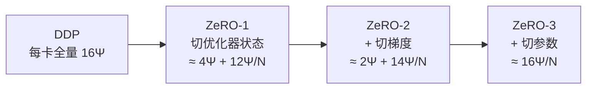
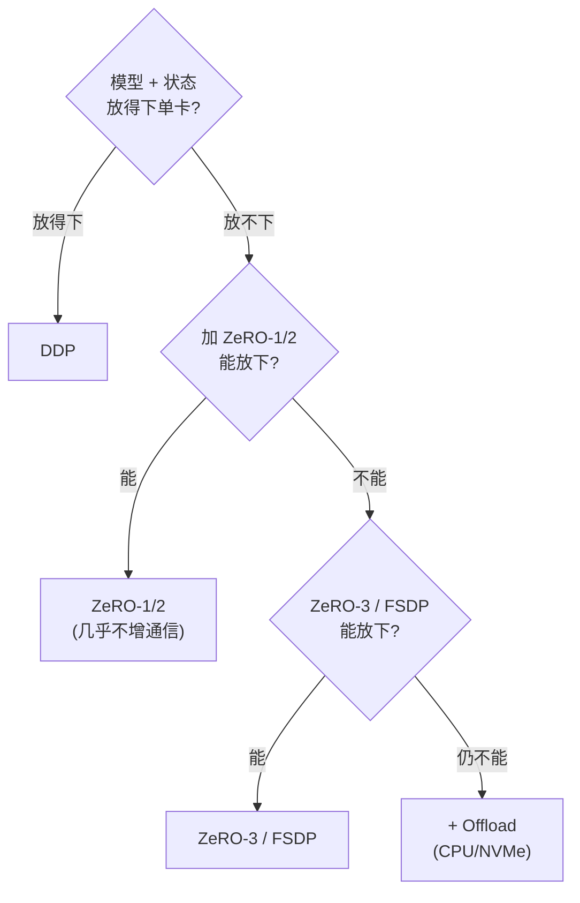

# 数据并行：DDP / ZeRO / FSDP

> **一句话**：数据并行让每张卡跑同一份模型、各自吃不同 batch，再用 all-reduce 同步梯度；ZeRO/FSDP 的核心贡献是把"每卡全量副本"的冗余按 N 卡近似线性切掉，让显存而非算力成为决定能训多大模型的瓶颈。
> 关键年份：ZeRO（Rajbhandari et al., 2019, arXiv:1910.02054）；ZeRO-Offload（2021, arXiv:2101.06840）；ZeRO-Infinity（2021, arXiv:2104.07857）；PyTorch FSDP（2022，官方 API）。
> 前置阅读：[训练系统总览](/training-systems/)、[训练效率与显存](/training-systems/efficiency)

## 朴素 DDP：简单但有冗余

最基础的数据并行是 PyTorch 的 `DistributedDataParallel`（DDP）：

1. 每张 GPU 持有一份**完整**的模型参数、梯度和优化器状态。
2. 每张卡从数据集的不同分片读 batch，独立前向 + 反向。
3. 反向结束后对各卡的梯度做 **all-reduce**（求和取平均），使所有卡看到相同梯度。
4. 各卡用相同梯度独立更新参数，状态天然保持一致。

DDP 的工程实现很成熟：梯度按 bucket 分桶，反向计算和 all-reduce 通信**重叠**（compute/communication overlap），通信量也低——ring all-reduce 每卡收发的数据量约为 $2\Psi$（$\Psi$ 为参数量），与卡数 N 几乎无关。

它的根本缺陷是**显存全量复制**。N 张卡存了 N 份相同的参数 / 梯度 / 优化器状态，单卡能训的模型大小完全不随集群扩大而增长。当模型放不下一张卡时，DDP 就无能为力。

## 显存账：优化器状态才是大头

以**混合精度 + Adam** 这一最常见配置，逐参数算一笔账（单位：字节/参数，记 $\Psi$ 为参数量）：

| 组成 | 精度 | 约占字节/参数 |
|---|---|---|
| 参数（fp16 副本，用于前向/反向） | fp16 | 约 2 |
| 梯度（fp16） | fp16 | 约 2 |
| 优化器状态：fp32 参数主副本 | fp32 | 约 4 |
| 优化器状态：Adam 一阶动量 $m$ | fp32 | 约 4 |
| 优化器状态：Adam 二阶动量 $v$ | fp32 | 约 4 |

参数:梯度:优化器状态 ≈ **2 : 2 : 12** 字节/参数（约值，混合精度 Adam）。也就是说，一个 $\Psi$ 参数的模型，光"模型状态"就要约 $16\Psi$ 字节——其中四分之三压在优化器状态上。例如 7.5B 参数的模型，模型状态约 120 GB，远超单卡显存。

> 注意：上面只算"模型状态"（model states），不含**激活值**（activations）。激活随 batch、序列长度、层数变化，通常另行用重计算 / 序列并行等手段处理，不在 ZeRO 分片范围内。

DDP 的浪费正在于：这 $16\Psi$ 在每张卡上都存了一份。ZeRO 的洞见是——**这些状态在 step 内的大部分时间根本用不到全量，可以切开按需聚合**。

## ZeRO 三级分片：把 $16\Psi$ 降到 $\approx 16\Psi/N$

ZeRO（Zero Redundancy Optimizer）把模型状态在 N 个数据并行 rank 之间**切片存储**，每张卡只长期持有 $1/N$，需要全量时再临时通信聚合。它分三个递进阶段（DeepSpeed 中对应 `stage: 1/2/3`）：

- **Stage 1（$P_{os}$）：分片优化器状态。** 只把那 $12\Psi$ 的优化器状态（fp32 主副本 + m + v）按 rank 切成 $1/N$。每卡仍存全量 fp16 参数和梯度，但更新时各卡只负责自己那片参数，更新后用 all-gather 同步参数。单卡模型状态约 $4\Psi + 12\Psi/N$。
- **Stage 2（$P_{os+g}$）：再分片梯度。** 反向过程中，每卡只需保留"自己负责更新的那片参数"对应的梯度，其余梯度 reduce 给对应 rank 后即可释放。单卡约 $2\Psi + 14\Psi/N$。
- **Stage 3（$P_{os+g+p}$）：再分片参数。** 连 fp16 参数本身也只存 $1/N$。前向 / 反向到某一层时，临时 all-gather 出该层全量参数算完即丢。单卡约 $16\Psi/N$——随 N 增大**近似线性**趋近于零。

直觉：Stage 1/2 几乎是"免费午餐"，通信量与 DDP 同量级；Stage 3 用更高的通信代价换来真正与卡数成反比的显存。

## 通信量与取舍

| 方案 | 单卡模型状态（约） | 每 step 通信量（约） | 说明 |
|---|---|---|---|
| DDP | $16\Psi$ | $2\Psi$ | all-reduce 梯度 |
| ZeRO-1 | $4\Psi + 12\Psi/N$ | $\approx 2\Psi$ | 与 DDP 同量级 |
| ZeRO-2 | $2\Psi + 14\Psi/N$ | $\approx 2\Psi$ | reduce-scatter 梯度 |
| ZeRO-3 | $\approx 16\Psi/N$ | $\approx 3\Psi$ | 参数 all-gather（前向+反向）+ 梯度 reduce-scatter |

要点：ZeRO-1/2 基本不增通信，应优先采用；ZeRO-3 通信量约升到 1.5 倍（多出参数 all-gather），但换来显存随 N 线性下降，是训练超大模型时的必选项。实践中常配合 prefetch（提前 all-gather 下一层参数）把通信藏进计算里，缓解通信开销。注意上述均为**字节/参数**量级的定性估计，实际数值随实现、bucket 策略与重叠程度而变，以原文与实测为准。

## FSDP：PyTorch 原生的 ZeRO-3

`FullyShardedDataParallel`（FSDP，2022 起进入 PyTorch 核心）在思想上与 **ZeRO Stage 3 等价**：参数、梯度、优化器状态全部按数据并行 rank 分片，按 FSDP unit（通常按 module 包裹）在前向/反向时 all-gather 全量、算完释放，梯度用 reduce-scatter 切回各 rank。

与 DeepSpeed ZeRO 的关系（定性，细节以官方文档为准）：

- **同源思想**：FSDP 是 PyTorch 把 ZeRO-3 内建为一等公民，无需引入 DeepSpeed 即可分片。
- **包裹粒度**：FSDP 以 `auto_wrap_policy` 控制分片单元的粒度，粒度影响显存峰值与通信频率的权衡。
- **生态**：FSDP 与 PyTorch 原生混合精度、`torch.compile`、张量/流水并行（组成 nD 并行）协同更顺；ZeRO 的卸载（offload）链路在 NVMe 等异构内存上更成熟。
- FSDP2（新一代 API）在分片表示（per-parameter sharding / DTensor）上有改进，使用时请以当前 PyTorch 版本文档为准。

## 卸载到 CPU / NVMe：ZeRO-Offload 与 ZeRO-Infinity

当卡数仍不够、或想在少量 GPU 上训大模型时，可把分片后的状态进一步**卸载到 GPU 之外的内存**：

- **ZeRO-Offload（arXiv:2101.06840，USENIX ATC'21）**：把优化器状态、fp32 主参数和优化器更新（Adam step）卸到 **CPU 内存 + CPU 计算**，GPU 只做前向/反向，最小化 GPU↔CPU 数据搬运。论文称可在**单张 GPU** 上训练 **13B+ 参数**模型（在单张 V100 上对 10B 模型可达约 40 TFLOPs/GPU；具体数字以原文为准）。
- **ZeRO-Infinity（arXiv:2104.07857）**：在 ZeRO-3 之上引入"infinity offload engine"，把模型状态同时卸到 **CPU 和 NVMe**，激活卸到 CPU，突破"GPU 显存墙"。论文称可在现有集群上承载数十甚至上百万亿参数级别的训练（数字以原文为准）。

代价是把显存压力换成了 **PCIe / NVMe 带宽压力**：卸载越激进，越容易被数据搬运拖慢吞吐。因此卸载是"显存换速度"的最后一道兜底——能靠加卡 / ZeRO-3 放下时，通常不优先卸载。

## 选型直觉

一句话总结：**先 DDP，放不下上 ZeRO-1/2（几乎白拿），再不行上 ZeRO-3 / FSDP（显存随 N 线性降），仍不行才卸载到 CPU/NVMe（用带宽换显存）。** 进一步要训百亿/千亿级模型时，数据并行还需与张量并行、流水并行组合，详见[训练系统总览](/training-systems/)与[训练效率与显存](/training-systems/efficiency)。

## 参考文献

- Rajbhandari et al., *ZeRO: Memory Optimizations Toward Training Trillion Parameter Models*, 2019/2020, arXiv:1910.02054
- Ren et al., *ZeRO-Offload: Democratizing Billion-Scale Model Training*, USENIX ATC 2021, arXiv:2101.06840
- Rajbhandari et al., *ZeRO-Infinity: Breaking the GPU Memory Wall for Extreme Scale Deep Learning*, 2021, arXiv:2104.07857
- PyTorch, *Introducing PyTorch Fully Sharded Data Parallel (FSDP) API*, 2022（官方博客与文档）
