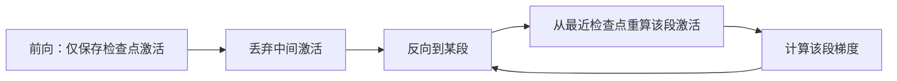

> **一句话**：在不改动模型质量的前提下，用「精度换字节、算力换显存、并行换等待」三类手段，把更大的模型/批量塞进有限的显存并榨干算力。
> 关键年份：Mixed Precision Training（Micikevicius et al. 2017，arXiv:1710.03740）；Sublinear Memory / 梯度检查点（Chen et al. 2016，arXiv:1604.06174）；FlashAttention（Dao et al. 2022，arXiv:2205.14135）；8-bit Optimizers（Dettmers et al. 2021，arXiv:2110.02861）。
> 前置阅读：[Transformer 架构](/architecture/transformer)、[训练系统总览](/training-systems/)、[推理优化](/inference/)

训练大模型时，单卡显存几乎永远是第一约束。要理解优化从哪里下手，先看显存被谁吃掉。以 Adam + 混合精度训练一个参数量为 $\Psi$ 的模型为例，主要占用包括：

- **模型权重**：fp16 副本 $2\Psi$，外加 fp32 主权重 $4\Psi$；
- **优化器状态**：Adam 的一阶/二阶动量各 $4\Psi$（fp32），共 $8\Psi$；
- **梯度**：$2\Psi$（fp16）或 $4\Psi$；
- **激活值（activations）**：与 batch size、序列长度、层数线性相关，长序列下往往是最大头。

前三项合计约 $16\Psi$ 字节（即每 10 亿参数约 16 GB），是「静态」开销；激活值是「动态」开销，也是最有弹性的优化空间。下面的手段分别针对这两类。

## 混合精度训练（Mixed Precision）

把前向/反向的计算放到 16 位浮点（fp16 或 bf16），同时保留一份 fp32 主权重用于参数更新，这就是混合精度训练的核心（Micikevicius et al. 2017）。收益有两点：16 位张量减半激活与梯度显存；现代 GPU 的 Tensor Core 对 16 位矩阵乘有数倍吞吐优势。

fp16 与 bf16 的关键差别在动态范围：

| 格式 | 位宽 | 指数位 | 尾数位 | 动态范围 | 是否需 loss scaling |
|------|------|--------|--------|----------|----------------------|
| fp32 | 32 | 8 | 23 | 很宽 | — |
| fp16 | 16 | 5 | 10 | 窄，小梯度易下溢 | 通常需要 |
| bf16 | 16 | 8 | 7 | 与 fp32 同宽 | 一般不需要 |

fp16 只有 5 位指数，反向传播中大量小梯度会**下溢为 0**。论文给出的解法是 **loss scaling**：把损失乘以一个放大因子 $S$，

$$
\nabla_\theta (S \cdot \mathcal{L}) = S \cdot \nabla_\theta \mathcal{L}
$$

使小梯度移入 fp16 可表示区间；更新前再除回 $S$。工程上常用**动态 loss scaling**——无溢出则周期性放大 $S$，一旦检测到 Inf/NaN 立即缩小并跳过该步。bf16 因为保留了 fp32 的 8 位指数，动态范围足够，通常无需 loss scaling，代价是尾数更少、精度略低。A100 及之后的硬件上，bf16 已成为 LLM 训练的默认选择。

PyTorch 的 `torch.cuda.amp`（Automatic Mixed Precision，AMP）把上述逻辑封装为 `autocast` + `GradScaler`：autocast 自动决定哪些算子走低精度（矩阵乘、卷积）、哪些保留 fp32（如 softmax、layernorm 的归约），GradScaler 负责动态 loss scaling。

## 激活重计算 / 梯度检查点（Gradient Checkpointing）

激活值在前向时被缓存，供反向计算梯度使用，显存随层数线性增长。梯度检查点（Chen et al. 2016）的思路是**只保存少量检查点激活，其余在反向时按需重算**，用一次额外前向换取显存下降。

对 $n$ 层网络，若每隔 $\sqrt{n}$ 层设一个检查点，激活显存可从 $O(n)$ 降到 $O(\sqrt{n})$，额外计算约为一次前向（典型约 +30% 训练时间）。这是「用算力换显存」最直接的体现，长序列训练几乎必开。



**Selective recomputation（选择性重计算）** 是更精细的版本：只重算那些「计算便宜但占显存大」的算子（如注意力中间结果），保留「计算昂贵」的部分。Megatron-LM 的 selective activation recomputation 即按此思路把重算开销压到个位数百分比，是大模型训练的常用配置。

## 梯度累积（Gradient Accumulation）

当目标 batch size 装不进单卡时，把它拆成 $k$ 个 micro-batch 依次前向/反向，**梯度累加而不立即更新**，累满 $k$ 步后再做一次 optimizer step。等效全局 batch 为 micro-batch × $k$ ×（数据并行卡数）。

```python
for i, batch in enumerate(loader):
    loss = model(batch) / accum_steps   # 缩放，保证梯度等价于大 batch 平均
    loss.backward()                     # 梯度自然累加
    if (i + 1) % accum_steps == 0:
        optimizer.step()
        optimizer.zero_grad()
```

它不省静态显存（权重/优化器状态照旧），但避开了大 batch 激活同时驻留的峰值，让小卡也能复现大 batch 的训练超参。代价是更新频率下降、吞吐略降。

## FlashAttention：省激活显存的注意力

标准注意力会显式构造 $n\times n$ 的注意力矩阵，激活显存随序列长度**平方**增长，是长上下文的主要瓶颈。FlashAttention（Dao et al. 2022）通过**分块（tiling）+ online softmax** 在 SRAM 中分块计算，不把完整 $n\times n$ 矩阵写回 HBM，使注意力的激活显存降到**线性** $O(n)$，同时减少 HBM 读写量从而显著提速，且结果与标准注意力**数值等价**（非近似）。它既省显存又提吞吐，已是长序列训练/推理的事实标准。实现与变体细节见 [Transformer 架构页](/architecture/transformer)。

## 8-bit 优化器

Adam 的两个动量状态合计 $8\Psi$ 字节，常是仅次于激活的显存大户。8-bit Optimizers（Dettmers et al. 2021）用**块级量化（block-wise quantization）**把优化器状态压到 8 位：将状态张量切成小块各自量化，配合动态量化（非线性、对大小幅值都精确）与稳定的 embedding 层，在语言建模、GLUE、ImageNet 等任务上**几乎无损地保持 32 位优化器性能**，而动量显存近似减少 4 倍。它以 `bitsandbytes` 提供，号称两行代码即可替换原优化器。

## 通信与计算重叠

进入多卡/集群后，瓶颈从「显存」转向「等待通信」。核心优化是让通信**藏到计算背后**：

- **梯度反向与 all-reduce 重叠**：反向是从后往前逐层算梯度，靠后的层先算完，可立即触发该层（或一桶 bucket）的梯度 all-reduce，与前面层的反向计算并行；DDP 的 gradient bucketing 即此机制。
- **ZeRO / FSDP 的参数通信重叠**：分片参数在用到前异步 all-gather（prefetch），用完即释放，把权重收集藏到上一层计算里。
- **流水线并行的 micro-batch 重叠**：用 1F1B 等调度让不同 micro-batch 的前后向交错，压缩 pipeline bubble。

这些机制的目标一致：让有效算力利用率（MFU）尽量接近通信不可见的理想值。具体并行策略（DP/TP/PP/ZeRO）见[训练系统总览](/training-systems/)。

## 小结：按瓶颈选工具

| 瓶颈 | 首选手段 | 性质 |
|------|----------|------|
| 激活显存（长序列/大 batch） | FlashAttention、梯度检查点、selective recompute | 算力换显存 |
| 静态显存（权重/优化器） | 混合精度、8-bit 优化器、ZeRO 分片 | 字节换精度/通信 |
| 凑不出大 batch | 梯度累积 | 时间换等效 batch |
| 多卡等待 | 通信-计算重叠 | 并行换等待 |

实践上这些手段叠加使用：bf16 + FlashAttention + 选择性重计算 + ZeRO 几乎是现代 LLM 预训练的标配组合。优化前先用显存分析定位是激活还是静态开销占主导，再对症下药。

## 参考文献

- Micikevicius et al. *Mixed Precision Training.* ICLR 2018. arXiv:1710.03740
- Chen et al. *Training Deep Nets with Sublinear Memory Cost.* 2016. arXiv:1604.06174
- Dao et al. *FlashAttention: Fast and Memory-Efficient Exact Attention with IO-Awareness.* NeurIPS 2022. arXiv:2205.14135
- Dettmers et al. *8-bit Optimizers via Block-wise Quantization.* ICLR 2022. arXiv:2110.02861
