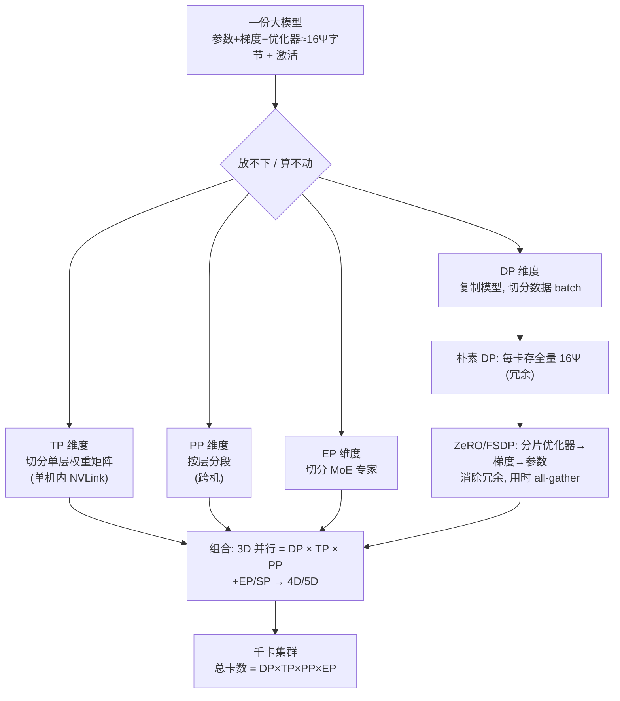

# 训练系统与分布式总览

> **一句话**：当一份大模型放不进、也算不动单卡时，训练系统的核心任务就是把「参数 + 梯度 + 优化器状态 + 激活」这四份显存，以及它们之间的通信，沿数据 / 张量 / 流水 / 专家 / 序列五个维度切到成百上千张卡上。
> 关键年份：Megatron-LM（arXiv:1909.08053, 2019）、ZeRO（arXiv:1910.02054, 2019）、PyTorch FSDP（arXiv:2304.11277, 2023）、Megatron 序列并行（arXiv:2205.05198, 2022）
> 前置阅读：[MoE 架构](/architecture/moe)、[推理框架](/inference/frameworks)、[QLoRA](/lora/qlora)

## 一、为什么必须分布式：显存墙与通信墙

单卡训练失败的根因通常不是「算不动」，而是「放不下」。先把显存账算清楚。

### 显存墙：四份占用

混合精度 + Adam 训练时，单个参数的常驻显存可以按字节估算（设参数量为 $\Psi$）：

| 占用项 | 内容 | 字节 / 参数 |
| --- | --- | --- |
| fp16 参数 | 前向 / 反向用的工作副本 | 2 |
| fp16 梯度 | 反向累积 | 2 |
| fp32 参数主副本 | 优化器更新基准 | 4 |
| Adam 一阶动量 $m$ | 优化器状态 | 4 |
| Adam 二阶动量 $v$ | 优化器状态 | 4 |
| **小计** | | **16** |

也就是说，**模型状态约需 $16\Psi$ 字节**（来源：ZeRO 论文 arXiv:1910.02054）。一个 7B 模型仅模型状态就约 $7\times10^9 \times 16 \approx 112\,\text{GB}$，已远超单张 80GB 卡。

这还没算第四份——**激活（activation）**。激活显存与 batch、序列长度、层数线性相关，长上下文场景下常常反超模型状态，成为真正的瓶颈。

$$
M_{\text{total}} \approx \underbrace{16\Psi}_{\text{参数+梯度+优化器}} + \underbrace{M_{\text{act}}(b, s, L)}_{\text{激活}}
$$

### 通信墙

切卡之后，卡间必须交换数据：DP 要 all-reduce 梯度，TP 要在每层内 all-reduce / all-gather 激活，PP 要在 stage 间传递激活与梯度。通信量、通信频率与硬件带宽（NVLink、IB）共同决定了「能扩到多大、扩得多快」。**分布式训练的本质，是在显存墙和通信墙之间做权衡**：切得越细越省显存，但通信越重。

## 二、并行维度全景

主流框架围绕五个相互正交的维度切分一份模型，可任意组合：

| 维度 | 切什么 | 通信特征 | 典型代表 |
| --- | --- | --- | --- |
| **数据并行 DP** | 复制模型，切分数据 batch | 每步 all-reduce 梯度 | DDP / [ZeRO](/training-systems/data-parallel) / FSDP |
| **张量并行 TP** | 切分单层权重矩阵（行/列） | 层内高频 all-reduce，带宽敏感 | [Megatron-LM](/training-systems/model-parallel) |
| **流水并行 PP** | 按层分段到不同卡 | stage 间 P2P 传激活，存在 bubble | GPipe / Megatron PP |
| **专家并行 EP** | 把 MoE 的专家分到不同卡 | token all-to-all 路由 | [MoE](/architecture/moe) |
| **序列并行 SP** | 沿序列维切 LayerNorm/Dropout 激活 | 与 TP 配合，省激活显存 | Megatron SP（arXiv:2205.05198） |

### 组合成 3D / 4D 并行

实际千卡训练几乎都是多维并行的笛卡尔积。经典的 **3D 并行 = DP × TP × PP**：

- **TP** 通常限制在单机内（NVLink 高带宽域），因为层内通信最频繁；
- **PP** 跨机切分层段，降低单机显存压力；
- **DP** 在最外层复制整套并行组，吃更多数据。

引入 MoE 后再叠加 **EP**，配合 SP，就成了 **4D / 5D 并行**。总卡数 = $\text{DP} \times \text{TP} \times \text{PP} \times \text{EP}$。

## 三、ZeRO / FSDP 与 Megatron 的定位

两条主线，解决两类问题：

- **ZeRO / FSDP —— 把 DP 做到不冗余。** 朴素 DP 在每张卡上都存一份完整的 $16\Psi$，纯属冗余。ZeRO（arXiv:1910.02054）分三个 stage 逐步消除冗余：**ZeRO-1** 切优化器状态、**ZeRO-2** 再切梯度、**ZeRO-3** 连参数也切。PyTorch **FSDP**（arXiv:2304.11277）是 ZeRO-3 思路的工业级原生实现：参数平时分片存放，用到某层时临时 all-gather，用完即丢。它本质仍是「数据并行」，但显存接近模型并行。

- **Megatron-LM —— 把单层 / 单段切开。** 当单层权重本身就放不下，或要在单机内跑满算力时，就需要 TP/PP。Megatron-LM（arXiv:1909.08053）给出了 Transformer 张量并行的标准切法（attention 与 MLP 的行列分块），并扩展出流水并行与序列并行，是大规模训练系统的事实标准。

工程实践中二者常叠加：**Megatron 负责 TP/PP/EP/SP，ZeRO/FSDP 负责最外层 DP**，例如 Megatron-DeepSpeed、Megatron-Core 都走这条组合路线。推理侧的切分思路（如 TP）与之同源，可对照 [推理框架](/inference/frameworks)。

## 四、本章导航

| 页面 | 主题 | 关键词 |
| --- | --- | --- |
| [数据并行](/training-systems/data-parallel) | DDP、ZeRO 三阶段、FSDP | 梯度 all-reduce、分片、参数 all-gather |
| [模型并行](/training-systems/model-parallel) | 张量并行 TP、流水并行 PP | Megatron 切法、pipeline bubble |
| [训练效率](/training-systems/efficiency) | 激活重计算、混合精度、通信重叠 | MFU、selective recompute、FlashAttention |

## 五、一份大模型怎么切到多卡

下图展示一份模型如何沿多个维度被层层切分到 GPU 集群：

切分顺序通常遵循「**通信越重，放得越近**」：TP 锁在机内，PP 跨机分段，DP/ZeRO 放最外层。后续三页分别下钻每个维度的具体机制与权衡。

## 参考文献

- Shoeybi et al. *Megatron-LM: Training Multi-Billion Parameter Language Models Using Model Parallelism.* arXiv:1909.08053
- Rajbhandari et al. *ZeRO: Memory Optimizations Toward Training Trillion Parameter Models.* arXiv:1910.02054
- Korthikanti et al. *Reducing Activation Recomputation in Large Transformer Models（序列并行 / 选择性重计算）.* arXiv:2205.05198
- Zhao et al. *PyTorch FSDP: Experiences on Scaling Fully Sharded Data Parallel.* arXiv:2304.11277
