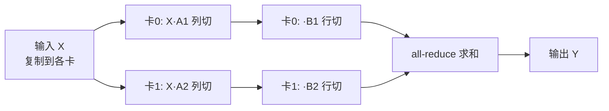
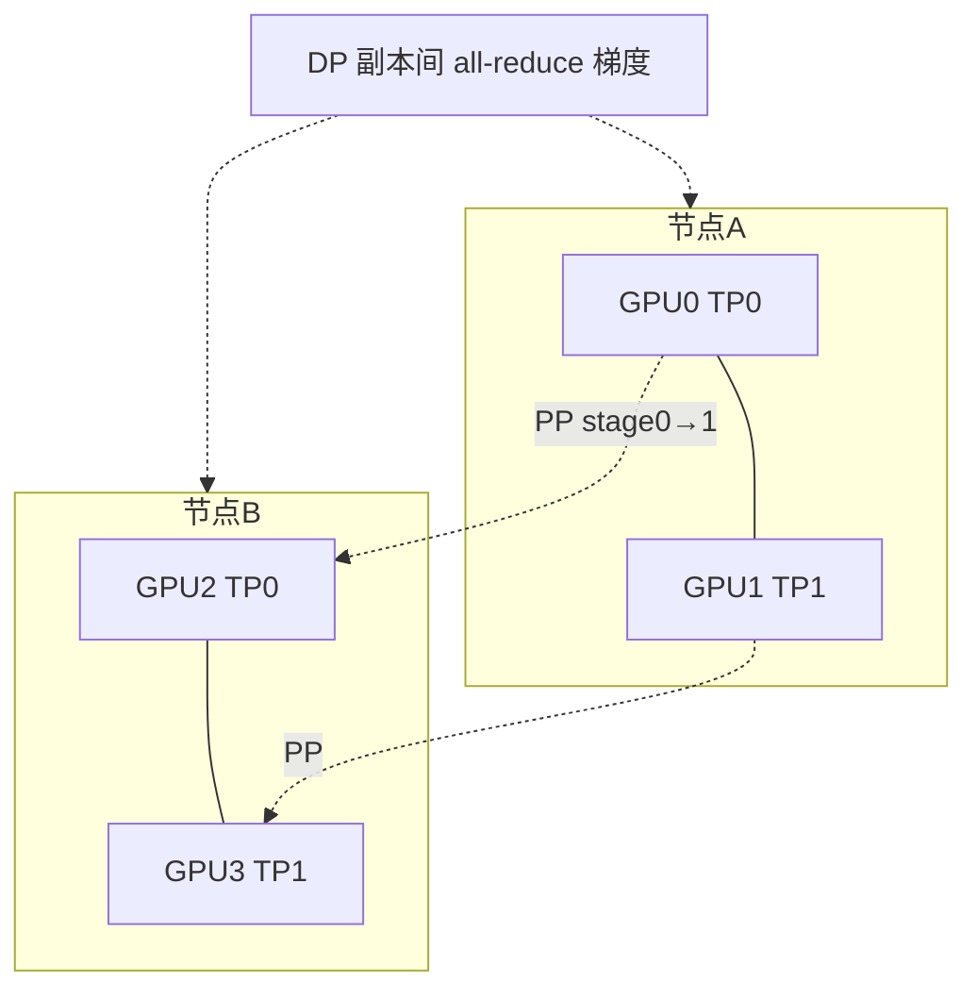

# 模型并行：张量并行 + 流水并行 + 3D 并行

> **一句话**：当单卡放不下一份模型时，把模型本身切开——张量并行（TP）按矩阵维度切单层、流水并行（PP）按层切段，再与数据并行（DP）正交组合成 3D 并行，用通信换显存。
> 关键年份：Megatron-LM（Shoeybi et al. 2019, arXiv:1909.08053）；GPipe（Huang et al. 2018, arXiv:1811.06965）；PipeDream（Harlap & Narayanan et al. 2018, arXiv:1806.03377）；Megatron 序列并行（Korthikanti et al. 2022, arXiv:2205.05198）。
> 前置阅读：[训练系统总览](/training-systems/)、[数据并行](/training-systems/data-parallel)、[MoE 架构](/architecture/moe)

数据并行（DP）每张卡都持有一份完整模型权重，因此当模型规模超过单卡显存（百亿、千亿参数）时，DP 单独无能为力。模型并行（Model Parallelism）的思路是把**模型本身**切到多卡上，每张卡只持有一部分参数与对应的中间激活。它分两条正交的切法：在**层内**切（张量并行）和在**层间**切（流水并行）。两者再与 DP 组合，构成训练超大模型的标准范式——3D 并行。

## 张量并行 TP：把单层矩阵切到多卡

张量并行（Tensor Parallelism，又称张量模型并行）由 Megatron-LM（Shoeybi et al. 2019）系统化提出，核心是把 Transformer 单层内的大矩阵乘法**沿某一维度切分**到多张卡上并行计算。

以 MLP 块 $Y = \text{GeLU}(XA)B$ 为例。Megatron 的关键设计是让两次 GEMM 的切分方式配合，避免在中间插入通信：

- 第一个权重 $A$ 按**列**切：$A = [A_1, A_2]$，每卡算 $\text{GeLU}(XA_i)$。GeLU 是逐元素非线性，列切后无需在它之前同步。
- 第二个权重 $B$ 按**行**切：$B = [B_1; B_2]$，每卡算局部 $\text{GeLU}(XA_i)B_i$，最后用一次 **all-reduce** 把分片结果加起来得到 $Y$。

自注意力块同理：多头注意力天然可按 head 切分，$Q/K/V$ 投影按列切、输出投影按行切。这样一个 Transformer 层在前向只需 **2 次 all-reduce**（注意力块 + MLP 块各一次），反向再 2 次。

**通信特征**：TP 的 all-reduce 在每一层、每个 micro-batch 的前向与反向都要发生，**通信极其频繁**，且通信量随激活规模增长，处在计算关键路径上无法隐藏。因此 TP 几乎只在**单机内**使用，强依赖高带宽互联（NVLink / NVSwitch）；跨机 TP 会被 PCIe / 网络带宽拖垮。实践中 TP 度数（tensor-parallel size）通常等于单机 GPU 数（如 8）。

## 流水并行 PP：按层切段，micro-batch 流水

流水并行（Pipeline Parallelism）把模型**按层切成若干连续的段（stage）**，每张卡持有一段，激活在 stage 之间点对点（P2P）传递。朴素做法是一个 mini-batch 顺序穿过所有 stage，但这样任意时刻只有一张卡在工作，其余卡空转——利用率约 $1/p$（$p$ 为 stage 数）。

GPipe（Huang et al. 2018）的关键贡献是 **micro-batch 流水**：把一个 mini-batch 拆成 $m$ 个 micro-batch，依次注入流水线，让不同 stage 同时处理不同 micro-batch，从而把空转压缩。但流水线启动（填充）与排空阶段仍存在**气泡（bubble）**——部分卡无事可做。GPipe 调度（所有前向做完再统一反向）的气泡占比约为：

$$
\text{bubble fraction} = \frac{p - 1}{m + p - 1}
$$

可见增大 $m$ 能摊薄气泡，但 $m$ 越大、GPipe 同时缓存的激活越多，显存压力越大。

PipeDream（Harlap & Narayanan et al. 2018）提出 **1F1B（one-forward-one-backward）** 调度：稳态时每个 stage 交替执行一次前向和一次反向，使在途激活数被限制在 stage 数量级，**显存峰值显著低于 GPipe**。其代价是需要权重版本管理（weight stashing）以保证反向用到的权重与前向一致。后续 Megatron 的 **interleaved 1F1B**（virtual pipeline）让每卡持有多个不连续的层块（$v$ 为每卡块数），进一步把气泡时间约缩小到原来的 $1/v$（代价是通信次数随 $v$ 增加；具体公式随气泡占比的定义口径而异，以原文为准）。

| 调度 | 气泡 | 激活显存峰值 | 备注 |
|---|---|---|---|
| 朴素 PP | $\frac{p-1}{p}$ | 低 | 利用率约 $1/p$ |
| GPipe | $\frac{p-1}{m+p-1}$ | 高（缓存 $m$ 份） | 全前向再全反向 |
| 1F1B (PipeDream) | 同 GPipe 量级 | 低（在途 $\le p$） | 需权重版本管理 |
| Interleaved 1F1B | 更小 | 中 | 通信次数增加 |

**通信特征**：PP 只在相邻 stage 间做**小量 P2P 通信**（传一份激活/梯度），通信量远小于 TP，且可与计算重叠，因此 **PP 可以跨机**使用。代价是气泡损失与调度复杂度，以及对层数 / micro-batch 数的均衡切分要求。

## 3D 并行：DP × TP × PP

单一维度都有边界：TP 受单机卡数与 NVLink 约束，PP 受气泡与层数约束，DP 受 batch size 与显存约束。把三者**正交组合**即 3D 并行，是 Megatron-LM、DeepSpeed 训练千亿/万亿模型的主力方案。GPU 总数 $N = d_{dp}\times d_{tp}\times d_{pp}$。

典型布局原则（按通信代价由重到轻分配到由近到远的硬件）：

- **TP 放最内层**：通信最重，限制在单机 8 卡 NVLink 域内。
- **PP 放中间**：跨机但通信量小，按 stage 分到不同节点。
- **DP 放最外层**：只在 step 末做一次梯度 all-reduce，最能容忍较慢的网络；常与 ZeRO（参见[数据并行](/training-systems/data-parallel)）结合分摊优化器状态。

## 序列并行 SP：补 TP 的激活短板

张量并行切了权重和注意力/MLP 内部的激活，但 LayerNorm、Dropout 等逐 token 操作在 Megatron 原始 TP 下激活仍是**全量复制**的，成为显存瓶颈。**序列并行**（Sequence Parallelism，Korthikanti et al. 2022）在 TP 不切的区域沿**序列维度**把激活切到各卡，与 TP 在层内交替，通过把原来的 all-reduce 拆成 **all-gather + reduce-scatter** 实现衔接，**不增加额外通信量**却进一步降低激活显存。SP 通常作为 TP 的搭档启用（注意：另有针对超长上下文的 Ring Attention / Context Parallelism，也常被称作"序列并行"，二者目标相近但实现不同）。

## 专家并行 EP：MoE 的并行维度

[MoE](/architecture/moe) 架构每层有多个专家（FFN），每个 token 只路由到 top-k 个。**专家并行**（Expert Parallelism）把不同专家放到不同卡上，是 MoE 特有的并行维度。其通信由两次 **all-to-all** 构成：token 按路由结果分发（dispatch）到对应专家所在卡，专家算完再聚合（combine）回原位。

all-to-all 通信量取决于路由分布，负载不均（部分专家过热）会拖慢整体，因此 MoE 训练需要负载均衡损失与 capacity factor 控制。EP 同样与 TP/PP/DP 正交，可叠成 EP×TP×PP×DP 的多维布局（如 DeepSpeed-MoE、Megatron-Core MoE）。

## 选型小结

| 维度 | 切什么 | 通信原语 | 频率/量 | 适用边界 |
|---|---|---|---|---|
| DP | batch（权重复制） | all-reduce 梯度 | 每 step 一次 | 容忍慢网络，受显存限 |
| TP | 层内矩阵 | all-reduce 激活 | 每层多次，关键路径 | 单机 NVLink 内 |
| PP | 层间分段 | P2P 激活 | 相邻 stage，量小 | 可跨机，有气泡 |
| SP | 序列维激活 | all-gather/reduce-scatter | 配合 TP | 降激活显存 |
| EP | 专家（FFN） | all-to-all | MoE 每层 | MoE 专用 |

一般决策顺序：先用 TP 填满单机、再用 PP 跨机扩到放得下模型、外层叠 DP（+ZeRO）扩吞吐；MoE 模型再额外引入 EP。各维度的度数需结合模型形状、互联带宽与显存预算联合调参，没有放之四海皆准的配置。

## 参考文献

- Shoeybi et al. *Megatron-LM: Training Multi-Billion Parameter Language Models Using Model Parallelism.* 2019. arXiv:1909.08053
- Huang et al. *GPipe: Efficient Training of Giant Neural Networks using Pipeline Parallelism.* 2018. arXiv:1811.06965
- Harlap, Narayanan et al. *PipeDream: Fast and Efficient Pipeline Parallel DNN Training.* 2018. arXiv:1806.03377
- Korthikanti et al. *Reducing Activation Recomputation in Large Transformer Models.* 2022. arXiv:2205.05198
- Narayanan et al. *Efficient Large-Scale Language Model Training on GPU Clusters Using Megatron-LM.* 2021. arXiv:2104.04473
